# 1 MQA（Multi Query Attention）
- 背景： 
&nbsp;&nbsp;&nbsp;&nbsp;&nbsp;&nbsp;&nbsp;&nbsp;MQA（Multi Query Attention）最早是出现在2019年谷歌的一篇论文 《Fast Transformer Decoding: One Write-Head is All You Need》，之所以没有被关注到，是因为文本生成类任务还没这么火热，解码序列长度也没有现阶段大模型的要求那么高。 

- 核心思想： 
&nbsp;&nbsp;&nbsp;&nbsp;&nbsp;&nbsp;&nbsp;&nbsp;MQA 让所有的头之间 共享 同一份 Key 和 Value 矩阵，每个头只单独保留了一份 Query 参数，从而大大减少 Key 和 Value 矩阵的参数量。(Multi-query attention is identical except that the different heads share a single set of keys and values.)  

- 图示： 

- 效果： 
&nbsp;&nbsp;&nbsp;&nbsp;&nbsp;&nbsp;&nbsp;&nbsp;推理速度上生成一个 token 时 MHA 和 MQA 的 encoder 分别耗时1.7us和1.5us，而 decoder 分别46us和3.8us，说明 decoder 上 MQA 比 MHA 快很多。另外在效果上 MQA 的 PPL (越小越好)有所上升，BLEU(越大越好)有所下降，换句话说就是效果有所下降。 

- [MQA 论文](https://arxiv.org/abs/1911.02150)

# 2 大模型神器：GQA（Grouped Query Attention）
## 2.1 GQA Structure
&nbsp;&nbsp;&nbsp;&nbsp;&nbsp;&nbsp;&nbsp;&nbsp;分组查询注意力(GQA)将查询头分成G个组，每个组共享一个键头和值头。GQA-G表示具有G个组的分组查询。GQA-1表示单个组，因此具有单个键头和值头，等效于MQA。而GQA-H表示组数等于头数，等效于MHA。下图显示了分组查询注意力和多头/多查询注意力的比较。在将多头检查点转换为GQA检查点时，我们通过对该组内所有原始头进行平均汇总来构建每个组的键头和值头。 

&nbsp;&nbsp;&nbsp;&nbsp;&nbsp;&nbsp;&nbsp;&nbsp;中间数量的组导致插值模型，其质量高于MQA但比MHA快，正如我们将展示的那样，这代表了一个有利的权衡。从MHA转换为MQA将H个键和值头减少为单个键和值头，将键值缓存(KV Cache)的大小减小，并且需要加载的数据量减少了H倍。然而，更大的模型通常会按比例增加头的数量，从而多查询注意力在内存带宽和容量上都具有更激进的削减。GQA使我们能够随着模型的增大而保持带宽和容量的相同比例减少。 
&nbsp;&nbsp;&nbsp;&nbsp;&nbsp;&nbsp;&nbsp;&nbsp;此外，较大的模型相对较少受到注意力的内存带宽开销的影响，因为KV Cache 随着模型维度的增加而扩展，而模型的FLOPs和参数随着模型维度的平方增加。最后，针对大型模型的标准分片将单个键头和值头复制了模型分区的数量（Pope等人，2022）；GQA消除了这种分区的浪费。因此，我们希望GQA在较大的模型中能够达到一个特别好的权衡。 
&nbsp;&nbsp;&nbsp;&nbsp;&nbsp;&nbsp;&nbsp;&nbsp;值得注意的是，GQA不适用于编码器(encoder)的自注意力层；编码器表示是并行计算的，因此内存带宽通常不是主要瓶颈。 

- [GQA 论文](https://arxiv.org/pdf/2305.13245.pdf)

# 2.2 精度改进：converting the checkpoint and uptraining
*(**uptraining** 是指对已有的模型进行进一步的训练(pre-train)或微调(fine-tune)。它可以是为了适应新的任务或结构，或者改进模型的性能。在这里， **uptraining** 是指将具有多头注意力的语言模型转换为具有多查询注意力的模型，并通过额外的预训练阶段来适应新的结构。)*  

- 概念  
&nbsp;&nbsp;&nbsp;&nbsp;&nbsp;&nbsp;&nbsp;&nbsp;在 Multi-Query Attention 方法中只会保留一个单独的key-value头，这样虽然可以提升推理的速度，但是会带来精度上的损失。《Multi-Head Attention:Collaborate Instead of Concatenate 》这篇论文的第一个思路是基于多个 MQA 的 checkpoint 进行 finetuning，来得到了一个质量更高的 MQA 模型。这个过程也被称为 Uptraining。 

从多头模型生成多查询模型分为两个步骤：
- 首先是转换检查点(checkpoint)，将多头检查点转换为多查询检查点。key和value头的投影矩阵被平均汇总为单个投影矩阵，我们发现这比选择单个键和值头或从头开始随机初始化新的键和值头效果更好。
- 转换后的检查点接着使用相同的预训练方法进行预训练，但仅进行原始训练步骤的一小部分α。

- 图示： 

- 论文链接： 
[GQA 论文](https://arxiv.org/pdf/2305.13245.pdf)  

# 3 大模型加速利器：FlashAttention: 

- [代码地址](https://github.com/Dao-AILab/flash-attention)
- [FlashAttention1 论文链接](https://arxiv.org/abs/2205.14135)

## 3.1 原理及思想介绍
&nbsp;&nbsp;&nbsp;&nbsp;&nbsp;&nbsp;&nbsp;&nbsp;论文提出了一种名为FlashAttention的新型注意力算法，它可以在较少的内存访问次数下计算精确的注意力。论文认为主要目标是避免将注意力矩阵读取和写入到HBM。为实现这一目标，论文采用了两种成熟的技术来解决这些挑战。
1. 重构了注意力计算过程，将输入分割成块，并对输入块进行多次处理，从而逐步执行softmax归一化操作（也称为切片）。 
2. 在前向传播中存储了softmax归一化因子，以便在后向传播中快速重新计算注意力，这比从HBM中读取中间注意力矩阵的标准方法更快。

&nbsp;&nbsp;&nbsp;&nbsp;&nbsp;&nbsp;&nbsp;&nbsp;给定输入的 $Q、K、V ∈ R^{N×d}$ 存储在 HBM 中，我们的目标是计算注意力输出 $O ∈ R^{N×d}$ 并将其写入 HBM。我们的目标是减少 HBM 访问量（降低到次二次方级别的水平）。 
&nbsp;&nbsp;&nbsp;&nbsp;&nbsp;&nbsp;&nbsp;&nbsp;我们应用了两种已经建立的技术（切片和重计算）来克服在次二次方级别的HBM访问中计算精确注意力的技术挑战。我们在下述算法中描述了这一过程。主要思想是将输入的 Q、K、V 划分为块，从较慢的HBM加载到较快的SRAM中，然后相对于这些块计算注意力输出。通过在将每个块的输出乘以正确的归一化因子之前进行缩放并将它们相加，我们最终得到了正确的结果。 

## 3.2 标准attention机制的算法实现
&nbsp;&nbsp;&nbsp;&nbsp;&nbsp;&nbsp;&nbsp;&nbsp;给定输入序列 $Q、K、V ∈ R^{N×d}$ ，其中 N 是序列长度，d 是头维度（head dimension），我们想要计算注意力输出 $O ∈ R^{N×d}$ 。

$$\mathbf{S}=\mathbf{Q K}^{\top} \in \mathbb{R}^{N \times N}, \quad \mathbf{P}=softmax(\mathbf{S}) \in \mathbb{R}^{N \times N}, \quad \mathbf{O}=\mathbf{P V} \in \mathbb{R}^{N \times d}$$

这里，softmax 按行(row-wise)来进行。 
&nbsp;&nbsp;&nbsp;&nbsp;&nbsp;&nbsp;&nbsp;&nbsp;标准的注意力实现将矩阵 S 和 P 实例化到 HBM 中，这需要 $O(N^{2})$  的内存。通常情况下, $N >> d$ （例如，对于GPT2，N=1024，d=64）。我们在算法0中描述了标准的注意力实现。由于一些或大部分操作是内存密集型的（例如softmax），大量的内存访问会导致较慢的实际执行时间 
&nbsp;&nbsp;&nbsp;&nbsp;&nbsp;&nbsp;&nbsp;&nbsp;这个问题在应用于注意力矩阵的其他逐元素操作时会变得更加严重，例如应用于 S 的掩码操作或应用于 P 的dropout操作。因此，已经有很多尝试将多个逐元素操作融合在一起，例如将掩码操作与softmax操作融合在一起[77]。 
在第3.2节中，我们将展示标准的注意力实现在序列长度 N 方面进行 HBM 访问的二次方增长。我们还将比较标准注意力和我们的方法（FlashAttention）的FLOPs数量和HBM访问数量。 

- 计算简图  
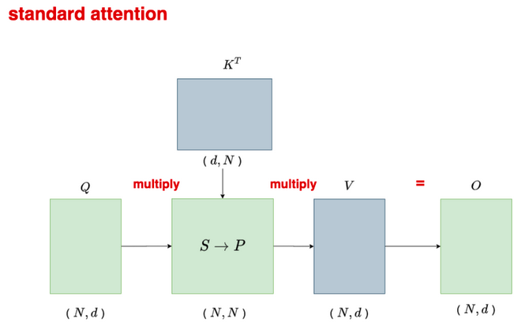

- standard attention pseudo-code  

## 3.3 准备：切片的方式计算softmax
&nbsp;&nbsp;&nbsp;&nbsp;&nbsp;&nbsp;&nbsp;&nbsp;我们按块计算注意力。由于 softmax 将 K 的列进行耦合，因此我们使用缩放的方法对大型 softmax 进行分解。为了数值稳定性，向量 $𝑥∈{R^B}$ 的 softmax 计算如下： 

$$m(x):=max(x_{i}), \quad  f(x):=\left[\begin{array}{lll} e^{x_{1}-m(x)} , \ldots ,  e^{x_{B}-m(x)} \end{array}\right], \quad \ell(x):=\sum_{i} f(x)_{i}, \quad softmax(x):=\frac{f(x)}{\ell(x)}$$

&nbsp;&nbsp;&nbsp;&nbsp;&nbsp;&nbsp;&nbsp;&nbsp; *(注释：在数学中，":=" 是赋值符号，表示将右侧的值赋给左侧的变量或表达式。它常用于编程语言中表示变量的初始化或赋值操作)*  

&nbsp;&nbsp;&nbsp;&nbsp;&nbsp;&nbsp;&nbsp;&nbsp;对于向量 $𝑥^{(1)}, 𝑥^{(2)} ∈ R^B$ ，我们可以将拼接后的向量 $𝑥 = [𝑥^{(1)}; 𝑥^{(2)}] ∈ R^{(2B)}$ 的 softmax 进行分解，如下所示： 

$$m(x)=m([x^{(1)}, x^{(2)}])=\max (m(x^{(1)}), m(x^{(2)})),$$

$$f(x)=[e^{m(x^{(1)})-m(x)} f(x^{(1)}) \quad e^{m(x^{(2)})-m(x)} f(x^{(2)})],$$

$$\ell(x)=\ell([x^{(1)}, x^{(2)}])=e^{m(x^{(1)})-m(x)} \ell(x^{(1)})+e^{m(x^{(2)})-m(x)} \ell(x^{(2)}),$$

$$softmax(x)=\frac{f(x)}{\ell(x)}.$$

- safe-softmax 图解  

## 3.4 flash-attention-1 算法图解
&nbsp;&nbsp;&nbsp;&nbsp;&nbsp;&nbsp;&nbsp;&nbsp;我们使用CUDA实现了FlashAttention，以实现对内存访问的细粒度控制，并将所有注意力操作融合到一个GPU内核中。尽管由于重新计算而增加了浮点运算量，但由于大大减少了对HBM的访问量，我们的算法比标准注意力运行得更快（下图图1右图所示，GPT-2上最高可达7.6倍），并且使用的内存量与序列长度呈线性关系。 

*左图：FlashAttention使用切片技术，防止在相对较慢的GPU高带宽存储器（HBM）上实例化大型的𝑁×𝑁注意力矩阵（虚线框）。在外循环（红色箭头）中，FlashAttention通过K和V矩阵的块循环，并将它们加载到快速的片上SRAM上。在每个块中，FlashAttention通过Q矩阵的块循环（蓝色箭头），将它们加载到SRAM，并将注意力计算的输出写回HBM。右图：相对于GPT-2在PyTorch实现的注意力机制，FlashAttention获得了加速。FlashAttention不需要将大型的𝑁×𝑁注意力矩阵读取和写入HBM，从而在注意力计算中获得了7.6倍的加速.*

## 3.5 FlashAttention1 Forward 伪代码
&nbsp;&nbsp;&nbsp;&nbsp;&nbsp;&nbsp;&nbsp;&nbsp;如上所述：如果我们跟踪一些额外的统计信息(𝑚(𝑥), ℓ(𝑥))，我们可以一次处理一个块计算 softmax。因此，我们将输入 Q、K、V 分成块（算法1的第3行），同时计算 softmax 值和额外的统计信息（算法1的第10行），然后将结果组合起来（算法的第12行）。 

&nbsp;&nbsp;&nbsp;&nbsp;&nbsp;&nbsp;&nbsp;&nbsp;实现细节：Kernel fuse。切片使我们能够在一个CUDA核函数中实现我们的算法，从HBM加载输入数据，执行所有的计算步骤（矩阵乘法、softmax、可选的掩码和dropout、矩阵乘法），然后将结果写回到HBM（掩码和dropout见附录B）。这避免了反复从HBM读取和写入输入和输出的操作。 

**前提：Q K V 三个矩阵的形状均为[N x d], 芯片上 SRAM 尺寸为大小为 M 个elements.**  
- **FlashAttention 简化伪代码：**  
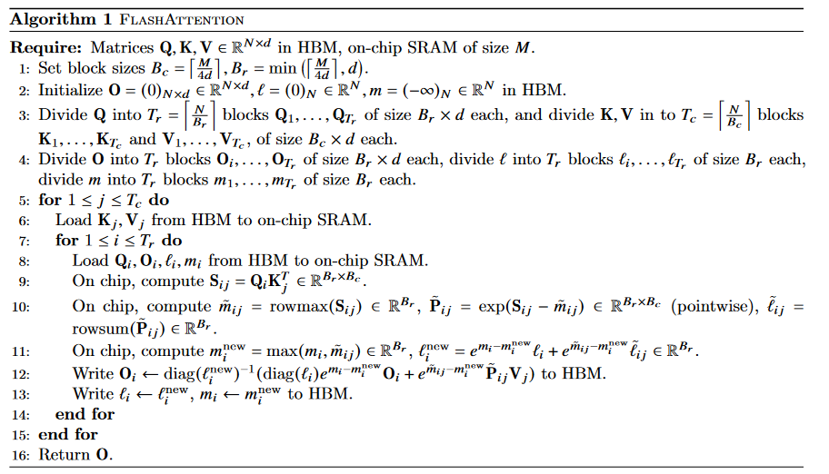

- **FlashAttention forward 实际伪代码**  
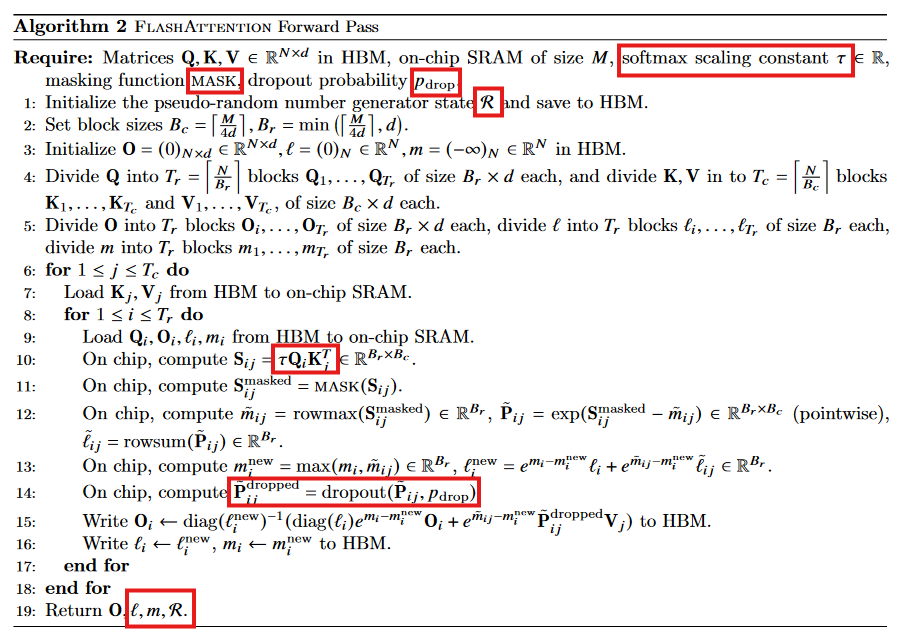

- 逻辑运算简图  
**step1**  
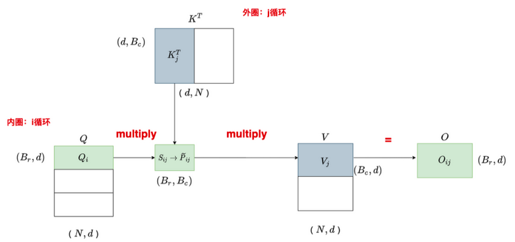

**step2**  
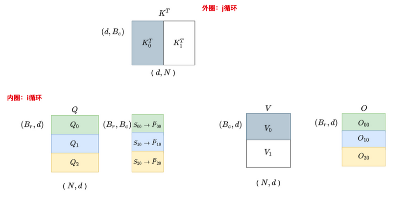

**step3**  
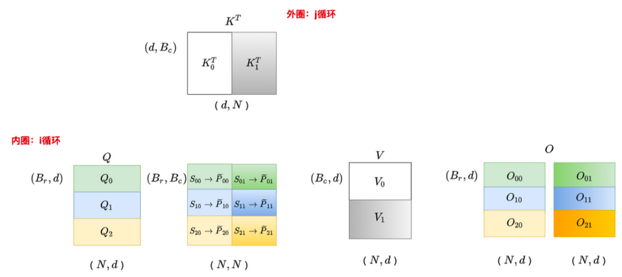

- 官方逻辑图
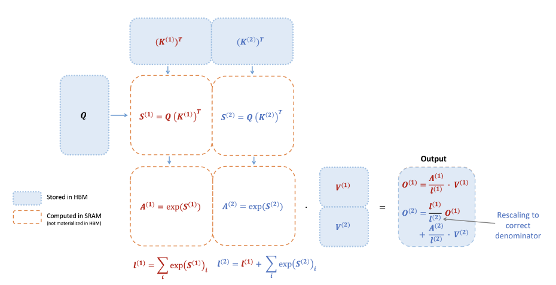

## 3.6 FlashAttention1 Backward 伪代码

- 普通Attention backwad  
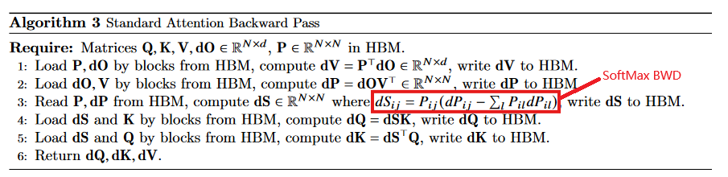

&nbsp;&nbsp;&nbsp;&nbsp;&nbsp;&nbsp;&nbsp;&nbsp;从前向传递中保存伪随机数生成器获取状态并在反向过程中重新生成dropout mask. 

- FlashAttention1 Backward  
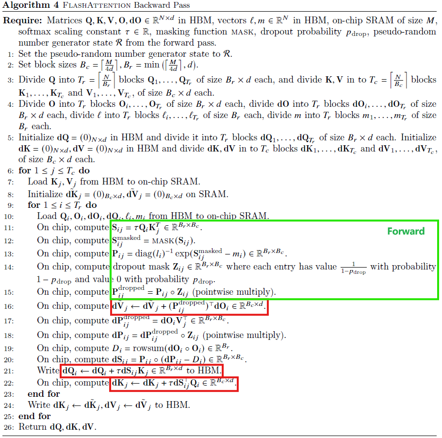

&nbsp;&nbsp;&nbsp;&nbsp;&nbsp;&nbsp;&nbsp;&nbsp;反向传播中，通过在输入块Q、K、V已加载到SRAM中重新计算注意力矩阵S和P的值，FlashAttention避免了需要存储大型中间值。由于不需要保存大小为𝑁×𝑁的大型矩阵S和P，FlashAttention在节省内存方面可以达到10-20倍，具体取决于序列长度（内存需求与序列长度𝑁成线性关系，而不是二次关系）。由于减少内存读写，反向传播还实现了2-4倍的挂钟速度提升。 
&nbsp;&nbsp;&nbsp;&nbsp;&nbsp;&nbsp;&nbsp;&nbsp;在第2.2节的方程中，反向传播应用了平铺。尽管从概念上讲，反向传播比正向传播更简单（没有softmax重新缩放），但在实现上却更为复杂。这是因为在反向传播中需要在SRAM中保持更多的值来执行5次矩阵乘法，而在正向传播中只需要执行2次矩阵乘法。 

## 3.7 Flash-Attention 效果
1. 内存开销： IO Complexity  
- 标准attention  
$$\theta(Nd + N^{2})$$
- Flash attention  
$$\Theta(N^2d^2M^{-1})$$

&nbsp;&nbsp;&nbsp;&nbsp;&nbsp;&nbsp;&nbsp;&nbsp;**内存占用和序列长度呈线性关系**  
&nbsp;&nbsp;&nbsp;&nbsp;&nbsp;&nbsp;&nbsp;&nbsp;For typical values of d(head-hidden-size 64-128) and 𝑀 (around 100KB), 𝑑2 is many times smaller than M.  

2. 加速效果  
&nbsp;&nbsp;&nbsp;&nbsp;&nbsp;&nbsp;&nbsp;&nbsp;HBM的访问次数是决定注意力运行时间的主要因素。Flash-Attention 用了recompute，总的计算FLOP高于传统Attention，但总的运行时间还是加速的。 
- 在常见的序列长度（最高为2K）上比标准注意力快3x倍;
- BERT-Large(MLPerf1.1) 加速15%(seq-len : 512);
- GPT-2 加速3x (seq-len : 1k);
- 可增加序列长度，提升模型性能.

## 3.7 重计算(recompute)
&nbsp;&nbsp;&nbsp;&nbsp;&nbsp;&nbsp;&nbsp;&nbsp;我们的目标之一是不在反向传播过程中存储 $𝑂(𝑁^2)$ 个中间值。反向传播通常需要矩阵 $S、P ∈ R^{N \times N}$ 来计算相对于Q、K、V的梯度。然而，通过存储输出O和softmax归一化统计信息(𝑚, ℓ)，我们可以在反向传播过程中从SRAM中的Q、K、V块轻松地重新计算注意力矩阵S和P。这可以看作是一种选择性梯度检查点的形式。虽然已经提出了梯度检查点技术来减少所需的最大内存量，但所有已知的实现都需要以速度换取内存。相比之下，即使有更多的FLOPs，我们的重计算由于减少了HBM访问次数而加速了反向传播过程。 

## 3.8 FlashAttention1 的不足之处
- output 需要反复读写, 循环一次Q才完成output的一次累计, 需要反复往shared memory 上读写中间结果;
- softmax 操作是在row, 维度上的, 然而现在每次遍历都需要保存一次 $m_{i} l_{i}$ ;

**有没有什么办法可以解决这个问题呢？**  
  
# 4 FlashAttention-2: Faster Attention with Better Parallelism and Work Partitioning  
- [FlashAttention2 论文链接](https://arxiv.org/pdf/2307.08691.pdf)

&nbsp;&nbsp;&nbsp;&nbsp;&nbsp;&nbsp;&nbsp;&nbsp;对FlashAttention算法进行了调整，以减少非矩阵乘法FLOP的数量。这是因为现代GPU具有专门的计算单元（例如，Nvidia GPU上的张量核心），使矩阵乘法速度更快。举个例子，A100 GPU在FP16/BF16矩阵乘法的最大理论吞吐量为312 TFLOPs/s，但在非矩阵乘法FP32上只有19.5 TFLOPs/s。另一种思考方式是，每个非矩阵乘法FLOP的成本是矩阵乘法FLOP的16倍。为了保持高吞吐量（例如，超过最大理论TFLOPs/s的50%以上），我们希望尽可能多地花费时间在矩阵乘法FLOP上。 

## 4.1 softmax-trick v1 vs v2
- FlashAttention1-softmax-trick
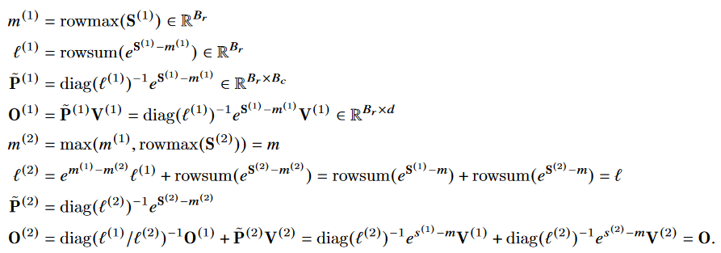

- FlashAttention2-softmax-trick
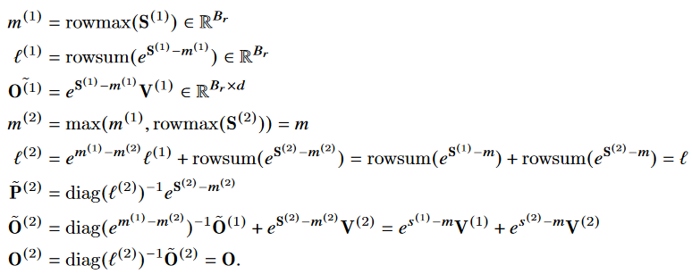

**核心不同**  
&nbsp;&nbsp;&nbsp;&nbsp;&nbsp;&nbsp;&nbsp;&nbsp; Output 不需要每次循环都进行缩放, 只需在Last循环缩放一次.  

## 4.2 forward pass
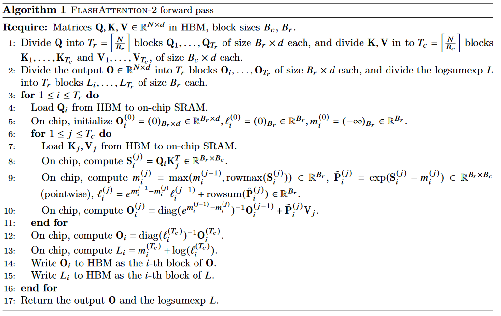

**核心改进点**  
- 循环顺序更改，避免了多次读写 shared memory 的操作;
- attention-score 分母缩放顺序调节避免了非矩阵的 FLOPs 操作, 避免了对每个block用 $l$ 进行缩放;
- 每行最大值 m 和 sum(exp) 值可以一起存储: $L^{j} = m^{j} + log(l^{j})$ ;

**causal masking 的情况**  
- 对于所有列索引均大于行索引的块（对于大序列长度约占一半的块），我们可以跳过对该块的计算。与没有因果掩码的注意力相比，这将导致大约1.7-1.8倍的加速。
- 对于那些确保行索引严格小于列索引的块，我们不需要应用因果掩码。这意味着对于每一行，我们只需要将因果掩码应用到1个块（假设是方块块）。

## 4.3 backward pass

**核心要点**  
- 内外层循环和FlashAttention1 情况相同;
- 前向时计算row 的 max 和 sum(exp) 保存成 $L^{j} = m^{j} + log(l^{j})$ , 导致反向时 $exp(QK^{T} - L)$ 一次计算成功;

**多查询注意力和分组查询注意力**  
&nbsp;&nbsp;&nbsp;&nbsp;&nbsp;&nbsp;&nbsp;&nbsp;多查询注意力（MQA）和分组查询注意力（GQA）是注意力的变体，其中多个查询头关注相同的键头和值头，以减少推断期间KV缓存的大小。我们不需要为计算复制键头和值头，而是隐式地操作头部的索引来执行相同的计算。在反向传播中，我们需要对隐式复制的不同头部之间的梯度dK和dV进行求和。 

## 4.4 v2 相对于 v1 的改进
**V2从以下三个方面做了改进:**  
- 置换内外循环位置，同时减少非矩阵的计算量。（这两点我们在第一部分中已给出详细说明）
- 优化Attention部分thread blocks的并行化计算，新增seq_len维度的并行，使SM的利用率尽量打满。这其实也是内外循环置换这个总体思想配套的改进措施. (具体实施 略)
- 优化thread blocks内部warp级别的工作模式，尽量减少warp间的通讯和读取shared memory的次数。（具体实施 略）

# 5 FlashAttention3 : Fast and Accurate Attention with Asynchrony and Low-precision
- [论文链接](https://arxiv.org/pdf/2407.08608)
  
&nbsp;&nbsp;&nbsp;&nbsp;&nbsp;&nbsp;&nbsp;&nbsp;FlashAttention-2算法遵循简化的同步模型，并且在设计中没有明确使用异步性和低精度。异步性是硬件专门化的结果，用于加速机器学习工作负载中最重要的操作：执行矩阵乘法（张量核心）或内存加载（张量存储器加速器 - TMA）的特定硬件单元，与其余的CUDA核心执行逻辑、整数和浮点计算分开。低精度，如Hopper中的FP8和Blackwell中的FP4，延续了2017年Pascal的FP16和2020年Ampere的BF16的趋势，是一种被证明的技术，可在相同功耗和芯片面积下实现双倍或四倍的吞吐量。我们在第2.2节中回顾了Hopper在这些方向上提供的功能。技术挑战在于重新设计FlashAttention-2以利用这些硬件特性：异步性要求在matmul和softmax之间重叠计算，即使其中一个取决于另一个的输出，低精度要求小心处理以最小化量化误差，特别是在LLMs的异常特征的情况下。 

研究人员提出了FlashAttention-3，它提出并综合了三个新想法，以进一步改进在新的GPU架构上的性能： 

- 生产者-消费者异步性：我们定义了一种专门针对warp的软件流水线方案，利用数据移动和张量核心的异步执行，通过将数据的生产者和消费者分割为单独的warp，从而扩展了算法隐藏内存和指令发布延迟的能力。 
- 在异步块级GEMM下隐藏softmax：我们将与softmax相关的比较低吞吐量的非GEMM操作（例如浮点乘加和指数）与GEMM的异步WGMMA指令重叠。作为其中的一部分，我们重新设计了FlashAttention-2算法，以规避softmax和GEMM之间的某些顺序依赖关系。例如，在我们算法的两阶段版本中，当softmax在得分矩阵的一个块上执行时，WGMMA在异步代理中执行以计算下一个块。 
- 硬件加速的低精度GEMM：我们调整前向传递算法，以允许针对GEMM目标FP8张量核心，几乎将测得的TFLOPs/s翻倍。这需要在内存中布置FP32累加器块和FP8操作数矩阵的不同布局一致性要求。我们使用块量化和不一致处理技术来减轻由于转换为FP8精度而导致的精度损失。 

# 6 RingAttention 
- [网站链接](https://gitcode.com/gh_mirrors/ri/RingAttention/overview?utm_source=artical_gitcode&index=top&type=card&webUrl)
- [RingAttention 论文链接](https://arxiv.org/pdf/2310.01889)
- [Blockwise Transformer](https://arxiv.org/pdf/2305.19370)

&nbsp;&nbsp;&nbsp;&nbsp;&nbsp;&nbsp;&nbsp;&nbsp;什么是ring-attention ? 术语一点地说, 我们希望 context length 能随卡数线性扩展，卡越多，则 context length 越长. 那么一个自然的思路就是让每张卡去算 1/n 的 context length. ring attention 就是基于这种切分的方法. 它的思路类似于把 flash attention （或更本源的 memory efficient attention, blockwise parallel attention）在单卡内部做的**分块**优化扩展到多卡上，不做近似地完成超长 context length 的计算. 

&nbsp;&nbsp;&nbsp;&nbsp;&nbsp;&nbsp;&nbsp;&nbsp;有了对分块计算(flash attention) 的了解，那么 ring attention 就是显而易见的，我们只需要把 seq_eln 分为卡数那么多份(n=num_gpu), 每张卡计算一个 block，只存储一份 $Q_{i}, K_{i}, V_{i}$ , 通过跨卡的 p2p 通信互相传递 $K_{j}, V_{j}$ 来实现迭代计算，就可以实现多卡的超长 context length 了.  

# 7 大模型推理加速利器：KV Cache
&nbsp;&nbsp;&nbsp;&nbsp;&nbsp;&nbsp;&nbsp;&nbsp;假设 K 和 V 能直接存在缓存中，模型规模小还好，一旦模型规模很大长度很长时，KV 根本就存不进缓存。 
- [KV Cache 课件链接](https://github.com/Elvin-Ma/ai_papers/blob/main/attention_optimize/kv-cache.md)

# 8 大模型推理加速利器：Page-Attention
- PagedAttention  
[参考链接](https://blog.vllm.ai/2023/06/20/vllm.html)  
[page attention 论文链接](https://arxiv.org/abs/2309.06180)  

# 9 参考链接
- [参考链接](https://towardsdatascience.com/attn-illustrated-attention-5ec4ad276ee3)
- [书籍 + 代码](https://zh-v2.d2l.ai/chapter_attention-mechanisms/attention-scoring-functions.html)
- [read paper](https://readpaper.com/paper/2963403868)
- [attention-2](https://blog.csdn.net/qq_27590277/article/details/136181185)
- [attention-3](https://blog.csdn.net/CV_Autobot/article/details/140482730)
