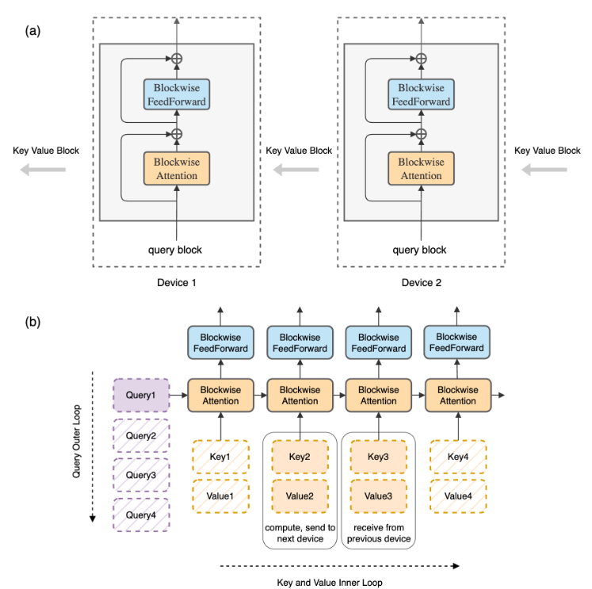
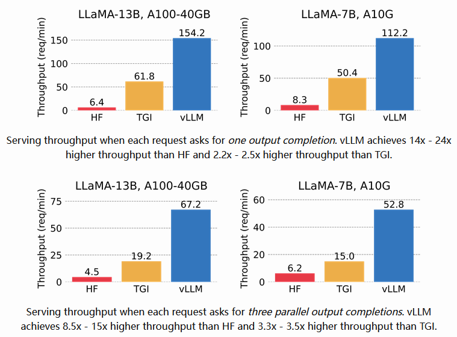

# 1 MQA（Multi Query Attention）
- 背景：<br>
&nbsp;&nbsp;&nbsp;&nbsp;&nbsp;&nbsp;&nbsp;&nbsp;MQA（Multi Query Attention）最早是出现在2019年谷歌的一篇论文 《Fast Transformer Decoding: One Write-Head is All You Need》，之所以没有被关注到，是因为文本生成类任务还没这么火热，解码序列长度也没有现阶段大模型的要求那么高。<br>

- 核心思想：<br>
&nbsp;&nbsp;&nbsp;&nbsp;&nbsp;&nbsp;&nbsp;&nbsp;MQA 让所有的头之间 共享 同一份 Key 和 Value 矩阵，每个头只单独保留了一份 Query 参数，从而大大减少 Key 和 Value 矩阵的参数量。(Multi-query attention is identical except that the different heads share a single set of keys and values.) <br>

- 图示：<br>


- 效果：<br>
&nbsp;&nbsp;&nbsp;&nbsp;&nbsp;&nbsp;&nbsp;&nbsp;推理速度上生成一个 token 时 MHA 和 MQA 的 encoder 分别耗时1.7us和1.5us，而 decoder 分别46us和3.8us，说明 decoder 上 MQA 比 MHA 快很多。另外在效果上 MQA 的 PPL (越小越好)有所上升，BLEU(越大越好)有所下降，换句话说就是效果有所下降。<br>

- [MQA 论文](https://arxiv.org/abs/1911.02150)

# 2 大模型神器：GQA（Grouped Query Attention）
## 2.1 GQA Structure
&nbsp;&nbsp;&nbsp;&nbsp;&nbsp;&nbsp;&nbsp;&nbsp;分组查询注意力(GQA)将查询头分成G个组，每个组共享一个键头和值头。GQA-G表示具有G个组的分组查询。GQA-1表示单个组，因此具有单个键头和值头，等效于MQA。而GQA-H表示组数等于头数，等效于MHA。下图显示了分组查询注意力和多头/多查询注意力的比较。在将多头检查点转换为GQA检查点时，我们通过对该组内所有原始头进行平均汇总来构建每个组的键头和值头。<br>


&nbsp;&nbsp;&nbsp;&nbsp;&nbsp;&nbsp;&nbsp;&nbsp;中间数量的组导致插值模型，其质量高于MQA但比MHA快，正如我们将展示的那样，这代表了一个有利的权衡。从MHA转换为MQA将H个键和值头减少为单个键和值头，将键值缓存(KV Cache)的大小减小，并且需要加载的数据量减少了H倍。然而，更大的模型通常会按比例增加头的数量，从而多查询注意力在内存带宽和容量上都具有更激进的削减。GQA使我们能够随着模型的增大而保持带宽和容量的相同比例减少。<br>
&nbsp;&nbsp;&nbsp;&nbsp;&nbsp;&nbsp;&nbsp;&nbsp;此外，较大的模型相对较少受到注意力的内存带宽开销的影响，因为KV Cache 随着模型维度的增加而扩展，而模型的FLOPs和参数随着模型维度的平方增加。最后，针对大型模型的标准分片将单个键头和值头复制了模型分区的数量（Pope等人，2022）；GQA消除了这种分区的浪费。因此，我们希望GQA在较大的模型中能够达到一个特别好的权衡。<br>
&nbsp;&nbsp;&nbsp;&nbsp;&nbsp;&nbsp;&nbsp;&nbsp;值得注意的是，GQA不适用于编码器(encoder)的自注意力层；编码器表示是并行计算的，因此内存带宽通常不是主要瓶颈。<br>

- [GQA 论文](https://arxiv.org/pdf/2305.13245.pdf)

# 2.2 精度改进：converting the checkpoint and uptraining
*(**uptraining** 是指对已有的模型进行进一步的训练(pre-train)或微调(fine-tune)。它可以是为了适应新的任务或结构，或者改进模型的性能。在这里， **uptraining** 是指将具有多头注意力的语言模型转换为具有多查询注意力的模型，并通过额外的预训练阶段来适应新的结构。)* <br>

- 概念 <br>
&nbsp;&nbsp;&nbsp;&nbsp;&nbsp;&nbsp;&nbsp;&nbsp;在 Multi-Query Attention 方法中只会保留一个单独的key-value头，这样虽然可以提升推理的速度，但是会带来精度上的损失。《Multi-Head Attention:Collaborate Instead of Concatenate 》这篇论文的第一个思路是基于多个 MQA 的 checkpoint 进行 finetuning，来得到了一个质量更高的 MQA 模型。这个过程也被称为 Uptraining。<br>

从多头模型生成多查询模型分为两个步骤：
- 首先是转换检查点(checkpoint)，将多头检查点转换为多查询检查点。key和value头的投影矩阵被平均汇总为单个投影矩阵，我们发现这比选择单个键和值头或从头开始随机初始化新的键和值头效果更好。
- 转换后的检查点接着使用相同的预训练方法进行预训练，但仅进行原始训练步骤的一小部分α。

- 图示：<br>


- 论文链接：<br>
[GQA 论文](https://arxiv.org/pdf/2305.13245.pdf) <br>

# 3 大模型加速利器：FlashAttention: 

- [代码地址](https://github.com/Dao-AILab/flash-attention)
- [FlashAttention1 论文链接](https://arxiv.org/abs/2205.14135)

## 3.1 原理及思想介绍
&nbsp;&nbsp;&nbsp;&nbsp;&nbsp;&nbsp;&nbsp;&nbsp;论文提出了一种名为FlashAttention的新型注意力算法，它可以在较少的内存访问次数下计算精确的注意力。论文认为主要目标是避免将注意力矩阵读取和写入到HBM。为实现这一目标，论文采用了两种成熟的技术来解决这些挑战。
1. 重构了注意力计算过程，将输入分割成块，并对输入块进行多次处理，从而逐步执行softmax归一化操作（也称为切片）。<br>
2. 在前向传播中存储了softmax归一化因子，以便在后向传播中快速重新计算注意力，这比从HBM中读取中间注意力矩阵的标准方法更快。

&nbsp;&nbsp;&nbsp;&nbsp;&nbsp;&nbsp;&nbsp;&nbsp;给定输入的 $Q、K、V ∈ R^{N×d}$ 存储在 HBM 中，我们的目标是计算注意力输出 $O ∈ R^{N×d}$ 并将其写入 HBM。我们的目标是减少 HBM 访问量（降低到次二次方级别的水平）。<br>
&nbsp;&nbsp;&nbsp;&nbsp;&nbsp;&nbsp;&nbsp;&nbsp;我们应用了两种已经建立的技术（切片和重计算）来克服在次二次方级别的HBM访问中计算精确注意力的技术挑战。我们在下述算法中描述了这一过程。主要思想是将输入的 Q、K、V 划分为块，从较慢的HBM加载到较快的SRAM中，然后相对于这些块计算注意力输出。通过在将每个块的输出乘以正确的归一化因子之前进行缩放并将它们相加，我们最终得到了正确的结果。<br>

## 3.2 标准attention机制的算法实现
&nbsp;&nbsp;&nbsp;&nbsp;&nbsp;&nbsp;&nbsp;&nbsp;给定输入序列 $Q、K、V ∈ R^{N×d}$ ，其中 N 是序列长度，d 是头维度（head dimension），我们想要计算注意力输出 $O ∈ R^{N×d}$ 。

$$\mathbf{S}=\mathbf{Q K}^{\top} \in \mathbb{R}^{N \times N}, \quad \mathbf{P}=softmax(\mathbf{S}) \in \mathbb{R}^{N \times N}, \quad \mathbf{O}=\mathbf{P V} \in \mathbb{R}^{N \times d}$$

这里，softmax 按行(row-wise)来进行。<br>
&nbsp;&nbsp;&nbsp;&nbsp;&nbsp;&nbsp;&nbsp;&nbsp;标准的注意力实现将矩阵 S 和 P 实例化到 HBM 中，这需要 $O(N^{2})$  的内存。通常情况下, $N >> d$ （例如，对于GPT2，N=1024，d=64）。我们在算法0中描述了标准的注意力实现。由于一些或大部分操作是内存密集型的（例如softmax），大量的内存访问会导致较慢的实际执行时间<br>
&nbsp;&nbsp;&nbsp;&nbsp;&nbsp;&nbsp;&nbsp;&nbsp;这个问题在应用于注意力矩阵的其他逐元素操作时会变得更加严重，例如应用于 S 的掩码操作或应用于 P 的dropout操作。因此，已经有很多尝试将多个逐元素操作融合在一起，例如将掩码操作与softmax操作融合在一起[77]。<br>
在第3.2节中，我们将展示标准的注意力实现在序列长度 N 方面进行 HBM 访问的二次方增长。我们还将比较标准注意力和我们的方法（FlashAttention）的FLOPs数量和HBM访问数量。<br>

- 计算简图 <br>


- standard attention pseudo-code <br>


## 3.3 准备：切片的方式计算softmax
&nbsp;&nbsp;&nbsp;&nbsp;&nbsp;&nbsp;&nbsp;&nbsp;我们按块计算注意力。由于 softmax 将 K 的列进行耦合，因此我们使用缩放的方法对大型 softmax 进行分解。为了数值稳定性，向量 $𝑥∈{R^B}$ 的 softmax 计算如下：<br>

$$m(x):=max(x_{i}), \quad  f(x):=\left[\begin{array}{lll} e^{x_{1}-m(x)} , \ldots ,  e^{x_{B}-m(x)} \end{array}\right], \quad \ell(x):=\sum_{i} f(x)_{i}, \quad softmax(x):=\frac{f(x)}{\ell(x)}$$

&nbsp;&nbsp;&nbsp;&nbsp;&nbsp;&nbsp;&nbsp;&nbsp; *(注释：在数学中，":=" 是赋值符号，表示将右侧的值赋给左侧的变量或表达式。它常用于编程语言中表示变量的初始化或赋值操作)* <br>

&nbsp;&nbsp;&nbsp;&nbsp;&nbsp;&nbsp;&nbsp;&nbsp;对于向量 $𝑥^{(1)}, 𝑥^{(2)} ∈ R^B$ ，我们可以将拼接后的向量 $𝑥 = [𝑥^{(1)}; 𝑥^{(2)}] ∈ R^{(2B)}$ 的 softmax 进行分解，如下所示：<br>

$$m(x)=m([x^{(1)}, x^{(2)}])=\max (m(x^{(1)}), m(x^{(2)})),$$

$$f(x)=[e^{m(x^{(1)})-m(x)} f(x^{(1)}) \quad e^{m(x^{(2)})-m(x)} f(x^{(2)})],$$

$$\ell(x)=\ell([x^{(1)}, x^{(2)}])=e^{m(x^{(1)})-m(x)} \ell(x^{(1)})+e^{m(x^{(2)})-m(x)} \ell(x^{(2)}),$$

$$softmax(x)=\frac{f(x)}{\ell(x)}.$$

- safe-softmax 图解 <br>


## 3.4 flash-attention-1 算法图解
&nbsp;&nbsp;&nbsp;&nbsp;&nbsp;&nbsp;&nbsp;&nbsp;我们使用CUDA实现了FlashAttention，以实现对内存访问的细粒度控制，并将所有注意力操作融合到一个GPU内核中。尽管由于重新计算而增加了浮点运算量，但由于大大减少了对HBM的访问量，我们的算法比标准注意力运行得更快（下图图1右图所示，GPT-2上最高可达7.6倍），并且使用的内存量与序列长度呈线性关系。<br>


*左图：FlashAttention使用切片技术，防止在相对较慢的GPU高带宽存储器（HBM）上实例化大型的𝑁×𝑁注意力矩阵（虚线框）。在外循环（红色箭头）中，FlashAttention通过K和V矩阵的块循环，并将它们加载到快速的片上SRAM上。在每个块中，FlashAttention通过Q矩阵的块循环（蓝色箭头），将它们加载到SRAM，并将注意力计算的输出写回HBM。右图：相对于GPT-2在PyTorch实现的注意力机制，FlashAttention获得了加速。FlashAttention不需要将大型的𝑁×𝑁注意力矩阵读取和写入HBM，从而在注意力计算中获得了7.6倍的加速.*

## 3.5 FlashAttention1 Forward 伪代码
&nbsp;&nbsp;&nbsp;&nbsp;&nbsp;&nbsp;&nbsp;&nbsp;如上所述：如果我们跟踪一些额外的统计信息(𝑚(𝑥), ℓ(𝑥))，我们可以一次处理一个块计算 softmax。因此，我们将输入 Q、K、V 分成块（算法1的第3行），同时计算 softmax 值和额外的统计信息（算法1的第10行），然后将结果组合起来（算法的第12行）。<br>

&nbsp;&nbsp;&nbsp;&nbsp;&nbsp;&nbsp;&nbsp;&nbsp;实现细节：Kernel fuse。切片使我们能够在一个CUDA核函数中实现我们的算法，从HBM加载输入数据，执行所有的计算步骤（矩阵乘法、softmax、可选的掩码和dropout、矩阵乘法），然后将结果写回到HBM（掩码和dropout见附录B）。这避免了反复从HBM读取和写入输入和输出的操作。<br>

**前提：Q K V 三个矩阵的形状均为[N x d], 芯片上 SRAM 尺寸为大小为 M 个elements.** <br>
- **FlashAttention 简化伪代码：** <br>


- **FlashAttention forward 实际伪代码** <br>


- 逻辑运算简图 <br>
**step1** <br>


**step2** <br>


**step3** <br>


- 官方逻辑图


## 3.6 FlashAttention1 Backward 伪代码

- 普通Attention backwad <br>


&nbsp;&nbsp;&nbsp;&nbsp;&nbsp;&nbsp;&nbsp;&nbsp;从前向传递中保存伪随机数生成器获取状态并在反向过程中重新生成dropout mask.<br>

- FlashAttention1 Backward <br>


&nbsp;&nbsp;&nbsp;&nbsp;&nbsp;&nbsp;&nbsp;&nbsp;反向传播中，通过在输入块Q、K、V已加载到SRAM中重新计算注意力矩阵S和P的值，FlashAttention避免了需要存储大型中间值。由于不需要保存大小为𝑁×𝑁的大型矩阵S和P，FlashAttention在节省内存方面可以达到10-20倍，具体取决于序列长度（内存需求与序列长度𝑁成线性关系，而不是二次关系）。由于减少内存读写，反向传播还实现了2-4倍的挂钟速度提升。<br>
&nbsp;&nbsp;&nbsp;&nbsp;&nbsp;&nbsp;&nbsp;&nbsp;在第2.2节的方程中，反向传播应用了平铺。尽管从概念上讲，反向传播比正向传播更简单（没有softmax重新缩放），但在实现上却更为复杂。这是因为在反向传播中需要在SRAM中保持更多的值来执行5次矩阵乘法，而在正向传播中只需要执行2次矩阵乘法。<br>

## 3.7 Flash-Attention 效果
1. 内存开销： IO Complexity <br>
- 标准attention <br>
$$\theta(Nd + N^{2})$$
- Flash attention <br>
$$\Theta(N^2d^2M^{-1})$$

&nbsp;&nbsp;&nbsp;&nbsp;&nbsp;&nbsp;&nbsp;&nbsp;**内存占用和序列长度呈线性关系** <br>
&nbsp;&nbsp;&nbsp;&nbsp;&nbsp;&nbsp;&nbsp;&nbsp;For typical values of d(head-hidden-size 64-128) and 𝑀 (around 100KB), 𝑑2 is many times smaller than M. <br>

2. 加速效果 <br>
&nbsp;&nbsp;&nbsp;&nbsp;&nbsp;&nbsp;&nbsp;&nbsp;HBM的访问次数是决定注意力运行时间的主要因素。Flash-Attention 用了recompute，总的计算FLOP高于传统Attention，但总的运行时间还是加速的。<br>
- 在常见的序列长度（最高为2K）上比标准注意力快3x倍;
- BERT-Large(MLPerf1.1) 加速15%(seq-len : 512);
- GPT-2 加速3x (seq-len : 1k);
- 可增加序列长度，提升模型性能.

## 3.7 重计算(recompute)
&nbsp;&nbsp;&nbsp;&nbsp;&nbsp;&nbsp;&nbsp;&nbsp;我们的目标之一是不在反向传播过程中存储 $𝑂(𝑁^2)$ 个中间值。反向传播通常需要矩阵 $S、P ∈ R^{N \times N}$ 来计算相对于Q、K、V的梯度。然而，通过存储输出O和softmax归一化统计信息(𝑚, ℓ)，我们可以在反向传播过程中从SRAM中的Q、K、V块轻松地重新计算注意力矩阵S和P。这可以看作是一种选择性梯度检查点的形式。虽然已经提出了梯度检查点技术来减少所需的最大内存量，但所有已知的实现都需要以速度换取内存。相比之下，即使有更多的FLOPs，我们的重计算由于减少了HBM访问次数而加速了反向传播过程。<br>

## 3.8 FlashAttention1 的不足之处
- output 需要反复读写, 循环一次Q才完成output的一次累计, 需要反复往shared memory 上读写中间结果;
- softmax 操作是在row, 维度上的, 然而现在每次遍历都需要保存一次 $m_{i} l_{i}$ ;

**有没有什么办法可以解决这个问题呢？** <br>
  
# 4 FlashAttention-2: Faster Attention with Better Parallelism and Work Partitioning <br>
- [FlashAttention2 论文链接](https://arxiv.org/pdf/2307.08691.pdf)

&nbsp;&nbsp;&nbsp;&nbsp;&nbsp;&nbsp;&nbsp;&nbsp;对FlashAttention算法进行了调整，以减少非矩阵乘法FLOP的数量。这是因为现代GPU具有专门的计算单元（例如，Nvidia GPU上的张量核心），使矩阵乘法速度更快。举个例子，A100 GPU在FP16/BF16矩阵乘法的最大理论吞吐量为312 TFLOPs/s，但在非矩阵乘法FP32上只有19.5 TFLOPs/s。另一种思考方式是，每个非矩阵乘法FLOP的成本是矩阵乘法FLOP的16倍。为了保持高吞吐量（例如，超过最大理论TFLOPs/s的50%以上），我们希望尽可能多地花费时间在矩阵乘法FLOP上。<br>

## 4.1 softmax-trick v1 vs v2
- FlashAttention1-softmax-trick


- FlashAttention2-softmax-trick


**核心不同** <br>
&nbsp;&nbsp;&nbsp;&nbsp;&nbsp;&nbsp;&nbsp;&nbsp; Output 不需要每次循环都进行缩放, 只需在Last循环缩放一次. <br>

## 4.2 forward pass


**核心改进点** <br>
- 循环顺序更改，避免了多次读写 shared memory 的操作;
- attention-score 分母缩放顺序调节避免了非矩阵的 FLOPs 操作, 避免了对每个block用 $l$ 进行缩放;
- 每行最大值 m 和 sum(exp) 值可以一起存储: $L^{j} = m^{j} + log(l^{j})$ ;

**causal masking 的情况** <br>
- 对于所有列索引均大于行索引的块（对于大序列长度约占一半的块），我们可以跳过对该块的计算。与没有因果掩码的注意力相比，这将导致大约1.7-1.8倍的加速。
- 对于那些确保行索引严格小于列索引的块，我们不需要应用因果掩码。这意味着对于每一行，我们只需要将因果掩码应用到1个块（假设是方块块）。

## 4.3 backward pass


**核心要点** <br>
- 内外层循环和FlashAttention1 情况相同;
- 前向时计算row 的 max 和 sum(exp) 保存成 $L^{j} = m^{j} + log(l^{j})$ , 导致反向时 $exp(QK^{T} - L)$ 一次计算成功;

**多查询注意力和分组查询注意力** <br>
&nbsp;&nbsp;&nbsp;&nbsp;&nbsp;&nbsp;&nbsp;&nbsp;多查询注意力（MQA）和分组查询注意力（GQA）是注意力的变体，其中多个查询头关注相同的键头和值头，以减少推断期间KV缓存的大小。我们不需要为计算复制键头和值头，而是隐式地操作头部的索引来执行相同的计算。在反向传播中，我们需要对隐式复制的不同头部之间的梯度dK和dV进行求和。<br>

## 4.4 v2 相对于 v1 的改进
**V2从以下三个方面做了改进:** <br>
- 置换内外循环位置，同时减少非矩阵的计算量。（这两点我们在第一部分中已给出详细说明）
- 优化Attention部分thread blocks的并行化计算，新增seq_len维度的并行，使SM的利用率尽量打满。这其实也是内外循环置换这个总体思想配套的改进措施. (具体实施 略)
- 优化thread blocks内部warp级别的工作模式，尽量减少warp间的通讯和读取shared memory的次数。（具体实施 略）

# 5 FlashAttention3 : Fast and Accurate Attention with Asynchrony and Low-precision
- [论文链接](https://arxiv.org/pdf/2407.08608)
  
&nbsp;&nbsp;&nbsp;&nbsp;&nbsp;&nbsp;&nbsp;&nbsp;FlashAttention-2算法遵循简化的同步模型，并且在设计中没有明确使用异步性和低精度。异步性是硬件专门化的结果，用于加速机器学习工作负载中最重要的操作：执行矩阵乘法（张量核心）或内存加载（张量存储器加速器 - TMA）的特定硬件单元，与其余的CUDA核心执行逻辑、整数和浮点计算分开。低精度，如Hopper中的FP8和Blackwell中的FP4，延续了2017年Pascal的FP16和2020年Ampere的BF16的趋势，是一种被证明的技术，可在相同功耗和芯片面积下实现双倍或四倍的吞吐量。我们在第2.2节中回顾了Hopper在这些方向上提供的功能。技术挑战在于重新设计FlashAttention-2以利用这些硬件特性：异步性要求在matmul和softmax之间重叠计算，即使其中一个取决于另一个的输出，低精度要求小心处理以最小化量化误差，特别是在LLMs的异常特征的情况下。<br>

研究人员提出了FlashAttention-3，它提出并综合了三个新想法，以进一步改进在新的GPU架构上的性能：<br>

- 生产者-消费者异步性：我们定义了一种专门针对warp的软件流水线方案，利用数据移动和张量核心的异步执行，通过将数据的生产者和消费者分割为单独的warp，从而扩展了算法隐藏内存和指令发布延迟的能力。<br>
- 在异步块级GEMM下隐藏softmax：我们将与softmax相关的比较低吞吐量的非GEMM操作（例如浮点乘加和指数）与GEMM的异步WGMMA指令重叠。作为其中的一部分，我们重新设计了FlashAttention-2算法，以规避softmax和GEMM之间的某些顺序依赖关系。例如，在我们算法的两阶段版本中，当softmax在得分矩阵的一个块上执行时，WGMMA在异步代理中执行以计算下一个块。<br>
- 硬件加速的低精度GEMM：我们调整前向传递算法，以允许针对GEMM目标FP8张量核心，几乎将测得的TFLOPs/s翻倍。这需要在内存中布置FP32累加器块和FP8操作数矩阵的不同布局一致性要求。我们使用块量化和不一致处理技术来减轻由于转换为FP8精度而导致的精度损失。<br>

# 6 RingAttention 
- [网站链接](https://gitcode.com/gh_mirrors/ri/RingAttention/overview?utm_source=artical_gitcode&index=top&type=card&webUrl)
- [RingAttention 论文链接](https://arxiv.org/pdf/2310.01889)
- [Blockwise Transformer](https://arxiv.org/pdf/2305.19370)

&nbsp;&nbsp;&nbsp;&nbsp;&nbsp;&nbsp;&nbsp;&nbsp;什么是ring-attention ? 术语一点地说, 我们希望 context length 能随卡数线性扩展，卡越多，则 context length 越长. 那么一个自然的思路就是让每张卡去算 1/n 的 context length. ring attention 就是基于这种切分的方法. 它的思路类似于把 flash attention （或更本源的 memory efficient attention, blockwise parallel attention）在单卡内部做的**分块**优化扩展到多卡上，不做近似地完成超长 context length 的计算.<br>

&nbsp;&nbsp;&nbsp;&nbsp;&nbsp;&nbsp;&nbsp;&nbsp;有了对分块计算(flash attention) 的了解，那么 ring attention 就是显而易见的，我们只需要把 seq_eln 分为卡数那么多份(n=num_gpu), 每张卡计算一个 block，只存储一份 $Q_{i}, K_{i}, V_{i}$ , 通过跨卡的 p2p 通信互相传递 $K_{j}, V_{j}$ 来实现迭代计算，就可以实现多卡的超长 context length 了. <br>

## 6.1 具体实现原理
&nbsp;&nbsp;&nbsp;&nbsp;&nbsp;&nbsp;&nbsp;&nbsp;我们的主要目标是通过有效地在多个主机之间分配长序列，消除个别设备施加的内存限制，而无需增加额外开销。为实现这一目标，我们提出对[blockwise parallel transforme（BPT）framework](https://arxiv.org/pdf/2305.19370)进行增强。在将输入序列分布到不同主机时，每个主机负责运行与其指定块相对应的块并行注意力外部循环的一个元素，以及特定于该块的前馈网络。这些操作不需要与其他主机进行通信。然而，在涉及需要从其他主机获取块的key-value block 交互的内部循环中出现了挑战。由于每个主机只拥有一个key-value block，从其他主机获取block的朴素方法会导致两个重要问题。首先，它会引入计算延迟，因为系统等待接收必要的key-value block。其次，key-value block的累积会导致内存使用增加，这将违背减少内存成本的初衷。<br>

&nbsp;&nbsp;&nbsp;&nbsp;&nbsp;&nbsp;&nbsp;&nbsp;**Ring-Based Blockwise Attention.** 为了解决上述挑战，我们利用内部循环key-value block操作的置换不变性属性。这一属性源自这样一个事实：Q block与一组Key-Value block之间的attention可以按任何顺序计算，只要每个块的统计数据正确组合以进行重新缩放。我们通过将所有主机概念化为形成一个环结构来利用这一属性：主机1、主机2，直至主机N。在计算块并行注意力和前馈时，每个主机通过**同时**将用于注意力计算的key-value block有效地发送到下一个主机，同时从前一个主机接收键-值块，**有效地重叠块的传输与块级计算**。具体而言，对于任何主机i，在计算其Query block与一个key-value block之间的注意力时，它同时将key-value block发送给下一个主机(i + 1)，同时从前一个主机(i - 1)接收key-value block。如果计算时间超过了传输key-value block所需的时间，这将不会导致额外的通信成本。这种重叠机制适用于我们方法的正向和反向传递，因为可以使用相同的操作和技术。先前的工作还提出利用环拓扑来计算自注意力，旨在降低通信成本。我们的工作不同之处在于利用块并行transformer大幅降低内存成本。正如我们在下一节中所展示的，这使得在训练和推理过程中上下文大小的扩展零开销，并允许任意大的上下文大小。<br>



*图a:我们使用与原始Transformer相同的模型架构，但重新组织计算。在图中，我们通过显示在主机环中，每个主机持有一个查询块，并且键-值块通过主机环进行遍历，以块对块的方式进行注意力和前馈计算来解释这一点。在计算注意力时，每个主机将键-值块发送到下一个主机，同时从前一个主机接收键-值块。通信与块级注意力和前馈计算重叠。* <br>
*图b:我们逐块计算原始Transformer。每个主机负责query’s outer loop的一个迭代，而key-value block在主机之间轮转。如图所示，一个设备从左侧开始处理第一个查询块；然后我们沿水平位置排列的key-value block sequence 进行迭代。query block 与 key-value block结合用于计算自注意力（黄色框），其输出传递给前馈网络（青色框）。* <br>

# 7 从ring-attention 到 context parallel
- [context_parallel](https://github.com/NVIDIA/Megatron-LM/blob/c3677e09aa4e2eec37048307bd795928b8f8324a/docs/source/api-guide/context_parallel.rst)


```python
#                                                                         attention 结束                               LayerNorm结束                                              MLP 结束
#
#                    (16, 32, 768)                       (16, 64, 384)                            (16, 32, 768)                       (16, 64, 384)                              (16, 32, 768)
#                          AG/RS --> (16, 64, 768) -->                --> (16, 64, 768) --> RS/AG             --> AG/RS (16, 64, 768)               -->  (16, 64, 768) --> RS/AG
#                    (16, 32, 768)                       (16, 64, 384)                            (16, 32, 768)                       (16, 64, 384)                              (16, 32, 768)
# (16, 128, 768) -->
#                    (16, 32, 768)                       (16, 64, 384)                            (16, 32, 768)                       (16, 64, 384)                              (16, 32, 768)
#                          AG/RS --> (16, 64, 768) -->                --> (16, 64, 768) --> RS/AG             --> AG/RS (16, 64, 768)               --> (16, 64, 768)  --> RS/AG
#                    (16, 32, 768)                       (16, 64, 384)                            (16, 32, 768)                       (16, 64, 384)                              (16, 32, 768)
#
```

*Figure : 一个使用 TP2CP2 运行的 Transformer 层。Attention 旁边的通信是为了 CP，其它的是为了 TP。（AG/RS：前向传播中的 all-gather 和反向传播中的 reduce-scatter，RS/AG：前向传播中的 reduce-scatter 和反向传播中的 all-gather，/AG：前向传播中的空操作和反向传播中的 all-gather）。* <br>

&nbsp;&nbsp;&nbsp;&nbsp;&nbsp;&nbsp;&nbsp;&nbsp;上下文并行（“CP”）是一种在**序列长度维度**上的并行化方案。与之前的 SP（序列并行）不同，SP仅拆分Dropout和LayerNorm激活的序列，CP沿着序列维度分割网络输入和所有激活。通过CP，除了注意力之外的所有模块（例如，Linear，LayerNorm等）都可以像往常一样工作，无需进行任何更改，因为它们没有跨token的操作。至于注意力，每个标记的查询（Q）需要与同一序列中所有标记的键值（KV）进行计算。因此，CP需要跨GPU进行额外的allgather以收集完整的KV序列。相应地，在反向传播中应用reduce-scatter到KV的激活梯度。为了减少激活内存占用，每个GPU在前向过程中仅存储一个序列块的KV，并在反向过程中再次收集KV。KV通信发生在一个GPU和其他TP组中的对等GPU之间。全收集和reduce-scatter在底层转换为环拓扑中的点对点通信。交换KV还可以利用MQA/GQA来减少通信量，因为它们仅对KV使用一个或少量注意力头。<br>

&nbsp;&nbsp;&nbsp;&nbsp;&nbsp;&nbsp;&nbsp;&nbsp;例如，在图1中，假设序列长度为8K，每个GPU处理4K个标记(此处有歧义)。GPU0和GPU2组成一个CP组，它们彼此交换KV。同样的情况也发生在GPU1和GPU3之间。CP类似于环注意力，但通过（1）利用最新的OSS和cuDNN快闪注意力内核；（2）消除由低三角形因果蒙版导致的不必要计算，并在GPU之间实现最佳负载平衡，提供更好的性能。<br>


&nbsp;&nbsp;&nbsp;&nbsp;&nbsp;&nbsp;&nbsp;&nbsp;LLM在处理长上下文（即，长序列长度）时遇到了内存不足（OOM）问题，因为激活的内存占用呈线性增长。在反向计算中重新计算激活可以避免OOM，但也会引入显著的开销（完全重新计算时约为30%）。扩大张量模型并行性（TP）也可以解决OOM问题，但**这可能会使计算（例如，Linear）过短，无法重叠通信延迟**。明确地说，无论是否发生OOM，扩展到更多GPU并增加TP都可能会遇到重叠问题。<br>

&nbsp;&nbsp;&nbsp;&nbsp;&nbsp;&nbsp;&nbsp;&nbsp;CP可以更好地解决这些问题。使用CP，每个GPU仅对序列的一部分进行计算，这通过CP倍减少了计算和通信。因此，不用担心它们之间的重叠。每个GPU的激活内存占用也小了CP倍，因此不再有OOM问题。正如图2所示，TP和CP的组合可以**通过消除重新计算开销，并在计算和通信之间取得最佳折衷来实现最佳性能**。<br>

&nbsp;&nbsp;&nbsp;&nbsp;&nbsp;&nbsp;&nbsp;&nbsp;在GPT中已经添加了CP支持。所有共享GPT代码路径的模型也应该能够受益于CP，比如Llama。CP可以与TP（张量模型并行）、PP（管道模型并行）和DP（数据并行）一起工作，其中GPU的总数等于TPxCPxPPxDP。CP还可以与不同的注意力变体一起工作，包括MHA/MQA/GQA，单向和双向掩蔽。<br>

&nbsp;&nbsp;&nbsp;&nbsp;&nbsp;&nbsp;&nbsp;&nbsp;通过简单地在命令行中设置context_parallel_size=<CP_SIZE> 来启用CP。默认的context_parallel_size为1，这意味着CP被禁用。运行CP需要Megatron-Core（>=0.5.0）和Transformer Engine（>=1.1）。

# 7 从context parallel 到 chunked pipeline parallelism
- [MoonCake](https://arxiv.org/pdf/2407.00079)

&nbsp;&nbsp;&nbsp;&nbsp;&nbsp;&nbsp;&nbsp;&nbsp;分块管道并行（Chunked Pipeline Parallelism，CPP）机制来扩展单个请求的处理能力，跨多个节点进行处理，这对于减少长上下文输入的总体处理时间（TTFT）是必要的。与传统的序列并行（Sequence Parallelism，SP）解决方案相比，CPP 减少了网络消耗并简化了对频繁弹性扩展的依赖。该机制还通过层次预填充（layer-wise prefill）进行了补充，使得 KV 缓存的流式传输可以重叠延迟，从而进一步提高了系统的性能和效率。CPP 机制使得系统可以更好地处理长上下文输入，并且可以更有效地利用多个节点的处理能力，从而提高系统的整体性能和吞吐量。

*(注释:TTFT(time to first token) TBT(time between tokens))*

&nbsp;&nbsp;&nbsp;&nbsp;&nbsp;&nbsp;&nbsp;&nbsp;最近的大型语言模型的可用上下文长度正在迅速增加，从8k到128K，甚至1M。通常，对于这样长的上下文请求，输入标记可能比输出标记大10到100倍，因此优化TTFT至关重要。由于长上下文预填具有丰富的并行性，使用超过一个8x GPU节点并行处理它们是可取的。然而，跨多个节点扩展张量并行性（TP）需要每层两次昂贵的基于RDMA的全局归约操作，显著降低了预填节点的MFU。<br>

&nbsp;&nbsp;&nbsp;&nbsp;&nbsp;&nbsp;&nbsp;&nbsp;最近，许多研究提出了序列并行性（SP）。序列并行性将请求的输入序列在不同节点之间分区，以实现加速。这些序列并行性方法利用了注意力运算的结合特性，并在Ring Attention或Striped Attention的实现过程中每层至少需要一次跨节点通信。这大大减少了网络消耗并提高了MFU。

&nbsp;&nbsp;&nbsp;&nbsp;&nbsp;&nbsp;&nbsp;&nbsp;然而，SP仍然导致MFU比仅使用单节点TP时更差。理想的部署将预填节点组织成两组：一组仅使用TP，另一组使用SP。仅在必要时将请求分发到SP组，以满足TTFT SLO。这种进一步的分解会导致动态调整每个组中节点数量的问题，因为静态并行设置可能导致集群中利用率较低。最近的研究提出了弹性序列并行性，以动态扩展或缩减SP组。尽管这是可能的，但这会给我们的架构增加复杂性。例如，需要提前建立一个全局通信组，并在调整期间考虑缓存重用利用率和SLO要求违规等指标时使Conductor的设计复杂化。这使得在部署过程中需要频繁的即时可扩展性的情况下具有挑战性。此外，SP仍然需要频繁的跨节点通信，这降低了MFU并与网络资源竞争以在节点之间传输KVCache。<br>

&nbsp;&nbsp;&nbsp;&nbsp;&nbsp;&nbsp;&nbsp;&nbsp;为解决这个问题，Mooncake 利用 **decoder-only transformer 的自回归属性** ，并为长上下文prefill实现了分块管道并行性（CPP）。我们将预填集群中的每 X 个节点分组为一个流水线预填节点组。对于每个请求，其输入标记被分成小块，每块不超过预填块大小。同一请求的不同块可以由不同节点同时处理，从而实现并行处理并减少 TTFT。<br>

&nbsp;&nbsp;&nbsp;&nbsp;&nbsp;&nbsp;&nbsp;&nbsp;CPP 提供了两个主要优点：<br>
1. 类似于训练中的流水线并行性，它只在每个流水线阶段的边界需要跨节点通信，这可以很容易地与计算重叠。这导致更好的 MFU，并减少了与 KVCache 传输相关的网络资源争用。
2. 它自然适用于短期和长期上下文，对于短期上下文预填没有明显的开销，并避免频繁动态调整节点分区。这基于流水线的加速方法已在训练系统中得到探讨，但据我们所知，这是在推理阶段的第一个应用，由于长上下文推理只是最近出现。

# 8 大模型推理加速利器：KV Cache
&nbsp;&nbsp;&nbsp;&nbsp;&nbsp;&nbsp;&nbsp;&nbsp;假设 K 和 V 能直接存在缓存中，模型规模小还好，一旦模型规模很大长度很长时，KV 根本就存不进缓存。<br>
- [KV Cache 课件链接](https://github.com/Elvin-Ma/ai_papers/blob/main/attention_optimize/kv-cache.md)

# 9 大模型推理加速利器：Page-Attention and vLLM
- PagedAttention <br>
[参考链接](https://blog.vllm.ai/2023/06/20/vllm.html) <br>
[page attention 论文链接](https://arxiv.org/pdf/2309.06180) <br>

## 9.1 vLLM 简介
&nbsp;&nbsp;&nbsp;&nbsp;&nbsp;&nbsp;&nbsp;&nbsp;LLM承诺从根本上改变我们在所有行业中使用人工智能的方式。然而，实际为这些模型提供服务是具有挑战性的，即使在昂贵的硬件上，速度也可能令人惊讶地缓慢。今天，我们很高兴地介绍vLLM，这是一个用于快速LLM推理和服务的开源库。vLLM利用了我们的新注意力算法PagedAttention，有效地管理注意力key 和 value。配备PagedAttention的vLLM重新定义了LLM Server的最新技术水平：它的吞吐量比HuggingFace Transformers高出多达24倍，而无需进行任何模型架构更改。<br>

&nbsp;&nbsp;&nbsp;&nbsp;&nbsp;&nbsp;&nbsp;&nbsp;vLLM已经在加州大学伯克利分校开发，并在过去两个月部署在Chatbot Arena和Vicuna Demo。这是一项核心技术，即使对于像LMSYS这样具有有限计算资源的小型研究团队，也使LLM服务变得负担得起。在我们的GitHub存储库中，现在可以通过一条简单的命令尝试vLLM。<br>

&nbsp;&nbsp;&nbsp;&nbsp;&nbsp;&nbsp;&nbsp;&nbsp;我们将vLLM的吞吐量与HuggingFace Transformers（HF）这一最流行的LLM库以及HuggingFace文本生成推理（TGI），即先前的技术水平进行比较。我们在两种设置下进行评估：LLaMA-7B在NVIDIA A10G GPU上和LLaMA-13B在NVIDIA A100 GPU（40GB）上。我们从ShareGPT数据集中对请求的输入/输出长度进行抽样。在我们的实验中，相较于HF，vLLM的吞吐量最高提高了24倍，比TGI高出最多3.5倍。<br>



## 9.2 秘密武器：PagedAttention
&nbsp;&nbsp;&nbsp;&nbsp;&nbsp;&nbsp;&nbsp;&nbsp;在vLLM中，我们确定LLM服务的性能受到**内存的限制**。在自回归解码过程中，LLM的所有输入token产生它们的注意力key 和 value Tensor，并且这些Tensor保留在GPU内存中以生成下一个token。这些cached key and value 通常被称为KV cache。KV cache具有以下特点：<br>

- Large：在LLaMA-13B中，单个序列(sequence)占用高达1.7GB的空间。<br>
- Dynamic：其大小取决于序列长度，而序列长度具有极大的变化和不可预测性。因此，有效地管理KV cache带来了重大挑战。我们发现，由于碎片化和过度保留，现有系统浪费了60%至80%的内存。<br>

&nbsp;&nbsp;&nbsp;&nbsp;&nbsp;&nbsp;&nbsp;&nbsp;为解决这一问题，我们引入了PagedAttention，这是一种受操作系统中虚拟内存和分页(virtual memory and paging)传统思想启发的注意力算法。与传统的注意力算法不同，PagedAttention允许在**非连续**的内存空间中存储连续的key和value。具体而言，PagedAttention将每个序列的KV cache划分为块，每个块包含一定数量的token的key 和value。在注意力计算过程中，PagedAttention内核能够高效地识别和获取这些块。<br>

*PagedAttention: KV Cache are partitioned into blocks. Blocks do not need to be contiguous in memory space.* <br>

## 9.3 优势1 : block 无需连续
&nbsp;&nbsp;&nbsp;&nbsp;&nbsp;&nbsp;&nbsp;&nbsp;由于这些块在内存中无需连续，我们可以像操作系统的虚拟内存一样以更加灵活的方式管理键和值：可以将块视为页面，标记视为字节，序列视为进程。序列的连续逻辑块通过块表映射到非连续的物理块。随着生成新标记，物理块会根据需要进行分配。<br>

*Example generation process for a request with PagedAttention.* <br>

&nbsp;&nbsp;&nbsp;&nbsp;&nbsp;&nbsp;&nbsp;&nbsp;在PagedAttention中，内存浪费仅发生在序列的最后一个块中。在实践中，这导致几乎最佳的内存利用率，仅浪费不到4%。这种内存效率的提升非常有益：它使系统能够更多地将序列进行批处理，提高GPU利用率，从而显著提高吞吐量，正如上述性能结果所示。<br>

## 9.4 优势2 ：内存共享
&nbsp;&nbsp;&nbsp;&nbsp;&nbsp;&nbsp;&nbsp;&nbsp;PagedAttention还有另一个关键优势：高效的内存共享。例如，在并行采样中，多个输出序列从相同的提示中生成。在这种情况下，提示(prompt)的计算和内存可以在输出序列之间共享使用。

*Example of parallel sampling.* <br>

&nbsp;&nbsp;&nbsp;&nbsp;&nbsp;&nbsp;&nbsp;&nbsp;PagedAttention通过其block-table自然地实现了内存共享。类似于进程共享物理页面，PagedAttention中的不同序列可以通过将它们的逻辑块映射到相同的物理块来共享块(processes share physical pages)。为了确保安全共享，PagedAttention跟踪物理块的引用计数并实现**写时复制机制**。<br>

- 写时复制机制

*Example generation process for a request that samples multiple outputs.* <br>

&nbsp;&nbsp;&nbsp;&nbsp;&nbsp;&nbsp;&nbsp;&nbsp;PageAttention的内存共享大大减少了复杂采样算法（如并行采样和beam-search）的内存开销，将它们的内存使用量降低了高达55%。这可以将吞吐量提高高达2.2倍。这使得这些采样方法在LLM服务中变得实用。<br>

&nbsp;&nbsp;&nbsp;&nbsp;&nbsp;&nbsp;&nbsp;&nbsp;PagedAttention是vLLM的核心技术，是我们的LLM推理和服务引擎背后的核心技术，支持各种高性能模型，并具有易于使用的接口。<br>

# 10 RedisAttention
- [sgLang](https://arxiv.org/abs/2312.07104)

## 10.1 当前KV Cache
&nbsp;&nbsp;&nbsp;&nbsp;&nbsp;&nbsp;&nbsp;&nbsp;在开发 SGLang runtime期间，作者发现了一个关键的优化机会，可以提高复杂的大型语言模型（LLM）程序的性能，这些程序在当前系统中处理得很差：键值缓存（KV Cache）重用。KV Cache reuse意味着具有相同前缀的不同提示可以共享中间KV Cache，从而避免冗余的内存和计算。在涉及多个 LLM 调用的复杂程序中，可能存在各种KV Cache重用模式(如下图所示)。这些模式在 LLM 工作负载中很常见。虽然有些系统能够在某些场景中处理KV Cache Reuse，但这通常需要手动配置和特定的调整。此外，**即使通过手动配置，现有的系统也无法自动适应所有场景**，因为可能的重用模式非常多样。换句话说，当前系统无法有效地处理KV Cache Reuse，需要手动配置和调整，而 SGLang 运行时可以自动识别和利用这些重用模式，提高复杂 LLM 程序的性能。<br>


键值缓存共享示例。蓝色框表示可共享的提示部分，绿色框表示不可共享的部分，黄色框表示不可共享的模型输出。可共享的部分包括:<br>
- 少样本学习示例（few-shot learning examples）
- 自一致性中的问题（questions in self-consistency）
- 多轮对话中的聊天历史（chat history in multi-turn chat）
- 思维树中的搜索历史（search history in tree-of-thought）

&nbsp;&nbsp;&nbsp;&nbsp;&nbsp;&nbsp;&nbsp;&nbsp;为了系统地利用这些重用机会，我们引入了 RadixAttention，一种用于在运行时自动重用键值缓存的新技术。与传统方法不同，我们的方法在完成生成请求后不会丢弃KV Cache，而是将其保留在基数树（radix tree）中，用于存储提示和生成结果的KV Cache。这种数据结构使得前缀搜索、插入和淘汰变得高效。我们实现了一个最近最少使用（Least Recently Used，LRU）淘汰策略，并结合了一个缓存感知调度策略，以提高缓存命中率。通过 RadixAttention，我们可以自动识别和利用键值缓存重用机会，从而减少冗余的计算和内存占用，提高系统的性能和效率。<br>

## 10.2 RedisAttention strategy
&nbsp;&nbsp;&nbsp;&nbsp;&nbsp;&nbsp;&nbsp;&nbsp;A Radix Tree 是一种数据结构，它作为一种空间高效的替代方案，取代了传统的 Trie（前缀树）。与典型的树不同，redix tree的边不仅可以用单个元素标记，还可以用不同长度的元素序列标记，从而显著提高了效率。在我们的系统中，我们使用redix tree来管理token序列与其对应的KV cache张量之间的映射关系。这些KV Cache张量存储在non-contiguous paged layout分页布局中，每个页面的大小等于一个token。由于 GPU 内存很快就会被KV Cache填满，我们引入了一个简单的 LRU（最近最少使用）淘汰(evict)策略，该策略首先淘汰最近最少使用的叶子节点。通过首先淘汰叶子节点，我们可以重用它们的共同祖先，直到这些祖先成为叶子节点并被淘汰。Radix tree的优势在于其能够高效地存储和检索大量的键值对，而 LRU 淘汰策略可以有效地管理缓存空间，减少内存占用。<br>

&nbsp;&nbsp;&nbsp;&nbsp;&nbsp;&nbsp;&nbsp;&nbsp;在连续批处理(contiguous batching)设置中，我们不能淘汰当前正在运行的批处理中使用的节点。因此，每个节点维护一个引用计数器，指示有多少个正在运行的请求正在使用它。如果一个节点的引用计数器为零，则该节点可以被淘汰。注意，我们不预先分配一个固定大小的内存池作为缓存。相反，我们让缓存的token和当前正在运行的请求共享同一个memory pool。因此，系统动态地分配内存用于缓存和运行请求。当足够多的等待请求运行时，系统将淘汰所有缓存的token，以便更大的batch size。下图显示了如何为多个传入请求维护 radix tree。前端解释器将完整的提示发送到runtime，runtime 运行前缀匹配和重用。树结构存储在 CPU 上，维护开销可以忽略不计。前端首先发送前缀作为提示，确保前缀正确插入树中。然后发送剩余的提示。这种“前端提示”简化了运行时调度和匹配，体现了前端-运行时协同设计的好处。这种设计使得系统能够高效地利用内存，减少缓存的开销，并提高系统的性能和效率。<br>

- [RadixAttention operations with an LRU eviction policy](https://lmsys.org/images/blog/sglang/radix_attn.jpg)

&nbsp;&nbsp;&nbsp;&nbsp;&nbsp;&nbsp;&nbsp;&nbsp;RadixAttention 操作示例，采用 LRU 淘汰策略，跨九个时间点进行演示。该图展示了基数树在响应各种请求时的动态演变。这些请求包括两个聊天会话、一个批量的少样本学习查询和一个自一致性采样。每个树边都带有一个标签，表示一个子字符串或令牌序列。节点根据其状态进行颜色编码：绿色表示新添加的节点，蓝色表示在当前时间点访问的缓存节点，红色表示已被淘汰的节点。<br>

1. 在步骤（1）中，基数树最初为空;
2. 在步骤（2）中，服务器处理一个传入的用户消息 "Hello" 并响应 LLM 输出 "Hi"。系统提示 "You are a helpful assistant"、用户消息 "Hello!" 和 LLM 回复 "Hi!" 被合并到树中作为一个单独的边，链接到一个新节点。
3. 在步骤（3）中，一个新的提示到达，服务器在基数树中找到提示的前缀（即对话的第一轮）并重用其 KV 缓存。新的轮次被追加到树中作为一个新节点。
4. 在步骤（4）中，一个新的聊天会话开始。来自（3）的节点 "b" 被拆分为两个节点，以允许两个聊天会话共享系统提示。
5. 在步骤（5）中，第二个聊天会话继续。但是，由于内存限制，来自（4）的节点 "c" 必须被淘汰。新的轮次被追加到（4）中的节点 "d" 之后。
6. 在步骤（6）中，服务器接收一个少样本学习查询，处理它，并将其插入树中。根节点被拆分，因为新查询与现有节点不共享任何前缀。
7. 在步骤（7）中，服务器接收一批额外的少样本学习查询。这些查询共享相同的少样本示例，因此我们拆分来自（6）的节点 'e' 以启用共享。
8. 在步骤（8）中，服务器接收来自第一个聊天会话的新消息。它淘汰来自第二个聊天会话的所有节点（节点 "g" 和 "h"），因为它们是最近最少使用的。
9. 在步骤（9）中，服务器接收一个请求，要求为（8）中的节点 "j" 中的问题采样更多答案，可能是为了自一致性提示。为了为这些请求腾出空间，我们淘汰（8）中的节点 "i"、"k" 和 "l"。
    
# 11 参考链接
- [参考链接](https://towardsdatascience.com/attn-illustrated-attention-5ec4ad276ee3)
- [书籍 + 代码](https://zh-v2.d2l.ai/chapter_attention-mechanisms/attention-scoring-functions.html)
- [read paper](https://readpaper.com/paper/2963403868)
- [attention-2](https://blog.csdn.net/qq_27590277/article/details/136181185)
- [attention-3](https://blog.csdn.net/CV_Autobot/article/details/140482730)
- [sglang 博客](https://lmsys.org/blog/2024-01-17-sglang/)
