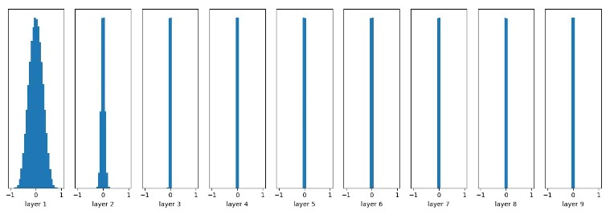
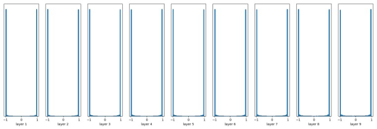
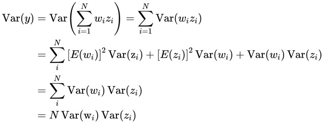

# 1 参数初始化概念(Parameters initialization)
&nbsp;&nbsp;&nbsp;&nbsp;&nbsp;&nbsp;&nbsp;&nbsp;参数初始化(parameters initialization)又称权重初始化(weight initialization), 具体指的是在网络模型训练之前，对各个节点的权重（weight）和偏置（bias）进行初始化赋值的过程。 

&nbsp;&nbsp;&nbsp;&nbsp;&nbsp;&nbsp;&nbsp;&nbsp;深度学习模型训练过程的本质是对 weight（即参数 W）进行更新，但是在最开始训练的时候需要每个参数有相应的初始值，这样神经网络就可以对权重参数w不停地迭代更新，以达到较好的性能。 

# 2 参数初始化的重要性
## 2.1 为什么参数初始化很重要
&nbsp;&nbsp;&nbsp;&nbsp;&nbsp;&nbsp;&nbsp;&nbsp;直观来看，在训练过程中，初始权重直接影响模型的输出，进一步影响损失及回传的梯度。因此，恰当的权重初始化是非常重要的。 

&nbsp;&nbsp;&nbsp;&nbsp;&nbsp;&nbsp;&nbsp;&nbsp;神经网络模型一般依靠随机梯度下降进行模型训练和参数更新，网络的最终性能与收敛得到的最优解直接相关，而收敛结果实际上又很大程度取决于网络参数的最开始的初始化。理想的网络参数初始化使模型训练事半功倍，相反，糟糕的初始化方案不仅会影响网络收敛，甚至会导致梯度弥散或爆炸。 

## 2.1 不合理初始化的问题
&nbsp;&nbsp;&nbsp;&nbsp;&nbsp;&nbsp;&nbsp;&nbsp;如果权值的初始值过大，则会导致梯度爆炸，使得网络不收敛；过小的权值初始值，则会导致梯度消失，会导致网络收敛缓慢或者收敛到局部极小值。 

&nbsp;&nbsp;&nbsp;&nbsp;&nbsp;&nbsp;&nbsp;&nbsp;如果权值的初始值过大，则loss function相对于权值参数的梯度值很大，每次利用梯度下降更新参数的时，参数更新的幅度也会很大，这就导致loss function的值在其最小值附近震荡。 

&nbsp;&nbsp;&nbsp;&nbsp;&nbsp;&nbsp;&nbsp;&nbsp;而过小的初始值则相反，loss关于权值参数的梯度很小，每次更新参数时，更新的幅度也很小，着就会导致loss的收敛很缓慢，或者在收敛到最小值前在某个局部的极小值收敛了。 

# 3 全0或常量初始化
&nbsp;&nbsp;&nbsp;&nbsp;&nbsp;&nbsp;&nbsp;&nbsp;在神经网络中，把Parameters初始化为0是不可以的。这是因为如果把Parameters初始化，那么在前向传播过程中，每一层的神经元学到的东西都是一样的（激活值均为0），而在BP的时候，不同维度的参数会得到相同的更新，因为他们的gradient相同，这种行为称之为 **对称失效**。  

# 4 随机初始化
&nbsp;&nbsp;&nbsp;&nbsp;&nbsp;&nbsp;&nbsp;&nbsp;随机初始化是很多人经常使用的方法，一般初始化的权重为高斯或均匀分布中随机抽取的值。然而这是有弊端的，一旦随机分布选择不当，就会导致网络优化陷入困境。 

## 4.1 较小随机值时
&nbsp;&nbsp;&nbsp;&nbsp;&nbsp;&nbsp;&nbsp;&nbsp; 当我们选择均值为0，标准差为 0.01 的正态分布 $N(0, 0.01)$ 时，随机生成的值都较小，此时经过多个前馈层(MLP) 传播时激活值的分布情况如下图所示： 

&nbsp;&nbsp;&nbsp;&nbsp;&nbsp;&nbsp;&nbsp;&nbsp;可见，当参数初始化很小时，随着层数的增加，我们看到输出值迅速向0靠拢，在后几层中，几乎所有的输出激活值都很接近0。反向传播(BP时)，根据链式法则，激活很小时会使得下层MLP的weight 的梯度很小，产生梯度消失问题.  

## 4.2 较大随机初始值时
&nbsp;&nbsp;&nbsp;&nbsp;&nbsp;&nbsp;&nbsp;&nbsp; 当我们选择均值为0，标准差为 1 的正态分布 $N(0, 1)$ 时，随机生成的值集中在距离原点位置为 1 的 ±1 处, 如下图所示。 

&nbsp;&nbsp;&nbsp;&nbsp;&nbsp;&nbsp;&nbsp;&nbsp;我们发现, 几乎所有的值集中在-1或1附近，神经元处于饱和状态(saturated). 注意到tanh/sigmoid 在-1和1附近的gradient都接近0，这同样导致了gradient太小，参数难以被更新 。 

## 4.3 结论 
- 随机初始化其实很难的，尝试太小的值，信息传不过去；
- 值太大的时候梯度信息传递过去了，他们又进入了饱和区，梯度缺变成了0；

# 5 理想的参数初始化
## 5.1 参数初始化的必要条件
&nbsp;&nbsp;&nbsp;&nbsp;&nbsp;&nbsp;&nbsp;&nbsp;综上所述，参数初始化要确保信息能够顺利传递，并且梯度不会出现弥散现象。由此，一般认为参数初始化需满足以下两个必要条件（注意不是充分条件）： 
- 参数初始化必要条件一：各层激活值不会出现饱和现象；
- 参数初始化必要条件二：各层激活值不为0.

## 5.2 Glorot 条件
&nbsp;&nbsp;&nbsp;&nbsp;&nbsp;&nbsp;&nbsp;&nbsp;Glorot条件，也称为Xavier条件，是一种用于初始化神经网络权重的方法。它是由 Xavier Glorot 和 Yoshua Bengio 在2010年提出的。它的核心思想是 **使网络各层的激活值和反向激活梯度的方差在传播过程中尽量保持一致**，以保持网络中正向和反向数据流动。 

*(注释：说的更通俗点就算，随着网络层数的加深，正向激活的分布和反向激活梯度的分布尽量维持一致）*  

**具体的Glorot条件如下：**  
- 各个层的激活的方差要保持一致, 数学表达为:   
$$\forall(i, i^{\prime}), Var[z^{i}]=Var[z^{i^{\prime}}]$$

- 各个层对状态z的梯度的方差要保持一致, 数学表达式为： 
$$\forall(i, i^{\prime}), Var[\frac{\partial Cost}{\partial s^{i}}]=Var[\frac{\partial Cost}{\partial s^{i'}}]$$

- [Glorot 条件论文链接](https://proceedings.mlr.press/v9/glorot10a/glorot10a.pdf)

# 6 塞维尔初始化(Xavier initialization)
&nbsp;&nbsp;&nbsp;&nbsp;&nbsp;&nbsp;&nbsp;&nbsp;假设一个神经元，其输入为 $z_{1}, z_{2}, \dots, z_{N}$ , 其权重值为 $w_{1}, w_{2}, \dots, w_{N}$ , 均为独立同分布的， 激活函数 f， 神经元输出 y，那么可得到输出 y的数学表达式： 

$$y=f(w_{1} * z_{1} + \cdot  + w_{N} * z_{N})$$

&nbsp;&nbsp;&nbsp;&nbsp;&nbsp;&nbsp;&nbsp;&nbsp;按照Glorot条件，我们要寻找w的分布使得输出y与输入z的方差保持一致。同时做如下假设：f 为tanh激活函数， $w_{i}$ 独立同分布， $z_{i}$ 独立同分布，且均值都为0. 则根据Gorot 条件推导如下： 

&nbsp;&nbsp;&nbsp;&nbsp;&nbsp;&nbsp;&nbsp;&nbsp;反向公式推导类似，于是我们可以得到两组结论： 

$$\forall i, n_{i} Var[W^{i}]=1$$

$$\forall i, n_{i+1} Var[W^{i}]=1$$

&nbsp;&nbsp;&nbsp;&nbsp;&nbsp;&nbsp;&nbsp;&nbsp;为满足上述公式继续推导，假如我们的wight 按照高斯分布来初始化的话，需要高斯分布如下： 

$$W \sim N [0, \sqrt{\frac{2}{n_{in} + n_{out}}}]$$

&nbsp;&nbsp;&nbsp;&nbsp;&nbsp;&nbsp;&nbsp;&nbsp;另如果采用均匀分布初始化的话，公式如下： 

$$W \sim U [-\frac{\sqrt{6}}{\sqrt{n_{j}+n_{j+1}}}, \frac{\sqrt{6}}{\sqrt{n_{j}+n_{j+1}}}]$$

*(注意：论文只讨论了sigmoid、tanh、softsign这三种激活函数，并没有后来常见的ReLU函数等，这也成为日后kaiming初始化提出的原因。tanh和softsign还有个很好的性质，在0点处导数值为1。）*  
*(注意：Glorot条件和Xavier方法是在2010年提出的，那时ReLU激活函数还未兴起，因此Xavier方法主要是围绕tanh激活函数可能存在的梯度爆炸或梯度消失进行的优化。）*  

- [论文链接](https://proceedings.mlr.press/v9/glorot10a/glorot10a.pdf)

# 7 kaiming initialization
&nbsp;&nbsp;&nbsp;&nbsp;&nbsp;&nbsp;&nbsp;&nbsp;kaiming初始化的推导过程只包含卷积和ReLU激活函数, 默认是vgg类似的网络, 没有残差, concat之类的结构, 也没有BN层. 

- [论文链接](https://arxiv.org/pdf/1502.01852)

## 7.1 方差计算数学基础

$$var(X_{1}+\cdots+X_{n})=var(X_{1})+\cdots+var(X_{n})$$

$$var(X)=E(X^{2})-(E X)^{2}$$

$$var(X Y)=var(X) var(Y)+var(X)(E Y)^{2}+var(Y)(E X)^{2}$$

## 7.2 前向推导过程
$$Y_{l}=W_{l} X_{l}+B_{l}$$

&nbsp;&nbsp;&nbsp;&nbsp;&nbsp;&nbsp;&nbsp;&nbsp;此处,  $Y_{l}$ 表示某个位置的输出值, $X_{l}$ 表示被卷积的输入(shape: $k \times k \times c$ ), 另 $n=k \times k \times c$, 则n的大小表示一个输出值是由多少个输入值计算出来的(求方差的时候用到).  W shape 为 $d \times n$ ,  其中，d表示的输出通道的数量. 下标 l 表示第几层.  $X_{l}=f\left(Y_{l-1}\right)$ , f 表示激活**函数ReLU** , 表示前一层的输出经过激活函数变成下一层的输入.  $c_{l}=d_{l-1}$ 表示网络下一层的输入通道数等于上一层的输出通道数.  

&nbsp;&nbsp;&nbsp;&nbsp;&nbsp;&nbsp;&nbsp;&nbsp;根据过个随机变量和的方差推导公式为： 
$$var (y_{l})=n_{l} var(w_{l} \cdot x_{l})$$

&nbsp;&nbsp;&nbsp;&nbsp;&nbsp;&nbsp;&nbsp;&nbsp;根据两个随机变量积的方差公式可得： 

$$var(y_{l})=n_{l}[var(w_{l}) var(x_{l})+var(w_{l})(E x_{l})^{2}+(E w_{l})^{2} var(x_{l})]$$

&nbsp;&nbsp;&nbsp;&nbsp;&nbsp;&nbsp;&nbsp;&nbsp;初始化的时候令**权重的均值是0**, 且假设更新的过程中权重的均值一直是0, 则 $E(w_{l})=0$ , 但是 $x_{l}$ 是上一层通过ReLU得到的,所以  $E(x_{l}) \neq 0$ . 于是上式可化简为： 

$$var(y_{l})=n_{l}[var(w_{l}) var(x_{l})+var(w_{l})(E x_{l})^{2}]=n_{l} var(w_{l})(var(x_{l})+(Ex_{l})^{2})$$

&nbsp;&nbsp;&nbsp;&nbsp;&nbsp;&nbsp;&nbsp;&nbsp;由方差和期望的关系 $$var(x_{l})+(Ex_{l})^{2}=E(x_{l}^{2})$$ 将上式化简为:  

$$var(y_{l})=n_{l} var(w_{l}) E(x_{l}^{2})$$

&nbsp;&nbsp;&nbsp;&nbsp;&nbsp;&nbsp;&nbsp;&nbsp;通过对l-1层的输出来求 $E(x_{l}^{2})$ , 其中激活函数为Relu, 我们记为 f:  

$$E(x_{l}^{2})=E(f^{2}(y_{l-1}))=\int_{-\infty}^{+\infty} p(y_{l-1}) f^{2}(y_{l-1}) dy_{l-1}$$

&nbsp;&nbsp;&nbsp;&nbsp;&nbsp;&nbsp;&nbsp;&nbsp;该公式可最终化简为:  

$$E(x_{l}^{2})=\frac{1}{2} E(y_{l-1}^{2})=\frac{1}{2} var(y_{l-1})$$

&nbsp;&nbsp;&nbsp;&nbsp;&nbsp;&nbsp;&nbsp;&nbsp;于是我们得到最终方差传递公式:  

$$var(y_{l})=\frac{1}{2} n_{l} var(w_{l}) var(y_{l-1})$$

&nbsp;&nbsp;&nbsp;&nbsp;&nbsp;&nbsp;&nbsp;&nbsp;我们让每层输出方差相等(等于1), 即:  

$$\frac{1}{2} n_{l} var(w_{l})=1$$

&nbsp;&nbsp;&nbsp;&nbsp;&nbsp;&nbsp;&nbsp;&nbsp;于是我们得到随机变量 weight 的方差为:  

$$var(w_{l})=\frac{2}{n_{l}}$$

**思考: 那么我们应该如何初始化weight呢？？？需要知道上一层的输出个数吗？？？**  
- 以卷积为例： 

&nbsp;&nbsp;&nbsp;&nbsp;&nbsp;&nbsp;&nbsp;&nbsp;假设进行conv 操作： Input：1 x 32 x 16 x 16 , kernel ： 64 x 32 x 3 x 3。 则该层的权重  $w \sim N (0, \frac{2}{32 \times 3 \times 3})$ , 偏置初始化为  0. $64 \times 32 \times 3 \times 3=18432$ 个参数都是从这个分布里面采样. 也对应了Pytorch里面的kaiming初始化**只要传卷积核的参数进去就行了**，可以看下源码对应的计算.  

## 7.3 反向推导过程

- 反向传播是的线性变换为:  

$$\Delta X_{l}=\hat{W_{l}} \Delta Y_{l}$$

&nbsp;&nbsp;&nbsp;&nbsp;&nbsp;&nbsp;&nbsp;&nbsp;其中, $\Delta$ 表示损失函数对其求导. 与正常的反向传播推导不一样，这里假设  $\Delta Y_{l}$  表示d个通道，每个通大小为 $c \times \hat{n}$ , 所以 $\Delta X_{l}$ 的形状为 $c \times l$ . $\hat{W}$  和 W 只差了一个转置(涉及到反向传播). 同样的想法是一个 $\Delta x_{l}$  的值是很多个 $\Delta y_{l}$  求得的, 继续通过多个独立同分布变量求一个变量(梯度)的方差. 假设随机变量 $\hat{w_{l}}, \Delta y_{l}$  都是独立同分布的. $\hat{w_{l}}$ 的分布在 0 附近是对称的，则  $\Delta x_{l}$ 对每层l，均值都是0, 即 $E(\Delta x_{l})=0$ .  

- 激活函数变换为： 
因为前向传播的时候激活变换为 $x_{l+1}=f(y_{l})$ , 反向时变为： 

$$\Delta y_{l}=f^{\prime}(y_{l}) \Delta x_{l+1}$$

- 最终我们可以推出： 

$$\frac{1}{2} \hat{n_{l}} var(w_{l})=1$$

&nbsp;&nbsp;&nbsp;&nbsp;&nbsp;&nbsp;&nbsp;&nbsp;按照前向传播最后的示例，此处的w为： $w \sim N\left(0, \frac{2}{64 \times 3 \times 3}\right)$ .  

## 7.4 凯明初始化总结
### 7.4.1 服从正态分布时
- 考虑前向传播方差相等时公式： 
  
$$W \sim N (0, \frac{2}{fan_{in}}) $$

- 考虑反向传方差相等时公式： 
$$W \sim N (0, \frac{2}{fan_{out}}) $$

### 7.4.2 服从均匀分布时:
均匀分布 $X \sim U(a, b)$ 的方差: $\frac{(b-a)^{2}}{12}$ .  

- 考虑前向传播方差相等时公式： 
  
$$W \sim U[-\sqrt{\frac{6}{n_{i}}}, \sqrt{\frac{6}{n_{i}}}] $$

- 考虑反向传方差相等时公式： 

$$W \sim U[-\sqrt{\frac{6}{\hat n_{i}}}, \sqrt{\frac{6}{\hat{n_{i}}}}] $$

# 8 初始化策略选择

# 9 使用预训练的weight
- 神经网络需要用数据来训练，它从数据中获得信息，进而把它们转换成相应的权重。这些权重能够被提取出来，迁移到其他的神经网络中，我们**迁移**了这些学来的特征，就不需要从零开始训练一个神经网络了。 

- 通过使用之前在大数据集上经过训练的预训练模型，我们可以直接使用相应的结构和权重，将它们应用到我们正在面对的问题上。这被称作是“迁移学习”，即将预训练的模型“迁移”到我们正在应对的特定问题中。 

# 10 参考文献
- [从基础到凯明](https://towardsdatascience.com/weight-initialization-in-neural-networks-a-journey-from-the-basics-to-kaiming-954fb9b47c79)
- [All you need is a good init](https://arxiv.org/abs/1511.06422)
- [书籍](https://zh-v2.d2l.ai/chapter_multilayer-perceptrons/numerical-stability-and-init.html)
- [文献1](https://arxiv.org/pdf/1502.01852.pdf)
- [文献2](https://cloud.tencent.com/developer/article/1535198)
- [文献3](https://cloud.tencent.com/developer/column/5139)
- [文献4](https://zhuanlan.zhihu.com/p/305055975)
