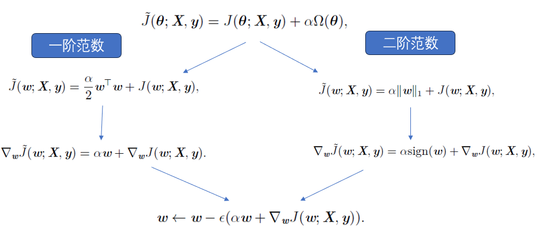
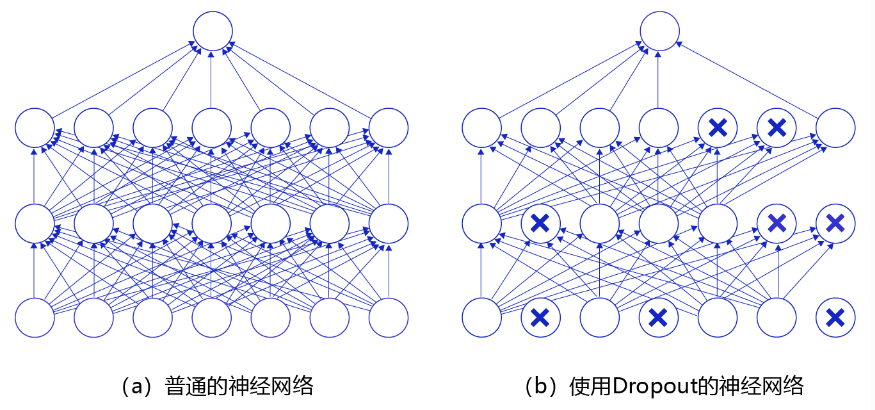
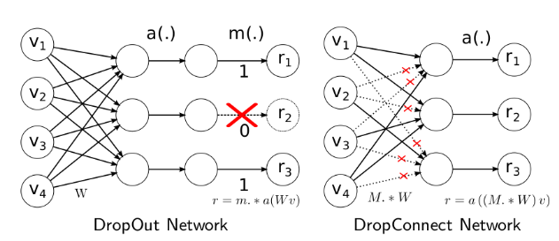
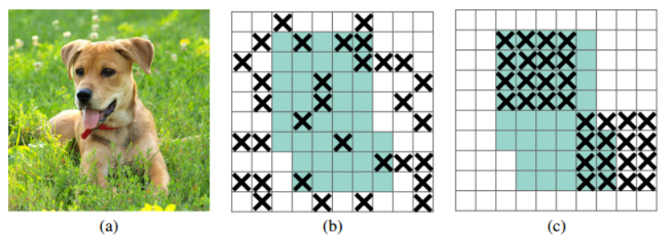
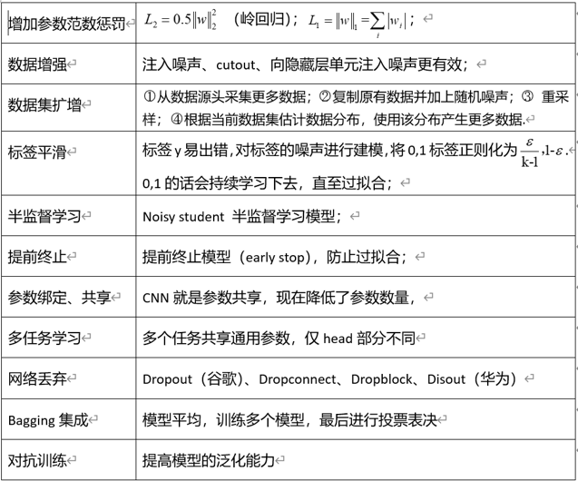

# 1 正则化概念
&nbsp;&nbsp;&nbsp;&nbsp;&nbsp;&nbsp;&nbsp;&nbsp;机器学习中的一个核心问题是设计不仅在训练数据上表现好，并且能在新输入上泛化好的算法。在机器学习中，许多策略显式地被设计来减少测试误差（可能会以增大训练误差为代价），这些策略被统称为正则化。 

**思考：只有深度学习才有正则化吗？**  

- 正则化在深度学习的出现前就已经被使用了数十年。 
- 线性模型，如线性回归和逻辑回归可以使用简单、直接、有效的正则化策略。 

# 2 什么情况下容易出现过拟合
&nbsp;&nbsp;&nbsp;&nbsp;&nbsp;&nbsp;&nbsp;&nbsp;正则化在以下情况下容易出现： 

- 数据集规模相对较小：当训练数据集的规模相对较小时，模型容易过拟合。这是因为较小的数据集可能无法很好地捕捉到真实数据的复杂性，导致模型过度依赖训练数据中的噪声和异常点。在这种情况下，引入正则化可以限制模型的复杂度，减少过拟合的风险。 

- 特征维度较高：当输入特征的维度较高时，模型也容易过拟合。高维特征空间中的线性模型往往有很大的参数空间，可以灵活地适应训练数据，但也容易产生过多的参数，从而增加过拟合的可能性。正则化可以帮助减少模型参数的数量，使模型更加简洁且泛化性能更好。 

- 模型复杂度较高：如果模型具有较大的容量，例如深度神经网络具有大量的隐藏层和参数，那么模型更容易过拟合。复杂模型具有较强的表达能力，可以学习到更多数据中的细节和噪声，但也容易在训练数据上表现出很好的性能而在新数据上表现较差。正则化可以限制模型的复杂度，平衡模型的拟合能力和泛化能力。 

&nbsp;&nbsp;&nbsp;&nbsp;&nbsp;&nbsp;&nbsp;&nbsp;总的来说，正则化在数据集规模较小、特征维度较高和模型复杂度较高等情况下容易出现，并且可以有效地控制模型的过拟合。 

# 3 常见的正则化方法

## 3.1 参数范数惩罚
&nbsp;&nbsp;&nbsp;&nbsp;&nbsp;&nbsp;&nbsp;&nbsp;许多正则化方法通过对目标函数J（loss函数） 添加一个参数范数惩罚Ω()，限制模型（如神经网络、线性回归或逻辑回归）的学习能力。我们将正则化后的目标函数记为 $\tilde{J}$ :  

**思考：所有weight的权重衰减系数相同吗？**  

## 3.2 数据集增强
&nbsp;&nbsp;&nbsp;&nbsp;&nbsp;&nbsp;&nbsp;&nbsp;让机器学习模型泛化得更好的最好办法是使用更多的数据进行训练。当然，在实践中，我们拥有的数据量是很有限的。解决这个问题的一种方法是创建假数据并
添加到训练集中。对于一些机器学习任务，创建新的假数据相当简单。 

**cv 中常见的数据增强手段**  
- Geometric Transformations：图像翻转，裁剪，旋转和平移等等，
- Color Space Transformations：对比度，锐化，白平衡，色彩抖动，随机色彩处理和许多其他技术来更改图像的色彩空间。
- Mixup就是将两张图像进行mix操作，提供数据的丰富性；
- Cutmix就是将一部分区域cut掉但不填充0像素而是随机填充训练集中的其他数据的区域像素值，分类结果按一定的比例分配。
- Mosaic：是将四张图片进行随机裁剪，再拼接到一张图上作为训练数据，这样做的好处是丰富了图片的背景。

**nlp 中常见的数据增强手段**  
- 词汇替换
- 使用正则表达式应用的简单模式匹配变
- 在文本中注入噪声，来生成新的文本
- 在句子中随机交换任意两个单词

## 3.3 标签平滑（label smoothing）
&nbsp;&nbsp;&nbsp;&nbsp;&nbsp;&nbsp;&nbsp;&nbsp;标签平滑（label smoothing）通过把确切分类目标从0 和1 替换成 $\frac{ϵ}{k -1}$ 和 $1 - ϵ$ ，正则化具有k 个输出的softmax 函数的模型。标准交叉熵损失可以用在这些非确切目标的输出上。使用softmax 函数和明确目标的最大似然学习可能永远不会收敛——softmax 函数永远无法真正预测0 概率或1 概率，因此它会继续学习越来越大的权重，使预测更极端。使用如权重衰减等其他正则化策略能够防止这种情况。标签平滑的优势是能够防止模型追求确切概率而不影响模型学习正确分类。这种策略自20 世纪80 年代就已经被使用，并在现代神经网络继续保持显著特色. 

**思考：为什么是 $\frac{ϵ}{k -1}$ 呢？

## 3.4 droupout
&nbsp;&nbsp;&nbsp;&nbsp;&nbsp;&nbsp;&nbsp;&nbsp;Dropout指在训练神经网络过程中随机丢掉一部分神经元来减少神经网络复杂度，从而防止过拟合。Dropout实现方法很简单：在每次迭代训练中，以一定概率随机屏蔽每一层中若干神经元，用余下神经元所构成网络来继续训练。  

&nbsp;&nbsp;&nbsp;&nbsp;&nbsp;&nbsp;&nbsp;&nbsp;上图是Dropout示意图，左边是完整的神经网络，右边是应用了Dropout之后的网络结构。应用Dropout之后，会将标了× 的神经元从网络中删除，让它们不向后面的层传递信号。在学习过程中，丢弃哪些神经元是随机决定，因此模型不会过度依赖某些神经元，能一定程度上抑制过拟合。 

**思考：训练和推理时dropout 有何不同？？？**  

## 3.5 dropconnet
&nbsp;&nbsp;&nbsp;&nbsp;&nbsp;&nbsp;&nbsp;&nbsp;DropConnect的思想也很简单，与Dropout不同的是，它不是随机将隐含层节点的输出清0,而是将节点中的每个与其相连的输入权值以1-p的概率清0。（一个是输出，一个是输入）;

**思考：dropout 和 dropblock 多用于全连接层，那卷积层呢？**  

## 3.6 dropblock

&nbsp;&nbsp;&nbsp;&nbsp;&nbsp;&nbsp;&nbsp;&nbsp;如果对原图进行dropout正则化，b图上的黑色的点即是导致失活的特征点。此时因为后续是卷积核来进行特征的提取，卷积核是具有感受野的。特征图上，相邻元素在空间上共享语义信息，所以并不影响有效特征的提取。并没阻止学习到有效特征，就失去了正则化的效果。那dropblock为什么在卷积网络上可以有效果？根据以上的猜测，要丢掉有效特征的方法就是将有效特征点与相邻点都丢掉。这样形成一整块整块（block）的丢掉有效特征。也就是dropblock的由来。丢掉整块的有效特征，强化其他位置的特征点学习到丢失掉的位置的语义信息。这样使得整个模型更具有鲁棒性。 

## 3.7 其它正则化方法

