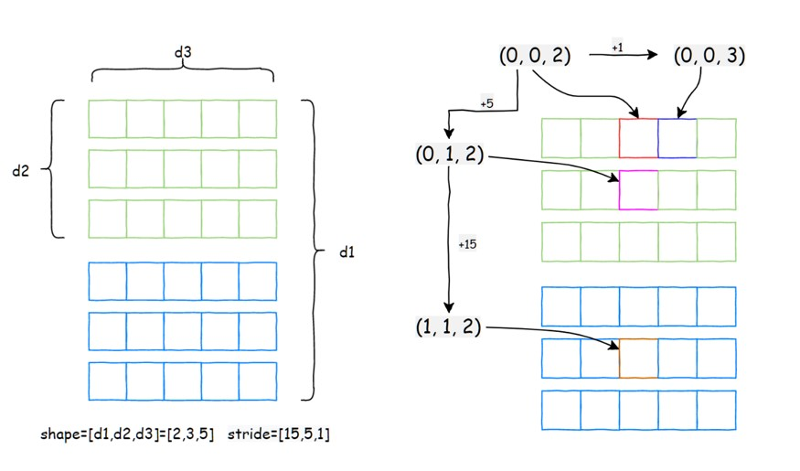

# [pytorch tensor](https://pytorch.org/docs/stable/tensors.html)
A torch.Tensor is a multi-dimensional matrix containing elements of a single data type. <br>

# 1 创建pytorch tensor

## 1.1 用torch.Tensor 创建
```python
import torch
data = [[1, 2],[3, 4]] # python list
x_data = torch.tensor(data) # 
x_data2 = torch.tensor((1, 2, 3))
# x_data3 = torch.tensor({"a": 5}) # fail
print("x_data2: ", x_data2)
```

## 1.2 直接生成特殊的tensor
```python
import torch
data = torch.ones(1, 2, 3)
data1 = torch.zeros(1, 3,4)
data2 = torch.randn(3, 4, 5)
data3 = torch.eye(4, 5)
data4 = torch.randint(5, (2, 10))
print("data type: ", type(data4))
print("data2: ", data4)
```

## 1.3 仿照其它tensor生成
```python
import torch
data0 = torch.Tensor([1, 2, 3])
data1 = torch.ones_like(data0)
data2 = torch.empty_like(data0)
# data3 = torch.empty_like(data0)
print("data: ", data2)
```

## 1.4 从numpy生成
```python
  np_array = np.array([1, 2, 3])
  tensor_numpy = torch.from_numpy(np_array)
  # tensor_numpy2 = torch.Tensor(np_array) # deepcopy 了一份数据
  np_array[0] = 100
  data_numpy = tensor_numpy.numpy()
  # print("data numpy: ", type(data_numpy))
  print("numpy tensor: ", tensor_numpy)
```

```
def numpy_with_torch_tensor():
  ndarray = np.array([1, 3, 4])
  tensor = torch.tensor(ndarray)
  tensor_from_numpy = torch.from_numpy(ndarray)
  
  print("numpy data_ptr: ", ndarray.ctypes.data)
  print("torch data_ptr: ", tensor.data_ptr())
  print("tensor_from numpy data_ptr: ", tensor_from_numpy.data_ptr())

  ndarray_from_torch = tensor_from_numpy.numpy()
  print("ndarray_from_torch data_ptr: ",   ndarray_from_torch.ctypes.data)
```

# 2 工程实践
- 找到 pytorch Tensor 中源码定义位置；
- 找到 Tensor 有哪些属性
- 找到 Tensor 有哪些方法可以调用；
- 比较本地 pytorch Tensor 源码 和 github pytroch 代码仓 的Tensor 源码一样吗？

# 3 Tensor 中的 to 方法
## 3.1 数据类型转化
```python
def tensor_to_demo():
  tensor = torch.ones(4, 5)

  tensor_0 = tensor.to(torch.int32)
  tensor_2 = tensor.to(tensor_0)
  # float16: 1bit(符号位) + 5bit(指数位) + 10bit(尾数) 
  # bfloat16：1bit(符号位) + 8bit(指数位) + 7bit(尾数)
  # BF16背后的想法是通过降低数字的精度来减少计算能力和将张量相乘所需的能源消耗
  tensor_1 = tensor.to(torch.bfloat16) # 数据类型转化
```

## 3.2 device 转化
```python
def tensor_device_demo():
  if torch.cuda.is_available():
    device = torch.device("cuda:0")
  else:
    device = torch.device("cpu")

  tensor = torch.randn(4, 5)
  tensor_0 = tensor.to(device)
  tensor_1 = tensor.to('cpu')
  tensor_2 = tensor.cuda()
  tensor_3 = tensor.to(tensor_0)
```

# 4 Tensor 讲解

**思考：如果让你设计一个工程的上数据结构来表示Tensor，你会如何设计呢？？？** <br>

## 4.1 两个角度认识 Tensor
- Tensor 的 meta data
- Tensor 的 raw data

- example
```python
def tensor_struct():
  r'''
    meta_data / raw_data
  ''' 
  nd_array = np.array([[1, 2, 3], [4, 5, 6]])
  # tensor = torch.tensor(nd_array) # deep copy
  tensor = torch.from_numpy(nd_array)
  # meta_data
  # print("shape:", tensor.shape) #meta data
  # print("dtype: ", tensor.dtype) # met
  # print("stride: ", tensor.stride())
  # print("device: ", tensor.device)
  # .... 其它参考 /lib/python3.8/site-packages/torch/_C/__init__.pyi
  
  # tensor / ndarray
  # 1. meta_data + raw_data;
  # 2 meta_data: shape/dtype/stride/dim/device ...
  # 3. raw_data: data_ptr

  # raw data
  print("pytorch data: \n", tensor)
  # print("pytorch raw data: \n", tensor.storage())
  print("numpy raw data_ptr: ", nd_array.ctypes.data)
  print("pytroch raw data_ptr: ", tensor.data_ptr())
  
  print("numpy data id", id(nd_array))
  print("pytorch data id", id(tensor))
  
  tensor2 = tensor.reshape(1, 6)
  print("tensor id: ", id(tensor))
  print("tensor2 id: ", id(tensor2))
  print("tensor pointer addr: ", tensor.data_ptr())
  print("tensor2 pointer addr: ", tensor2.data_ptr())
```

## 4.2 代码实践之：视图到底是什么

**思考：如何判断两个tensor 是否是同一个tensor** <br>

**思考：numpy 中大家都了解过 视图 的概念，那视图的底层逻辑到底是什么呢？？？** <br>

- reshape、view 过程中发生了什么 ？？？ <br>

- 原理图示：<br>



## 4.3 代码实践之：Tensor 中数据的连续性

- reshape、view、permute、transpose的区别 <br>

## 5 Tensor 运算的几种主要类型
- 矩阵型运算
- Pointwise 型运算
- broadcast 型运算
- inplace 型运算
- Allreduce 型运算
- type 类型运算
- bit 型运算
- shape 和 轴变换
- ...

# 6 Tensor 的属性全解
- [pytorch Tensor class](https://github.com/pytorch/pytorch/blob/main/torch/_tensor.py)
- [pytorch C TensorBase](https://github.com/pytorch/pytorch/blob/main/torch/_C/__init__.pyi.in)
- [官方文档](https://pytorch.org/docs/stable/tensors.html)

```python
# Defined in torch/csrc/autograd/python_variable.cpp
class TensorBase(metaclass=_TensorMeta): # metaclass 参数用于指定一个元类（metaclass）来创建类对象
    requires_grad: _bool 
    retains_grad: _bool
    shape: Size
    data: Tensor
    names: List[str]
    device: _device
    dtype: _dtype
    layout: _layout
    real: Tensor
    imag: Tensor
    T: Tensor # only 2d 
    H: Tensor # Returns a view of a matrix (2-D tensor) conjugated and transposed. （返回一个矩阵（2D 张量）的共轭转置视图）
    mT: Tensor # Returns a view of this tensor with the last two dimensions transposed.
    mH: Tensor
    ndim: _int
    output_nr: _int # 创建者的第几个输出, requres_grad = True 时生效
    _version: _int
    _base: Optional[Tensor]
    _cdata: _int
    grad_fn: Optional[_Node]
    _grad_fn: Any
    _grad: Optional[Tensor]
    grad: Optional[Tensor]
    _backward_hooks: Optional[Dict[_int, Callable[[Tensor], Optional[Tensor]]]]
    ${tensor_method_hints}

_TensorBase = TensorBase
```

- 注释1： 对于复数，共轭转置操作将实部保持不变，而虚部取负值。例如，对于复数 z = a + bi，其共轭转置为 z* = a - bi。<br>
- 注释2：对于矩阵，共轭转置将矩阵的每个元素取复共轭，然后对矩阵进行转置操作。<br>

```python
import torch
a = torch.randn(4,5,6)
a.requires_grad=True
aa = a.split([1,2,1])
print(aa[1].output_nr)
```


# 7 外层 Tensor 方法汇总
```python
def __deepcopy__(self, memo):   #自定义对象在深拷贝（deep copy）操作中的行为
def__reduce_ex__(self, proto):  #自定义对象在序列化和反序列化过程中的行为
def storage(self):  # 返回与张量关联的底层数据存储对象
def _typed_storage(self): # For internal use only, to avoid raising deprecation warning <new>.
def__reduce_ex_internal(self, proto): '. # 被__reduce_ex__调用
def __setstate__(self, state):  # 自定义在反序列化过程中恢复对象状态的行为
def __repr__(self, *, tensor_contents=None): # 定义对象的字符串表示形式。当调用 repr(obj) 或在交互式环境中直接输入 obj 时，Python 会调用对象的 __repr__ 方法来获取对象的字符串表示。
def backward(self, gradient=None, retain_graph=None, create_graph=False, inputs=None): # 计算当前张量相对于计算图叶节子节点的梯度
def register_hook(self, hook): # 注册反向钩子函数，计算完该张量的梯度时，钩子（hook）将被调用。
def register_post_accumulate_grad_hook(self, hook): # 注册一个梯度累加之后的反向钩子函数 <new>.
def reinforce(self, reward): # 强制报错
detach  =  _C.__add_docstr(_C._TensorBase.detach）# Returns a new Tensor, detached from the current graph.
detach_  =  _C.__add_docstr(_C._TensorBase.detach_) # 将张量从创建它的计算图中分离，使其成为叶节点。
def is_shared(self): # 检查张量是否位于共享内存中。对于 CUDA 张量（即在 GPU 上的张量），该方法始终返回 True
def share_memory_(self): # 将底层存储移动到共享内存 Moves the underlying storage to shared memory
def__reversed__(self):  # 按照某个维度对张量进行反转操作，可以用 torch.flip() 调用
def norm(self, p="fro", dim=None, keepdim=False, dtype=None): # 参考torch.norm --> 返回给定张量的矩阵范数或向量范数。
def solve(self, other): # 解线性方程组，参考torch.solve() ： torch.solve(input, A) -> (solution, LU) 
def lstsq(self, other):  # 求解线性最小二乘问题
def eig(self, eigenvectors=False): # 计算一个实对称或复数方阵的特征值和特征向量。
def lu(self, pivot=True, get_infos=False): # 执行 LU 分解（LU decomposition） 
def stft(...) # 短时傅里叶变换
def istft (...）  短时傅里叶逆变换
def resize(self,~*sizes): # 根据需要重新分配内存，可能返回原始张量的视图（view）或副本（copy）
def resize_as(self, tensor): # 按照另一个tensor的 size 来 resize
def split(self, split_size,  dim=0): # 同torch.split，将一个tensor split 成多个tensor
def unique(self, sorted=True, return_inverse=False, return_counts=False, dim=None): # 返回输入张量的唯一元素，去重作用，输出为一维的
def unique_consecutive(self, return_inverse=False, return_counts=False, dim=None): # 消除每个连续数据中除第一个元素之外的所有元素
@_handle_torch_function_and_wrap_type_error_to_not_implemented
def__rsub__(self, other): # 定义tensor 右侧减法 result = other - self 的行为
@_handle_torch_function_and_wrap_type_error_to_not_implemented
def__rdiv__(self, other): # 定义tensor 右侧除法的行为, 使用运算符 // 进行操作，表示执行整数除法或向下取整除法，目前已被 __rfloatdiv__  代替

__rtruediv__  =  __rdiv__ # 右侧真除法使用运算符 / 进行操作，表示执行浮点数除法
__itruediv_  =  _C._TensorBase._idiv_ # 用于实现就地真除法运算符 /= 的行为
__ pow__ = _handle_torch_function_and_wrap_type_error_to_not_implemented(_C._TensorBase.pow) # 实现幂运算，即通过运算符 ** 进行操作
__ipow__ = _handle_torch_function_and_wrap_type_error_to_not_implemented (_C._TensorBase.pow_) # 实现就地幂运算，即通过运算符 **= 进行操作

def__format__(self, format_spec): # 使用内置的 format() 函数 进行格式化时调用

@_handle_torch_function_and_wrap_type_error_to_not_implemented
def __rmod__(self, other): # 定义右侧取模运算符（取余运算符）% 的行为
@_handle_torch_function_and_wrap_type_error_to_not_implemented
def __rpow__(self, other): # 定义右侧取幂运算符 ** 的行为
@_handle_torch_function_and_wrap_type_error_to_not_implemented
def __floordiv__(self, other): # 用于实现整数除法运算 // 的行为。
@_handle_torch_function_and_wrap_type_error_to_not_implemented
def __rfloordiv__(self, other): # 实现右侧整数除法运算 // 的行为
@_handle_torch_function_and_wrap_type_error_to_not_implemented
def __rlshift__(self, other): # 实现右侧的位左移运算符 << 的行为
@_handle_torch_function_and_wrap_type_error_to_not_implemented
def __rrshift_(self, other):  # 实现右侧的位右移运算符 >> 的行为 
@_handle_torch_function_and_wrap_type_error_to_not_implemented
def __rmatmul__(self, other): # 用于实现右侧矩阵乘法运算符 @ 的行为

__pos__ = _C._TensorBase.positive # 实现正号运算符（一元加法）的行为
__neg_ = _C._TensorBase.neg # 实现负号运算符（一元加法）的行为
__abs__ = _C._TensorBase.abs # 实现绝对值运算符（一元加法）的行为

def __len__(self):  # 返回 Tensor 对象的维度
def __iter__(self): # 用于使 Tensor 对象可迭代
def __hash__(self): # 支持 Tensor 对象的哈希操作。
def __dir__(self):  # 用于返回 Tensor 对象的属性和方法列表。
__array_priority_  =1000 # support `numpy.asarray(tensor) -> ndarray
def __array_(self, dtype=None): # 支持将 Tensor 对象转换为 NumPy 数组
def __array_wrap__(self, array): # 用np 操作Tensor对象，并返回 Tensor： numpy.sin(tensor) -> tensor
def __contains__(self, element): # 用于判断某个值是否存在于 Tensor 对象中，用 in 来触发 

@property
def __cuda_array_interface_(self): # CUDA 张量的数组视图描述
def storage_type(self): # 存储的数据类型
def refine_names(self, *names): # 修改或细化 Tensor 对象的维度命名 ：x = torch.randn(3, 4, 5, names=('batch', 'channel', 'height'))
def align_to(self, *names): # 调整 Tensor 对象的维度顺序以匹配指定的顺序： y = x.align_to('height', 'batch', 'channel')
def unflatten(self, dim, sizes): # 用于将一个连续的一维 Tensor 对象重新转换为具有指定维度大小的多维 Tensor 对象
def rename_(self, *names, **rename_map): # rename_ 是一个方法，用于原地修改 Tensor 对象的维度名称。
def rename(self, *names, **rename_map): # 修改 Tensor 对象的维度名称
def to_sparse_coo(self): # 用于将一个稠密（dense）的 Tensor 对象转换为 COO（Coordinate）格式的稀疏（sparse）Tensor 对象
def dim_order(self): 返回一个由整数组成的元组，描述了 self 的维度顺序或物理布局 <new>
def _update_names(self, names, inplace): # 原地更新 Tensor 对象的维度名称。
@classmethod
def __torch_function__(cls, func, types, args=(), kwargs=None): # 对子类进行包装，使得在子类上调用的方法返回一个子类实例，而不是一个 torch.Tensor 实例， 需要自己在该方法内做转化
__torch_dispatch__ = C._disabled_torch_dispatch_impl # 用于定义自定义的分发逻辑，以便根据输入的类型、形状或其他条件来选择适当的实现。
def __dlpack__(self, stream=None): # 用于将 Tensor 对象转换为 DLPack 格式。DLPack 是一种用于在不同深度学习框架之间交换数据的标准化格式
def __dlpack_device__(self) -> Tuple[enum.IntEnum, int]: # 用于获取 Tensor 对象所在的设备信息并返回。DLPack 是一种用于在不同深度学习框架之间交换数据的标准化格式
__module__ = "torch" # 用于指示 Tensor 对象所属的模块
```

# 7 TensorBase 方法汇总
- [TensorBase 链接](https://github.com/pytorch/pytorch/blob/main/torch/_C/__init__.pyi.in)
- [c++ api](https://pytorch.org/cppdocs/notes/tensor_basics.html)
- [c++ functions](https://pytorch.org/cppdocs/api/file_build_aten_src_ATen_Functions.h.html#file-build-aten-src-aten-functions-h)

# 4.1 魔术方法（基本运算符 + 构造函数 + 索引）
```python
def __abs__(self) -> Tensor: ... # 取绝对值
def __add__(self, other: Any) -> Tensor: ...
@overload
def __and__(self, other: Tensor) -> Tensor: ...
@overload
def __and__(self, other: Union[Number, _complex]) -> Tensor: ...
@overload
def __and__(self, other: Any) -> Tensor: ...
def __bool__(self) -> builtins.bool: ...
def __complex__(self) -> builtins.complex: ...
def __div__(self, other: Any) -> Tensor: ...
def __eq__(self, other: Any) -> Tensor: ... \# type: ignore[override]
def __float__(self) -> builtins.float: ... # # 调用 float() 函数时触发，将Tensor 数据类型转化为float
def __floordiv__(self, other: Any) -> Tensor: ...
def __ge__(self, other: Any) -> Tensor: ...
def __getitem__(self, indices: Union[None,_int, slice, Tensor, List, Tuple]) -> Tensor: ... # 用于通过索引或切片操作访问 Tensor 对象的元素或子集
def __gt__(self, other: Any) -> Tensor: ... # 
def __iadd__(self, other: Any) -> Tensor: ...
@overload
def __iand__(self, other: Tensor) -> Tensor: ...
@overload
def __iand__(self, other: Union[Number, _complex]) -> Tensor: ...
@overload
def __iand__(self, other: Any) -> Tensor: ...
def __idiv__(self, other: Any) -> Tensor: ...
def __ifloordiv__(self, other: Any) -> Tensor: ...
@overload
def __ilshift__(self, other: Tensor) -> Tensor: ... # 原地左移操作（<<=），移动位数有other 确定
@overload
def __ilshift__(self, other: Union[Number,_complex]) -> Tensor: ...
@overload
def __ilshift__(self, other: Any) -> Tensor: ...
def __imod__(self, other: Any) -> Tensor: ... # 原地取余操作
def __imul__(self, other: Any) -> Tensor: ...
def __index__(self) -> builtins.int: ... # 将 Tensor 对象用作整数索引，index = x[torch.tensor(2)] 时调用
@overload
def __init__(self, *args: Any, device: Device = None) -> None: ...
@overload
def __init__(self, storage: Storage) -> None: ...
@overload
def __init__(self, other: Tensor) -> None: ...
@overload
def __init__(self, size:_size, *, device: Device = None) -> None: ...
def __int__(self) -> builtins.int: ... # 转为整型 int() 方法调用
def __invert__(self) -> Tensor: ... # 按位取反操作符，（~）时被调用
@overload
def __ior__(self, other: Tensor) -> Tensor: ...
@overload
def __ior__(self, other: Union[Number, _complex]) -> Tensor: ...
@overload
def __ior__(self, other: Any) -> Tensor: ...
@overload
def __irshift__(self, other: Tensor) -> Tensor: ...
@overload
def __irshift__(self, other: Union[Number, _complex]) -> Tensor: ...
@overload
def __irshift__(self, other: Any) -> Tensor: ...
def __isub__(self, other: Any) -> Tensor: ...
@overload
def __ixor__(self, other: Tensor) -> Tensor: ...
@overload
def __ixor__(self, other: Union[Number, _complex]) -> Tensor: ...
@overload
def __ixor__(self, other: Any) -> Tensor: ...
def __le__(self, other: Any) -> Tensor: ...
def __long__(self) -> builtins.int: ...
@overload
def __lshift__(self, other: Tensor) -> Tensor: ...
@overload
def __lshift__(self, other: Union[Number, _complex]) -> Tensor: ...
@overload
def __lshift__(self, other: Any) -> Tensor: ...
def __lt__(self, other: Any) -> Tensor: ...
def __matmul__(self, other: Any) -> Tensor: ...
def __mod__(self, other: Any) -> Tensor: ...
def __mul__(self, other: Any) -> Tensor: ...
def __ne__(self, other: Any) -> Tensor: ... \# type: ignore[override]
def __neg__(self)  ->  Tensor: ...
def __nonzero__(self) -> builtins.bool: ... # 对 Tensor 对象进行真值测试（例如，用作条件表达式的条件）时触发
@overload
def __or__(self, other: Tensor) -> Tensor: ...
@overload
def __or__(self, other: Union[Number, _complex]) -> Tensor: ...
@overload
def __or__(self, other: Any) -> Tensor: ...
def __pow__(self, other: Any) -> Tensor: ...
def __radd__(self, other: Any) -> Tensor: ...
def __rand__(self, other: Any) -> Tensor: ...
def __rfloordiv__(self, other: Any) -> Tensor: ...
def __rmul__(self, other: Any) -> Tensor: ...
def __ror__(self, other: Any) -> Tensor: ...
def __rpow__(self, other: Any) -> Tensor: ...
@overload
def __rshift__(self, other: Tensor) -> Tensor: ...
@overload
def __rshift__(self, other: Union[Number, _complex]) -> Tensor: ...
@overload
def __rshift__(self, other: Any) -> Tensor: ...
def __rsub__(self, other: Any) -> Tensor: ...
def __rtruediv__(self, other: Any) -> Tensor: ...
def __rxor__(self, other: Any) -> Tensor: ...
def __setitem__(self, indices: Union[None,_int, slice, Tensor, List, Tuple], val: Union[Tensor, Number]) -> None: ... # 对 Tensor 对象进行赋值操作时触发
def __sub__(self, other: Any) -> Tensor: ...
def __truediv__(self, other: Any) -> Tensor: ... # 对 Tensor 对象使用除法操作符（/）时触发
@overload
def __xor__(self, other: Tensor) -> Tensor: ... # 
@overload
def __xor__(self, other: Union[Number, _complex]) -> Tensor: 
@overload
def __xor__(self, other: Any) -> Tensor: ...
```

## 4.2 私有方法
```python
# 执行矩阵乘法和加法操作，并应用激活函数。
# 首先：执行矩阵乘法操作：result = torch.matmul(mat1, mat2)；
# 然后：它将结果使用 alpha 权重进行缩放 与 input 张量相乘，其中input使用 beta 权重进行缩放；
# 最后：它应用激活函数（例如，Gelu）来对最终结果进行非线性变换，并返回变换后的张量。
def _addmm_activation(self, mat1: Tensor, mat2: Tensor, *, beta: Union[Number, _complex] = 1, alpha: Union[Number, _complex] = 1, use_gelu: _bool = False) -> Tensor: ...
def _autocast_to_full_precision(self, cuda_enabled:_bool, cpu_enabled:_bool) -> Tensor: ...# 自动转换到全精度
def _coalesced_(self, coalesced:_bool) -> Tensor: ... # 稀疏张量 sparse_tensor = torch.sparse_coo_tensor(indices, values, size) 中indices 可能有重复值，该函数用于在稀疏张量中合并重复的索引和值。
def _conj(self) -> Tensor: ... # 用于计算复数张量的共轭张量
def _conj_physical(self) -> Tensor: ... # tensor.conj().clone()
def _dimI(self)  ->  _int: ... # 稀疏矩阵 indices的维度
def _dimV(self)  >  _ int: ... # 稀疏矩阵 values 中每个 ele 的维度
def _indices(self) -> Tensor: ... # 获取稀疏矩阵的索引矩阵
def _is_all_true(self) -> Tensor: ... # bool 类型的Tensor 元素是否全是True
def _is_any_true(self) -> Tensor: ... # bool 类型的Tensor 元素是否含有True
def _is_view(self) ->_bool: ... # 检查张量是否是视图
def _is_zerotensor(self) ->_bool: ... # 检查一个Tensor 是否全为 0

# 用于创建子类时使用
@staticmethod
def _make_subclass(cls: Type[S], data: Tensor, require_grad: _bool = False, dispatch_strides: _bool = False, dispatch_device: _bool = False, device_for_backend_keys: Optional[_device] = None) -> S: ...
def _neg_view(self) -> Tensor: ... # 返回Tensor 中元素的相反数视图
def _nested_tensor_size(self) -> Tensor: ... # 嵌套张量(nested tensor)的PyTorch API处于原型阶段，并将在不久的将来进行更改。
def _nested_tensor_storage_offsets(self) -> Tensor: ... # 嵌套Tensor 的storage 偏移
def _nested_tensor_strides(self) -> Tensor: ... # 嵌套Tensor 的stride
def _nnz(self) ->_int: ... # non-zero elements 获取稀疏矩阵中非0元素的 个数
def _sparse_mask_projection(self, mask: Tensor, accumulate_matches: _bool = False) -> Tensor: ... # 获取经过掩模后的矩阵(self, mask, output 都是sparse的)
def _to_dense(self, dtype: Optional[_dtype] = None, masked_grad: Optional[_bool] = None) -> Tensor: ... # 转为 dense Tensor
@overload
def _to_sparse(self, *, layout: Optional[_layout] = None, blocksize: Optional[Union[_int, _size]] = None, dense_dim: Optional[_int] = None) -> Tensor: ... # 转为 sparse Tensor 
@overload
def _to_sparse(self, sparse_dim:_int) -> Tensor: ... # 转为sparse Tensor 默认为 ：Coordinate format
def _to_sparse_bsc(self, blocksize: Union[_int,__size], dense_dim: Optional[_int] = None) -> Tensor: ... # 转为块稀疏列布局
def _to_sparse_bsr(self, blocksize: Union[_int,__size], dense_dim: Optional[_int] = None) -> Tensor: ... # 转为块稀疏行布局
def _to_sparse_csc(self, dense_dim: Optional[_int] = None) -> Tensor: ... # 转为压缩稀疏列布局
def _to_sparse_csr(self, dense_dim: Optional[_int] = None) -> Tensor: ... # 转为压缩稀疏行布局
def _values(self) -> Tensor: ... # 返回稀疏Tensor 的value 矩阵
```
** 注释** <br>
- [嵌套张量 nested tensor](https://pytorch.org/docs/stable/nested.html)
- nested tensor 介绍：
One application of NestedTensors is to express sequential data in various domains.  While the conventional approach is to pad variable length sequences, NestedTensor enables users to bypass padding(绕过padding 操作).  The API for calling operations on a nested tensor is no different from that of a regular torch. Tensor, which should allow seamless integration(无缝整合) with existing models, with the main difference being construction of the inputs（主要区别在于输入的构造）. <br>
- python demo:
```python
import torch
a = torch.randn(50, 128) # text 1
b = torch.randn(32, 128) # text 2
nt = torch.nested.nested_tensor([a, b], dtype=torch.float32)
```
- [sparse tensor](https://pytorch.org/docs/stable/sparse.html#sparse-coo-docs)

# 4.3 Tensor 的 对外API接口
```python
def abs(self) -> Tensor: ...
def abs_(self) -> Tensor: ... # 原地取绝对值
def absolute(self) -> Tensor: ... # abs 的别名
def absolute_(self) -> Tensor: ... # abs_ 的别名
def  acos(self)  ->  Tensor: ... # 反余弦
def acos_(self) -> Tensor: ...
def acosh(self) -> Tensor: ... # 逆双曲余弦
def acosh_(self) -> Tensor: ...
def add_(self, other: Union[Tensor, Number, torch.SymInt, torch.SymFloat], *, alpha: Optional[Number] = 1) -> Tensor: ...
def addcdiv(self, tensor1: Tensor, tensor2: Tensor, *, value: Union[Number, _complex] = 1) -> Tensor: ... # self + tensor1 / tensor2
def addcdiv_(self, tensor1: Tensor, tensor2: Tensor, *, value: Union[Number, _complex] = 1) -> Tensor: ...
def addcmul(self, tensor1: Tensor, tensor2: Tensor, *, value: Union[Number, _complex] = 1) -> Tensor: ...
def addcmul_(self, tensor1: Tensor, tensor2: Tensor, *, value: Union[Number, _complex] = 1) -> Tensor: ...
def adjoint(self) -> Tensor: ... # 返回共轭张量的视图，并将最后两个维度进行转置。
def align_as(self, other: Tensor) -> Tensor: ... # 按照other 中维度 来排列 self 的维度
@overload
def align_to(self, order: Sequence[Union[str, ellipsis, None]], ellipsis_idx: _int) -> Tensor: ...
@overload
def align_to(self, names: Sequence[Union[str, ellipsis, None]]) -> Tensor: ...
@overload
def all(self) -> Tensor: ... # 全为真则为真
@overload
def all(self, dim: _int, keepdim: _bool = False) -> Tensor: ...
@overload
def all(self, dim: Union[str, ellipsis, None], keepdim: _bool = False) -> Tensor: ...
def allclose(self, other: Tensor, rtol: _float = 1e-05, atol: _float = 1e-08, equal_nan: _bool = False) -> bool: ... # 两数据差异比较 ： ∣input−other∣ ≤ atol + rtol × ∣other∣
def amin(self, dim: Union[_int,_size] = (), keepdim:_bool = False) -> Tensor: ... # 返回输入张量在给定维度 dim 中的每个切片的最小值
def aminmax(self, *, dim: Optional[_int] = None, keepdim: _bool = False) -> torch.return_types.aminmax: ... # 返回输入张量在给定维度 dim 中的每个切片的最小值 和 最小值 两个Tensor
def angle(self) -> Tensor: ...
@overload
def any(self) -> Tensor: ...
@overload
def any(self, dim:_int, keepdim: _bool = False) -> Tensor: ...
@overload
def any(self, dim: Union[str, ellipsis, None], keepdim: _bool = False) -> Tensor: ...
def apply_(self, callable: Callable) -> Tensor: ...
def arccos(self) -> Tensor: ...
def arccos_(self) -> Tensor: ...
def arccosh(self) -> Tensor: ...
def arccosh_(self) -> Tensor: ...
def arcsin(self) -> Tensor: ...
def arcsin_(self) -> Tensor: ...
def arcsinh(self) -> Tensor: ...
def arcsinh_(self) -> Tensor: ...
def arctan(self) -> Tensor: ...
def arctan2(self, other: Tensor) -> Tensor: ...
def arctan2_(self, other: Tensor) -> Tensor: ...
def arctan_(self) -> Tensor: ...
def arctanh(self) -> Tensor: ...
def arctanh_(self) -> Tensor: ... # 原地操作
def argmax(self, dim: Optional[_int] = None, keepdim: _bool = False) -> Tensor: ... # 返回最大值的索引(拉平后)
def argmin(self, dim: Optional[_int] = None, keepdim: _bool = False) -> Tensor: ... # 返回拉平后最小值的索引
@overload
def argsort(self, *, stable: _bool, dim: _int = -1, descending: _bool = False) -> Tensor: ... # 返回Tensor 排序后的 index 组成的Tensor
@overload
def argsort(self, dim: _int = -1, descending: _bool = False) -> Tensor: ... # 返回排序的索引，另：torch.sort 是用来排序的
@overload
def argsort(self, dim: Union[str, ellipsis, None], descending: _bool = False) -> Tensor: ...
def argwhere(self) -> Tensor: ... # 返回 self 中非0元素的索引
# 使用指定的大小（size）、步幅（stride）和存储偏移（storage_offset）创建一个现有 torch.Tensor 输入的视图。
def as_strided(self, size: Sequence[Union[_int, SymInt]], stride: Sequence[Union[_int, SymInt]], storage_offset: Optional[Union[_int, SymInt]] = None) -> Tensor: ...
def as_strided_(self, size: Sequence[Union[_int, SymInt]], stride: Sequence[Union[_int, SymInt]], storage_offset: Optional[Union[_int, SymInt]] = None) -> Tensor: ...
# 带scatter通信的 as_strided
def as_strided_scatter(self, src: Tensor, size: Sequence[Union[_int, SymInt]], stride: Sequence[Union[_int, SymInt]], storage_offset: Optional[Union[_int, SymInt]] = None) -> Tensor: 
# 使用与 self 相同的数据指针创建一个 cls 实例。对输出的更改会反映在 self 中，并且输出会保持与自动求导图的关联。cls 必须是 Tensor 的子类。
def as_subclass(self, cls: Type[S]) -> S: ...
def asin(self) -> Tensor: ... # arcsin 的别名
def asin_(self) -> Tensor: ...
def asinh(self) -> Tensor: ...
def asinh_(self) -> Tensor: ...
def atan(self) -> Tensor: ...
def atan2(self, other: Tensor) -> Tensor: ... # self / other 之后再反正切
def atan2_(self, other: Tensor) -> Tensor: ...
def atan_(self) -> Tensor: ...
def atanh(self) -> Tensor: ...
def atanh_(self) -> Tensor: ...
# 考虑batch 下的 matmul 后再相加
def baddbmm(self, batch1: Tensor, batch2: Tensor, *, beta: Union[Number, _complex] = 1, alpha: Union[Number, _complex] = 1) -> Tensor: ...
def baddbmm_(self, batch1: Tensor, batch2: Tensor, *, beta: Union[Number, _complex] = 1, alpha: Union[Number, _complex] = 1) -> Tensor: ...
@overload
def bernoulli(self, *, generator: Optional[Generator] = None) -> Tensor: ... # 从伯努利分布中绘制二进制随机数（0或1）
@overload
def bernoulli(self, p: _float, *, generator: Optional[Generator] = None) -> Tensor: ...
@overload
def bernoulli_(self, p: Tensor, *, generator: Optional[Generator] = None) -> Tensor: ...
@overload
def bernoulli_(self, p: _float = 0.5, *, generator: Optional[Generator] = None) -> Tensor: ...
def bfloat16(self) -> Tensor: ... # 转为bfloat16 数据类型
# 统计非负整数数组中每个值的频率。
def bincount(self, weights: Optional[Tensor] = None, minlength: _int = 0) -> Tensor: ...
@overload
def bitwise_and(self, other: Tensor) -> Tensor: ...
@overload
def bitwise_and(self, other: Union[Number, _complex]) -> Tensor: ...
@overload
def bitwise_and_(self, other: Tensor) -> Tensor: ...
@overload
def bitwise_and_(self, other: Union[Number, _complex]) -> Tensor: ...
@overload
def bitwise_left_shift(self, other: Tensor) -> Tensor: ... #通过 other bit 对输入 input 进行左移位运算
@overload
def bitwise_left_shift(self, other: Union[Number, _complex]) -> Tensor: ...
@overload
def bitwise_left_shift_(self, other: Tensor) -> Tensor: ...
@overload
def bitwise_left_shift_(self, other: Union[Number, _complex]) -> Tensor: ...
def bitwise_not(self) -> Tensor: ...
def bitwise_not_(self) -> Tensor: ...
@overload
def bitwise_or(self, other: Tensor) -> Tensor: ...
@overload
def bitwise_or(self, other: Union[Number, _complex]) -> Tensor: ...
@overload
def bitwise_or_(self, other: Tensor) -> Tensor: ...
@overload
def bitwise_or_(self, other: Union[Number, _complex]) -> Tensor: ...
@overload
def bitwise_right_shift(self, other: Tensor) -> Tensor: ...
@overload
def bitwise_right_shift(self, other: Union[Number, _complex]) -> Tensor: ...
@overload
def bitwise_right_shift_(self, other: Tensor) -> Tensor: ...
@overload
def bitwise_right_shift_(self, other: Union[Number, _complex]) -> Tensor: ...
@overload
def bitwise_xor(self, other: Tensor) -> Tensor: ...
@overload
def bitwise_xor(self, other: Union[Number, _complex]) -> Tensor: ...
@overload
def bitwise_xor_(self, other: Tensor) -> Tensor: ...
@overload
def bitwise_xor_(self, other: Union[Number, _complex]) -> Tensor: ...
def bmm(self, mat2: Tensor) -> Tensor: ... # batch matmal
def bool(self) -> Tensor: ... # 数据类型转化为 bool
@overload
def broadcast_to(self, size: Sequence[Union[_int, SymInt]]) -> Tensor: ...
@overload
def broadcast_to(self, *size: _int) -> Tensor: ... # Equivalent to calling input.expand(shape)
def byte(self) -> Tensor: ... # tensor 中 storage 的 字节数；
# 使用从柯西分布中抽取的数字填充张量。
def cauchy_(self, median: _float = 0, sigma: _float = 1, *, generator: Optional[Generator] = None) -> Tensor: ...
# ？？？
def ccol_indices(self) -> Tensor: ...
def ceil(self) -> Tensor: ... # 向上取整
def ceil_(self) -> Tensor: ...
# equivalent to self.to(torch.complex32)
def chalf(self, *, memory_format: Optional[memory_format] = None) -> Tensor: ...
def char(self) -> Tensor: ... # 转为char 类型
def cholesky(self, upper: _bool = False) -> Tensor: ... # 
def cholesky_inverse(self, upper: _bool = False) -> Tensor: ...
def cholesky_solve(self, input2: Tensor, upper: _bool = False) -> Tensor: ...
def chunk(self, chunks: _int, dim: _int = 0) -> List[Tensor]: ...
@overload
def clamp(self, min: Optional[Tensor] = None, max: Optional[Tensor] = None) -> Tensor: ...
@overload
def clamp(self, min: Optional[Union[Number, _complex]] = None, max: Optional[Union[Number, _complex]] = None) -> Tensor: ...
@overload
def clamp_(self, min: Optional[Tensor] = None, max: Optional[Tensor] = None) -> Tensor: ...
@overload
def clamp_(self, min: Optional[Union[Number, _complex]] = None, max: Optional[Union[Number, _complex]] = None) -> Tensor: ...
@overload
def clamp_max(self, max: Tensor) -> Tensor: ...
@overload
def clamp_max(self, max: Union[Number, _complex]) -> Tensor: ...
@overload
def clamp_max_(self, max: Tensor) -> Tensor: ...
@overload
def clamp_max_(self, max: Union[Number, _complex]) -> Tensor: ...
@overload
def clamp_min(self, min: Tensor) -> Tensor: ...
@overload
def clamp_min(self, min: Union[Number, _complex]) -> Tensor: ...
@overload
def clamp_min_(self, min: Tensor) -> Tensor: ...
@overload
def clamp_min_(self, min: Union[Number, _complex]) -> Tensor: ...
@overload
def clip(self, min: Optional[Tensor] = None, max: Optional[Tensor] = None) -> Tensor: ...
@overload
def clip(self, min: Optional[Union[Number, _complex]] = None, max: Optional[Union[Number, _complex]] = None) -> Tensor: ...
@overload
def clip_(self, min: Optional[Tensor] = None, max: Optional[Tensor] = None) -> Tensor: ...
@overload
def clip_(self, min: Optional[Union[Number, _complex]] = None, max: Optional[Union[Number, _complex]] = None) -> Tensor: ...
def clone(self, *, memory_format: Optional[memory_format] = None) -> Tensor: ...
def coalesce(self) -> Tensor: ...
def col_indices(self) -> Tensor: ...
def conj(self) -> Tensor: ...
def conj_physical(self) -> Tensor: ...
def conj_physical_(self) -> Tensor: ...
def contiguous(self, memory_format=torch.contiguous_format) -> Tensor: ...
def copy_(self, src: Tensor, non_blocking: _bool = False) -> Tensor: ...
@overload
def copysign(self, other: Tensor) -> Tensor: ...
@overload
def copysign(self, other: Union[Number, _complex]) -> Tensor: ...
@overload
def copysign_(self, other: Tensor) -> Tensor: ...
@overload
def copysign_(self, other: Union[Number, _complex]) -> Tensor: ...
def corrcoef(self) -> Tensor: ...
def cos(self) -> Tensor: ...
def cos_(self) -> Tensor: ...
def cosh(self) -> Tensor: ...
def cosh_(self) -> Tensor: ...
@overload
def count_nonzero(self, dim: Optional[_int] = None) -> Tensor: ...
@overload
def count_nonzero(self, dim: _size) -> Tensor: ...
@overload
def count_nonzero(self, *dim: _int) -> Tensor: ...
def cov(self, *, correction: _int = 1, fweights: Optional[Tensor] = None, aweights: Optional[Tensor] = None) -> Tensor: ...
def cpu(self) -> Tensor: ...
def cross(self, other: Tensor, dim: Optional[_int] = None) -> Tensor: ...
def crow_indices(self) -> Tensor: ...
def cuda(self, device: Optional[Union[_device, _int, str]] = None, non_blocking: _bool = False) -> Tensor: ...
@overload
def cummax(self, dim: _int) -> torch.return_types.cummax: ...
@overload
def cummax(self, dim: Union[str, ellipsis, None]) -> torch.return_types.cummax: ...
@overload
def cummin(self, dim: _int) -> torch.return_types.cummin: ...
@overload
def cummin(self, dim: Union[str, ellipsis, None]) -> torch.return_types.cummin: ...
@overload
def cumprod(self, dim: _int, *, dtype: Optional[_dtype] = None) -> Tensor: ...
@overload
def cumprod(self, dim: Union[str, ellipsis, None], *, dtype: Optional[_dtype] = None) -> Tensor: ...
@overload
def cumprod_(self, dim: _int, *, dtype: Optional[_dtype] = None) -> Tensor: ...
@overload
def cumprod_(self, dim: Union[str, ellipsis, None], *, dtype: Optional[_dtype] = None) -> Tensor: ...
@overload
def cumsum(self, dim: _int, *, dtype: Optional[_dtype] = None) -> Tensor: ...
@overload
def cumsum(self, dim: Union[str, ellipsis, None], *, dtype: Optional[_dtype] = None) -> Tensor: ...
@overload
def cumsum_(self, dim: _int, *, dtype: Optional[_dtype] = None) -> Tensor: ...
@overload
def cumsum_(self, dim: Union[str, ellipsis, None], *, dtype: Optional[_dtype] = None) -> Tensor: ...
def data_ptr(self) -> _int: ...
def deg2rad(self) -> Tensor: ...
def deg2rad_(self) -> Tensor: ...
def dense_dim(self) -> _int: ...
def dequantize(self) -> Tensor: ...
def det(self) -> Tensor: ...
def detach(self) -> Tensor: ...
def detach_(self) -> Tensor: ...
def diag(self, diagonal: _int = 0) -> Tensor: ...
def diag_embed(self, offset: _int = 0, dim1: _int = -2, dim2: _int = -1) -> Tensor: ...
def diagflat(self, offset: _int = 0) -> Tensor: ...
@overload
def diagonal(self, *, outdim: Union[str, ellipsis, None], dim1: Union[str, ellipsis, None], dim2: Union[str, ellipsis, None], offset: _int = 0) -> Tensor: ...
@overload
def diagonal(self, offset: _int = 0, dim1: _int = 0, dim2: _int = 1) -> Tensor: ...
def diagonal_scatter(self, src: Tensor, offset: _int = 0, dim1: _int = 0, dim2: _int = 1) -> Tensor: ...
def diff(self, n: _int = 1, dim: _int = -1, prepend: Optional[Tensor] = None, append: Optional[Tensor] = None) -> Tensor: ...
def digamma(self) -> Tensor: ...
def digamma_(self) -> Tensor: ...
def dim(self) -> _int: ...
def dist(self, other: Tensor, p: Union[Number, _complex] = 2) -> Tensor: ...
def div(self, other: Union[Tensor, Number], *, rounding_mode: Optional[str] = None) -> Tensor: ...
def div_(self, other: Union[Tensor, Number], *, rounding_mode: Optional[str] = None) -> Tensor: ...
@overload
def divide(self, other: Tensor) -> Tensor: ...
@overload
def divide(self, other: Tensor, *, rounding_mode: Optional[str]) -> Tensor: ...
@overload
def divide(self, other: Union[Number, _complex], *, rounding_mode: Optional[str]) -> Tensor: ...
@overload
def divide(self, other: Union[Number, _complex]) -> Tensor: ...
@overload
def divide_(self, other: Tensor) -> Tensor: ...
@overload
def divide_(self, other: Tensor, *, rounding_mode: Optional[str]) -> Tensor: ...
@overload
def divide_(self, other: Union[Number, _complex], *, rounding_mode: Optional[str]) -> Tensor: ...
@overload
def divide_(self, other: Union[Number, _complex]) -> Tensor: ...
def dot(self, tensor: Tensor) -> Tensor: ...
def double(self) -> Tensor: ...
@overload
def dsplit(self, sections: _int) -> List[Tensor]: ...
@overload
def dsplit(self, indices: _size) -> List[Tensor]: ...
@overload
def dsplit(self, *indices: _int) -> List[Tensor]: ...
def element_size(self) -> _int: ...
@overload
def eq(self, other: Tensor) -> Tensor: ...
@overload
def eq(self, other: Union[Number, _complex]) -> Tensor: ...
@overload
def eq_(self, other: Tensor) -> Tensor: ...
@overload
def eq_(self, other: Union[Number, _complex]) -> Tensor: ...
def equal(self, other: Tensor) -> _bool: ...
def erf(self) -> Tensor: ...
def erf_(self) -> Tensor: ...
def erfc(self) -> Tensor: ...
def erfc_(self) -> Tensor: ...
def erfinv(self) -> Tensor: ...
def erfinv_(self) -> Tensor: ...
def exp(self) -> Tensor: ...
def exp2(self) -> Tensor: ...
def exp2_(self) -> Tensor: ...
def exp_(self) -> Tensor: ...
@overload
def expand(self, size: Sequence[Union[_int, SymInt]], *, implicit: _bool = False) -> Tensor: ...
@overload
def expand(self, *size: _int, implicit: _bool = False) -> Tensor: ...
def expand_as(self, other: Tensor) -> Tensor: ...
def expm1(self) -> Tensor: ...
def expm1_(self) -> Tensor: ...
def exponential_(self, lambd: _float = 1, *, generator: Optional[Generator] = None) -> Tensor: ...
@overload
def fill_(self, value: Tensor) -> Tensor: ...
@overload
def fill_(self, value: Union[Number, _complex]) -> Tensor: ...
def fill_diagonal_(self, fill_value: Union[Number, _complex], wrap: _bool = False) -> Tensor: ...
def fix(self) -> Tensor: ...
def fix_(self) -> Tensor: ...
@overload
def flatten(self, start_dim: _int = 0, end_dim: _int = -1) -> Tensor: ...
@overload
def flatten(self, start_dim: _int, end_dim: _int, out_dim: Union[str, ellipsis, None]) -> Tensor: ...
@overload
def flatten(self, start_dim: Union[str, ellipsis, None], end_dim: Union[str, ellipsis, None], out_dim: Union[str, ellipsis, None]) -> Tensor: ...
@overload
def flatten(self, dims: Sequence[Union[str, ellipsis, None]], out_dim: Union[str, ellipsis, None]) -> Tensor: ...
@overload
def flip(self, dims: _size) -> Tensor: ...
@overload
def flip(self, *dims: _int) -> Tensor: ...
def fliplr(self) -> Tensor: ...
def flipud(self) -> Tensor: ...
def float(self) -> Tensor: ...
@overload
def float_power(self, exponent: Tensor) -> Tensor: ...
@overload
def float_power(self, exponent: Union[Number, _complex]) -> Tensor: ...
@overload
def float_power_(self, exponent: Tensor) -> Tensor: ...
@overload
def float_power_(self, exponent: Union[Number, _complex]) -> Tensor: ...
def floor(self) -> Tensor: ...
def floor_(self) -> Tensor: ...
def floor_divide(self, other: Union[Tensor, Number, torch.SymInt, torch.SymFloat], *, out: Optional[Tensor] = None) -> Tensor: ...
def floor_divide_(self, other: Union[Tensor, Number, torch.SymInt, torch.SymFloat]) -> Tensor: ...
def fmax(self, other: Tensor) -> Tensor: ...
def fmin(self, other: Tensor) -> Tensor: ...
@overload
def fmod(self, other: Tensor) -> Tensor: ...
@overload
def fmod(self, other: Union[Number, _complex]) -> Tensor: ...
@overload
def fmod_(self, other: Tensor) -> Tensor: ...
@overload
def fmod_(self, other: Union[Number, _complex]) -> Tensor: ...
def frac(self) -> Tensor: ...
def frac_(self) -> Tensor: ...
def frexp(self) -> torch.return_types.frexp: ...
@overload
def gather(self, dim: _int, index: Tensor, *, sparse_grad: _bool = False) -> Tensor: ...
@overload
def gather(self, dim: Union[str, ellipsis, None], index: Tensor, *, sparse_grad: _bool = False) -> Tensor: ...
def gcd(self, other: Tensor) -> Tensor: ...
def gcd_(self, other: Tensor) -> Tensor: ...
@overload
def ge(self, other: Tensor) -> Tensor: ...
@overload
def ge(self, other: Union[Number, _complex]) -> Tensor: ...
@overload
def ge_(self, other: Tensor) -> Tensor: ...
@overload
def ge_(self, other: Union[Number, _complex]) -> Tensor: ...
def geometric_(self, p: _float, *, generator: Optional[Generator] = None) -> Tensor: ...
def geqrf(self) -> torch.return_types.geqrf: ...
def ger(self, vec2: Tensor) -> Tensor: ...
def get_device(self) -> _int: ...
@overload
def greater(self, other: Tensor) -> Tensor: ...
@overload
def greater(self, other: Union[Number, _complex]) -> Tensor: ...
@overload
def greater_(self, other: Tensor) -> Tensor: ...
@overload
def greater_(self, other: Union[Number, _complex]) -> Tensor: ...
@overload
def greater_equal(self, other: Tensor) -> Tensor: ...
@overload
def greater_equal(self, other: Union[Number, _complex]) -> Tensor: ...
@overload
def greater_equal_(self, other: Tensor) -> Tensor: ...
@overload
def greater_equal_(self, other: Union[Number, _complex]) -> Tensor: ...
@overload
def gt(self, other: Tensor) -> Tensor: ...
@overload
def gt(self, other: Union[Number, _complex]) -> Tensor: ...
@overload
def gt_(self, other: Tensor) -> Tensor: ...
@overload
def gt_(self, other: Union[Number, _complex]) -> Tensor: ...
def half(self) -> Tensor: ...
def hardshrink(self, lambd: Union[Number, _complex] = 0.5) -> Tensor: ...
def has_names(self) -> _bool: ...
def heaviside(self, values: Tensor) -> Tensor: ...
def heaviside_(self, values: Tensor) -> Tensor: ...
def histc(self, bins: _int = 100, min: Union[Number, _complex] = 0, max: Union[Number, _complex] = 0) -> Tensor: ...
@overload
def histogram(self, bins: Tensor, *, weight: Optional[Tensor] = None, density: _bool = False) -> torch.return_types.histogram: ...
@overload
def histogram(self, bins: _int = 100, *, range: Optional[Sequence[_float]] = None, weight: Optional[Tensor] = None, density: _bool = False) -> torch.return_types.histogram: ...
@overload
def hsplit(self, sections: _int) -> List[Tensor]: ...
@overload
def hsplit(self, indices: _size) -> List[Tensor]: ...
@overload
def hsplit(self, *indices: _int) -> List[Tensor]: ...
def hypot(self, other: Tensor) -> Tensor: ...
def hypot_(self, other: Tensor) -> Tensor: ...
def i0(self) -> Tensor: ...
def i0_(self) -> Tensor: ...
def igamma(self, other: Tensor) -> Tensor: ...
def igamma_(self, other: Tensor) -> Tensor: ...
def igammac(self, other: Tensor) -> Tensor: ...
def igammac_(self, other: Tensor) -> Tensor: ...
@overload
def index_add(self, dim: _int, index: Tensor, source: Tensor, *, alpha: Union[Number, _complex] = 1) -> Tensor: ...
@overload
def index_add(self, dim: Union[str, ellipsis, None], index: Tensor, source: Tensor, *, alpha: Union[Number, _complex] = 1) -> Tensor: ...
def index_add_(self, dim: _int, index: Tensor, source: Tensor, *, alpha: Union[Number, _complex] = 1) -> Tensor: ...
@overload
def index_copy(self, dim: _int, index: Tensor, source: Tensor) -> Tensor: ...
@overload
def index_copy(self, dim: Union[str, ellipsis, None], index: Tensor, source: Tensor) -> Tensor: ...
@overload
def index_copy_(self, dim: _int, index: Tensor, source: Tensor) -> Tensor: ...
@overload
def index_copy_(self, dim: Union[str, ellipsis, None], index: Tensor, source: Tensor) -> Tensor: ...
@overload
def index_fill(self, dim: _int, index: Tensor, value: Tensor) -> Tensor: ...
@overload
def index_fill(self, dim: Union[str, ellipsis, None], index: Tensor, value: Tensor) -> Tensor: ...
@overload
def index_fill(self, dim: _int, index: Tensor, value: Union[Number, _complex]) -> Tensor: ...
@overload
def index_fill(self, dim: Union[str, ellipsis, None], index: Tensor, value: Union[Number, _complex]) -> Tensor: ...
@overload
def index_fill_(self, dim: _int, index: Tensor, value: Tensor) -> Tensor: ...
@overload
def index_fill_(self, dim: Union[str, ellipsis, None], index: Tensor, value: Tensor) -> Tensor: ...
@overload
def index_fill_(self, dim: _int, index: Tensor, value: Union[Number, _complex]) -> Tensor: ...
@overload
def index_fill_(self, dim: Union[str, ellipsis, None], index: Tensor, value: Union[Number, _complex]) -> Tensor: ...
def index_put(self, indices: Optional[Union[Tuple[Tensor, ...], List[Tensor]]], values: Tensor, accumulate: _bool = False) -> Tensor: ...
def index_put_(self, indices: Optional[Union[Tuple[Tensor, ...], List[Tensor]]], values: Tensor, accumulate: _bool = False) -> Tensor: ...
def index_reduce(self, dim: _int, index: Tensor, source: Tensor, reduce: str, *, include_self: _bool = True) -> Tensor: ...
def index_reduce_(self, dim: _int, index: Tensor, source: Tensor, reduce: str, *, include_self: _bool = True) -> Tensor: ...
@overload
def index_select(self, dim: _int, index: Tensor) -> Tensor: ...
@overload
def index_select(self, dim: Union[str, ellipsis, None], index: Tensor) -> Tensor: ...
def indices(self) -> Tensor: ...
def inner(self, other: Tensor) -> Tensor: ...
def int(self) -> Tensor: ...
def int_repr(self) -> Tensor: ...
def inverse(self) -> Tensor: ...
def is_coalesced(self) -> _bool: ...
def is_complex(self) -> _bool: ...
def is_conj(self) -> _bool: ...
def is_contiguous(self, memory_format=torch.contiguous_format) -> _bool: ...
is_cpu: _bool
is_cuda: _bool
def is_distributed(self) -> _bool: ...
def is_floating_point(self) -> _bool: ...
def is_inference(self) -> _bool: ...
is_ipu: _bool
is_leaf: _bool
is_meta: _bool
is_mkldnn: _bool
is_mps: _bool
def is_neg(self) -> _bool: ...
is_nested: _bool
def is_nonzero(self) -> _bool: ...
is_ort: _bool
def is_pinned(self, device: Optional[Union[_device, str, None]] = None) -> _bool: ...
is_quantized: _bool
def is_same_size(self, other: Tensor) -> _bool: ...
def is_set_to(self, tensor: Tensor) -> _bool: ...
def is_signed(self) -> _bool: ...
is_sparse: _bool
is_sparse_csr: _bool
is_vulkan: _bool
def isclose(self, other: Tensor, rtol: _float = 1e-05, atol: _float = 1e-08, equal_nan: _bool = False) -> Tensor: ...
def isfinite(self) -> Tensor: ...
def isinf(self) -> Tensor: ...
def isnan(self) -> Tensor: ...
def isneginf(self) -> Tensor: ...
def isposinf(self) -> Tensor: ...
def isreal(self) -> Tensor: ...
def istft(self, n_fft: _int, hop_length: Optional[_int] = None, win_length: Optional[_int] = None, window: Optional[Tensor] = None, center: _bool = True, normalized: _bool = False, onesided: Optional[_bool] = None, length: Optional[_int] = None, return_complex: _bool = False) -> Tensor: ...
def item(self) -> Number: ...
def kron(self, other: Tensor) -> Tensor: ...
@overload
def kthvalue(self, k: _int, dim: _int = -1, keepdim: _bool = False) -> torch.return_types.kthvalue: ...
@overload
def kthvalue(self, k: _int, dim: Union[str, ellipsis, None], keepdim: _bool = False) -> torch.return_types.kthvalue: ...
def lcm(self, other: Tensor) -> Tensor: ...
def lcm_(self, other: Tensor) -> Tensor: ...
def ldexp(self, other: Tensor) -> Tensor: ...
def ldexp_(self, other: Tensor) -> Tensor: ...
@overload
def le(self, other: Tensor) -> Tensor: ...
@overload
def le(self, other: Union[Number, _complex]) -> Tensor: ...
@overload
def le_(self, other: Tensor) -> Tensor: ...
@overload
def le_(self, other: Union[Number, _complex]) -> Tensor: ...
@overload
def lerp(self, end: Tensor, weight: Tensor) -> Tensor: ...
@overload
def lerp(self, end: Tensor, weight: Union[Number, _complex]) -> Tensor: ...
@overload
def lerp_(self, end: Tensor, weight: Tensor) -> Tensor: ...
@overload
def lerp_(self, end: Tensor, weight: Union[Number, _complex]) -> Tensor: ...
@overload
def less(self, other: Tensor) -> Tensor: ...
@overload
def less(self, other: Union[Number, _complex]) -> Tensor: ...
@overload
def less_(self, other: Tensor) -> Tensor: ...
@overload
def less_(self, other: Union[Number, _complex]) -> Tensor: ...
@overload
def less_equal(self, other: Tensor) -> Tensor: ...
@overload
def less_equal(self, other: Union[Number, _complex]) -> Tensor: ...
@overload
def less_equal_(self, other: Tensor) -> Tensor: ...
@overload
def less_equal_(self, other: Union[Number, _complex]) -> Tensor: ...
def lgamma(self) -> Tensor: ...
def lgamma_(self) -> Tensor: ...
def log(self) -> Tensor: ...
def log10(self) -> Tensor: ...
def log10_(self) -> Tensor: ...
def log1p(self) -> Tensor: ...
def log1p_(self) -> Tensor: ...
def log2(self) -> Tensor: ...
def log2_(self) -> Tensor: ...
def log_(self) -> Tensor: ...
def log_normal_(self, mean: _float = 1, std: _float = 2, *, generator: Optional[Generator] = None) -> Tensor: ...
@overload
def log_softmax(self, dim: _int, dtype: Optional[_dtype] = None) -> Tensor: ...
@overload
def log_softmax(self, dim: Union[str, ellipsis, None], *, dtype: Optional[_dtype] = None) -> Tensor: ...
def logaddexp(self, other: Tensor) -> Tensor: ...
def logaddexp2(self, other: Tensor) -> Tensor: ...
@overload
def logcumsumexp(self, dim: _int) -> Tensor: ...
@overload
def logcumsumexp(self, dim: Union[str, ellipsis, None]) -> Tensor: ...
def logdet(self) -> Tensor: ...
def logical_and(self, other: Tensor) -> Tensor: ...
def logical_and_(self, other: Tensor) -> Tensor: ...
def logical_not(self) -> Tensor: ...
def logical_not_(self) -> Tensor: ...
def logical_or(self, other: Tensor) -> Tensor: ...
def logical_or_(self, other: Tensor) -> Tensor: ...
def logical_xor(self, other: Tensor) -> Tensor: ...
def logical_xor_(self, other: Tensor) -> Tensor: ...
def logit(self, eps: Optional[_float] = None) -> Tensor: ...
def logit_(self, eps: Optional[_float] = None) -> Tensor: ...
@overload
def logsumexp(self, dim: Union[_int, _size], keepdim: _bool = False) -> Tensor: ...
@overload
def logsumexp(self, dim: Sequence[Union[str, ellipsis, None]], keepdim: _bool = False) -> Tensor: ...
def long(self) -> Tensor: ...
@overload
def lt(self, other: Tensor) -> Tensor: ...
@overload
def lt(self, other: Union[Number, _complex]) -> Tensor: ...
@overload
def lt_(self, other: Tensor) -> Tensor: ...
@overload
def lt_(self, other: Union[Number, _complex]) -> Tensor: ...
def lu_solve(self, LU_data: Tensor, LU_pivots: Tensor) -> Tensor: ...
def map2_(self, x: Tensor, y: Tensor, callable: Callable) -> Tensor: ...
def map_(self, tensor: Tensor, callable: Callable) -> Tensor: ...
@overload
def masked_fill(self, mask: Tensor, value: Tensor) -> Tensor: ...
@overload
def masked_fill(self, mask: Tensor, value: Union[Number, _complex]) -> Tensor: ...
@overload
def masked_fill_(self, mask: Tensor, value: Tensor) -> Tensor: ...
@overload
def masked_fill_(self, mask: Tensor, value: Union[Number, _complex]) -> Tensor: ...
def masked_scatter(self, mask: Tensor, source: Tensor) -> Tensor: ...
def masked_scatter_(self, mask: Tensor, source: Tensor) -> Tensor: ...
def masked_select(self, mask: Tensor) -> Tensor: ...
def matmul(self, other: Tensor) -> Tensor: ...
def matrix_exp(self) -> Tensor: ...
def matrix_power(self, n: _int) -> Tensor: ...
@overload
def max(self) -> Tensor: ...
@overload
def max(self, other: Tensor) -> Tensor: ...
@overload
def max(self, dim: _int, keepdim: _bool = False) -> torch.return_types.max: ...
@overload
def max(self, dim: Union[str, ellipsis, None], keepdim: _bool = False) -> torch.return_types.max: ...
def maximum(self, other: Tensor) -> Tensor: ...
@overload
def mean(self, *, dtype: Optional[_dtype] = None) -> Tensor: ...
@overload
def mean(self, dim: Optional[Union[_int, _size]], keepdim: _bool = False, *, dtype: Optional[_dtype] = None) -> Tensor: ...
@overload
def mean(self, dim: Sequence[Union[str, ellipsis, None]], keepdim: _bool = False, *, dtype: Optional[_dtype] = None) -> Tensor: ...
@overload
def median(self) -> Tensor: ...
@overload
def median(self, dim: _int, keepdim: _bool = False) -> torch.return_types.median: ...
@overload
def median(self, dim: Union[str, ellipsis, None], keepdim: _bool = False) -> torch.return_types.median: ...
@overload
def min(self) -> Tensor: ...
@overload
def min(self, other: Tensor) -> Tensor: ...
@overload
def min(self, dim: _int, keepdim: _bool = False) -> torch.return_types.min: ...
@overload
def min(self, dim: Union[str, ellipsis, None], keepdim: _bool = False) -> torch.return_types.min: ...
def minimum(self, other: Tensor) -> Tensor: ...
def mm(self, mat2: Tensor) -> Tensor: ...
@overload
def mode(self, dim: _int = -1, keepdim: _bool = False) -> torch.return_types.mode: ...
@overload
def mode(self, dim: Union[str, ellipsis, None], keepdim: _bool = False) -> torch.return_types.mode: ...
@overload
def moveaxis(self, source: _int, destination: _int) -> Tensor: ...
@overload
def moveaxis(self, source: _size, destination: _size) -> Tensor: ...
@overload
def movedim(self, source: _int, destination: _int) -> Tensor: ...
@overload
def movedim(self, source: _size, destination: _size) -> Tensor: ...
def msort(self) -> Tensor: ...
def mul(self, other: Union[Tensor, Number, torch.SymInt, torch.SymFloat], *, out: Optional[Tensor] = None) -> Tensor: ...
def mul_(self, other: Union[Tensor, Number, torch.SymInt, torch.SymFloat]) -> Tensor: ...
def multinomial(self, num_samples: _int, replacement: _bool = False, *, generator: Optional[Generator] = None) -> Tensor: ...
@overload
def multiply(self, other: Tensor) -> Tensor: ...
@overload
def multiply(self, other: Union[Number, _complex]) -> Tensor: ...
@overload
def multiply_(self, other: Tensor) -> Tensor: ...
@overload
def multiply_(self, other: Union[Number, _complex]) -> Tensor: ...
def mv(self, vec: Tensor) -> Tensor: ...
def mvlgamma(self, p: _int) -> Tensor: ...
def mvlgamma_(self, p: _int) -> Tensor: ...
def nan_to_num(self, nan: Optional[_float] = None, posinf: Optional[_float] = None, neginf: Optional[_float] = None) -> Tensor: ...
def nan_to_num_(self, nan: Optional[_float] = None, posinf: Optional[_float] = None, neginf: Optional[_float] = None) -> Tensor: ...
def nanmean(self, dim: Optional[Union[_int, _size]] = None, keepdim: _bool = False, *, dtype: Optional[_dtype] = None) -> Tensor: ...
@overload
def nanmedian(self) -> Tensor: ...
@overload
def nanmedian(self, dim: _int, keepdim: _bool = False) -> torch.return_types.nanmedian: ...
@overload
def nanmedian(self, dim: Union[str, ellipsis, None], keepdim: _bool = False) -> torch.return_types.nanmedian: ...
@overload
def nanquantile(self, q: Tensor, dim: Optional[_int] = None, keepdim: _bool = False, *, interpolation: str = "linear") -> Tensor: ...
@overload
def nanquantile(self, q: _float, dim: Optional[_int] = None, keepdim: _bool = False, *, interpolation: str = "linear") -> Tensor: ...
def nansum(self, dim: Optional[Union[_int, _size]] = None, keepdim: _bool = False, *, dtype: Optional[_dtype] = None) -> Tensor: ...
@overload
def narrow(self, dim: _int, start: Tensor, length: Union[_int, SymInt]) -> Tensor: ...
@overload
def narrow(self, dim: _int, start: Union[_int, SymInt], length: Union[_int, SymInt]) -> Tensor: ...
def narrow_copy(self, dim: _int, start: Union[_int, SymInt], length: Union[_int, SymInt]) -> Tensor: ...
def ndimension(self) -> _int: ...
@overload
def ne(self, other: Tensor) -> Tensor: ...
@overload
def ne(self, other: Union[Number, _complex]) -> Tensor: ...
@overload
def ne_(self, other: Tensor) -> Tensor: ...
@overload
def ne_(self, other: Union[Number, _complex]) -> Tensor: ...
def neg(self) -> Tensor: ...
def neg_(self) -> Tensor: ...
def negative(self) -> Tensor: ...
def negative_(self) -> Tensor: ...
def nelement(self) -> _int: ...
@overload
def new(self, *args: Any, device: Device = None) ->Tensor: ...
@overload
def new(self, storage: Storage) -> Tensor: ...
@overload
def new(self, other: Tensor) -> Tensor: ...
@overload
def new(self, size: _size, *, device: Device = None) -> Tensor: ...
@overload
def new_empty(self, size: Sequence[Union[_int, SymInt]], *, dtype: Optional[_dtype] = None, layout: Optional[_layout] = None, device: Optional[Union[_device, str, None]] = None, pin_memory: Optional[_bool] = False, requires_grad: Optional[_bool] = False) -> Tensor: ...
@overload
def new_empty(self, *size: _int, dtype: Optional[_dtype] = None, layout: Optional[_layout] = None, device: Optional[Union[_device, str, None]] = None, pin_memory: Optional[_bool] = False, requires_grad: Optional[_bool] = False) -> Tensor: ...
def new_empty_strided(self, size: Sequence[Union[_int, SymInt]], stride: Sequence[Union[_int, SymInt]], *, dtype: Optional[_dtype] = None, layout: Optional[_layout] = None, device: Optional[Union[_device, str, None]] = None, pin_memory: Optional[_bool] = False, requires_grad: Optional[_bool] = False) -> Tensor: ...
def new_full(self, size: Sequence[Union[_int, SymInt]], fill_value: Union[Number, _complex], *, dtype: Optional[_dtype] = None, layout: Optional[_layout] = None, device: Optional[Union[_device, str, None]] = None, pin_memory: Optional[_bool] = False, requires_grad: Optional[_bool] = False) -> Tensor: ...
@overload
def new_ones(self, size: _size, dtype: Optional[_dtype] = None, device: Device = None, requires_grad: _bool = False) -> Tensor: ...
@overload
def new_ones(self, size: Sequence[Union[_int, SymInt]], *, dtype: Optional[_dtype] = None, layout: Optional[_layout] = None, device: Optional[Union[_device, str, None]] = None, pin_memory: Optional[_bool] = False, requires_grad: Optional[_bool] = False) -> Tensor: ...
@overload
def new_ones(self, *size: _int, dtype: Optional[_dtype] = None, layout: Optional[_layout] = None, device: Optional[Union[_device, str, None]] = None, pin_memory: Optional[_bool] = False, requires_grad: Optional[_bool] = False) -> Tensor: ...
def new_tensor(self, data: Any, dtype: Optional[_dtype] = None, device: Device = None, requires_grad: _bool = False) -> Tensor: ...
@overload
def new_zeros(self, size: Sequence[Union[_int, SymInt]], *, dtype: Optional[_dtype] = None, layout: Optional[_layout] = None, device: Optional[Union[_device, str, None]] = None, pin_memory: Optional[_bool] = False, requires_grad: Optional[_bool] = False) -> Tensor: ...
@overload
def new_zeros(self, *size: _int, dtype: Optional[_dtype] = None, layout: Optional[_layout] = None, device: Optional[Union[_device, str, None]] = None, pin_memory: Optional[_bool] = False, requires_grad: Optional[_bool] = False) -> Tensor: ...
def nextafter(self, other: Tensor) -> Tensor: ...
def nextafter_(self, other: Tensor) -> Tensor: ...
@overload
def nonzero(self, *, as_tuple: Literal[False] = False) -> Tensor: ...
@overload
def nonzero(self, *, as_tuple: Literal[True]) -> Tuple[Tensor, ...]: ...
def nonzero_static(self, *, size: _int, fill_value: _int = -1) -> Tensor: ...
def normal_(self, mean: _float = 0, std: _float = 1, *, generator: Optional[Generator] = None) -> Tensor: ...
@overload
def not_equal(self, other: Tensor) -> Tensor: ...
@overload
def not_equal(self, other: Union[Number, _complex]) -> Tensor: ...
@overload
def not_equal_(self, other: Tensor) -> Tensor: ...
@overload
def not_equal_(self, other: Union[Number, _complex]) -> Tensor: ...
def numel(self) -> _int: ...
def numpy(self, *, force: _bool = False) -> Any: ...
def orgqr(self, input2: Tensor) -> Tensor: ...
def ormqr(self, input2: Tensor, input3: Tensor, left: _bool = True, transpose: _bool = False) -> Tensor: ...
def outer(self, vec2: Tensor) -> Tensor: ...
@overload
def permute(self, dims: _size) -> Tensor: ...
@overload
def permute(self, *dims: _int) -> Tensor: ...
def pin_memory(self, device: Optional[Union[_device, str, None]] = None) -> Tensor: ...
def pinverse(self, rcond: _float = 1e-15) -> Tensor: ...
def polygamma(self, n: _int) -> Tensor: ...
def polygamma_(self, n: _int) -> Tensor: ...
def positive(self) -> Tensor: ...
@overload
def pow(self, exponent: Tensor) -> Tensor: ...
@overload
def pow(self, exponent: Union[Number, _complex]) -> Tensor: ...
@overload
def pow_(self, exponent: Tensor) -> Tensor: ...
@overload
def pow_(self, exponent: Union[Number, _complex]) -> Tensor: ...
def prelu(self, weight: Tensor) -> Tensor: ...
@overload
def prod(self, *, dtype: Optional[_dtype] = None) -> Tensor: ...
@overload
def prod(self, dim: _int, keepdim: _bool = False, *, dtype: Optional[_dtype] = None) -> Tensor: ...
@overload
def prod(self, dim: Union[str, ellipsis, None], keepdim: _bool = False, *, dtype: Optional[_dtype] = None) -> Tensor: ...
def put(self, index: Tensor, source: Tensor, accumulate: _bool = False) -> Tensor: ...
def put_(self, index: Tensor, source: Tensor, accumulate: _bool = False) -> Tensor: ...
def q_per_channel_axis(self) -> _int: ...
def q_per_channel_scales(self) -> Tensor: ...
def q_per_channel_zero_points(self) -> Tensor: ...
def q_scale(self) -> _float: ...
def q_zero_point(self) -> _int: ...
def qr(self, some: _bool = True) -> torch.return_types.qr: ...
def qscheme(self) -> _qscheme: ...
@overload
def quantile(self, q: Tensor, dim: Optional[_int] = None, keepdim: _bool = False, *, interpolation: str = "linear") -> Tensor: ...
@overload
def quantile(self, q: _float, dim: Optional[_int] = None, keepdim: _bool = False, *, interpolation: str = "linear") -> Tensor: ...
def rad2deg(self) -> Tensor: ...
def rad2deg_(self) -> Tensor: ...
@overload
def random_(self, *, generator: Optional[Generator] = None) -> Tensor: ...
@overload
def random_(self, from_: _int, to: Optional[_int], *, generator: Optional[Generator] = None) -> Tensor: ...
@overload
def random_(self, to: _int, *, generator: Optional[Generator] = None) -> Tensor: ...
def ravel(self) -> Tensor: ...
def reciprocal(self) -> Tensor: ...
def reciprocal_(self) -> Tensor: ...
def record_stream(self, s: Stream) -> None: ...
def refine_names(self, names: Sequence[Union[str, ellipsis, None]]) -> Tensor: ...
def relu(self) -> Tensor: ...
def relu_(self) -> Tensor: ...
@overload
def remainder(self, other: Tensor) -> Tensor: ...
@overload
def remainder(self, other: Union[Number, _complex]) -> Tensor: ...
@overload
def remainder_(self, other: Tensor) -> Tensor: ...
@overload
def remainder_(self, other: Union[Number, _complex]) -> Tensor: ...
def rename(self, names: Optional[Sequence[Union[str, ellipsis, None]]]) -> Tensor: ...
def rename_(self, names: Optional[Sequence[Union[str, ellipsis, None]]]) -> Tensor: ...
def renorm(self, p: Union[Number, _complex], dim: _int, maxnorm: Union[Number, _complex]) -> Tensor: ...
def renorm_(self, p: Union[Number, _complex], dim: _int, maxnorm: Union[Number, _complex]) -> Tensor: ...
@overload
def repeat(self, repeats: Sequence[Union[_int, SymInt]]) -> Tensor: ...
@overload
def repeat(self, *repeats: _int) -> Tensor: ...
@overload
def repeat_interleave(self, repeats: Tensor, dim: Optional[_int] = None, *, output_size: Optional[_int] = None) -> Tensor: ...
@overload
def repeat_interleave(self, repeats: Union[_int, SymInt], dim: Optional[_int] = None, *, output_size: Optional[_int] = None) -> Tensor: ...
def requires_grad_(self, mode: _bool = True) -> Tensor: ...
@overload
def reshape(self, shape: Sequence[Union[_int, SymInt]]) -> Tensor: ...
@overload
def reshape(self, *shape: _int) -> Tensor: ...
def reshape_as(self, other: Tensor) -> Tensor: ...
@overload
def resize_(self, size: Sequence[Union[_int, SymInt]], *, memory_format: Optional[memory_format] = None) -> Tensor: ...
@overload
def resize_(self, *size: _int, memory_format: Optional[memory_format] = None) -> Tensor: ...
def resize_as_(self, the_template: Tensor, *, memory_format: Optional[memory_format] = None) -> Tensor: ...
def resize_as_sparse_(self, the_template: Tensor) -> Tensor: ...
def resolve_conj(self) -> Tensor: ...
def resolve_neg(self) -> Tensor: ...
def retain_grad(self) -> None: ...
def roll(self, shifts: Union[Union[_int, SymInt], Sequence[Union[_int, SymInt]]], dims: Union[_int, _size] = ()) -> Tensor: ...
def rot90(self, k: _int = 1, dims: _size = (0,1)) -> Tensor: ...
@overload
def round(self) -> Tensor: ...
@overload
def round(self, *, decimals: _int) -> Tensor: ...
@overload
def round_(self) -> Tensor: ...
@overload
def round_(self, *, decimals: _int) -> Tensor: ...
def row_indices(self) -> Tensor: ...
def rsqrt(self) -> Tensor: ...
def rsqrt_(self) -> Tensor: ...
@overload
def scatter(self, dim: _int, index: Tensor, src: Tensor) -> Tensor: ...
@overload
def scatter(self, dim: _int, index: Tensor, src: Tensor, *, reduce: str) -> Tensor: ...
@overload
def scatter(self, dim: _int, index: Tensor, value: Union[Number, _complex], *, reduce: str) -> Tensor: ...
@overload
def scatter(self, dim: Union[str, ellipsis, None], index: Tensor, src: Tensor) -> Tensor: ...
@overload
def scatter(self, dim: _int, index: Tensor, value: Union[Number, _complex]) -> Tensor: ...
@overload
def scatter(self, dim: Union[str, ellipsis, None], index: Tensor, value: Union[Number, _complex]) -> Tensor: ...
@overload
def scatter_(self, dim: _int, index: Tensor, src: Tensor) -> Tensor: ...
@overload
def scatter_(self, dim: _int, index: Tensor, src: Tensor, *, reduce: str) -> Tensor: ...
@overload
def scatter_(self, dim: _int, index: Tensor, value: Union[Number, _complex], *, reduce: str) -> Tensor: ...
@overload
def scatter_(self, dim: _int, index: Tensor, value: Union[Number, _complex]) -> Tensor: ...
@overload
def scatter_add(self, dim: _int, index: Tensor, src: Tensor) -> Tensor: ...
@overload
def scatter_add(self, dim: Union[str, ellipsis, None], index: Tensor, src: Tensor) -> Tensor: ...
def scatter_add_(self, dim: _int, index: Tensor, src: Tensor) -> Tensor: ...
def scatter_reduce(self, dim: _int, index: Tensor, src: Tensor, reduce: str, *, include_self: _bool = True) -> Tensor: ...
def scatter_reduce_(self, dim: _int, index: Tensor, src: Tensor, reduce: str, *, include_self: _bool = True) -> Tensor: ...
@overload
def select(self, dim: _int, index: Union[_int, SymInt]) -> Tensor: ...
@overload
def select(self, dim: Union[str, ellipsis, None], index: _int) -> Tensor: ...
def select_scatter(self, src: Tensor, dim: _int, index: Union[_int, SymInt]) -> Tensor: ...
@overload
def set_(self, storage: Union[Storage, TypedStorage, UntypedStorage], offset: _int, size: _size, stride: _size) -> Tensor: ...
@overload
def set_(self, storage: Union[Storage, TypedStorage, UntypedStorage]) -> Tensor: ...
def sgn(self) -> Tensor: ...
def sgn_(self) -> Tensor: ...
def short(self) -> Tensor: ...
def sigmoid(self) -> Tensor: ...
def sigmoid_(self) -> Tensor: ...
def sign(self) -> Tensor: ...
def sign_(self) -> Tensor: ...
def signbit(self) -> Tensor: ...
def sin(self) -> Tensor: ...
def sin_(self) -> Tensor: ...
def sinc(self) -> Tensor: ...
def sinc_(self) -> Tensor: ...
def sinh(self) -> Tensor: ...
def sinh_(self) -> Tensor: ...
@overload
def size(self) -> Size: ...
@overload
def size(self, dim: _int) -> _int: ...
def slice_scatter(self, src: Tensor, dim: _int = 0, start: Optional[Union[_int, SymInt]] = None, end: Optional[Union[_int, SymInt]] = None, step: Union[_int, SymInt] = 1) -> Tensor: ...
def slogdet(self) -> torch.return_types.slogdet: ...
def smm(self, mat2: Tensor) -> Tensor: ...
@overload
def softmax(self, dim: _int, dtype: Optional[_dtype] = None) -> Tensor: ...
@overload
def softmax(self, dim: Union[str, ellipsis, None], *, dtype: Optional[_dtype] = None) -> Tensor: ...
@overload
def sort(self, *, stable: Optional[_bool], dim: _int = -1, descending: _bool = False) -> torch.return_types.sort: ...
@overload
def sort(self, dim: _int = -1, descending: _bool = False) -> torch.return_types.sort: ...
@overload
def sort(self, *, stable: Optional[_bool], dim: Union[str, ellipsis, None], descending: _bool = False) -> torch.return_types.sort: ...
@overload
def sort(self, dim: Union[str, ellipsis, None], descending: _bool = False) -> torch.return_types.sort: ...
def sparse_dim(self) -> _int: ...
def sparse_mask(self, mask: Tensor) -> Tensor: ...
def sparse_resize_(self, size: _size, sparse_dim: _int, dense_dim: _int) -> Tensor: ...
def sparse_resize_and_clear_(self, size: _size, sparse_dim: _int, dense_dim: _int) -> Tensor: ...
@overload
def split(self, split_size: _int, dim: _int = 0) -> Sequence[Tensor]: ...
@overload
def split(self, split_size: Tuple[_int, ...], dim: _int = 0) -> Sequence[Tensor]: ...
def split_with_sizes(self, split_sizes: Sequence[Union[_int, SymInt]], dim: _int = 0) -> List[Tensor]: ...
def sqrt(self) -> Tensor: ...
def sqrt_(self) -> Tensor: ...
def square(self) -> Tensor: ...
def square_(self) -> Tensor: ...
@overload
def squeeze(self) -> Tensor: ...
@overload
def squeeze(self, dim: _int) -> Tensor: ...
@overload
def squeeze(self, dim: _size) -> Tensor: ...
@overload
def squeeze(self, *dim: _int) -> Tensor: ...
@overload
def squeeze(self, dim: Union[str, ellipsis, None]) -> Tensor: ...
@overload
def squeeze_(self) -> Tensor: ...
@overload
def squeeze_(self, dim: _int) -> Tensor: ...
@overload
def squeeze_(self, dim: _size) -> Tensor: ...
@overload
def squeeze_(self, *dim: _int) -> Tensor: ...
@overload
def squeeze_(self, dim: Union[str, ellipsis, None]) -> Tensor: ...
def sspaddmm(self, mat1: Tensor, mat2: Tensor, *, beta: Union[Number, _complex] = 1, alpha: Union[Number, _complex] = 1) -> Tensor: ...
@overload
def std(self, dim: Optional[Union[_int, _size]], unbiased: _bool = True, keepdim: _bool = False) -> Tensor: ...
@overload
def std(self, dim: Optional[Union[_int, _size]] = None, *, correction: Optional[Union[Number, _complex]] = None, keepdim: _bool = False) -> Tensor: ...
@overload
def std(self, unbiased: _bool = True) -> Tensor: ...
@overload
def std(self, dim: Sequence[Union[str, ellipsis, None]], unbiased: _bool = True, keepdim: _bool = False) -> Tensor: ...
@overload
def std(self, dim: Sequence[Union[str, ellipsis, None]], *, correction: Optional[Union[Number, _complex]] = None, keepdim: _bool = False) -> Tensor: ...
def untyped_storage(self) -> UntypedStorage: ...
def storage_offset(self) -> _int: ...
def storage_type(self) -> Storage: ...
@overload
def stride(self) -> Tuple[_int, ...]: ...
@overload
def stride(self, _int) -> _int: ...
def sub(self, other: Union[Tensor, Number, torch.SymInt, torch.SymFloat], *, alpha: Optional[Number] = 1, out: Optional[Tensor] = None) -> Tensor: ...
def sub_(self, other: Union[Tensor, Number, torch.SymInt, torch.SymFloat], *, alpha: Optional[Number] = 1) -> Tensor: ...
@overload
def subtract(self, other: Tensor, *, alpha: Union[Number, _complex] = 1) -> Tensor: ...
@overload
def subtract(self, other: Union[Number, _complex], alpha: Union[Number, _complex] = 1) -> Tensor: ...
@overload
def subtract_(self, other: Tensor, *, alpha: Union[Number, _complex] = 1) -> Tensor: ...
@overload
def subtract_(self, other: Union[Number, _complex], alpha: Union[Number, _complex] = 1) -> Tensor: ...
@overload
def sum(self, *, dtype: Optional[_dtype] = None) -> Tensor: ...
@overload
def sum(self, dim: Optional[Union[_int, _size]], keepdim: _bool = False, *, dtype: Optional[_dtype] = None) -> Tensor: ...
@overload
def sum(self, dim: Sequence[Union[str, ellipsis, None]], keepdim: _bool = False, *, dtype: Optional[_dtype] = None) -> Tensor: ...
@overload
def sum_to_size(self, size: Sequence[Union[_int, SymInt]]) -> Tensor: ...
@overload
def sum_to_size(self, *size: _int) -> Tensor: ...
def svd(self, some: _bool = True, compute_uv: _bool = True) -> torch.return_types.svd: ...
def swapaxes(self, axis0: _int, axis1: _int) -> Tensor: ...
def swapaxes_(self, axis0: _int, axis1: _int) -> Tensor: ...
def swapdims(self, dim0: _int, dim1: _int) -> Tensor: ...
def swapdims_(self, dim0: _int, dim1: _int) -> Tensor: ...
def t(self) -> Tensor: ...
def t_(self) -> Tensor: ...
def take(self, index: Tensor) -> Tensor: ...
def take_along_dim(self, indices: Tensor, dim: Optional[_int] = None) -> Tensor: ...
def tan(self) -> Tensor: ...
def tan_(self) -> Tensor: ...
def tanh(self) -> Tensor: ...
def tanh_(self) -> Tensor: ...
@overload
def tensor_split(self, indices: Sequence[Union[_int, SymInt]], dim: _int = 0) -> List[Tensor]: ...
@overload
def tensor_split(self, tensor_indices_or_sections: Tensor, dim: _int = 0) -> List[Tensor]: ...
@overload
def tensor_split(self, sections: Union[_int, SymInt], dim: _int = 0) -> List[Tensor]: ...
@overload
def tile(self, dims: Sequence[Union[_int, SymInt]]) -> Tensor: ...
@overload
def tile(self, *dims: _int) -> Tensor: ...
@overload
def to(self, dtype: _dtype, non_blocking: _bool = False, copy: _bool = False) -> Tensor: ...
@overload
def to(self, device: Optional[Union[_device, str]] = None, dtype: Optional[_dtype] = None, non_blocking: _bool = False, copy: _bool = False) -> Tensor: ...
@overload
def to(self, other: Tensor, non_blocking: _bool = False, copy: _bool = False) -> Tensor: ...
def to_dense(self, dtype: Optional[_dtype] = None, *, masked_grad: Optional[_bool] = None) -> Tensor: ...
def to_mkldnn(self, dtype: Optional[_dtype] = None) -> Tensor: ...
def to_padded_tensor(self, padding: _float, output_size: Optional[Sequence[Union[_int, SymInt]]] = None) -> Tensor: ...
@overload
def to_sparse(self, *, layout: Optional[_layout] = None, blocksize: Optional[Union[_int, _size]] = None, dense_dim: Optional[_int] = None) -> Tensor: ...
@overload
def to_sparse(self, sparse_dim: _int) -> Tensor: ...
def to_sparse_bsc(self, blocksize: Union[_int, _size], dense_dim: Optional[_int] = None) -> Tensor: ...
def to_sparse_bsr(self, blocksize: Union[_int, _size], dense_dim: Optional[_int] = None) -> Tensor: ...
def to_sparse_csc(self, dense_dim: Optional[_int] = None) -> Tensor: ...
def to_sparse_csr(self, dense_dim: Optional[_int] = None) -> Tensor: ...
def tolist(self) -> List: ...
def topk(self, k: Union[_int, SymInt], dim: _int = -1, largest: _bool = True, sorted: _bool = True) -> torch.return_types.topk: ...
def trace(self) -> Tensor: ...
@overload
def transpose(self, dim0: _int, dim1: _int) -> Tensor: ...
@overload
def transpose(self, dim0: Union[str, ellipsis, None], dim1: Union[str, ellipsis, None]) -> Tensor: ...
def transpose_(self, dim0: _int, dim1: _int) -> Tensor: ...
def triangular_solve(self, A: Tensor, upper: _bool = True, transpose: _bool = False, unitriangular: _bool = False) -> torch.return_types.triangular_solve: ...
def tril(self, diagonal: _int = 0) -> Tensor: ...
def tril_(self, diagonal: _int = 0) -> Tensor: ...
def triu(self, diagonal: _int = 0) -> Tensor: ...
def triu_(self, diagonal: _int = 0) -> Tensor: ...
def true_divide(self, other: Union[Tensor, Number, torch.SymInt, torch.SymFloat], *, out: Optional[Tensor] = None) -> Tensor: ...
def true_divide_(self, other: Union[Tensor, Number, torch.SymInt, torch.SymFloat]) -> Tensor: ...
def trunc(self) -> Tensor: ...
def trunc_(self) -> Tensor: ...
@overload
def type(self, dtype: None = None, non_blocking: _bool = False) -> str: ...
@overload
def type(self, dtype: Union[str, _dtype], non_blocking: _bool = False) -> Tensor: ...
def type_as(self, other: Tensor) -> Tensor: ...
@overload
def unbind(self, dim: _int = 0) -> List[Tensor]: ...
@overload
def unbind(self, dim: Union[str, ellipsis, None]) -> List[Tensor]: ...
@overload
def unflatten(self, dim: Union[str, ellipsis, None], sizes: Sequence[Union[_int, SymInt]], names: Sequence[Union[str, ellipsis, None]]) -> Tensor: ...
@overload
def unflatten(self, dim: _int, sizes: Sequence[Union[_int, SymInt]]) -> Tensor: ...
def unfold(self, dimension: _int, size: _int, step: _int) -> Tensor: ...
def uniform_(self, from_: _float = 0, to: _float = 1, *, generator: Optional[Generator] = None) -> Tensor: ...
def unsafe_chunk(self, chunks: _int, dim: _int = 0) -> List[Tensor]: ...
def unsafe_split(self, split_size: Union[_int, SymInt], dim: _int = 0) -> List[Tensor]: ...
def unsafe_split_with_sizes(self, split_sizes: Sequence[Union[_int, SymInt]], dim: _int = 0) -> List[Tensor]: ...
def unsqueeze(self, dim: _int) -> Tensor: ...
def unsqueeze_(self, dim: _int) -> Tensor: ...
def values(self) -> Tensor: ...
@overload
def var(self, dim: Optional[Union[_int, _size]], unbiased: _bool = True, keepdim: _bool = False) -> Tensor: ...
@overload
def var(self, dim: Optional[Union[_int, _size]] = None, *, correction: Optional[Union[Number, _complex]] = None, keepdim: _bool = False) -> Tensor: ...
@overload
def var(self, unbiased: _bool = True) -> Tensor: ...
@overload
def var(self, dim: Sequence[Union[str, ellipsis, None]], unbiased: _bool = True, keepdim: _bool = False) -> Tensor: ...
@overload
def var(self, dim: Sequence[Union[str, ellipsis, None]], *, correction: Optional[Union[Number, _complex]] = None, keepdim: _bool = False) -> Tensor: ...
def vdot(self, other: Tensor) -> Tensor: ...
@overload
def view(self, dtype: _dtype) -> Tensor: ...
@overload
def view(self, size: Sequence[Union[_int, SymInt]]) -> Tensor: ...
@overload
def view(self, *size: _int) -> Tensor: ...
def view_as(self, other: Tensor) -> Tensor: ...
@overload
def vsplit(self, sections: _int) -> List[Tensor]: ...
@overload
def vsplit(self, indices: _size) -> List[Tensor]: ...
@overload
def vsplit(self, *indices: _int) -> List[Tensor]: ...
@overload
def where(self, condition: Tensor, other: Tensor) -> Tensor: ...
@overload
def where(self, condition: Tensor, other: Union[Number, _complex]) -> Tensor: ...
@overload
def xlogy(self, other: Tensor) -> Tensor: ...
@overload
def xlogy(self, other: Union[Number, _complex]) -> Tensor: ...
@overload
def xlogy_(self, other: Tensor) -> Tensor: ...
@overload
def xlogy_(self, other: Union[Number, _complex]) -> Tensor: ...
def zero_(self) -> Tensor: ...
```

