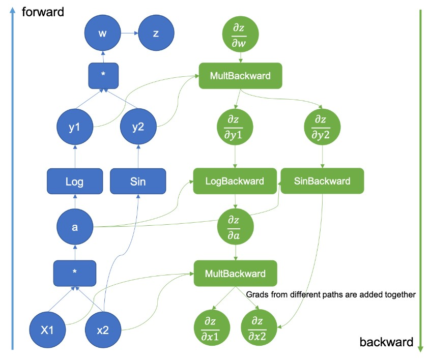
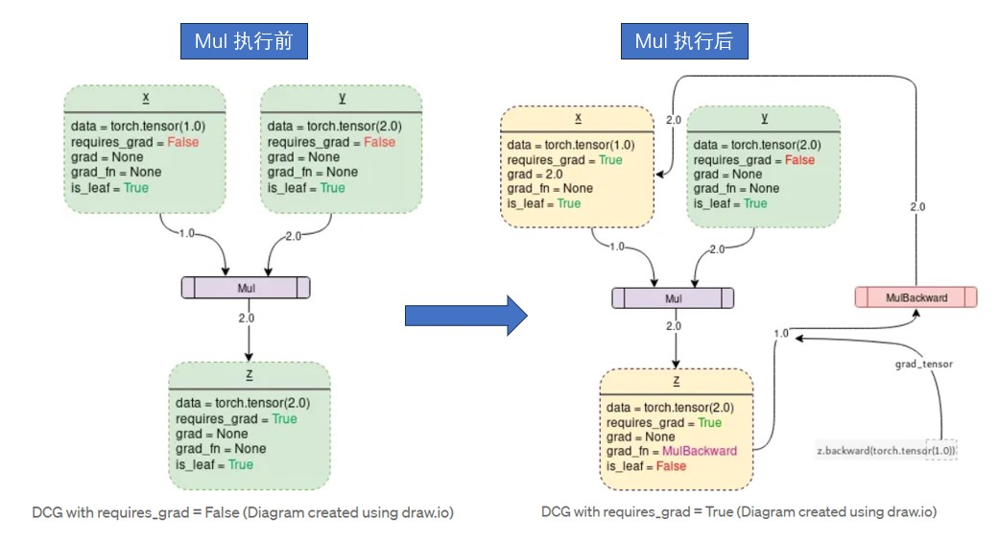
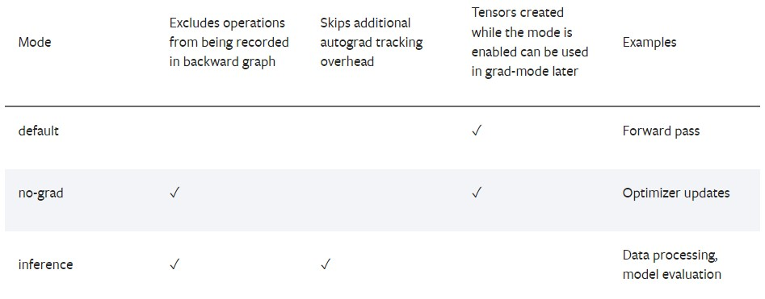

# 1 pytorch autograd 原理概述
**参考链接：** <br>
- [TORCH.AUTOGRAD](https://pytorch.org/docs/stable/index.html)
- [AUTOGRAD MECHANICS](https://pytorch.org/docs/stable/notes/autograd.html)
- [Overview of PyTorch Autograd Engine](https://pytorch.org/blog/overview-of-pytorch-autograd-engine/)
- [pytorch code](https://github.com/pytorch/pytorch/tree/main/torch/autograd)
- [pytorch internal](http://blog.ezyang.com/2019/05/pytorch-internals/)
- [derivatives.yaml](https://github.com/pytorch/pytorch/blob/release/1.9/tools/autograd/derivatives.yaml)

## 1.1 原理概述
- 原理简图：<br>


- 静态原理图：<br>


- 动态原理图: <br>


- [参考：How Computational Graphs are Constructed in PyTorch](https://pytorch.org/blog/computational-graphs-constructed-in-pytorch/)
- [参考：Overview of PyTorch Autograd Engine](https://pytorch.org/blog/overview-of-pytorch-autograd-engine/)

- 前向传播发生的两件事：
1. 运行请求的操作来计算结果张量；
2. 在DAG(directed acylic graph)中保存算子的梯度函数；

## 1.2 实现细节
- 细节展示


- [参考链接](https://towardsdatascience.com/pytorch-autograd-understanding-the-heart-of-pytorchs-magic-2686cd94ec95)
- [Vedio: PyTorch Autograd Explained — In-depth Tutorial by Elliot Waite](https://youtu.be/MswxJw-8PvE)

# 2 pytorch 代码实现
## 2.1 pytorch autograd 展示
```python
def autograd_demo():
    data0 = torch.randn(2, 2, 4)
    w_0 = torch.randn(2, 4, 3, requires_grad=True)
    data2 = torch.bmm(data0, w_0)
    data3 = torch.sigmoid(data2)
    w_1 = torch.randn(2, 3, 5, requires_grad = True)
    output = torch.matmul(data3, w_1)
    loss = output.sum()
    loss.backward()
    w_0 = w_0 - 0.001* w_0.grad

    print("run autograd_demo finished !!!")
```

## 2.2 require_grad 的自动推理机制
```python
x = torch.rand(5, 5)
y = torch.rand(5, 5)
z = torch.rand((5, 5), requires_grad=True)

a = x + y
print(f"Does `a` require gradients? : {a.requires_grad}")
b = x + z
print(f"Does `b` require gradients?: {b.requires_grad}")
```

## 2.3 detach 隔离功能
```python
import torch
# 创建一个需要梯度的张量
x = torch.tensor([2.0], requires_grad=True)
# 计算某个函数的输出
y = x.pow(2)
# 分离张量y，使其不再与计算图相关联
z = y.detach()
# 对z进行操作，不会影响梯度计算
w = z * 3
# 计算梯度
w.backward()
print("x的梯度:", x.grad)  # 输出为tensor([6.])
```

## 2.4 控制梯度计算
def set_no_grad():
    x = torch.ones(5, requires_grad=True)  # input tensor
    y = torch.zeros(3)  # expected output
    w = torch.randn(5, 3, requires_grad=True) # requires_grad
    b = torch.randn(3, requires_grad=True) 
    z = torch.matmul(x, w)+b
    # print("requires_grad: ", z.requires_grad)
    z.backward(torch.randn_like(z))
    print("x grad: ", x.grad)
    
    # torch.set_grad_enabled(False) # 全局设置 requires_grad = False
    
    with torch.no_grad():
        z = torch.matmul(x, w)+b
    
    # z.backward(torch.ones_like(z))
    print("requires_grad: ", z.requires_grad)

## 2.5 梯度累加和清0
def grad_accumulate():
    # torch.seed()
    x = torch.ones(5)  # input tensor
    label = torch.zeros(3)  # expected output
    w = torch.randn(5, 3, requires_grad=True) # requires_grad
    b = torch.randn(3, requires_grad=True)    
    output = torch.matmul(x, w)+b # 全连接层 
    
    loss = torch.nn.functional.binary_cross_entropy_with_logits(output, label)
    loss.backward(retain_graph=True) # 反向传播：求梯度
    print(f"Grad for w first time = {w.grad}")
    print(f"Gradient function for z = {output.grad_fn}")
    print(f"Gradient function for loss = {loss.grad_fn}")
    w.grad.zero_()
    loss.backward(retain_graph=True)
    print(f"Grad for w second time = {w.grad}")

## 2.6 小心 inplace-op
```python
def inplace_demo():
    data1 = torch.randn(3, 4)
    data1.requires_grad = True
    
    data1.mul_(2)
    loss = data1.var()
    
    loss.backward()

def inplace_demo_v2():
    with torch.no_grad():
        v = y.view(5, 5)
        v.sub_(y.grad * 0.1)
    
        # 底层的实现机制，sub_ 在c++ 层面上是经过多层的函数调用；
        # sub_ 底层会有一个新tensor的创建过程的；
        y.sub_(0.1 * y.grad)
```

## 2.7 pytorch autograd 解方程
```python
def autograd_demo_v1():
    torch.manual_seed(0)
    x = torch.ones(5, requires_grad=True) # input
    w = torch.randn(5, 5, requires_grad=True) # weight
    b = torch.randn_like(x)
    label = torch.Tensor([0, 0, 1, 0, 0])

    for i in range(100):
        # w.requires_grad=True # True 
        if w.grad:
          w.grad.zero_()
          
        z = torch.matmul(w, x) + b # linear layer    
        output = torch.sigmoid(z)
        output.register_hook(hook)        
        output.retain_grad() # tensor([-0.0405, -0.0722, -0.1572,  0.3101, -0.0403]
        loss = (output-label).var() # l2 loss
        loss.backward()
        print(w.grad)
        print("loss: ", loss)

def autograd_demo_v2():
    torch.manual_seed(0)
    x = torch.ones(5, requires_grad=True)
    w = torch.randn(5, 5, requires_grad=True) # 叶子节点
    b = torch.randn_like(x)
    label = torch.Tensor([0, 0, 1, 0, 0])

    for i in range(100):
        # w.grad.zero_()
        w.retain_grad()
        # print("===========w.grad: ", w.grad)
        z = torch.matmul(w, x) + b # linear layer    
        output = torch.sigmoid(z)
        loss = (output-label).var() # l2 loss
        loss.backward()
        w = w - 0.2 * w.grad # y 新的y --> 已经完成了梯度清0；
        print("loss: ", loss)

# 全连接层计算梯度 tiny
def autograd_demo_v3():
    torch.manual_seed(0)
    x = torch.ones(5, requires_grad=True)
    y = torch.randn(5, 5, requires_grad=True) # 叶子节点
    b = torch.randn_like(x)

    for i in range(100):
        if i > 0:
            y.grad.zero_()
        # print("==========y.grad: ", y.grad)
        z = torch.matmul(y, x) + b # linear layer    
        output = torch.sigmoid(z)
        label = torch.Tensor([0, 0, 1, 0, 0])
        loss = (output-label).var() # l2 loss
        loss.backward()
        
        # tensor a : requires_grad,  --> a.sub_(b): 对它的数据进行了更新；
        # pytorch check： 对我们需要更新梯度的tensor 禁止用 replace操作；
        # torch.no_grad(): 忽略这些警告，运行 replace 操作；
        with torch.no_grad(): # replace 
          y.sub_(0.2 * y.grad)
    
        print("loss: ", loss)
```

## 2.8 保存中间 activation tensor 的梯度
**中间tensor的梯度控制**
- middle_tensor.register_hook(hook)
- register_hook : 钩子注册函数
- hook: 钩子。类型：函数（lambda 函数 和 自定义函数都可以）
- hook 函数有一个参数：grad
- 这个grad 就是上一层传下来的梯度值
- 拿到这个梯度值，就可以进行操作（改变、保存）
- mid_tensor.retain_grad() ：不释放tensor的梯度
- 使用retain_grad 保存中间tensor 的梯度：<br>

- 方式1：<br>
```python
for i in range(100):
    y.retain_grad()
    z = torch.matmul(y, x) + b # linear layer
    output = torch.sigmoid(z)
    label = torch.Tensor([0, 0, 1, 0, 0])
    loss = (output-label).var() # l2 loss
    loss.backward()
    y = y - 0.1 * y.grad # y 中间计算过程 --> y 变为非叶子节点
```
- 方式2：<br>
```python
gard_list = []
def aa(grad):
    grad_list.append(grad)
    # return 0.001*grad

a = torch.Tensor([1, 2, 3])
a.regiter_hook(aa)
b = a.mul(c)
b.backward()
```

## 2.9 customer 自定义自己的反向传播函数
```python
 class Exp(Function):
     @staticmethod
     def forward(ctx, i):
         result = i.exp()
         ctx.save_for_backward(result)
         return result

     @staticmethod
     def backward(ctx, grad_output):
         result, = ctx.saved_tensors
         return grad_output * result

 # Use it by calling the apply method:
 output = Exp.apply(input)
 ```

## 2.10 多维Tensor 如何backward
```python
inp = torch.eye(4, 5, requires_grad=True)
out = (inp+1).pow(2).t()
out.backward(torch.ones_like(out), retain_graph=True)
print(f"First call\n{inp.grad}")
out.backward(torch.ones_like(out), retain_graph=True)
print(f"\nSecond call\n{inp.grad}")
inp.grad.zero_()
out.backward(torch.ones_like(out), retain_graph=True)
print(f"\nCall after zeroing gradients\n{inp.grad}")
```

## 2.11 example : train a model with two mlp layers
```python
def train_demo():    
    w1 = [[0.1, 0.15], [0.2, 0.25], [0.3, 0.35]]
    w2 = [[0.4, 0.45, 0.5], [0.55, 0.6, 0.65]]
    w1 = torch.tensor(w1, requires_grad=True)
    w2 = torch.tensor(w2, requires_grad=True)
    b1 = torch.ones(3, 1).float()
    b2 = torch.ones(2, 2).float()
    
    input1 = torch.tensor([5, 10]).reshape(2, 1).to(torch.float32)
    label = torch.tensor([0.01, 0.99]).reshape(2, 1)
    
    for i in range(300):
        if w1.grad or w2.grad:
            w1.grad.zero_()
            w2.grad.zero_()
        
        w1.retain_grad()
        w2.retain_grad()
        net_h = torch.mm(w1, input1) + b1
        out_h = torch.sigmoid(net_h)

        net_o = torch.matmul(w2, out_h) + b2
        out_o = torch.sigmoid(net_o)
        loss = (out_o - label).var()
        loss.backward()
        
        if i < 100:
            w1 = w1 - 0.5 * w1.grad
            w2 = w2 - 0.5 * w2.grad
        else:
            w1 = w1 - 0.02 * w1.grad
            w2 = w2 - 0.02 * w2.grad

        print(loss)
```

# 3 要点总结
## 3.1 自动微分机制(auto grad) 重点：
- pytorch中 正向forward 对我们用户是可见的，但是backward对我们用户是不可见的；
- 一般情况下，每一个正向的函数，都对应一个反向的函数（grad_fn--> Tensor中）；
- tensor：requires_grad = True
- tensor: grad --> tensor 中存储grad的地方；
- tensor: grad_fn --> 存储我们反向函数的地方
- tesnor: is_leaf --> 这个tensor 是不是 叶子节点；
- net::all weight --> 都是leaf
- 叶子节点的梯度会自动保存下来的（weight）；
- 中间的 activation 的梯度会计算，但是不保留；
- pytorch 动态图 vs tensorflow 静态图；
- 我们不能改变一个非叶子节点的 requires_grad;
- 非叶子（一个函数的output）节点它的 requires_grad 自动推导的；
- 非叶子节点对应函数的inputs 中只要有一个 requires_grad = True, 那么这个非叶子节点的requires_grad = True;
- torch.no_grad() 会使得里面的新的tensor requires_grad = False
- inplace的操作，非常大的风险：覆盖了原来的值，导致反向传播时计算不准确；
- 标量的梯度才能被隐式创建，隐式创建（.backward(1)）；
- 一般情况下，.backward(gradient)是有输入的: ;

## 3.2 反向传播算法
- pytorch ：正向（forward） 和 反向 （backward）
- 反向 和 autograd 有密切的关系
- 因为反向求梯度的
- 根据loss相对于给定参数的梯度来调整parameters(模型权重)
- 为了计算这些梯度，PyTorch有一个内置的微分引擎，名为torch.autograd。
- 它支持任何计算图的梯度自动计算。
- 这个torch.autograd 对用户不可知

## 3.3 tensor 的梯度
- requires_grad: 设置我们是否需要求这个tensor的梯度
- [requres_grad 链接接](site-packages/torch/_C/_VariableFunctions.pyi)
- 只有浮点、复数可以设置 require grdients
- reqires_grad: 告诉torch 我这个tensor 需要计算梯度的，正向的时候，torch会做额外的一些事情；
- requires_grad: default = False
- 输入的tensor 只要有一个requires_grad=True, output.requires_grad = True
- 中间的tensor 的 梯度会计算，但不保存
- weight：不释放，中间activation的梯度最好释放；
- 因为内存；GPU显存是很宝贵的。

## 3.4 反向求导原理
- grad_fn(grad function): 反向传播用到的函数；
- grad_fn 在正向的时候自动生成（requires_grad=True时)；
- .backend(）触发反向求导操作
- 求导操作针对整个反向图来进行，而不是仅仅一个算子；
- 冻结权重：.requires_grad = False
- weight 是需要计算权重并保存梯度的, matmul等算子如何设置weight和act???

## 3.5 动态图机制
- 每次运行.backward()后，autogard模块才会填充一个新的图；
- 上述正是模型中可以使用控制流语句的原因；
- 如有必要：可以在每次迭代中更改形状、大小和操作

 ## 3.6 auto grad 机制不足
 - 用起来不方便，搭建模型也不方便；
 - 哪些参数需要设置requires_grad？
 - 保存模型：保存哪些东西？
 - matmul：那一个是weight 哪一个是activation呢？
 - weight 的初始化；
 - 解决思路：nn

 ## 3.7 autograd是什么
- variable.h: struct TORCH_API AutogradMeta
- grad_ ：存储当前Variable实例的梯度，本身也是一个Variable。
- grad_fn ：是个Node实例，非叶子节点才有。通过 grad_fn() 方法来访问，实际上，PyTorch中就是通过 grad_fn是否为空 来判断一个Variable是否是leaf variable。
- grad_accumulator_ ：也是Node的实例，只有叶子节点才有。
- requires_grad_ ：表明此Variable实例是否需要grad。
- retains_grad_ ： 只有非叶子节点才有意义，意义为是否需要保持图。
- is_view_ ：是个flag，表明此Variable实例是否是个view（没有实际存储，基于base的variable）。
- version_counter_ ：version number。
- output_nr_：是个数字。output_nr_表明是 Node 的第几个输出，比如为 0 就 表明这个Variable是Node 的第 1 个输出。
- base_ ：是view的base variable。

## 3.8 grad_fun
- grad_fn 属性还包含 _saved_self 和 _saved_other 两个属性;
- _saved_self: 保存计算当前张量梯度所需要的计算图中的自身张量；
- _saved_other: 保存计算当前张量梯度所需要的计算图中的其他张量;

# 4 pytorch autograd(自动微分机制) extension ： 了解即可，不需要掌握
- [pytorch link](https://pytorch.org/docs/stable/notes/autograd.html#complex-autograd-doc)

&nbsp;&nbsp;&nbsp;&nbsp;&nbsp;&nbsp;&nbsp;&nbsp;本文将概述自动微分（autograd）的工作原理和记录操作的方式。虽然不一定需要完全理解其中的所有内容，但我们建议您熟悉它，因为这将有助于您编写更高效、更清晰的程序，并可帮助您进行调试。<br>

## 4.1 自动微分如何编码历史记录
&nbsp;&nbsp;&nbsp;&nbsp;&nbsp;&nbsp;&nbsp;&nbsp;自动微分是一种反向自动微分系统。在概念上，自动微分在执行操作(operations)时记录了创建数据的所有操作(operations)，从而生成了一个**有向无环图**，其叶节点是输入张量，而根节点是输出张量。通过从根节点到叶节点追溯这个图，您可以使用链式法则自动计算梯度。<br>

&nbsp;&nbsp;&nbsp;&nbsp;&nbsp;&nbsp;&nbsp;&nbsp;在内部，自动微分将这个图表示为一组函数对象(实际上是表达式)，可以通过 apply() 方法应用这些函数对象来计算图的求值结果。在计算前向传播时，自动微分同时执行请求的计算，并构建表示计算梯度的函数的图(每个 torch.Tensor 的 .grad_fn 属性是进入这个图的入口)。完成前向传播后，我们在反向传播中评估这个图，以计算梯度。<br>

&nbsp;&nbsp;&nbsp;&nbsp;&nbsp;&nbsp;&nbsp;&nbsp;需要注意的重要一点是，图在每次迭代时都是**从头开始重新创建的(动态性的一个重要体现)**，这正是允许使用任意的 Python 控制流语句的原因，这些语句可以在每次迭代时改变图的整体形状和大小。在启动训练之前，您不必编码所有可能的路径 - 您运行的就是您要求微分的内容。<br>

## 4.2 Saved Tensors
&nbsp;&nbsp;&nbsp;&nbsp;&nbsp;&nbsp;&nbsp;&nbsp;在前向传播过程中，有些操作需要保存中间结果以便执行反向传播。例如，函数 x ↦ x² 保存输入 x 来计算梯度。<br>

&nbsp;&nbsp;&nbsp;&nbsp;&nbsp;&nbsp;&nbsp;&nbsp;当定义一个自定义的 Python [Function](https://pytorch.org/docs/stable/autograd.html#torch.autograd.Function) 时，您可以使用 save_for_backward() 在前向传播期间保存张量，并使用 saved_tensors 在反向传播期间检索它们。有关更多信息，请参阅 [扩展 PyTorch](https://pytorch.org/docs/stable/notes/extending.html)。<br>

&nbsp;&nbsp;&nbsp;&nbsp;&nbsp;&nbsp;&nbsp;&nbsp;对于 PyTorch 定义的操作（例如 torch.pow()），张量会根据需要自动保存。您可以探索（出于教育或调试目的）哪些张量由特定 grad_fn 保存，方法是查找以 _saved 为前缀的属性。<br>

```python
x = torch.randn(5, requires_grad=True)
y = x.pow(2)
print(x.equal(y.grad_fn._saved_self))  # True
print(x is y.grad_fn._saved_self)  # True
```
&nbsp;&nbsp;&nbsp;&nbsp;&nbsp;&nbsp;&nbsp;&nbsp;在上述代码中，y.grad_fn._saved_self 引用的是与 x 相同的 Tensor 对象。但并非总是如此。例如：<br>

```python
x = torch.randn(5, requires_grad=True)
y = x.exp()
print(y.equal(y.grad_fn._saved_result))  # True
print(y is y.grad_fn._saved_result)  # False
```

&nbsp;&nbsp;&nbsp;&nbsp;&nbsp;&nbsp;&nbsp;&nbsp;在内部，为了防止引用循环，PyTorch在保存时对张量进行了打包，并在读取时将其解包为不同的张量。在这里，从访问 y.grad_fn._saved_result 得到的张量与 y 是不同的张量对象（但它们仍然共享相同的存储）。<br>
&nbsp;&nbsp;&nbsp;&nbsp;&nbsp;&nbsp;&nbsp;&nbsp;张量是否会被打包为不同的张量对象取决于它是否是其自身 grad_fn 的输出，这是一个可能变化的实现细节，用户不应依赖此特性。<br>

您可以使用 [张量的钩子(Hooks)](https://pytorch.org/docs/stable/notes/autograd.html#saved-tensors-hooks-doc) 来控制 PyTorch 如何进行保存张量的打包/解包操作。

## 4.3 对于不可微分的函数的梯度计算
&nbsp;&nbsp;&nbsp;&nbsp;&nbsp;&nbsp;&nbsp;&nbsp;使用自动微分进行梯度计算仅在每个使用的基本函数都是可微分的情况下有效。不幸的是，我们在实践中使用的许多函数并不具备这个性质（例如 relu 或 sqrt 在 0 处）。为了尽量减少不可微分函数的影响，我们按照以下规则定义基本操作的梯度计算顺序：<br>

1. 如果该函数可微分，因此在当前点存在梯度，请使用它。<br>
2. 如果该函数是凸函数（至少在局部上），请使用模最小的子梯度（它是最陡下降方向）。<br>
3. 如果该函数是凹函数（至少在局部上），请使用模最小的超梯度（考虑 -f(x) 并应用上述点）。<br>
4. 如果该函数被定义，通过连续性在当前点定义梯度（请注意，这里可能存在无穷大，例如 sqrt(0)）。如果存在多个值，则任意选择一个。<br>
5. 如果该函数未定义（sqrt(-1)、log(-1) 或当输入为 NaN 时的大多数函数），那么作为梯度使用的值是任意的（我们也可能引发错误，但不能保证）。大多数函数将使用 NaN 作为梯度，但出于性能原因，某些函数将使用其他值（例如，log(-1)）。<br>
6. 如果该函数不是确定性映射（即它不是数学函数），则将其标记为不可微分。如果在需要梯度的张量上在 no_grad 环境之外使用它，这将导致在反向传播过程中引发错误。<br>

## 4.4 局部禁用梯度计算
&nbsp;&nbsp;&nbsp;&nbsp;&nbsp;&nbsp;&nbsp;&nbsp;有几种机制可以在 Python 中局部禁用梯度计算：

- 要在代码的整个块中禁用梯度，可以使用像 no-grad 模式和推断模式这样的上下文管理器。
- 为了更细粒度地排除子图不进行梯度计算，可以设置张量的 requires_grad 字段。
- 除了讨论上述机制之外，下面我们还会介绍评估模式（nn.Module.eval()），这是一种**不用于**禁用梯度计算的方法，但由于其名称，经常与前面的三种方法混淆。

```python
x = torch.tensor([1.0, 2.0, 3.0], requires_grad=True)
with torch.no_grad():
    y = x * 2  # 这里的计算不会被跟踪梯度

with torch.set_grad_enabled(False):
    y = x * 2  # 这里的计算不会被跟踪梯度

x = torch.tensor([1.0, 2.0, 3.0], requires_grad=True)
y = torch.tensor([4.0, 5.0, 6.0], requires_grad=True)
x.requires_grad = False  # 禁用 x 的梯度计算
z = x * y  # 只有 y 的梯度会被计算
```

## 4.5 设置 requires_grad
&nbsp;&nbsp;&nbsp;&nbsp;&nbsp;&nbsp;&nbsp;&nbsp;requires_grad 是一个标志，除非包装在 nn.Parameter 中，默认为 false，它允许对子图进行细粒度的梯度计算排除。它在前向传播和反向传播中都起作用：<br>

&nbsp;&nbsp;&nbsp;&nbsp;&nbsp;&nbsp;&nbsp;&nbsp;在前向传播过程中，只有至少一个输入张量需要 grad 的操作才会在反向图中记录。在反向传播过程（.backward()）中，只有 requires_grad=True 的叶张量才会将梯度累积到其 .grad 字段中。<br>

&nbsp;&nbsp;&nbsp;&nbsp;&nbsp;&nbsp;&nbsp;&nbsp;重要的是要注意，尽管每个张量都有这个标志，但仅对叶张量设置它才有意义（没有 grad_fn 的张量，例如 nn.Module 的参数）。非叶张量（具有 grad_fn 的张量）是具有与之相关联的反向图的张量。因此，它们的梯度将作为计算需要，作为计算需要 grad 的叶张量的中间结果。根据这个定义，所有非叶张量将自动具有 require_grad=True。<br>

&nbsp;&nbsp;&nbsp;&nbsp;&nbsp;&nbsp;&nbsp;&nbsp;设置 requires_grad 应该是控制模型中哪些部分参与梯度计算的主要方法，例如，在模型微调期间需要冻结预训练模型的某些部分。<br>

&nbsp;&nbsp;&nbsp;&nbsp;&nbsp;&nbsp;&nbsp;&nbsp;要冻结模型的某些部分，只需将 .requires_grad_(False) 应用于不希望更新的参数。正如上面所述，因为使用这些参数作为输入的计算在前向传播中不会被记录，所以它们在反向传播中的 .grad 字段也不会被更新，因为它们一开始就不是反向图的一部分，正如期望的那样。<br>

&nbsp;&nbsp;&nbsp;&nbsp;&nbsp;&nbsp;&nbsp;&nbsp;由于这是一个常见的模式，requires_grad 也可以在**模块级别使用 nn.Module.requires_grad_()** 进行设置。当应用于模块时，.requires_grad_() 对模块的所有参数（默认情况下 requires_grad=True）都起作用。<br>

## 4.6 梯度模式
&nbsp;&nbsp;&nbsp;&nbsp;&nbsp;&nbsp;&nbsp;&nbsp;除了设置 requires_grad 外，还有三种梯度模式可以从 Python 中选择，这些模式可以影响 PyTorch 中 autograd 在内部处理计算的方式：默认模式（grad 模式）、无梯度模式(no-grad mode)和推断模式(inference mode,)，所有这些模式都可以通过上下文管理器和装饰器进行切换。<br>



### 4.6.1 默认模式（Grad mode）
&nbsp;&nbsp;&nbsp;&nbsp;&nbsp;&nbsp;&nbsp;&nbsp;**默认模式**是在没有启用其他模式（如无梯度模式和推断模式）时隐式存在的模式。与“无梯度模式”相对应的是，“默认模式”有时也被称为“grad 模式”。<br>

&nbsp;&nbsp;&nbsp;&nbsp;&nbsp;&nbsp;&nbsp;&nbsp;关于默认模式最重要的是，它是唯一可以生效的 requires_grad 模式。在其他两种模式中，requires_grad 总是被覆盖为 False。<br>

### 4.6.2 无梯度模式
&nbsp;&nbsp;&nbsp;&nbsp;&nbsp;&nbsp;&nbsp;&nbsp;在无梯度模式下，计算行为就好像**没有任何输入需要梯度**一样。换句话说，在无梯度模式下，即使存在 require_grad=True 的输入，计算也不会被记录在反向图中。<br>

&nbsp;&nbsp;&nbsp;&nbsp;&nbsp;&nbsp;&nbsp;&nbsp;当您需要执行不应由自动求导记录的操作，但仍希望在后续的梯度模式中使用这些计算的输出时，可以启用无梯度模式。这个上下文管理器使得在不必临时将张量设置为 requires_grad=False，然后再设置为 True 的情况下，方便地在一段代码或函数中禁用梯度。<br>

&nbsp;&nbsp;&nbsp;&nbsp;&nbsp;&nbsp;&nbsp;&nbsp;例如，**当编写优化器时，无梯度模式可能非常有用**：在执行训练更新时，您希望原地更新参数，而不会被自动求导记录。您还打算在下一次前向传播中使用**更新后的参数**进行梯度模式的计算。<br>

torch.nn.init 中的实现也依赖于无梯度模式，在初始化参数时避免了在原地更新初始化的参数时的自动求导跟踪。<br>

### 4.6.3 推断模式(inference mode)
&nbsp;&nbsp;&nbsp;&nbsp;&nbsp;&nbsp;&nbsp;&nbsp;推断模式是无梯度模式的极端版本。与无梯度模式类似，推断模式下的计算不会被记录在反向图中，但启用推断模式将使得 PyTorch 加速您的模型。这种更好的运行时性能伴随着一个缺点：在退出推断模式后，无法在由自动求导记录的计算中使用在推断模式下创建的张量。<br>

&nbsp;&nbsp;&nbsp;&nbsp;&nbsp;&nbsp;&nbsp;&nbsp;当进行不需要在反向图中记录的计算，并且您不打算在后续的自动求导记录的计算中使用在推断模式下创建的张量时，请启用推断模式。<br>

&nbsp;&nbsp;&nbsp;&nbsp;&nbsp;&nbsp;&nbsp;&nbsp;建议您在不需要自动求导跟踪的代码部分（例如数据处理和模型评估）中尝试推断模式。如果它能够适用于您的用例，那么可以免费获得性能提升。如果在启用推断模式后遇到错误，请检查您是否在退出推断模式后的自动求导记录的计算中使用了在推断模式下创建的张量。如果您无法避免在您的情况下使用这样的张量，您可以随时切换回无梯度模式。<br>

&nbsp;&nbsp;&nbsp;&nbsp;&nbsp;&nbsp;&nbsp;&nbsp;有关推断模式的详细信息，请参阅推断模式 [Inference Mode](https://pytorch.org/cppdocs/notes/inference_mode.html) 。<br>

&nbsp;&nbsp;&nbsp;&nbsp;&nbsp;&nbsp;&nbsp;&nbsp;有关推断模式的实现细节，请参阅 [RFC-0011-InferenceMode](https://github.com/pytorch/rfcs/pull/17) 。<br>

### 4.6.4 评估模式（nn.Module.eval()）
&nbsp;&nbsp;&nbsp;&nbsp;&nbsp;&nbsp;&nbsp;&nbsp;评估模式**不是一种局部禁用梯度计算的机制**。尽管如此，我们在这里还是包括了它，因为有时候它会被**误解**为这样的机制。<br>

&nbsp;&nbsp;&nbsp;&nbsp;&nbsp;&nbsp;&nbsp;&nbsp;从功能上讲，module.eval()（或等效地使用 module.train(False)）与无梯度模式和推断模式**完全无关**。model.eval() 对您的模型的影响完全取决于您模型中使用的具体模块以及它们是否定义了任何训练模式特定的行为。<br>

&nbsp;&nbsp;&nbsp;&nbsp;&nbsp;&nbsp;&nbsp;&nbsp;如果您的模型依赖于诸如 torch.nn.Dropout 和 torch.nn.BatchNorm2d 等模块，而这些模块在训练模式下可能表现不同，那么您需要负责调用 model.eval() 和 model.train()，例如在验证数据上避免更新 BatchNorm 的运行统计信息。<br>

&nbsp;&nbsp;&nbsp;&nbsp;&nbsp;&nbsp;&nbsp;&nbsp;建议您在训练模型时始终使用 model.train()，在评估模型（验证/测试）时使用 model.eval()，即使您不确定您的模型是否具有训练模式特定的行为，因为您使用的某个模块可能会在训练和评估模式下表现不同。<br>

## 4.7 In-place operations with autograd
&nbsp;&nbsp;&nbsp;&nbsp;&nbsp;&nbsp;&nbsp;&nbsp;使用自动求导（autograd）支持原地操作（In-place operations）是一个很复杂的问题，在大多数情况下，我们不鼓励使用它们。自动求导的缓冲区释放和重用使其非常高效，很少有情况下原地操作能够显著降低内存使用量。除非您的内存压力非常大，否则您可能永远不需要使用它们。<br>

&nbsp;&nbsp;&nbsp;&nbsp;&nbsp;&nbsp;&nbsp;&nbsp;存在两个主要原因限制了In-Place操作的适用性：<br>

&nbsp;&nbsp;&nbsp;&nbsp;&nbsp;&nbsp;&nbsp;&nbsp;原地操作可能会**覆盖**计算梯度所需的值。<br>

&nbsp;&nbsp;&nbsp;&nbsp;&nbsp;&nbsp;&nbsp;&nbsp;每个原地操作都需要**重新构建计算图**。而不原地操作只是分配新的对象并保留对旧计算图的引用，而原地操作需要更改表示该操作的函数的所有输入的创建者。这可能会很棘手，特别是如果有许多张量引用相同的存储（例如通过索引或转置创建），并且如果被修改的输入的存储被其他张量引用，原地函数将引发错误。<br>


