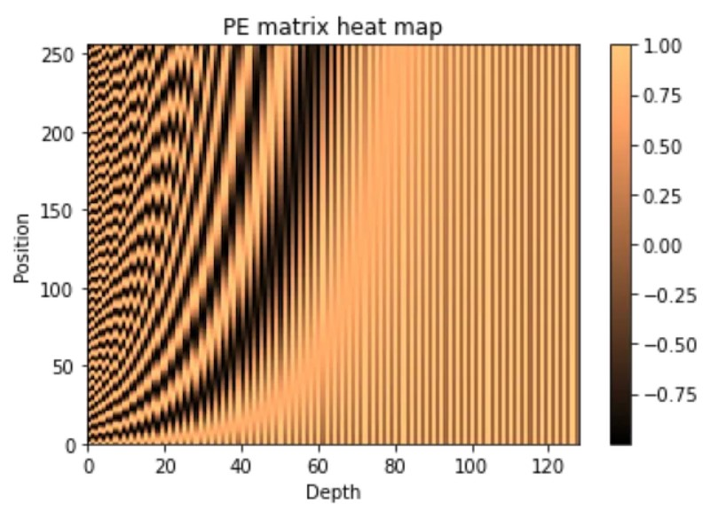

# 1 模型跑通
```shell
git clone https://github.com/huggingface/transformers.git

export PYTHONPATH=*/transformers/src:$PYTHONPATH

cd transformers

git checkout v4.31.0

cd */transformsers/examples/pytorch/question-answering

python run_seq2seq_qa.py \
  --model_name_or_path t5-small \
  --dataset_name squad_v2 \
  --context_column context \
  --question_column question \
  --answer_column answers \
  --do_train \
  --do_eval \
  --per_device_train_batch_size 12 \
  --learning_rate 3e-5 \
  --num_train_epochs 2 \
  --max_seq_length 384 \
  --doc_stride 128 \
  --output_dir /tmp/debug_seq2seq_squad/
```

# 2 t5 介绍

- [t5 论文链接](https://arxiv.org/pdf/1910.10683.pdf)
- [t5 论文链接](https://links.jianshu.com/go?to=https%3A%2F%2Farxiv.org%2Fabs%2F1910.10683)


# 3 position embedding 总结
## 3.1 绝对位置编码
### 3.1.1 三角函数式(Sinusoidal)位置编码
&nbsp;&nbsp;&nbsp;&nbsp;&nbsp;&nbsp;&nbsp;&nbsp;三角函数式(Sinusoidal)位置编码是在原Transformer模型中使用的一种显式编码。以一维三角函数编码为例：<br>

$$p_{k, 2i} = sin (\frac{k}{10000^{2 i / d}})$$

$$p_{k, 2i+1} = cos (\frac{k}{10000^{2 i / d}})$$

&nbsp;&nbsp;&nbsp;&nbsp;&nbsp;&nbsp;&nbsp;&nbsp;一个长度为32 的输入序列（每个输入向量的特征维度是128）的Sinusoidal编码的可视化如下：<br>



 三角函数绝对位置编码只考虑距离没有考虑方向。

### 3.1.2 可学习(Learnable)的位置编码
&nbsp;&nbsp;&nbsp;&nbsp;&nbsp;&nbsp;&nbsp;&nbsp;可学习(Learnable)位置编码是指将位置编码当作可训练参数，比如输入序列(经过嵌入层后)的大小为  $n \times d$  ，则随机初始化一个  $p \in \mathbb{R}^{n \times d}$  的矩阵作为位置编码，随训练过程更新。<br>

&nbsp;&nbsp;&nbsp;&nbsp;&nbsp;&nbsp;&nbsp;&nbsp;可学习位置编码的缺点是没有外推性，即如果预训练序列的最大长度为  n  ，则无法处理长度超过  n  的序列。此时可以将超过  n  部分的位置编码随机初始化并微调。<br>


## 3.2 相对位置编码
## 3.2.1 经典的相对位置编码
- [论文链接](https://aclanthology.org/N18-2074.pdf)


## 3.2.2 T5 中的相对位置编码
- [来源](https://arxiv.org/abs/1910.10683)

- 形成相对位置坐标
```python
a = torch.arange(15)[:, None]
b = torch.arange(15)[None, :]
c = a -b
>>> c.shape
torch.Size([15, 15])
>>> c
tensor([[  0,  -1,  -2,  -3,  -4,  -5,  -6,  -7,  -8,  -9, -10, -11, -12, -13,
         -14],
        [  1,   0,  -1,  -2,  -3,  -4,  -5,  -6,  -7,  -8,  -9, -10, -11, -12,
         -13],
        [  2,   1,   0,  -1,  -2,  -3,  -4,  -5,  -6,  -7,  -8,  -9, -10, -11,
         -12],
        [  3,   2,   1,   0,  -1,  -2,  -3,  -4,  -5,  -6,  -7,  -8,  -9, -10,
         -11],
        [  4,   3,   2,   1,   0,  -1,  -2,  -3,  -4,  -5,  -6,  -7,  -8,  -9,
         -10],
        [  5,   4,   3,   2,   1,   0,  -1,  -2,  -3,  -4,  -5,  -6,  -7,  -8,
          -9],
        [  6,   5,   4,   3,   2,   1,   0,  -1,  -2,  -3,  -4,  -5,  -6,  -7,
          -8],
        [  7,   6,   5,   4,   3,   2,   1,   0,  -1,  -2,  -3,  -4,  -5,  -6,
          -7],
        [  8,   7,   6,   5,   4,   3,   2,   1,   0,  -1,  -2,  -3,  -4,  -5,
          -6],
        [  9,   8,   7,   6,   5,   4,   3,   2,   1,   0,  -1,  -2,  -3,  -4,
          -5],
        [ 10,   9,   8,   7,   6,   5,   4,   3,   2,   1,   0,  -1,  -2,  -3,
          -4],
        [ 11,  10,   9,   8,   7,   6,   5,   4,   3,   2,   1,   0,  -1,  -2,
          -3],
        [ 12,  11,  10,   9,   8,   7,   6,   5,   4,   3,   2,   1,   0,  -1,
          -2],
        [ 13,  12,  11,  10,   9,   8,   7,   6,   5,   4,   3,   2,   1,   0,
          -1],
        [ 14,  13,  12,  11,  10,   9,   8,   7,   6,   5,   4,   3,   2,   1,
           0]])
```

## 3.3 旋转位置编码
&nbsp;&nbsp;&nbsp;&nbsp;&nbsp;&nbsp;&nbsp;&nbsp;旋转位置编码（Rotary Position Embedding，RoPE）是论文 Roformer: Enhanced Transformer With Rotray Position Embedding 提出的一种能够将相对位置信息依赖集成到 self-attention 中并提升 transformer 架构性能的位置编码方式。而目前很火的 LLaMA、GLM 模型也是采用该位置编码方式。和相对位置编码相比，RoPE 具有更好的外推性，目前是大模型相对位置编码中应用最广的方式之一。<br>

**思考：什么是大模型外推性？** <br>

外推性是指大模型在训练时和预测时的输入长度不一致，导致模型的泛化能力下降的问题。例如，如果一个模型在训练时只使用了 512 个 token 的文本，那么在预测时如果输入超过 512 个 token，模型可能无法正确处理。这就限制了大模型在处理长文本或多轮对话等任务时的效果。<br>

- llama 中的RoPE 代码实现

```python
# 生成旋转矩阵
def precompute_freqs_cis(dim: int, seq_len: int, theta: float = 10000.0):
    # 计算词向量元素两两分组之后，每组元素对应的旋转角度\theta_i
    freqs = 1.0 / (theta ** (torch.arange(0, dim, 2)[: (dim // 2)].float() / dim))
    # 生成 token 序列索引 t = [0, 1,..., seq_len-1]
    t = torch.arange(seq_len, device=freqs.device)
    # freqs.shape = [seq_len, dim // 2] 
    freqs = torch.outer(t, freqs).float()  # 计算m * \theta

    # 计算结果是个复数向量
    # 假设 freqs = [x, y]
    # 则 freqs_cis = [cos(x) + sin(x)i, cos(y) + sin(y)i]
    freqs_cis = torch.polar(torch.ones_like(freqs), freqs) 
    return freqs_cis

# 旋转位置编码计算
def apply_rotary_emb(
    xq: torch.Tensor,
    xk: torch.Tensor,
    freqs_cis: torch.Tensor,
) -> Tuple[torch.Tensor, torch.Tensor]:
    # xq.shape = [batch_size, seq_len, dim]
    # xq_.shape = [batch_size, seq_len, dim // 2, 2]
    xq_ = xq.float().reshape(*xq.shape[:-1], -1, 2)
    xk_ = xk.float().reshape(*xk.shape[:-1], -1, 2)

    # 转为复数域
    xq_ = torch.view_as_complex(xq_)
    xk_ = torch.view_as_complex(xk_)

    # 应用旋转操作，然后将结果转回实数域
    # xq_out.shape = [batch_size, seq_len, dim]
    xq_out = torch.view_as_real(xq_ * freqs_cis).flatten(2)
    xk_out = torch.view_as_real(xk_ * freqs_cis).flatten(2)
    return xq_out.type_as(xq), xk_out.type_as(xk)

class Attention(nn.Module):
    def __init__(self, args: ModelArgs):
        super().__init__()

        self.wq = Linear(...)
        self.wk = Linear(...)
        self.wv = Linear(...)

        self.freqs_cis = precompute_freqs_cis(dim, max_seq_len * 2)

    def forward(self, x: torch.Tensor):
        bsz, seqlen, _ = x.shape
        xq, xk, xv = self.wq(x), self.wk(x), self.wv(x)

        xq = xq.view(batch_size, seq_len, dim)
        xk = xk.view(batch_size, seq_len, dim)
        xv = xv.view(batch_size, seq_len, dim)

        # attention 操作之前，应用旋转位置编码
        xq, xk = apply_rotary_emb(xq, xk, freqs_cis=freqs_cis)

        # scores.shape = (bs, seqlen, seqlen)
        scores = torch.matmul(xq, xk.transpose(1, 2)) / math.sqrt(dim)
        scores = F.softmax(scores.float(), dim=-1)
        output = torch.matmul(scores, xv)  # (batch_size, seq_len, dim)
  # ......
```

- [参考链接](https://hub.baai.ac.cn/view/29979)
- [参考链接](https://kexue.fm/archives/8265)


# 4 参考链接
- [参考链接1](https://mp.weixin.qq.com/s/ENpXBYQ4hfdTLSXBIoF00Q)
- [参考链接2](https://www.cnblogs.com/shiyublog/p/11236212.html)
- [参考链接3](https://blog.nghuyong.top/2023/09/02/NLP/llm-position-embedding/)
- [参考链接4](https://juejin.cn/post/7126132489428402184)
- [参考链接5](https://blog.nghuyong.top/2023/09/02/NLP/llm-position-embedding/)
- [参考链接5](https://https://kexue.fm/archives/8130)
