# 0 LLM简史：从Transformer（2017）到DeepSeek-R1（2025）


2025年初，中国推出了具有开创性且高性价比的「大型语言模型」（Large Language Model——LLM）DeepSeek-R1，引发了AI的巨大变革。本文回顾了LLM的发展历程，起点是2017年`革命性的Transformer架构`，该架构通过「**自注意力机制**」(Self-
Attention) **彻底重塑了自然语言处理**。到2018年，BERT和GPT等模型崭露头角，显著提升了上下文理解和文本生成能力。2020年，拥有1750亿参数的GPT-3展示了卓越的「少样本(few-shot)」和「零样本zero-shot」学习能力。然而，「幻觉」问题
— —即生成内容与事实不符，甚至出现「一本正经地胡说八道」的现象 — —成为了一个关键挑战。2022年，OpenAI通过开发「对话式」的ChatGPT应对这一问题，采用了「**监督微调**」（SFT）和「**基于人类反馈的强化学习**」（RLHF）。到2023年，像GPT-4这样的「多模态模型」整合了文本、图像和音频处理能力，使LLM能够以更接近人类的「听」、「说」、「看」能力。

**对话式ChatGPT 和 传统问答系统/搜索引擎的不同**
| 特性 | 对话式 ChatGPT | 传统问答系统/搜索引擎 |
| :--: | :--: | :--: |
| 交互模式 | 多轮、动态对话 | 单次输入、单次输出 |
| 上下文处理 | 支持上下文关联 | 每次查询独立处理 |
| 回答生成 | 生成自然语言文本 | 返回链接、摘要或固定模板内容 |
| 灵活性 | 适应模糊、复杂问题 | 依赖关键词匹配，对模糊问题敏感 |

&nbsp;&nbsp;&nbsp;&nbsp;近期推出的OpenAI-o1和DeepSeek-R1「**推理模型**」(`Reasoning Model`)在复杂问题解决方面取得突破，赋予LLM更接近人类「系统思维」的深度推理能力，`标志着人工智能在模拟人类思维模式上迈出了重要一步`。此外，DeepSeek-R1模型以其「**超成本效益**」和「**开源**」设计挑战了AI领域的传统规范，推动了先进LLM的普及，并促进了各行业的创新。

# 1. 什么是语言模型 (Language Models)？

「语言模型」是一种「人工智能系统」，旨在处理、理解和生成类似人类的语言。它们从大型数据集中学习模式和结构，使得能够产生连贯且上下文相关的文本，应用于翻译、摘要、聊天机器人和内容生成等领域。

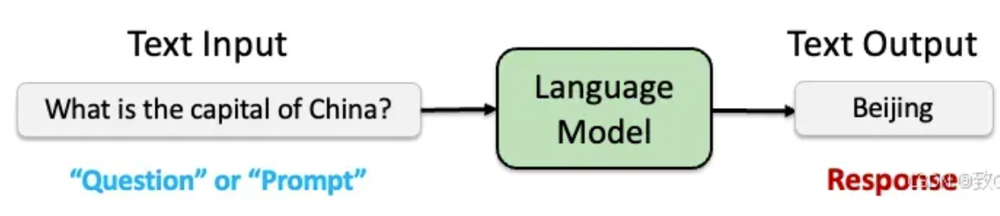

*语言模型就是这样一个模型：对于任意的词序列，它能够计算出这个序列是一句话的概率。或者说语言模型能预测单词序列的下一个词是什么。*

## 1.1 大型语言模型（LLMs）

&nbsp;&nbsp;&nbsp;&nbsp;「语言模型」（LMs）和「大型语言模型」（LLMs）这两个术语虽然经常被互换使用，但实际上它们基于规模、架构、训练数据和能力指代不同的概念。LLMs 是 LMs 的一个子集，其规模显著更大，通常包含数十亿个参数（例如，GPT-3 拥有 1750 亿个参数）。这种更大的规模使 LLMs 能够在广泛的任务中表现出卓越的性能。


“LLM”这一术语在 2018 至 2019 年间随着基于 Transformer 架构的模型（如 BERT 和 GPT-1）的出现开始受到关注。然而，在 2020 年 `GPT-3 发布后，这个词才被广泛使用`，展示了这些大规模模型的重大影响力和强大能力。

## 1.2 自回归语言模型 （Autoregressive Language Models）

&nbsp;&nbsp;&nbsp;&nbsp;大多数LLMs以「自回归方式」(Autoregressive)操作，这意味着它们根据前面的「文本」预测下一个「字」（或token／sub-word）的「概率分布」(propability distribution)。这种自回归特性使模型能够学习复杂的语言模式和依赖关系，从而善于「**文本生成**」。

&nbsp;&nbsp;&nbsp;&nbsp;在数学上，LLM 是一个概率模型（Probabilistic Model），根据之前的输入文本 $ x_1, x_2, \ldots, x_{n-1} $ 预测下一个字 $ x_n $ 的概率分布。这可以表示为：<br>

$$ P(x_n|x_1, x_2, \ldots, x_{n-1}) $$

&nbsp;&nbsp;&nbsp;&nbsp;在文本生成任时，LLM通过**解码算法(Decoding Algorithm)** 来确定下一个输出的token。这一过程可以采用不同的策略：既可以选择概率最高的下个字（即贪婪搜索），也可以从预测的概率分布中**随机采样一个token**。后一种方法使得每次生成的文本都可能有所不同，这种特性与人类语言的多样性和随机性颇为相似。

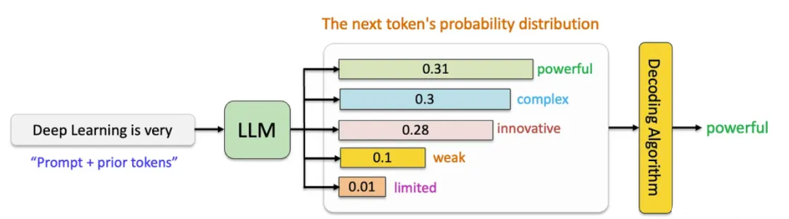

## 1.3 生成能力

&nbsp;&nbsp;&nbsp;&nbsp;LLMs的`自回归特性`使其能够基于前文提供的上下文逐词生成文本。从「提示」(prompt)开始，如下图，模型通过迭代预测下一个词，直到生成完整的序列或达到预定的停止条件。为了生成对提示的完整回答，LLM通过`将先前选择的token添加到输入中进行迭代生成`，尤如 「文字接龙」游戏。

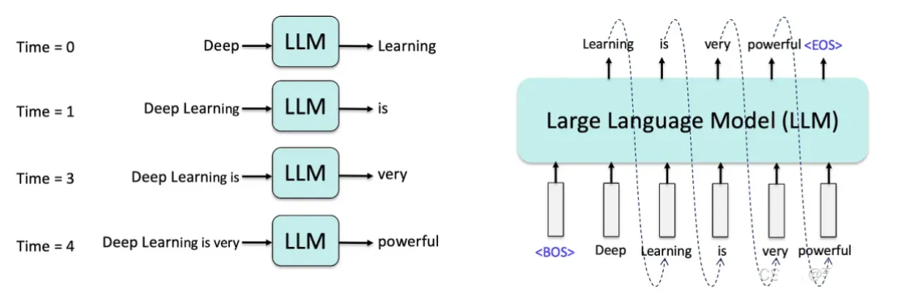

> LLM的文本生成尤如「文字接龙」游戏。

&nbsp;&nbsp;&nbsp;&nbsp;这种生成能力推动了多种应用的发展，例如创意写作、对话式人工智能以及自动化客户支持系统。

# 2\. Transformer革命 (2017)

&nbsp;&nbsp;&nbsp;&nbsp;Vaswani等人在2017年通过其开创性论文**Attention is All You Need**引入了**Transformer架构**，标志着NLP的一个`分水岭时刻`。它解决了早期模型如循环神经网络（RNNs）和长短期记忆网络（LSTMs）的关键限制，这些模型`在长程依赖性和顺序处理方面存在困难`。这些问题使得使用RNN或LSTM实现有效的语言模型变得困难，因为它们计算效率低下且容易出现梯度消失等问题。另一方面，Transformers克服了这些障碍，彻底改变了这一领域，并为现代大型语言模型奠定了基础。

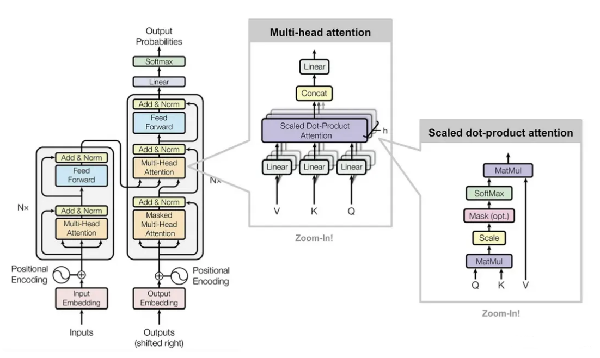


> 自注意力和Transformer架构

## 2.1 Transformer架构的关键创新

  1. 自注意力机制 (Self-Attention)：与按顺序处理标记并难以应对长程依赖性的RNN不同，Transformers使用自注意力来权衡每个标记相对于其他标记的重要性。这使得模型能够动态关注输入的相关部分。数学上：

  $$ Attention(Q, K, V) = softmax(\frac{QK^T}{\sqrt{d_k}})V $$

  这里，Q、K、V是查询(query)、键(key)和值(value)矩阵，dₖ是键的维度。自注意力允许并行计算，加快训练速度，同时提高全局上下文理解。

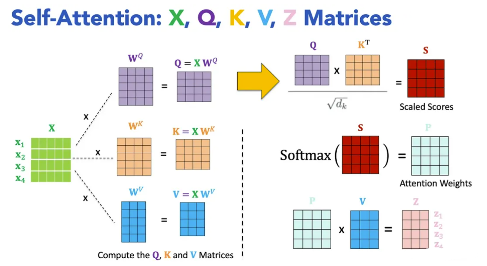

  2. 多头注意力：多个注意力头并行操作，每个头专注于输入的不同方面。它们的输出被连接并转换，从而实现更丰富的上下文表示。

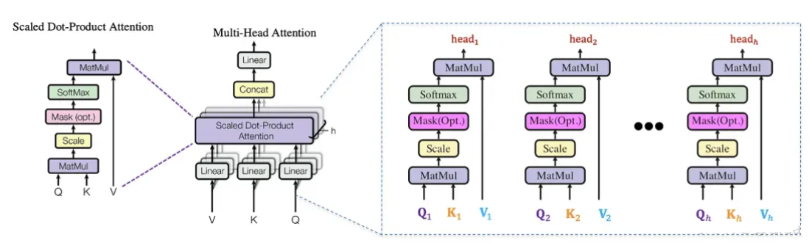

  3. 前馈网络(FFN)和层归一化(Layer Norm)：每个Transformer层包括应用于每个标记的前馈网络，以及层归一化和残差连接。这些稳定了训练并支持更深的架构。

  4. 位置编码：由于Transformers本身不编码标记顺序，因此添加了位置编码（位置和频率的正弦函数）以表示词序，在不牺牲并行化的情况下保留顺序信息。

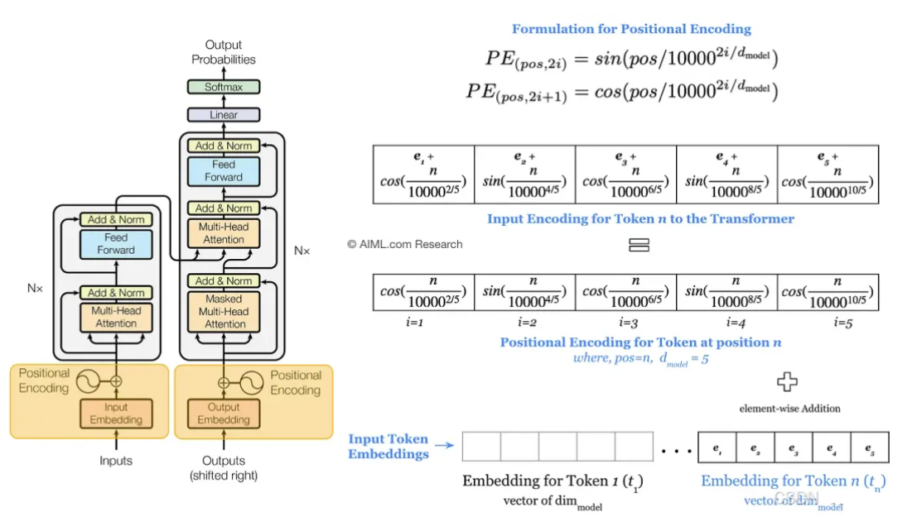

## 2.2 对语言建模的影响

  * 可扩展性：Transformers实现了**完全并行化的计算**，`使得在大型数据集上训练大规模模型成为可能`。
  * 上下文理解：自注意力`捕捉局部和全局依赖关系`，提高了连贯性和上下文意识。

&nbsp;&nbsp;&nbsp;&nbsp;Transformer架构的引入为构建`以前所未有的精确性和灵活性处理复杂任务的大规模高效语言模型`奠定了基础。

## 3\. 预训练Transformer模型时代 (2018–2020)

&nbsp;&nbsp;&nbsp;&nbsp;2017年Transformer架构的引入为NLP的新时代铺平了道路，其特点是**预训练模型**的兴起和对**扩展**的前所未有的关注。这一时期见证了两个有影响力的模型家族的出现：`BERT和GPT`，它们展示了大规模**预训练和微调**范式的强大功能。<br>

## 3.1. BERT：双向上下文理解 (2018)

&nbsp;&nbsp;&nbsp;&nbsp;2018年，谷歌推出了**BERT（Bidirectional Encoder Representations from
Transformers）** ，这是一种使用Transformer编码器(Encoder)的突破性模型，`在广泛的NLP任务中取得了最先进的性能`。与之前单向处理文本（从左到右或从右到左）的模型不同，BERT采用了`双向训练方法`，使其能够同时**从两个方向捕获上下文**。通过生成深层次的、上下文丰富的文本表示，`BERT在文本分类、命名实体识别（NER）、情感分析等语言理解任务中表现出色`。

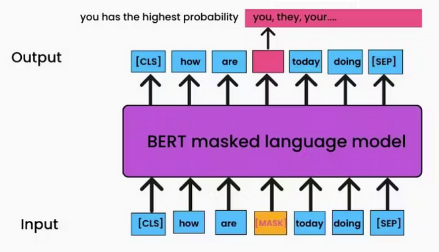

&nbsp;&nbsp;&nbsp;&nbsp;BERT的关键创新包括：<br>

  * **掩码语言建模**（Masked Language Modeling — MLM）：BERT不是预测序列中的下一个词，而是被训练预测句子中随机掩码的标记。这迫使模型在进行预测时考虑整个句子的上下文 — — 包括前后词语。例如，给定句子“The cat sat on the [MASK] mat”，BERT会学习根据周围上下文预测“soft”。
  * **下一句预测**（Next Sentence Prediction — NSP）：除了MLM之外，BERT还接受了称为下一句预测的次要任务训练，其中模型学习预测两个句子是否在文档中连续。这帮助BERT在需要理解句子之间关系的任务中表现出色，例如问答和自然语言推理。

&nbsp;&nbsp;&nbsp;&nbsp;BERT的影响：BERT的双向训练使其在GLUE（通用语言理解评估）和SQuAD（斯坦福问答数据集）等基准测试中取得了突破性的表现。它的成功证明了上下文嵌入的重要性— — 这些**表示**根据`周围词语`动态变化 — — 并为新一代预训练模型铺平了道路。

## 3.2 GPT：生成式预训练和自回归文本生成（2018–2020）

&nbsp;&nbsp;&nbsp;&nbsp;虽然BERT优先考虑双向上下文理解，但OpenAI的GPT系列采用了不同的策略，`专注于通过自回归预训练实现生成能力`。通过利用Transformer的解码器(**Decoder**)，GPT模型`在自回归语言模型和文本生成方面表现出色`。**GPT(2018)** GPT的第一个版本于2018年发布，是一个大规模的Transformer模型，经过训练以预测序列中的下一个词，类似于传统语言模型。

  - **单向自回归训练**：GPT使用`因果语言建模`目标进行训练，其中模型仅基于前面的token预测下一个token。这使得它特别适合于**生成式任务**，如`文本补全、摘要生成和对话生成`。
  - **下游任务的微调**：GPT的一个关键贡献是它能够在不需要特定任务架构的情况下针对特定下游任务进行微调。只需添加一个分类头或修改输入格式，GPT就可以适应诸如情感分析、机器翻译和问答等任务。

**举例** <br>
```shell
情感分析：
输入：“这篇电影评论的情感是积极的还是消极的？评论：这部电影太棒了！”
输出：“积极”

机器翻译：
输入：“将英文翻译为中文：Hello, how are you?”
输出：“你好，最近怎么样？”

问答：
输入：“问题：珠穆朗玛峰的高度是多少？上下文：珠穆朗玛峰海拔8848.86米。”
输出：“8848.86米”
```

**GPT-2 (2019)**
&nbsp;&nbsp;&nbsp;&nbsp;在原版GPT的成功基础上，OpenAI发布了GPT-2，这是一个参数量达15亿的更大模型。GPT-2展示了令人印象深刻的零样本(Zero-
shot)能力，意味着它可以在没有任何特定任务微调的情况下执行任务。例如，它可以生成连贯的文章、回答问题，甚至在语言之间翻译文本，尽管没有明确针对这些任务进行训练。

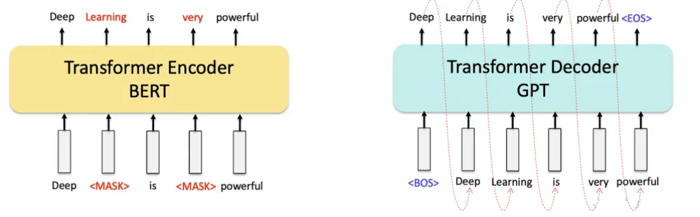

| 模型 | GPT1 | GPT2 | GPT3 | GPT4 |
| --- | --- | --- | --- | --- |
| 参数 | 117M | 1.5B | 175B | 1.8T |

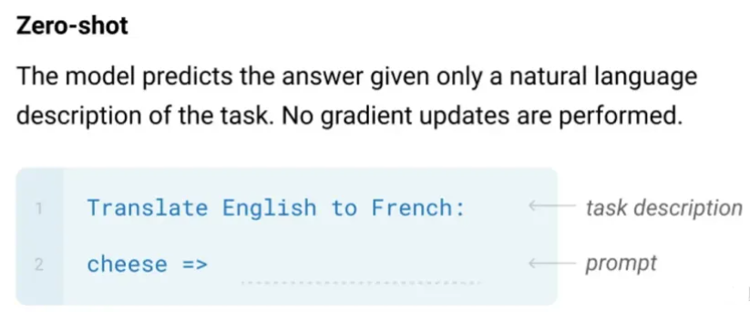

&nbsp;&nbsp;&nbsp;&nbsp;**GPT-3 (2020)** GPT-3的发布标志着语言模型规模扩展的一个转折点。凭借惊人的1750亿参数(175B parameters)，GPT-3突破了大规模预训练的可能性界限。它展示了显著的**少样本(Few-short)和零样本(Zero-short)学习能力**，在推理时只需提供最少或无需示例即可执行任务。GPT-3的生成能力`扩展到了创意写作、编程和复杂推理任务，展示了超大模型的潜力`。

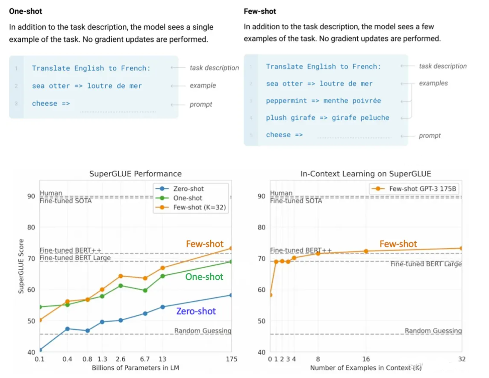


## 3.3 GPT的影响及规模的作用

&nbsp;&nbsp;&nbsp;&nbsp;GPT模型的引入，特别是GPT-3，标志着AI的一个变革时代，展示了`自回归架构和生成能力的强大功能`。这些模型为内容创作、对话代理和自动推理等应用开辟了新的可能性，在广泛的任务中达到了接近人类的表现。GPT-3凭借其1750亿参数证明了规模的深远影响，表明在大规模数据集上训练的更大模型可以树立新的AI能力标杆。

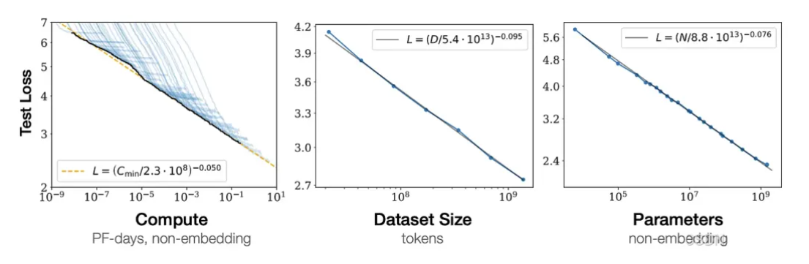

> 语言建模性能随着**模型大小、数据集大小和训练使用的计算量**的增加而平稳提升。https://arxiv.org/pdf/2001.08361

&nbsp;&nbsp;&nbsp;&nbsp;在2018年至2020年间，该领域由**对规模的不懈追求**驱动。研究人员发现，随着模型规模的增长 — — 从数百万到数十亿参数 — —它们在`捕捉复杂模式和泛化到新任务方面变得更好`。这种规模效应得到了三个关键因素的支持：

  * **数据集大小**：更大的模型需要庞大的数据集进行`预训练`。例如，GPT-3是在大量互联网文本语料库上进行训练的，使其能够学习多样化的语言模式和知识领域。
  * **计算资源**：强大的硬件（如GPU和TPU）的可用性以及分布式训练技术，使得高效训练具有数十亿参数的模型成为可能。
  * **高效架构**：混合精度训练和梯度检查点等创新降低了计算成本，使得在合理的时间和预算内进行大规模训练更加实际。

&nbsp;&nbsp;&nbsp;&nbsp;这个规模扩展的时代不仅提升了语言模型的性能，还为未来的AI突破奠定了基础，强调了规模、数据和计算在实现最先进结果中的重要性。

# 4\. 后训练对齐：弥合AI与人类价值观之间的差距 (2021–2022)

&nbsp;&nbsp;&nbsp;&nbsp;GPT-3（一个拥有1750亿参数的LLM）生成几乎无法与人类写作区分的文本的能力引发了关于AI生成内容的真实性和可信度的重大担忧。尽管这一成就标志着AI发展的一个重要里程碑，但也突显了确保这些模型与人类价值观、偏好和期望保持一致的关键挑战。一个主要问题是「幻觉」（Hallucination），即**LLM生成与事实不符、无意义或与输入提示矛盾的内容**，给人一种「`一本正经地胡说八道`」的印象。为了解决这些挑战，`2021年和2022年的研究人员专注于改善与人类意图的一致性并减少幻觉`，导致了**监督微调(SFT)** 和基于人类反馈的**强化学习(RLHF)** 等技术的发展。<br>

## 4.1 监督微调 (SFT)

&nbsp;&nbsp;&nbsp;&nbsp;增强GPT-3 **对齐能力**的第一步是监督微调（SFT），这是**RLHF框架**的基础组成部分。SFT类似于指令调优，涉及在`高质量的输入-输出对或演示上训练模型`，以教它如何遵循指令并生成所需的输出。

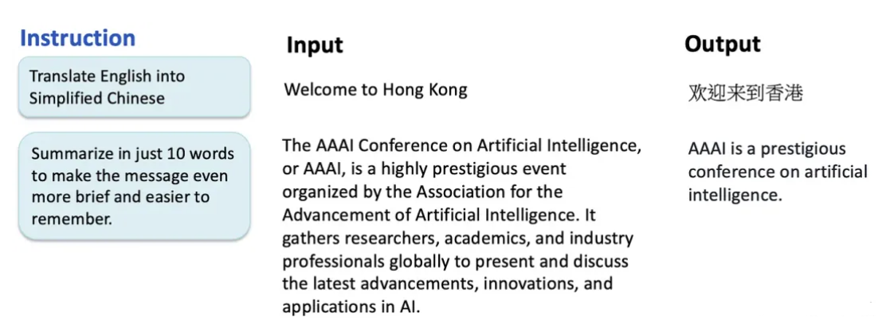

&nbsp;&nbsp;&nbsp;&nbsp;这些演示经过精心策划，以反映预期的行为和结果，确保模型学会生成准确且符合上下文的响应。

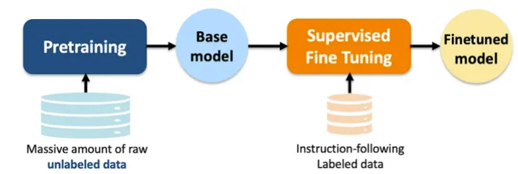

然而，SFT本身有局限性：

  1. 可扩展性：收集人类演示是**劳动密集型且耗时**的，尤其是对于复杂或小众任务。
  2. 性能：简单模仿人类行为并**不能保证模型会超越人类表现或在未见过的任务上很好地泛化**。

&nbsp;&nbsp;&nbsp;&nbsp;为了克服这些挑战，需要一种更具可扩展性和效率的方法，为下一步铺平了道路：**基于人类反馈的强化学习**（Reinforcement Learning from Human Feedback — RLHF）。

## 4.2 基于人类反馈的强化学习 (RLHF)

&nbsp;&nbsp;&nbsp;&nbsp;OpenAI在2022年引入的**RLHF解决了SFT的可扩展性和性能限制**。与需要人类编写完整输出的SFT不同，RLHF涉及`根据质量对多个模型生成的输出进行排名`。这种方法允许更高效的数据收集和标注，显著增强了可扩展性。

**RLHF过程包括两个关键阶段：**

  1. 训练奖励模型：人类注释者`对模型生成的多个输出进行排名`，创建一个偏好数据集。这些数据用于训练一个**奖励模型(reward model)**，该模型学习`根据人类反馈评估输出的质量`。
  2. 使用强化学习微调LLM：奖励模型使用**近端策略优化（Proximal Policy Optimization - PPO）（一种强化学习算法）** 指导LLM的微调。通过迭代更新，模型学会了`生成更符合人类偏好和期望的输出`。

这个两阶段过程 — — **结合SFT和RLHF** — —使模型不仅能够准确遵循指令，还能`适应新任务并持续改进`。通过将人类反馈整合到训练循环中，RLHF显著增强了模型生成可靠、符合人类输出的能力，为AI对齐和性能设定了新标准。

## 4.3 ChatGPT：推进对话式AI (2022)

&nbsp;&nbsp;&nbsp;&nbsp;2022年3月，OpenAI推出了GPT-3.5，这是GPT-3的升级版，**架构相同但训练和微调有所改进**。关键增强包括通过改进数据更好地遵循指令，`减少了幻觉（尽管未完全消除），以及更多样化、更新的数据集，以生成更相关、上下文感知的响应。`

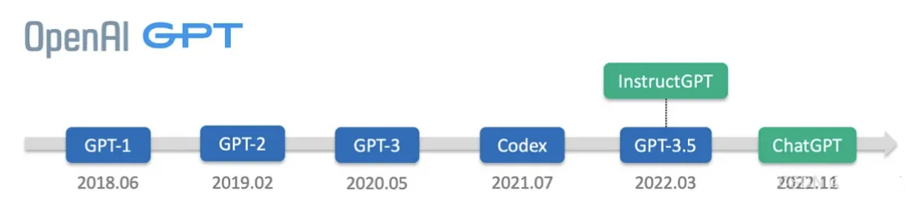

**ChatGPT:** <br>
基于**GPT-3.5和InstructGPT**，OpenAI于2022年11月推出了ChatGPT，这是一种突破性的`对话式AI模型`，专门**为自然的多轮对话进行了微调**。ChatGPT的关键改进包括：

  - **对话聚焦的微调**：在大量**对话数据集上**进行训练，ChatGPT擅长`维持对话的上下文和连贯性`，实现更引人入胜和类似人类的互动。
  - **RLHF**：通过整合RLHF，ChatGPT学会了生成`不仅有用而且诚实和无害的响应`。人类培训师根据质量**对响应进行排名**，使模型能够逐步改进其表现。

**ChatGPT的推出标志着AI的一个关键时刻，通常被称为「ChatGPT时刻」(ChatGPT moment)，因为它展示了对话式AI改变人机交互的潜力。**

# 5\. 多模态模型：连接文本、图像及其他 (2023–2024)

&nbsp;&nbsp;&nbsp;&nbsp;在2023年至2024年间，像GPT-4V和GPT-4o这样的多模态大型语言模型（MLLMs:Multimodal Large Language Models）通过将文本、图像、音频和视频整合到统一系统中重新定义了AI。这些模型扩展了传统语言模型的能力，实现了更丰富的交互和更复杂的问题解决。<br>


## 5.1 GPT-4V：视觉遇见语言

&nbsp;&nbsp;&nbsp;&nbsp;2023年，OpenAI推出了GPT-4V，将GPT-4的**语言能力**与先进的**计算机视觉**相结合。它可以`解释图像、生成标题、回答视觉问题，并推断视觉中的上下文关系`。其跨模态注意力机制允许文本和图像数据的无缝集成，使其在医疗保健（如分析医学图像）和教育（如互动学习工具）等领域具有价值。


## 5.2 GPT-4o：全模态前沿

&nbsp;&nbsp;&nbsp;&nbsp;到2024年初，GPT-4o通过整合音频和视频输入进一步推进了多模态。它在一个统一的表示空间中运行，可以转录音频、描述视频或将文本合成音频。实时交互和增强的创造力
— — 如生成多媒体内容 — — 使其成为娱乐和设计等行业的多功能工具。


&nbsp;&nbsp;&nbsp;&nbsp;现实世界的影响: MLLMs革新了医疗保健（诊断）、教育（互动学习）和创意产业（多媒体制作）等领域。它们处理多种模态的能力解锁了创新的新可能性。

# 6\. 开源和开放权重模型 (2023–2024)

&nbsp;&nbsp;&nbsp;&nbsp;在2023年至2024年间，**开源和开放权重AI模型获得了动力，使先进AI技术的访问民主化。**

  * **开放权重LLMs** ：开放权重模型提供公开访问的模型权重，限制极少。这使得微调和适应成为可能，**但架构和训练数据保持封闭**。它们适合快速部署。例子：Meta AI的LLaMA系列和Mistral AI的Mistral 7B / Mixtral 8x7B
  * **开源LLMs** ：开源模型使底层代码和结构公开可用。这允许全面理解、修改和定制模型，促进创新和适应性。例子：OPT和BERT。
  * **社区驱动的创新** ：像**Hugging Face**这样的平台促进了协作，`LoRA和PEFT等工具使高效的微调成为可能`。

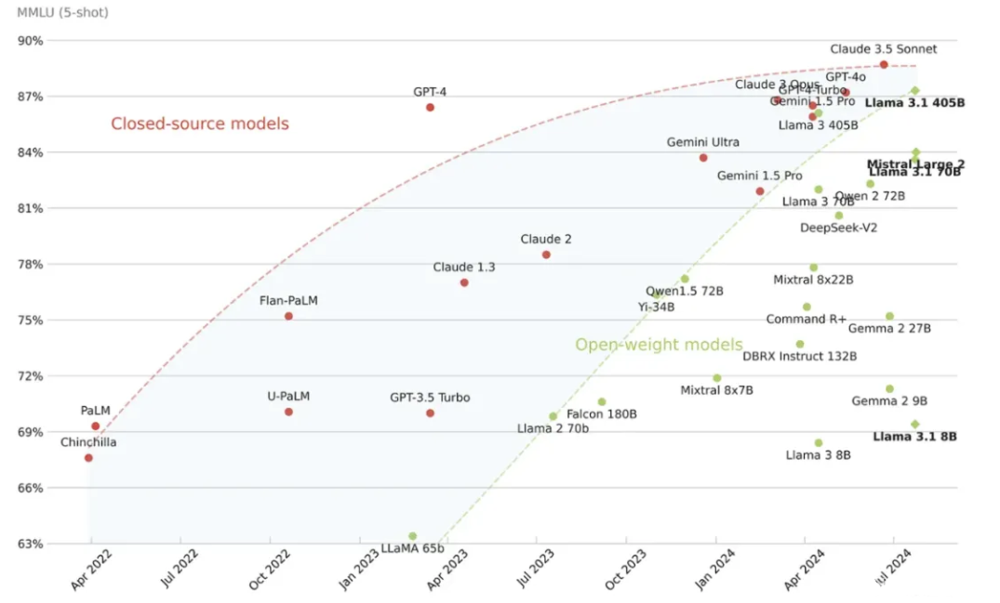

  &nbsp;&nbsp;&nbsp;&nbsp;社区开发了专门针对医疗、法律和创意领域的模型，同时优先考虑道德AI实践。开源社区目前处于一个激动人心的阶段，得益于尖端对齐技术的出现。这一进展导致越来越多的卓越开放权重模型发布。因此，闭源和开放权重模型之间的差距正在稳步缩小。**LLaMA3.1–405B模型首次历史性地弥合了与闭源对应物的差距**。

**逆向工程反推llama架构**
```shell
Hugging Face 团队实现了与 LLaMA 兼容的模型类（LlamaForCausalLM），关键步骤包括：<br>

1. 解析权重文件结构，确定各层维度。

2. 对齐 RoPE 实现：根据 LLaMA 的生成效果调整位置编码计算方式。

3. 发布配置文件：提供标准化的 config.json，用户可直接加载权重。
```

**7\. 推理模型：从「系统1」到「系统2」思维的转变 (2024)**

&nbsp;&nbsp;&nbsp;&nbsp;2024年，AI开发开始强调**增强「推理」(Reasoning**)**，从简单的模式识别转向更逻辑化和结构化的思维过程。这一转变受到认知心理学双重过程理论的影响，`区分了「系统1」（快速、直觉）和「系统2」（缓慢、分析）思维`。虽然像GPT-3和GPT-4这样的早期模型在生成文本等「系统1」任务上表现出色，但`在深度推理和问题解决方面却有所欠缺`。<br>

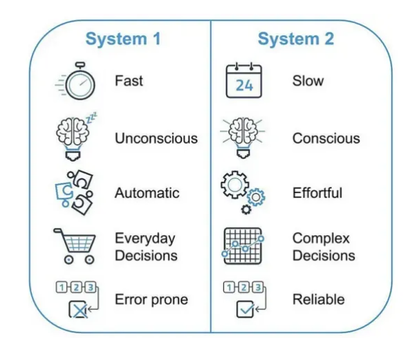

> 「系统1」与「系统2」思维

## 7.1 OpenAI-o1：推理能力的一大飞跃(2024)

&nbsp;&nbsp;&nbsp;&nbsp;OpenAI于2024年12月发布的o1模型旨在提高AI的推理能力，特别是在代码生成和调试等复杂任务上表现出色。o1模型的一个关键特征是通过 **「思维链」(Chain of Thought－CoT)过程**增强推理能力，使其能够将复杂问题分解为更小、更易管理的步骤。

**推理时间计算与能力**

  * **思维链**：o1模型在提供答案之前花费额外时间「思考」（thinking)，通过生成思维链来增强复杂推理，特别是在科学和数学领域。模型的准确性与在回答前用于思考的计算量的对数相关。
  * **o1模型套件包括**: o1、o1-mini和o1 pro。o1-mini比o1-preview更快且更具成本效益，适用于编程和STEM相关任务，尽管它缺乏o1-preview的广泛世界知识。
  * **性能**：o1-preview在物理、化学和生物学的基准测试中达到了大约博士水平的表现。在美国数学邀请赛中，它解决了83%的问题，相比之下GPT-4o解决了13%。它还在Codeforces编程竞赛中排名在第89百分位。

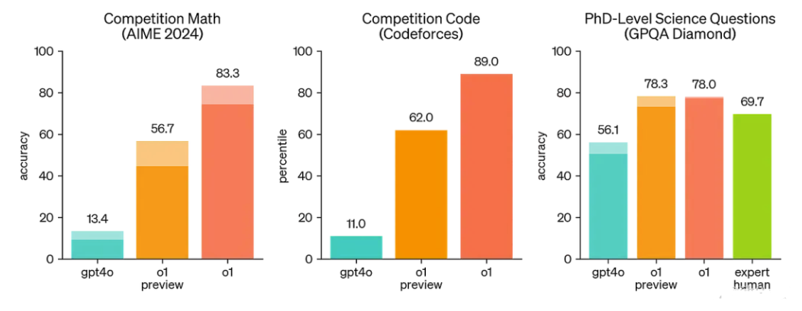


  `OpenAI-o1的发布标志着AI开发的一个关键时刻，展示了结合生成和推理能力创造能够像人类一样思考和行动的模型的潜力`。随着该领域的不断发展，**推理模型有望解锁AI的新前沿**，使机器能够应对人类面临的最具挑战性的问题。

**8\. 成本高效的推理模型：DeepSeek-R1 (2025)**

&nbsp;&nbsp;&nbsp;&nbsp;LLMs通常需要极其庞大的计算资源来进行训练和推理。像GPT-4o和OpenAI-o1这样的最先进LLM模型的闭源性质限制了对尖端AI的「普及化」。

## 8.1 DeepSeek-V3 (2024–12)

&nbsp;&nbsp;&nbsp;&nbsp;2024年12月下旬，「深度求索-V3」(DeepSeek-V3)作为一种成本高效的开放权重LLM出现，为AI的可访问性设定了新标准。DeepSeek-V3与OpenAI的ChatGPT等顶级解决方案相媲美，但开发成本显著降低，估计约为**560万美元**，仅为西方公司投资的一小部分。该模型最多包含**6710亿个参数**，其中**370亿个活跃参数**，并采用**专家混合（MoE）架构**，将模型划分为专门处理数学和编码等任务的组件，以减轻训练负担。DeepSeek-V3采用了工程效率，例如改进Key-Value缓存管理和进一步推动专家混合方法。该模型引入了三个关键架构：

  * **多头潜在注意力**（Multi-head Latent Attention — MLA）：通过压缩注意力键和值来减少内存使用，同时保持性能，并通过旋转位置嵌入（RoPE）增强位置信息。
  * **DeepSeek专家混合（DeepSeekMoE）**：在前馈网络（FFNs）中采用共享和路由专家的混合，以提高效率并平衡专家利用率。
  * **多标记预测** (Multi-Token Prediction — MTP)：`增强模型生成连贯且上下文相关的输出的能力，特别是对于需要复杂序列生成的任务`。

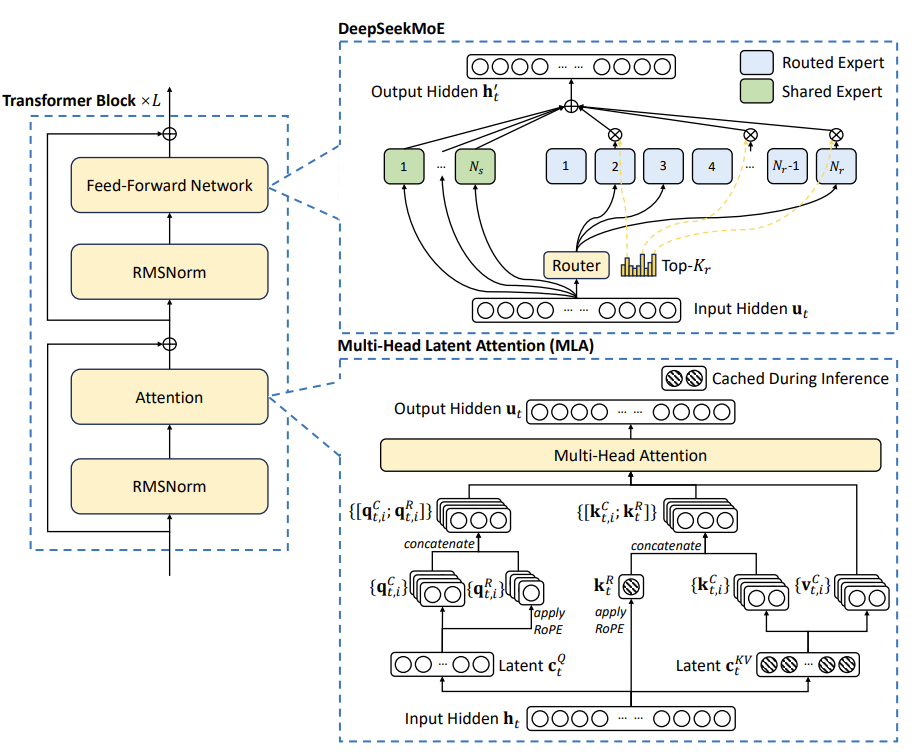

&nbsp;&nbsp;&nbsp;&nbsp;DeepSeek-V3的发布引发了全球科技抛售，危及1万亿美元的市值，并导致英伟达股票盘前下跌13%。DeepSeek-V3的价格为每百万输出标记2.19美元，约为OpenAI类似模型成本的1/30。

## 8.2 DeepSeek-R1-Zero 和 DeepSeek-R1 (2025–01)

&nbsp;&nbsp;&nbsp;&nbsp;仅仅一个月后，2025年1月下旬，DeepSeek通过发布DeepSeek-R1-Zero和DeepSeek-R1再次引起轰动，这些模型展示了**卓越的推理能力，训练成本极低**。利用`先进的强化学习技术，这些模型证明了高性能推理可以在没有通常与尖端AI相关的巨额计算费用的情况下实现`。这一突破巩固了DeepSeek作为高效和可扩展AI创新领导者的地位。

  * **DeepSeek-R1-Zero**：一种基于DeepSeek-V3的推理模型，通过强化学习（RL）增强其推理能力。它完全消除了「监督微调」(SFT)阶段，直接从名为DeepSeek-V3-Base的预训练模型开始。它采用了一种基于「规则的强化学习方法」(Rule-based Reinforcement Learning)，称为「组相对策略优化」（Group Relative Policy Optimization — GRPO），根据预定义规则计算奖励，使训练过程更简单且更具可扩展性。

  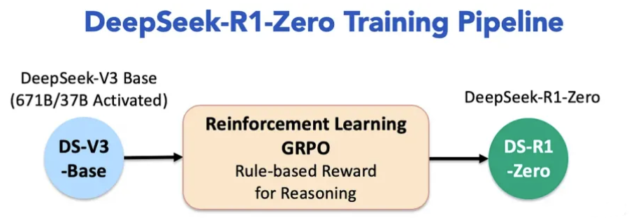

  * **DeepSeek-R1**：为了解决DeepSeek-R1-Zero的局限性，如低可读性和语言混杂，DeepSeek-R1纳入了一组有限的高质量冷启动数据和额外的RL训练。该模型经历了多个微调和RL阶段，包括拒绝采样和第二轮RL训练，以提高其通用能力和与人类偏好的一致性。

  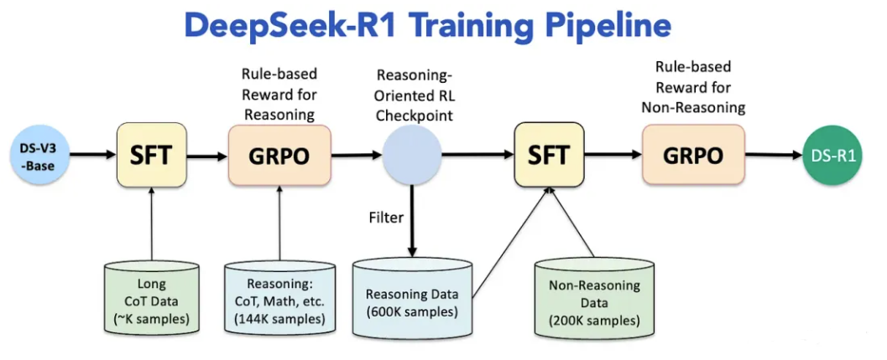

  * **蒸馏DeepSeek模型**：DeepSeek开发了较小的、蒸馏版的DeepSeek-R1，参数范围从15亿到700亿，将先进的推理能力带到较弱的硬件上。这些模型使用原始DeepSeek-R1生成的合成数据进行微调，确保在推理任务中表现出色，同时足够轻量化以便本地部署。

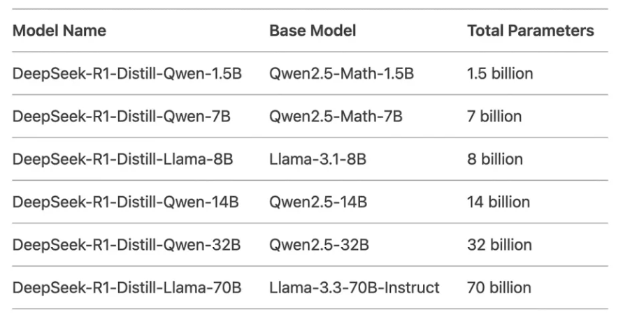

> DeepSeek 蒸馏DeepSeek模型

&nbsp;&nbsp;&nbsp;&nbsp;DeepSeek-R1在各种基准测试中表现出竞争力，包括数学、编码、常识和写作。根据使用模式，它相比OpenAI的o1模型等竞争对手提供了显著的成本节省，使用成本便宜20到50倍。

  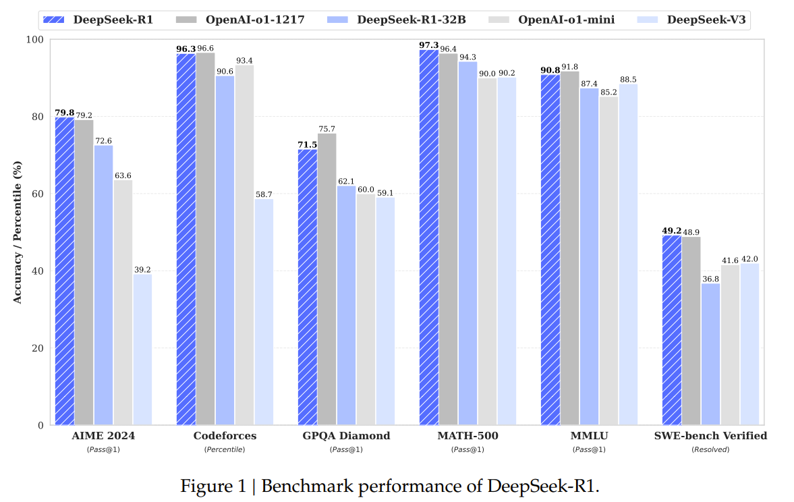


### **8.3 对AI行业的影响**

&nbsp;&nbsp;&nbsp;&nbsp;DeepSeek-R1的引入`挑战了AI领域的既定规范`，使先进LLMs得以「普及化」，并促进了一个更具竞争力的生态系统。其可负担性和可访问性预计将推动各行各业的采用和创新增加。最近，领先的云服务提供商如AWS、微软和谷歌云已在其平台上提供DeepSeek-R1。较小的云提供商和DeepSeek母公司以竞争性定价提供它。

**结论**

从2017年Transformer架构的引入到2025年DeepSeek-R1的发展，大型语言模型（LLMs）的演变标志着人工智能领域的一个革命性篇章。LLMs的崛起由四个里程碑式的成就标示：

  * **Transformers (2017)**：Transformer架构的引入为构建能够以前所未有的精确性和灵活性处理复杂任务的大规模高效模型奠定了基础。
  * **GPT-3 (2020)**：该模型展示了规模在AI中的变革力量，证明了在大规模数据集上训练的巨大模型可以在广泛的应用中实现接近人类的表现，为AI所能完成的任务设立了新的基准。
  * **ChatGPT (2022)**：通过将对话式AI带入主流，ChatGPT使高级AI对普通用户来说更加可访问和互动。它还引发了关于广泛采用AI的伦理和社会影响的关键讨论。
  * **DeepSeek-R1 (2025)**：代表了成本效率的一大飞跃，DeepSeek-R1利用专家混合架构(MoE)和优化算法，与许多美国模型相比，运营成本降低了多达50倍。其开源性质加速尖端AI应用的普及化，赋予各行业创新者权力，并强调了可扩展性、对齐性和可访问性在塑造AI未来中的重要性


