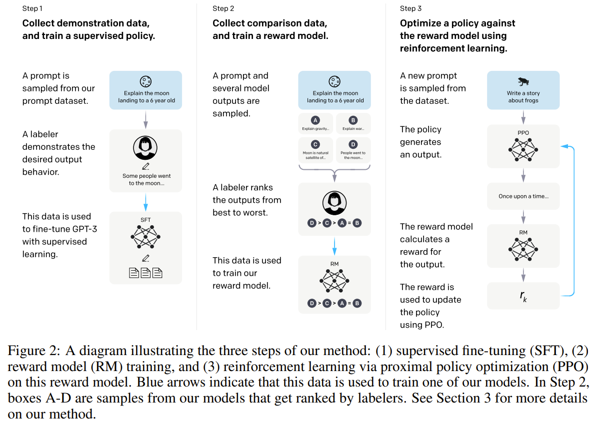
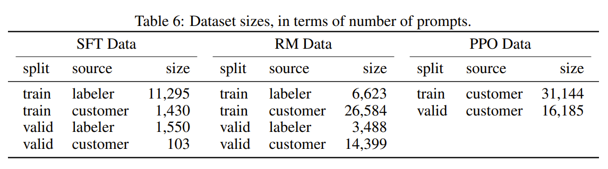
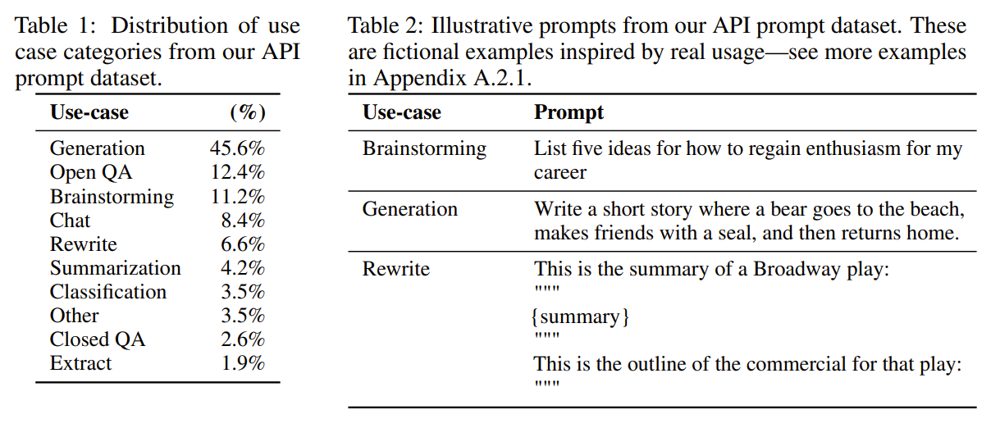
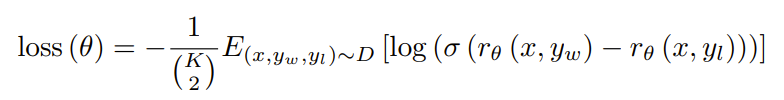
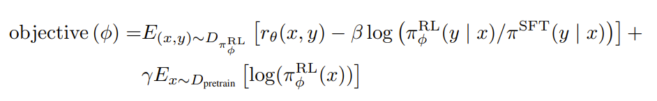
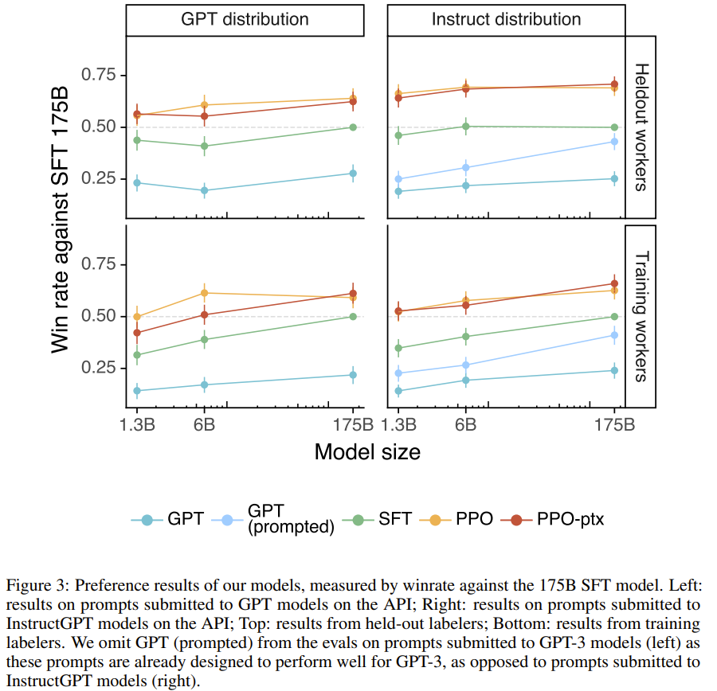
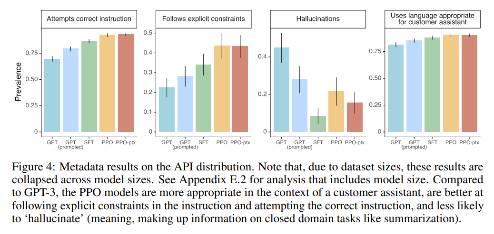
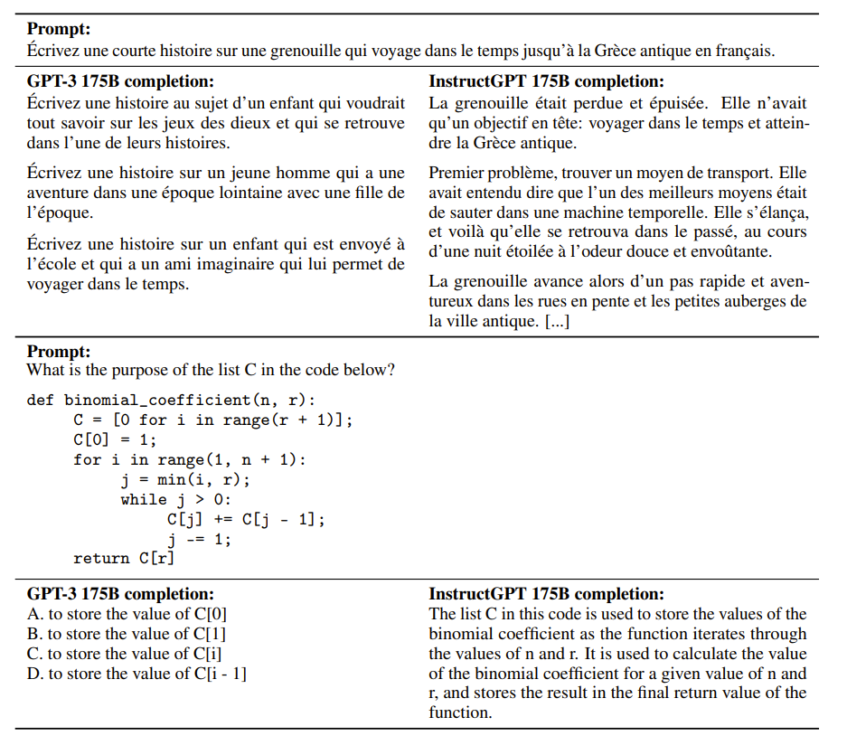
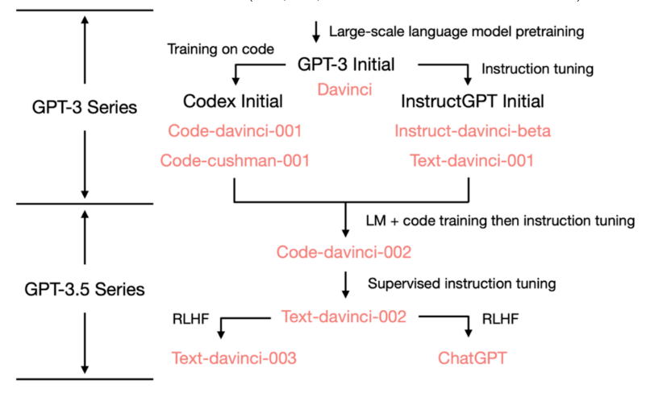
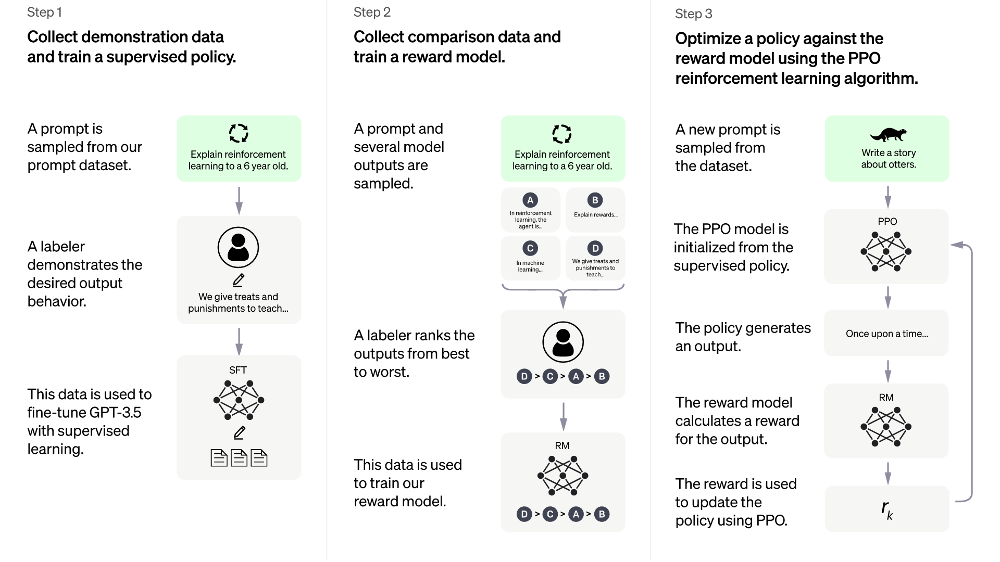

# 0 gpt3之前NLP领域的训练范式

NLP自发展以来，先后经历了4种任务处理范式

**第一种范式**，非神经网络时代的完全监督学习(Fully Supervised Learning, Non-Neural Network)
具体而言，即手工设计一系列特征模板，来输入模型。模型对任务的处理结果高度依赖于特征模板的设计，同时也高度依赖领域专家的知识。举个例子，比如对于条件随机场CRF模型，业界甚至有一个专门的库CRF++帮助自动生成大量的随机模板然后输入模型进行训练，从而避免对领域专家的过度依赖.  

**第二范式**，基于神经网络的完全监督学习(Fully Supervised Learning, Neural Network)
神经网络学派开始流行以后，处理范式基本基本是预训练后的词嵌入表征 + 模型架构的调整，在这个时期，一方面的工作在词嵌入上，比如NNLM/CBOW/SKIP/GRAM/GLOVE/ELMO等，另一方面的工作则在模型架构上，比如BI-LSTM/SEQ2SEQ架构在神经机器翻译领域NMT的应用等.  

**第三范式**，预训练-微调范式 (Pre-train、Fine-tune)
相比于第二范式而言，第三范式的优点在于更进一步减少了人工的参与，不再需要对于每个任务采取不同的模型架构，而是在超大的文本数据集上预训练一个具备泛化能力的通用的模型，然后再根据下游任务本身的特点对模型进行针对性的微调即可，使得一个模型解决多种任务成为可能，比如GPT1模型. 

**第四范式**，预训练、提示、预测范式(Pre-train、Prompt、Predict)
在这个过程我们往往不对预训练语言模型改动太多，我们希望是通过对合适prompt的利用将下游任务建模的方式重新定义，这则是GPT2、GPT3的特点.  

> 往后该如何发展呢？ 还有更进一步的训练范式吗？

# 1. InstructGPT论文精读：大模型调教之道

- [论文链接](https://arxiv.org/pdf/2203.02155.pdf)
- [参考连接](https://juejin.cn/post/7288624193956216869)

**ChatGPT采用了与InstructGPT相同的方法，只是在数据集在些许差异。** 如下所示是ChatGPT在OpenAI官网上的介绍：

>   * **ChatGPT is a sibling model to InstructGPT** , which is trained to
> follow an instruction in a prompt and provide a detailed response.
>   * We trained this model using Reinforcement Learning from Human Feedback
> (RLHF), **using the same methods as InstructGPT** , but with slight
> differences in the data collection setup.
>

因此，今天我们将跟随论文一起深入了解InstructGPT的细节，以便对ChatGPT背后的技术有一个更加清晰的认知。

>   * 论文： Training language models to follow instructions with human feedback
>
>   * 模型参数： 1750亿
>
>   * 公司/机构： OpenAI
>
>

# 摘要

**语言模型的规模增大并不能保证其更好地遵循用户的意图。** 较大规模的语言模型可能会产生不真实、有害或对用户毫无用处的输出，与用户意图背道而驰。

为了解决这一问题，研究人员通过使用人类反馈，使语言模型在各种任务中能够与用户意图保持一致。首先，**通过收集标注员编写或OpenAI
API提交的prompts来微调GPT-3以满足所需行为** 。接着，**利用人类对模型输出进行排序的数据集，采用强化学习进行进一步微调**
，最终形成了`InstructGPT`模型。

人类评估结果显示，**相较于具有1750亿参数的GPT-3模型，InstructGPT模型在参数量减少100倍的情况下，其输出也更受欢迎。**
此外，InstructGPT在生成真实性方面有所提高，并减少了生成有害输出的情况。

# 研究动机

语言模型往往会出现意想不到的行为，如虚构事实、生成带有偏见或有害文本、不遵循用户指令等。这是因为**模型的语言建模目标与安全遵循用户指令的目标不一致。**

因此，研究者们努力通过训练来保证语言模型满足用户期望，包括**有帮助、诚实、无害**
等要求。这有助于避免部署和使用这些模型时出现意外行为，从而保证其安全性和可靠性。

InstructGPT正是在这一背景下的产物。

# InstructGPT模型调教流程

InstructGPT的调教过程主要有以下三个步骤：

**Step1：有监督微调（SFT）。** 在人工标注的prompts数据集上对预训练好的GPT-3进行微调。

**Step2：训练奖励模型（RM）。**
收集了一系列语言模型输出结果的排序数据集。具体而言，对于给定的提示（prompt），语言模型生成了多个输出，然后由标注员对这些输出进行排序。接下来，我们使用这些排序数据集进行训练，构建了一个奖励模型，可以预测人类对输出结果的偏好排序。

**Step3：使用强化学习优化奖励模型。** 具体而言，使用PPO算法（Proximal Policy
Optimization）对奖励模型进行训练，其输出是一个标量值。

Step2和Step3可以连续迭代进行。可以利用当前最佳策略，不断收集更多排序数据，用于训练新的奖励模型。**在InstructGPT中，大部分的排序数据集来自人工标注，同时有一部分来自PPO策略。**

## 数据集

InstructGPT的三个训练步骤分别对应**SFT数据集、RM数据集和PPO数据集，** 数据集超过96％都是英文。

三个数据集的大小如Table 6所示：

InstructGPT的训练数据主要来自以下两个途径：

**1\. 来自OpenAI API的Prompts。**
根据用户ID生成了训练、验证和测试数据集。为确保数据的质量，对数据进行了去重处理，并限制每个用户ID提交的Prompts数量不超过200
条。同时，在筛选训练数据时，严格排除了可能包含个人可识别信息（PII）的Prompts，以确保客户信息的安全性。

**2\. 标注员编写的Prompts数据集。**
标注员编写的数据集主要包含三种类型，分别为通用Prompts、少样本Prompts和基于用户需求的Prompts。通用Prompts要求多样性的任务，少样本Prompts则提供指令及对应查询响应。针对提交给OpenAI
API等候列表的使用案例，我们要求标注员提供与之相应的Prompts。

Table 1中展示了RM数据集的类别分布，可以看到，**这些prompts非常多样化，包括生成、问答、对话、摘要、提取和其他自然语言任务。** Table
2中展示了一些示例prompts。

## 模型结构及训练过程

**InstructGPT使用GPT-3作为预训练模型，** 并使用以下三种技术进行微调：

`GPT-3精读可在我们的历史文章中找到！`

### 有监督微调（Supervised fine-tuning，SFT）

采用标注员人工标注的数据进行训练，训练`epoch`设置为16，并根据验证集上的RM分数选择最佳的SFT模型。

### 奖励建模（Reward modeling，RM）

把上一个步骤得到的SFT模型的最后一层unembedding layer移除，训练一个模型，这个模型接收一个问题`prompt`和回答`response`，然后输出一个标量`reward`。

**RM的大小仅为6B，** 一方面是这样可以有效节省计算资源，另一方面是作者发现175B的RM在强化学习中作为值函数训练不太稳定。

具体来说，**奖励模型的损失函数** 如下：

其中，$r_{θ}(x,y)$ 奖励模型对于prompt x和回答y的输出标量值，θ是参数。D是比较数据集。$y_w$ 是比 $y_l$ 排序位置更高的response，所以希望 $r_θ(x,y_w)$ 与 $r_θ(x,y_l)$ 的差值尽可能大。

### 强化学习（Reinforcement learning，RL）

**使用`PPO算法`对第一阶段训练的SFT模型进行微调。** 该模型接收一个问题prompt x，并生成一个回应y，将x和y输入到之前训练的奖励模型中，得到一个奖励分数，然后使用梯度下降法来更新模型策略。

此外，为了减轻奖励模型的过拟合问题，作者还在每个token上添加了来自**SFT模型的KL散度惩罚项** 。

为了解决在公共NLP数据集上性能退化的问题，作者**将预训练梯度与PPO梯度进行混合** ，形成了一种名为`PPO-ptx`的模型。

在强化学习训练中，作者致力于最大化以下目标函数：

其中，$π^{RL}_{Φ}$ 是学习到的强化学习策略。$π^{SFT}$ 是第一阶段有监督训练的SFT模型。$D_{pretrain}$是预训练分布。KL奖励系数β和预训练损失系数γ分别控制了KL惩罚和`预训练梯度`的强度。

**第二项目标函数中包含一个KL散度惩罚项** ，这是因为在训练奖励模型时，y数据来自于SFT模型。然而在进行推理任务时，y数据来自于新的强化学习策略模型。

训练过程中，随着模型策略的更新，新模型生成的y可能会偏离该奖励模型训练时输入的y，从而导致奖励模型的估计不太准确。

为了解决这个问题，引入了KL散度惩罚项。**KL散度惩罚项的作用是希望强化学习新模型输出的y的概率分布不与SFT模型输出的y的概率分布有太大差异。**

**第三项目标函数的目的是避免仅在新数据集上表现良好，而在原始GPT3预训练数据集上表现下降。**
为此，在使用新数据训练的同时，也采样了部分原始GPT3的训练数据，其中γ参数控制了倾向于使用原始数据集的程度。

## 实验结果

Figure 3展示了各种模型在OpenAI
API提交的数据集上的人类评估结果。评估标准是衡量每个模型输出相对于拥有1750亿参数的SFT模型更受欢迎的频率。

InstructGPT模型（`PPO-
ptx`）以及其未进行预训练梯度混合的变体（`PPO`）在这个评估中表现出明显的优势，超越了GPT-3的基准模型（`GPT`、`GPT
prompted`）。从图中可以发现，**经过新的数据集微调和强化学习训练后，即使是1.3B的模型表现也好于GPT-3和只经过微调的GPT-3。**

当使用不同来源的数据集进行测试时，Instruct GPT都表现了相同的优势。具体见Figure 4。

**InstructGPT模型在未经过RLHF微调的指令上展现了出色的泛化能力，尤其是在处理非英语语言和代码相关指令时。**
值得一提的是，即使这些非英语语言和代码只占据了我们微调数据的一小部分。

在与175B PPO-ptx模型进行交互时，作者发现InstructGPT仍然会犯一些简单的错误。以下是InstructGPT犯下的一些错误行为：

**行为1：** 对于带有错误前提的指令，模型有时会错误地假设前提是真实的。

**行为2：** 模型有时过于谨慎，在面对一个简单问题时，它可能会表达出这个问题没有一个确切的答案，即使上下文已经明确表明答案。

**行为3：**
当指令中包含多个明确的约束条件（如：请列出20世纪30年代在法国拍摄的10部电影）或对语言模型来说有挑战性的限制时（如：用指定数量的句子写一篇摘要），模型的性能将下降。

Figure 9呈现了这些行为的一些示例。

对于行为1，作者认为其发生的原因是**训练集中很少包含错误前提的prompts** ，导致模型在这些情况下的泛化能力较弱。

对于行为2，作者怀疑其出现的部分原因是在标注者标注排序数据集时要求他们考虑到回答表达是否谦逊，因此，**他们可能更倾向于那些含糊其辞的输出，而这一偏好正是被奖励模型所学到**
。

当然，通过对抗性数据收集，这两种行为都有望得到显著减少。

# 写在最后

ChatGPT是InstructGPT的姊妹模型，**两者在技术路线的使用上完全一致**。本文详细总结了InstructGPT的技术原理，深度解析了OpenAI对大模型的调教之道。

# 2 从 GPT3 到 GPT3.5

据OpenAI官网对GPT3.5的介绍，GPT3.5从2021年第四季度开始就混合使用文本和代码进行训练，我们来看下GPT3.5的各个系列模型及其各自的发展演变脉络图.  

## 2.1 GPT3 + 代码训练 = Codex
2020 年5-6月，OpenAI先后发布了GPT3的论文《Language Models are Few-Shot Learners》。GPT-3的最大规模的版本——175B(1750亿参数)大小的API Davinci(有着2048个词的上下文窗口)，此时的GPT3还只能写一些简单的代码和做一些简单的数学题。

2021 年7月，OpenAI发布Codex的论文《Evaluating Large Language Models Trained on Code》，其中初始的Codex是根据120亿参数的GPT-3变体进行微调的，且通过对159GB的Python代码进行代码训练。后来这个120 亿参数的模型演变成OpenAI API中的code-cushman-001，具备较强的代码/推理能力。

代码能力好理解，通过大量的代码训练，但其推理能力是如何获取到的呢，其中关键在于很多代码是为了解决数学推理问题，训练中可以用『类似后续22年年初Google一些研究者定义的CoT技术』获取推理能力，当然，此时文本上的能力尚且偏弱。

## 2.2 GPT3 + 指令学习 + RLHF = instructGPT
上文第一部分已经提到过，根据OpenAI的这篇论文《Learning to summarize with human feedback (Stiennon et al., 2020)》可知，2020年OpenAI便在研究GPT3与RLHF的结合了，但此时还是会经常一本正经的胡说八道，且很容易输出负面甚至带有危害的内容(毕竟人类言论中存在不少不友好的言论).  

在OpenAI于2021年彻底加强Codex之后，终于有时间解决模型与人类对话的问题了，于是在2022年3月，OpenAI发布遵循人类指令学习的论文(指令学习可以认为就是指令微调instruct tuning)：Training language models to follow instructions with human feedback，这就是instructGPT，且把RLHF用得更好了
其核心API就是instruct-davinci-beta和text-davinci-001(当然，文本上的能力不错但代码/推理上的能力偏弱).

## 2.3 指令微调
深度学习中指令调优的主要作用是提升大语言模型（LLMs）的性能和可控性‌。指令调优通过有监督的方式在由（指令，输出）对组成的数据集上进一步训练大语言模型，旨在缩小LLMs的下一个标记预测目标与用户期望LLMs遵循人类指令的目标之间的差距‌。

**指令调优的具体作用**
1.‌ 提升模型性能‌：指令调优通过对模型进行微调，使其能够更好地理解并执行自然语言指令，从而提高模型的准确性和任务完成能力‌。 
‌2. 增强可控性‌：通过明确的指令数据集，模型可以学会根据指令调整输出，使得模型的输出更加符合用户的期望和需求‌。 
‌3. 提高零样本能力‌：经过指令调优的模型在新任务上的零样本学习能力显著增强，能够更好地理解和完成未见过的任务‌。 

**指令调优的实现过程**
指令调优的过程包括以下几个步骤：

‌准备指令数据‌：指令数据由指令、输入和输出三部分组成。指令是任务描述，输入是任务所需的输入内容，输出是任务的期望结果‌。

‌数据来源‌：指令数据可以通过人工构造、机器生成或利用现有数据集转化而来‌。

‌模型训练‌：在准备好的指令数据集上对LLMs进行微调，使其学会根据指令调整输出‌.

## 2.4 GPT3.5 功能总结

| 英文 | 中文 | 释义 |
| :--: | :--: | :--: |
| Emergent Ability | 突现能力 | 小模型没有，只在模型大到一定程度才会出现的能力 |
| Prompt | 提示词 | 把 prompt 输入给大模型，大模型给出 completion |
| In-Context Learning | 上下文学习 | 在 prompt 里面写几个例子，模型就可以照着这些例子做生成 |
| Instruction Tuning | 指令微调 | 用 instruction 来 fine-tune 大模型 |
| Code Tuning | 在代码上微调 | 用代码来 fine-tune 大模型 |
| Reinforcement Learning with Human Feedback (RLHF) | 基于人类反馈的强化学习 | 让人给模型生成的结果打分，用人打的分来调整模型 |
| Chain-of-Thought | 思维链 | 在写 prompt 的时候，不仅给出结果，还要一步一步地写结果是怎么推出来的 |
| Scaling Laws | 缩放法则 | 模型的效果的线性增长要求模型的大小指数增长 |
| Alignment | 与人类对齐 | 让机器生成复合人类期望的，复合人类价值观的句子 |

# 3 从GPT3.5 到 ChatGPT

## 3.1 融合代码/推理与理解人类的能力

2022年4月至7月，OpenAI开始对code-davinci-002(有着8192个token的上下文窗口)模型进行Beta测试(一开始也称其为Codex，当配备完善的**思维链**时，其在GSM8K等数学测试数据上的表现十分优异)

2022 年5-6月发布的text-davinci-002是一个基于code-davinci-002的有监督指令微调(即在code-davinci-002基础上加入supervised instruction tuning) 模型在text-davinci-002上面进行指令微调很可能降低了模型的上下文学习能力，但是增强了模型的零样本能力(更懂人类)

## 3.2 进一步理解人类
**text-davinci-002 + RLHF = text-davinci-003/ChatGPT**

text-davinci-003、ChatGPT都是基于text-davinci-002基础上改进的`基于人类反馈的强化学习的指令微调模型 (instruction tuning with reinforcement learning from human feedback)` text-davinci-003恢复了一些在text-davinci-002中丢失的部分上下文学习能力(比如在微调的时候混入了语言建模) 并进一步改进了零样本能力(得益于RLHF，生成更加符合人类期待的反馈或者说模型与人类对齐)

至于ChatGPT则更不用说了，其初版对应的API为gpt-3.5-turbo(由23年3.2日OpenAI最新发布) 代码/推理能力强大，考虑到Codex学习了大量的开源代码，由此是不也能理解为何ChatGPT具备那么强大的编码及debug能力了，且训练代码中包含不少解决数学问题的代码，加上对代码注释的学习(基于一些代码和代码描述的样式/范例使用类似CoT这样的技术学习)，是不是也就能学会代码背后的推理能力呢?而且理解人类的能力前所未有.

## 3.3 InstructGPT 和 ChatGPT 的区别
ChatGPT的训练流程与InstructGPT是一致的，差异只在于：

- InstructGPT(有1.3B 6B 175B参数的版本，这个细节你马上会再看到的)，是在GPT-3(原始的GPT3有1.3B 2.7B 6.7B 13B 175B等8个参数大小的版本)上做Fine-Tune.

- 22年11月份的初版ChatGPT是在GPT-3.5上做Fine-Tune.

# 4 GPT4的ChatGPT改进版：新增多模态技术能力

23年3月14日(国内3.15凌晨)，OpenAI正式对外发布自从22年8月份便开始训练的GPT4，之前订阅ChatGPT plus版的可以直接体验GPT4.

## 4.1 GPT4 特点
1. gpt-4 has a context length of 8,192 tokens. We are also providing limited access to our 32,768–context (about 50 pages of text，约25000个字) version.

2. GPT-4经过预训练之后，再通过RLHF的方法微调:对于某些特定任务，The GPT-4 base model is only slightly better at this task than GPT-3.5; however, after RLHF post-training we observe large improvements over GPT-3.5。

3. RLHF之外，为了进一步让模型输出安全的回答，过程中还提出了基于规则的奖励模型RBRMs(rule-based reward models)，奖励规则由人编写RBRMs相当于是零样本下GPT-4的决策依据或者分类器. 这些分类器在RLHF微调期间为GPT-4策略模型提供了额外的奖励信号，以生成正确回答为目标，从而拒绝生成有害内容，说白了，额外增加RBRMs就是为了让模型的输出更安全(且合理拒答的同时避免误杀，比如下面第二个图所示的例子：寻找cigarettes)

4. 经过测试，GPT4在遵循人类指令上表现的更好(同样指令下，输出更符合人类预期的回答)，且在常识性推理、解题等多项任务上的表现均超过GPT3和对应的SOTA.

5. 具备了多模态的能力，可以接受图片形式的输入(图片输入接口暂未开放)，并按指令读图.

## 4.2 训练不同点？
其训练方式和基于GPT3的instructGPT或基于GPT3.5的ChatGPT初版的训练方式如出一辙： 

> 先收集数据

> 1. 一部分是人工标注问题-答案对：We collect demonstration data (given an input, demonstrating how the model should respond)
> 2. 一部分是基于人类偏好对模型输出的多个答案进行排序的数据：ranking data on outputs from our models (given an input and several outputs, rank the outputs from best to worst) from human trainers
接下来三个步骤(具体下文第三部分详述)

> 通过人工标注的数据(问题-答案对)监督微调GPT4
> 1. We use the demonstration data to finetune GPT-4 using supervised learning (SFT) to imitate the behavior in the demonstrations.
通过对模型多个回答进行人工排序的数据训练一个奖励模型，这个奖励模型相当于是模型输出好坏的裁判
> 2. We use the ranking data to train a reward model (RM), which predicts the average labeler’s preference for a given output
> 3. 通过最大化奖励函数的目标下，通过PPO算法继续微调GPT4模型
and use this signal as a reward to fine-tune the GPT-4 SFT model using reinforcement learning (specifically, the PPO algorithm)

# 5 GPT 系列继续发展

## 5.1. GPT-4o（全能多模态模型）
- 核心能力：支持文本、图像、音频的多模态输入和输出，具备实时交互能力（响应速度接近人类对话），优化了非英语语言支持246。
- 适用场景：多模态内容生成（如实时翻译、图像分析）、快速对话交互、轻量级编程辅助26。
- 性能与成本：API调用速度比GPT-4 Turbo快2倍，价格便宜50%（输入2.5美元/百万token），免费用户有限额2612。

## 5.2. GPT-4.5（大规模通用模型）
- 核心能力：OpenAI迄今最大的模型，知识库更广，幻觉率更低（37.1% vs GPT-4的61.8%），情商和自然对话能力提升，但非前沿模型。
- 适用场景：写作优化、客户服务、内容生成等需自然交互的通用任务，不支持多模态语音/视频功能。
- 性能与成本：计算效率比GPT-4提升10倍，但API价格极高（输入75美元/百万token，是GPT-4o的30倍），仅限付费用户使用。

## 5.3. o1系列（深度推理模型）
**o1-preview：**
- 核心能力：专攻复杂逻辑推理（如数学证明、代码调试），采用思维链（Chain-of-Thought）方法分解问题，性能接近人类博士水平4914。
- 适用场景：科研分析、策略制定、高精度编程任务414。
- 性能与成本：API价格较高（具体未公开），适用于高需求场景914。

**o3-mini：**  
- 核心能力：o1的轻量版，推理速度更快，成本更低，但精度稍弱69。
- 适用场景：日常代码审查、基础数据分析614。

## 5.4. o3系列（推理优化版）
- 核心能力：o1的升级版，在复杂问题解决（如ARC-AGI基准测试）中表现更优，适应性和逻辑推理能力更强14。
- 性能对比：在OpenAI内部测试中，o3得分显著高于o1和GPT-4o，尤其在处理新颖问题时更具优势14。
- 定位：专为高难度推理任务设计，可能替代o1成为企业级解决方案14。

# 5.5 如何选择

| 需求 | 模型 |
| :--: | :--: |
|多模态需求 | GPT-4o |
| 低成本通用任务 | GPT-4o或o3-mini |
| 专业推理 | o1或o3 |
| 自然交互与知识广度 | GPT-4.5（需评估成本） |

