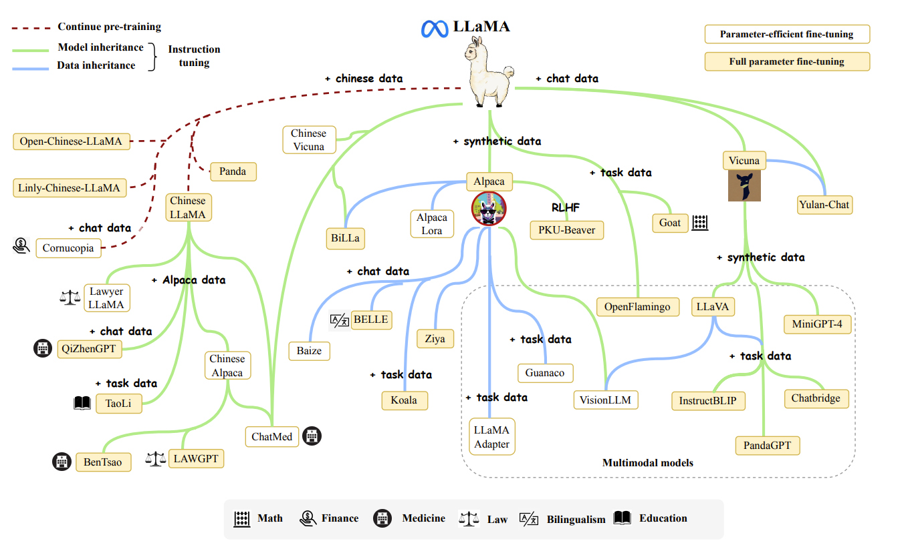
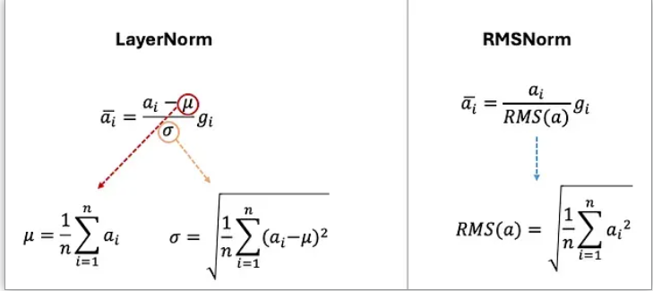
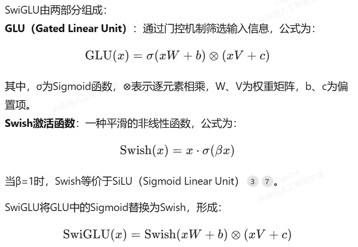
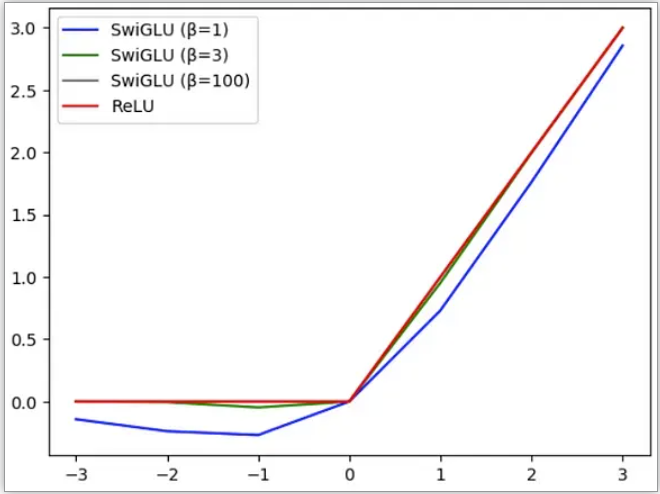
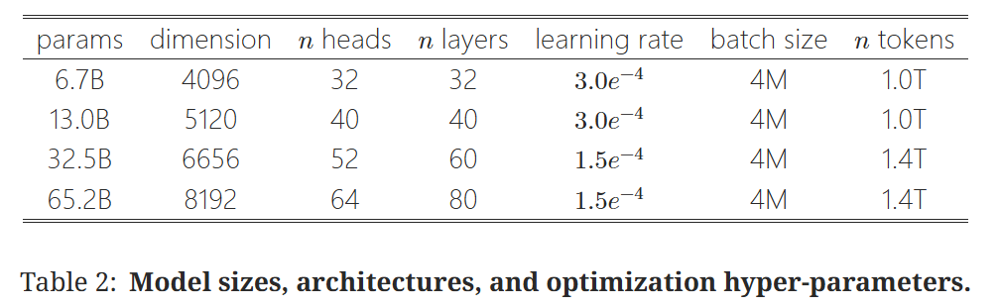
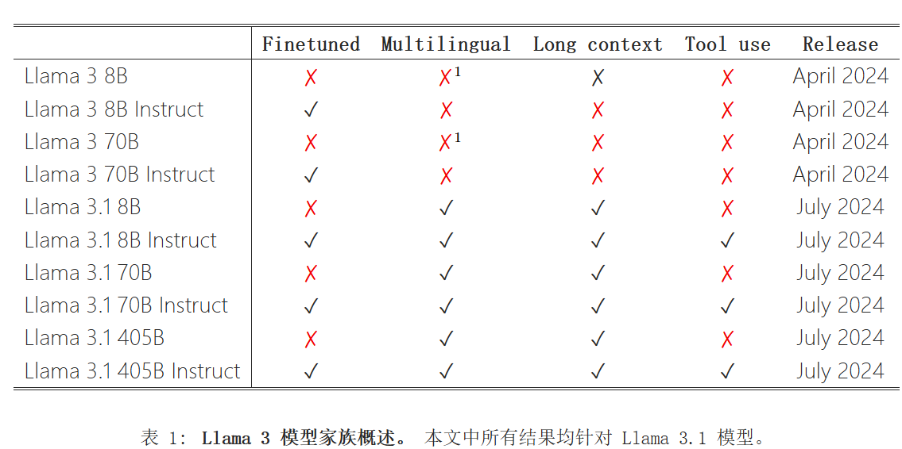
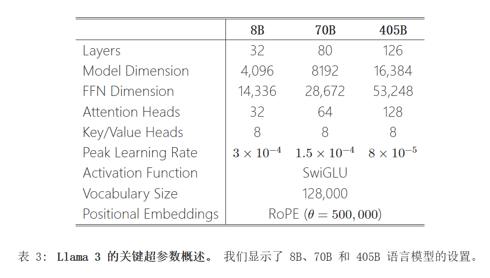
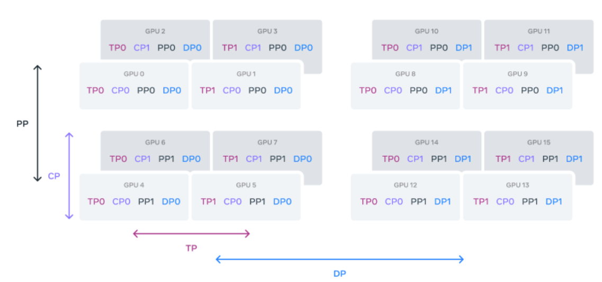
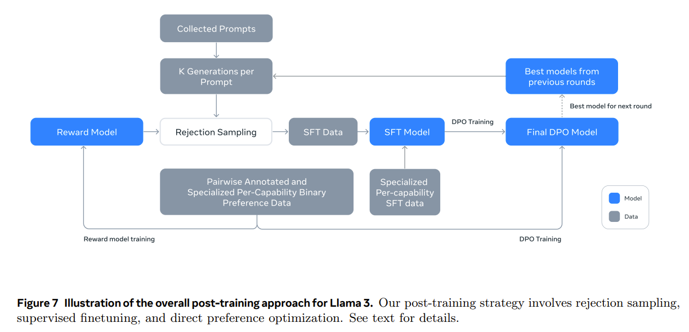

# 0 前瞻


- [Llama1-EN](https://arxiv.org/pdf/2302.13971)
- [Llama1-CN]()
- [LLama1-CN-mls](https://github.com/Elvin-Ma/ai_papers/blob/main/llama/llama.md)

- [LLama2-EN](https://arxiv.org/pdf/2307.09288)
- [LLame2-CN](https://yiyibooks.cn/arxiv/2307.09288v2/index.html)


- [LLama3-EN](https://arxiv.org/pdf/2407.21783)
- [Llama3-CN](https://yiyibooks.cn/arxiv/2407.21783v3/index.html)


# 1 llama code implement

- [torchtitan](https://github.com/pytorch/torchtitan)
- [torchtitan introduce](https://github.com/Elvin-Ma/ai_papers/tree/main/TorchTitan)

## 1.1 环境配置
```bash
git clone https://github.com/pytorch/torchtitan
cd torchtitan
pip install -r requirements.txt
# pytorch2.6 is enaught
pip3 install --pre torch --index-url https://download.pytorch.org/whl/nightly/cu124 --force-reinstall
[For AMD GPU] pip3 install --pre torch --index-url https://download.pytorch.org/whl/nightly/rocm6.3 --force-reinstall

# Get your HF token from https://huggingface.co/settings/tokens

# Llama 3.1 tokenizer.model
python scripts/download_tokenizer.py --repo_id meta-llama/Meta-Llama-3.1-8B --tokenizer_path "original" --hf_token=...

# Llama 3 8B model locally on 8 GPUs
CONFIG_FILE="./torchtitan/models/llama/train_configs/llama3_8b.toml" ./run_train.sh
```

## 1.2 用自己的tokenizer
```bash
# ./train_configs/llama2_7b.toml
tokenizer_path = "/root/Llama-2-7b-hf/tokenizer.model
```

## 1.3 修改datasets 导入

```python
# torchtitan/datasets/hf_datasets.py
if dataset_name == "c4":
    # c4 is huge, and requires both streaming and language selection
    # (we default to en)
    #ds = load_dataset(dataset_path, name="en", split="train", streaming=True)
    ds = load_from_disk("/root/datasets/c4-en-train-00000")
```

# 5 LLaMA: Open and Efficient Foundation Language Models

## 5.1 llama-1-structure
### 5.1.1 Pre-normalization [GPT3].
To improve the training stability, we normalize(RMSNorm) the input of each transformer sub-layer, instead of normalizing the output. We use the RMSNorm normalizing function, introduced by Zhang and Sennrich (2019).<br>



### 5.1.2 SwiGLU activation function [PaLM].





- 门控机制
GLU的门控特性允许模型动态调节信息流，过滤无关信息，增强对长距离依赖的建模能力，特别适合处理长文本序列。<br>

- 平滑非线性
Swish函数在0点附近平滑过渡（非ReLU的硬截断），缓解了梯度消失问题，同时保留了负值响应（避免神经元“死亡”）。<br>

- 计算效率
相比GELU等复杂激活函数，SwiGLU在保持高性能的同时计算开销更低，适合大规模模型训练。<br>

- 可学习参数
SwiGLU中的权重矩阵（W₁、V、W₂）和偏置项均通过训练动态调整，增强了模型对不同任务的适应性。<br>

```python
import torch
import torch.nn  as nn

class SwiGLU(nn.Module):
    def __init__(self, hidden_dim, output_dim):
        super().__init__()
        # 定义两个线性变换层（对应公式中的 W 和 V）
        self.w = nn.Linear(hidden_dim, output_dim, bias=False)
        self.v = nn.Linear(hidden_dim, output_dim, bias=False)
        # Swish激活函数（PyTorch内置SiLU即Swish）
        self.swish  = nn.SiLU()

    def forward(self, x):
        # 门控机制：Swish(Wx) ⊗ Vx
        return self.swish(self.w(x))  * self.v(x)
```

### 5.1.3 Rotary Embeddings [GPTNeo].
We remove the absolute positional embeddings, and instead, add rotary positional embeddings (RoPE), introduced by Su et al. (2021), at each layer of the network.

```python
# torchtitan/models/llama/model.py
def apply_rotary_emb(
    xq: torch.Tensor,
    xk: torch.Tensor,
    freqs_cis: torch.Tensor,
) -> Tuple[torch.Tensor, torch.Tensor]:
    """
    Apply rotary embeddings to input tensors using the given frequency tensor.

    This function applies rotary embeddings to the given query 'xq' and key 'xk' tensors using the provided
    frequency tensor 'freqs_cis'. The input tensors are reshaped as complex numbers, and the frequency tensor
    is reshaped for broadcasting compatibility. The resulting tensors contain rotary embeddings and are
    returned as real tensors.

    Args:
        xq (torch.Tensor): Query tensor to apply rotary embeddings.
        xk (torch.Tensor): Key tensor to apply rotary embeddings.
        freqs_cis (torch.Tensor): Precomputed frequency tensor for complex exponentials.

    Returns:
        Tuple[torch.Tensor, torch.Tensor]: Tuple of modified query tensor and key tensor with rotary embeddings.
    """
    xq_ = torch.view_as_complex(xq.float().reshape(*xq.shape[:-1], -1, 2))
    xk_ = torch.view_as_complex(xk.float().reshape(*xk.shape[:-1], -1, 2))
    freqs_cis = reshape_for_broadcast(freqs_cis, xq_)
    xq_out = torch.view_as_real(xq_ * freqs_cis).flatten(3)
    xk_out = torch.view_as_real(xk_ * freqs_cis).flatten(3)
    return xq_out.type_as(xq), xk_out.type_as(xk)
```

## 5.2 模型配置



我们使用 AdamW 优化器（Loshchilov 和 Hutter，2017）训练我们的模型，具有以下超参数：
$\beta_1 = 0.9$, $\beta_2 = 0.95$。
- 我们使用余弦学习率调度，使得最终学习率等于最大学习率的 10%。
- 我们使用 $0.1$ 的权重衰减和 $1.0$ 的梯度裁剪。
- 我们使用 $2,000$ 预热步骤，并根据模型的大小改变学习率和批次大小。

## 5.3 分布式策略
为了进一步提高训练效率，我们通过检查点减少了在反向传播期间重新计算的激活数量。 更准确地说，我们保存了计算成本高的激活，例如线性层的输出。 这是通过手动实现 Transformer 层的反向函数来实现的，而不是依赖 PyTorch autograd。 为了充分利用这种优化，我们需要通过使用模型和序列并行来减少模型的内存使用量，如 Korthikanti 等人 (2022) 所述。 此外，我们还尽可能地重叠激活的计算和 GPU 之间的网络通信（由于 all_reduce 操作）。

在训练一个 650 亿参数的模型时，我们的代码在 2048 个 A100 GPU 上处理大约 380 个 token/秒/GPU，每个 GPU 有 80GB 的内存。 这意味着在包含 1.4 万亿个 token 的数据集上训练大约需要 21 天。

## 5.4 实验结果

- 想看paper

## 5.5 碳排放
我们希望发布这些模型将有助于减少未来的碳排放量，因为训练已经完成，其中一些模型相对较小，可以在单个 GPU 上运行。

## 5.6 结论
在本文中，我们介绍了一系列公开发布的语言模型，它们与最先进的基础模型**竞争**。 最值得注意的是，`LLaMA-13B 的性能优于 GPT-3`，同时**体积小 10× 倍以上**，LLaMA-65B 与 Chinchilla-70B 和 PaLM-540B 竞争。 与之前的研究不同，我们证明了`仅通过在公开可用的数据上进行训练，而无需依赖专有数据集，就能实现最先进的性能`。 我们希望将这些模型发布给研究界能够加速大型语言模型的开发，并帮助改进其鲁棒性并缓解已知问题，例如毒性和偏差。 此外，我们观察到，就像 Chung 等人 (2022) 所做的那样，对这些模型进行**指令微调**可以带来可喜的结果，我们计划在未来的工作中进一步研究这一点。 最后，我们计划在未来发布在更大预训练语料库上训练的更大模型，因为我们已经看到性能随着规模的扩展而不断提高。

# 6 Llama 2: Open Foundation and Fine-Tuned Chat Models

## 6.1 摘要
本文开发并发布了Llama 2，这是一个包含从70亿到700亿参数的预训练和微调大型语言模型 (LLM) 集合。 我们**微调后的LLM，称为Llama 2-Chat**，针对对话用例进行了优化。 在我们测试的大多数基准测试中，我们的模型优于开源对话模型，并且根据我们对有用性和安全性的主观评估，它可能是闭源模型的合适替代品。 我们提供了关于Llama 2-Chat微调和安全改进方法的详细描述，以便社区能够在此基础上开展工作，并为负责任地开发LLM做出贡献。


## 6.2 引言
1. Llama 2是Llama 1的更新版本，它是在新的公共可用数据混合物上训练的。 我们还将预训练语料库的大小增加了40%，将模型的上下文长度增加了一倍，并采用了分组查询注意力(Ainslie et al., 2023)。 我们正在发布具有7B、13B和70B参数的Llama 2变体。 我们还训练了34B变体，我们在本文中对此进行了报告，但没有发布。

2. Llama 2-Chat是Llama 2的微调版本，针对对话用例进行了优化。 我们也发布了具有7B、13B和70B参数的此模型变体。

## 6.3 模型架构
用了大部分来自Llama 1的预训练设置和模型架构。 我们使用标准的Transformer架构(Vaswani et al., 2017)，使用RMSNorm进行预归一化(Zhang and Sennrich, 2019)，使用SwiGLU激活函数(Shazeer, 2020)，以及旋转位置嵌入（RoPE，Su et al. 2022）。 与Llama 1的主要架构差异包括增加上下文长度和分组查询注意力机制（GQA）。

## 6.4 Llama2 训练流程


*Llama 2-Chat的训练：此过程始于使用公开可用的在线资源对Llama 2进行预训练。 之后，我们通过应用监督微调创建了Llama 2-Chat的初始版本。 随后，使用基于人类反馈的强化学习(RLHF)方法（特别是通过拒绝采样和近端策略优化 (PPO)）迭代改进模型。 在整个 RLHF 阶段，与模型增强并行积累迭代奖励建模数据对于确保奖励模型保持在分布内至关重要。*

### 6.4.1 预训练

**预训练策略** <br>

进行了更强大的数据清洗，更新了我们的数据组合，训练了更多 40% 的符元，将上下文长度加倍。<br>


我们使用AdamW优化器进行训练（Loshchilov and Hutter, 2017），其中：<br>
$\beta_1 = 0.9$, $\beta_2 = 0.95$, $\epsilon = 10^{-5}$。

我们使用余弦学习率调度，预热阶段为 2000 步，并将最终学习率衰减到峰值学习率的 10%。

我们使用 $0.1$ 的权重衰减和 $1.0$ 的梯度裁剪 。

**分布式集群** <br>

我们在 Meta 的研究超级集群 (RSC) (Lee and Sengupta, 2022) 以及内部生产集群上对我们的模型进行了预训练。 两个集群都使用 NVIDIA A100。 这两个集群之间有两个主要区别，第一个是可用的互连类型：RSC 使用 NVIDIA Quantum InfiniBand，而我们的生产集群配备基于商用以太网交换机的 RoCE（RDMA over converged Ethernet）解决方案。 这两种解决方案都互连了 200 Gbps 的端点。 第二个区别在于每个 GPU 的功耗上限——RSC 使用 400W，而我们的生产集群使用 350W。 通过这种双集群设置，我们能够比较这些不同类型的互连技术在大规模训练中的适用性。 RoCE（一种更经济实惠的商用互连网络）几乎可以与昂贵的 Infiniband 一样扩展到 2000 个 GPU，这使得预训练更加民主化。

**预训练模型效果** <br>

Llama 2模型优于Llama 1模型。 特别是，与Llama 1 65B相比，Llama 2 70B分别将MMLU和BBH的结果提高了≈5和≈8个点。 Llama 2 7B和30B模型在除代码基准测试之外的所有类别中都优于相应规模的MPT模型。 对于Falcon模型，Llama 2 7B和34B在所有基准测试类别中都优于Falcon 7B和40B模型。 此外，Llama 2 70B模型优于所有开源模型。

将Llama 2 70B的结果与闭源模型进行了比较。 如表4所示，在MMLU和GSM8K基准测试上，Llama 2 70B的性能接近GPT-3.5 (OpenAI, 2023)，但在编码基准测试上存在显著差距。 Llama 2 70B的结果在几乎所有基准测试上都与PaLM (540B) (Chowdhery et al., 2022)不相上下甚至更好。 Llama 2 70B与GPT-4和PaLM-2-L的性能之间**仍存在巨大差距**。


### 6.4.2 微调
Llama 2-Chat是数月研究和迭代应用对齐技术的成果，包括指令调优和RLHF，需要大量的计算和标注资源。

**1. SFT 阶段** <br>

使用公开可用的指令调优数据(Chung et al., 2022)开始SFT阶段.

```python
{
  "instruction": "从句子中提取人名和地点",
  "input": "张华计划下周去北京参加会议。",
  "output": "人名：张华；地点：北京"
}
```

对于监督微调，我们使用余弦学习率调度，初始学习率为 $2×10^{−5}$ ,权重衰减为0.1，批量大小为64，序列长度为4096个符元。

在微调过程中，**每个样本包含一个提示和一个答案**。 为了确保模型序列长度被正确填充，我们将训练集中的所有提示和答案连接起来。 使用一个特殊的符元来分隔提示和答案片段。 我们使用自回归目标函数，并将用户提示中的符元损失清零，因此，我们只对答案符元进行反向传播。 最后，我们对模型进行2个epoch的微调。

**2. 基于人类反馈的强化学习** <br>

RLHF 是一种模型训练程序，`应用于微调后的语言模型`，以进一步使模型行为与人类偏好和指令遵循保持一致。 我们收集代表经验采样的人类偏好的数据，其中人类标注者选择他们更偏好的两个模型输出中的一个。 此人类反馈随后用于**训练奖励模型**，该模型学习人类标注者偏好中的模式，然后可以自动进行偏好决策。

我们在训练数据上进行了一个 epoch 的训练。 在早期的实验中，我们发现训练时间过长会导致过拟合。

我们使用与基础模型相同的优化器参数。 对于 700 亿参数的 Llama 2-Chat，最大学习率为 $5\times10^{-6}$，其余为 $1\times10^{-5}$。

学习率按照余弦学习率调度表下降，下降到最大学习率的 10%。 我们使用总步数的 3% 作为预热阶段，最小值为 5。

有效批量大小保持固定在 512 对，或每批 1024 行。

奖励模型的准确性是Llama 2-Chat最终性能最重要的代理指标之一。 虽然全面评估生成模型的最佳实践仍然是一个开放的研究问题，但奖励的排序任务没有歧义。 因此，在其他条件相同的情况下，奖励模型的改进可以直接转化为Llama 2-Chat的改进。

**3. 迭代微调** <br>

随着我们获得更多批次的人工偏好数据标注，我们能够训练出更好的奖励模型并收集更多提示。 因此，我们训练了用于RLHF模型的连续版本，这里称为RLHF-V1，……，RLHF-V5。

我们探索了使用两种主要算法进行RLHF微调：

• 近端策略优化 (PPO) (Schulman et al., 2017)，RLHF文献中的标准方法。
• 拒绝采样微调。 我们从模型中采样K.

输出，并使用我们的奖励选择最佳候选，这与Bai et al. (2022b)一致。 同样的LLM重新排序策略也在Deng et al. (2019)中提出，其中奖励被视为能量函数。 在这里，我们更进一步，使用选定的输出进行梯度更新。 对于每个提示，获得最高奖励分数的样本被认为是新的黄金标准。 与Scialom等人 (2020a)类似，我们随后在我们新的排序样本集上微调模型，强化奖励。

使用ADAMW优化器（Loshchilov和Hutter，2017），带有：<br>

$\beta_1 = 0.9$, $\beta_2 = 0.95$, $\epsilon = 10^{-5}$。

我们使用 $0.1$ 的重量衰减，$1.0$ 的梯度剪辑和 $10^{-6}$ 的恒定学习率。

对于每个PPO迭代，我们使用 $512$ 的批次大小，一个 $0.2$ 的PPO夹阈值，一个小批量的 $64$ ，然后采取一个梯度步骤每批次。

对于7B和13B型号，我们设置 $\beta = 0.01$（KL惩罚），对于34B和70B型号，我们设置了 $\beta = 0.005$ 。

**分布式方案** <br>

为了快速训练和大批量处理，我们使用了FSDP(Zhao et al., 2023)。 当使用O(1)的前向或反向传递时，这很有效，但在生成过程中造成了严重的减速(≈20×)，即使使用大批量和KV缓存也是如此。 我们通过在生成之前将模型权重整合到每个节点，然后在生成后释放内存，恢复训练循环的其余部分来减轻这个问题。

### 6.4.3 安全
（略）

### 6.5 结论
在这项研究中，我们介绍了 Llama 2，这是一个新的预训练和微调模型系列，参数规模从70亿到700亿不等。 这些模型在评估集上表现出了与现有开源聊天模型的竞争力，以及与一些专有模型相当的能力，尽管它们仍然落后于其他模型，例如GPT-4。 我们仔细阐述了在构建模型中应用的方法和技术，并重点强调了它们与有用性和安全性原则的一致性。 为了更显著地为社会做出贡献并加快研究步伐，我们已负责任地开放了对Llama 2和Llama 2-Chat的访问。 作为我们持续致力于透明度和安全性的承诺的一部分，我们计划在未来的工作中进一步改进Llama 2-Chat。<br>


# 7 The Llama 3 Herd of Models(Llama3 模型家族)

Llama 3。 它是一组原生支持多语言、编码、推理和工具使用的语言模型。 我们最大的模型是一个密集的 Transformer，具有 405B 个参数和最多 128K 个 Token 的上下文窗口。 本文对 Llama 3 进行了广泛的实证评估。 我们发现 Llama 3 在大量任务上的质量可与 GPT-4 等领先语言模型相媲美。 我们公开发布了 Llama 3，包括 405B 参数语言模型的预训练和后训练版本以及用于输入和输出安全的 Llama Guard 3 模型。 本文还介绍了我们通过组合方法将图像、视频和语音功能集成到 Llama 3 中的实验结果。 我们观察到这种方法在图像、视频和语音识别任务上的表现与最先进的方法具有竞争力。 由此产生的模型尚未广泛发布，因为它们仍在开发中。



 Llama 3 模型家族原生支持多语言、编码、推理和工具使用。 我们最大的模型是一个具有 4050 亿参数的密集 Transformer，在高达 128K 个符元的上下文窗口中处理信息。 该家族的每个成员都在表 1 中列出。 本文介绍的所有结果都适用于 Llama 3.1 模型，为简便起见，我们将在整个论文中将其称为 Llama 3。

 Llama 3：一个由三个多语言组成的群体 1 语言模型，分别具有 8B、70B 和 405B 个参数。 我们在涵盖广泛语言理解任务的一系列基准数据集上评估了 Llama 3 的性能。 此外，我们进行了广泛的人工评估，将 Llama 3 与竞争模型进行比较。 表 1 概述了旗舰 Llama 3 模型在关键基准上的性能。 我们的实验评估表明，我们的旗舰模型在各种任务上与 GPT-4 (openai2023gpt4) 等领先的语言模型相当，并且接近于匹配最先进的水平。 我们较小的模型是同类最佳，优于具有类似参数数量的其他模型 (bai2023qwen; jiang2023mistral)。 与其前身 (touvron2023llama2) 相比，Llama 3 在帮助度和无害度之间取得了更好的平衡。 我们在第 5.4 节中详细分析了 Llama 3 的安全性。

 ## 7.1 Llama 3 的架构
 Llama 3 使用标准的、密集的 Transformer 架构 (vaswani2017attention)。 在模型架构方面，它与 Llama 和 Llama 2 (touvron2023llama; touvron2023llama2) 没有显著差异；我们的性能提升主要得益于数据质量和多样性的提升以及训练规模的增加。

 与 Llama 2 相比，我们进行了一些小的修改：

- 我们使用分组查询注意力 (GQA；ainslie2023gqa)，其中有 8 个键值头，以提高推理速度并减少解码过程中键值缓存的大小。
- 我们使用了一个注意力掩码，它可以防止同一个序列中不同文档之间的自注意力。 我们发现，这种改变对标准预训练的影响有限，但我们发现它在对非常长的序列进行持续预训练时很重要。
- 我们使用了一个包含 128K 个符元的词汇表。 我们的符元词汇表结合了来自 tiktoken3 分词器的 100K 个符元和 28K 个额外的符元，以更好地支持非英语语言。 与 Llama 2 分词器相比，我们新的分词器将英文数据样本的压缩率从 3.17 提高到 3.94 个字符/符元。 这使得模型能够在相同训练计算量的情况下“阅读”更多文本。 我们还发现，从选定的非英语语言中添加 28K 个符元可以提高压缩率和下游性能，而不会影响英语分词。
- 我们将 RoPE 基本频率超参数提高到 500,000。 这使我们能够更好地支持更长的上下文；xiong2023effective 表明此值对上下文长度高达 32,768 有效。



## 7.2 分布式策略



*以下是 4D 并行性的示例：GPU 按 [TP, CP, PP, DP] 的顺序划分到并行组中，其中 DP 代表 FSDP。在此示例中，16 个 GPU 的组大小配置为：|TP| = 2，|CP| = 2，|PP| = 2，|DP| = 2。GPU 在 4D 并行中的位置用一个向量表示，[$D_1$, $D_2$, $D_3$, $D_4$]，其中 $D_i$ 是在第 $i$ 个并行维度上的索引。在此示例中，GPU0[TP0, CP0, PP0, DP0] 和 GPU1[TP1, CP0, PP0, DP0] 位于同一个 TP 组中，GPU0 和 GPU2 位于同一个 CP 组中，GPU0 和 GPU4 位于同一个 PP 组中，而 GPU0 和 GPU8 位于同一个 DP 组中。*<br>

## 7.3 预训练方法

用于预训练 Llama 3 405B 的配方包括三个主要阶段：(1) 初始预训练、(2) 长上下文预训练和 (3) 退火。 下面分别描述了这三个阶段。 我们使用类似的配方来预训练 8B 和 70B 模型。

### 7.3.1 初始预训练
我们使用 AdamW 预训练 Llama 3 405B，峰值学习率为 $8×10^{−5}$，线性预热 8,000 步，余弦学习率计划衰减到 $8×10^{−07}，持续 1,200,000 步。 在训练的早期阶段，我们使用较小的批次大小以提高训练的稳定性，并在之后增加批次大小以提高效率。 具体来说，我们使用 4M 个符元的初始批次大小和长度为 4,096 的序列，并在预训练 252M 个符元后将这些值加倍，达到 8M 个符元和长度为 8,192 的序列的批次大小。 在预训练 2.87T 个符元后，我们将批次大小再次加倍至 16M。 我们发现这种训练方案非常稳定：我们观察到很少的损失峰值，并且不需要干预来纠正模型训练发散。

### 7.3.2调整数据混合
 在训练期间，我们对预训练数据混合进行了多次调整，以提高模型在特定下游任务上的性能。 特别是，我们在预训练期间提高了非英语数据的比例，以改善 Llama 3 的多语言性能。 我们还对数学数据进行了过采样，以提高模型的数学推理性能；在预训练的后期阶段，我们添加了更多最近的网络数据，以推进模型的知识截止日期；我们还对预训练数据集中后来被识别为质量较低的部分进行了降采样。

### 7.3.3长上下文预训练
在预训练的最后阶段，我们在长序列上进行训练，以支持高达 128K 个符元的上下文窗口。 我们不会在早期阶段在长序列上进行训练，因为自注意力层的计算量会随着序列长度的平方增长。 我们逐步增加支持的上下文长度，进行预训练，直到模型成功适应了增加的上下文长度。 我们通过测量以下指标来评估成功的适应：(1) 模型在短上下文评估上的性能是否完全恢复，以及(2) 模型是否完美地解决了长度达到该长度的“大海捞针”任务。 在 Llama 3 405B 预训练中，我们以六个阶段逐步增加上下文长度，从最初的 8K 上下文窗口开始，最终达到 128K 上下文窗口。 此长上下文预训练阶段使用大约 800B 个训练符元执行。

### 7.3.4退火
在对最终 40M 个 token 进行预训练期间，我们将学习率线性退火至 0，保持 128K token 的上下文长度。 在这个退火阶段，我们还调整了数据混合，以对高质量的数据源进行过采样；参见第 3.1.3 节。 最后，我们计算模型检查点 (polyak1991averaging 平均) 在退火过程中的平均值，以生成最终的预训练模型。

## 7.4 Post-Training

每轮后期训练都涉及监督微调 (SFT)，然后对通过人工注释收集或综合生成的示例进行直接偏好优化（DPO；rafailov2024direct）.




### 7.4.1 建模
我们训练后策略的核心是奖励模型和语言模型。 我们首先使用人工标注的偏好数据（见第 4.1.2 节）在预训练检查点之上训练一个奖励模型。 然后，我们使用监督微调（SFT；见第 4.1.3 节）对预训练的检查点进行微调，并进一步使用直接偏好优化（DPO；见第 4.1.4 节）对检查点进行对齐。 该过程在图 7 中进行了说明。 除非另有说明，我们的建模过程适用于 Llama 3 405B，为了简单起见，我们将 Llama 3 405B 简称为 Llama 3。

### 7.4.2 聊天对话格式
为了调整 LLM 以便进行人机交互，我们需要定义一个**聊天对话协议**，以便模型理解人类指令并执行对话任务。 与其前身相比，Llama 3 具有新的功能，例如工具使用（第 4.3.5 节），这可能需要生成多个消息并将其发送到单个对话回合内的不同位置（例如，用户，ipython）。 为了支持这一点，我们设计了一个新的多消息聊天协议，该协议使用各种特殊标题和终止符。 标题符用于指示对话中每条消息的来源和目的地。 同样，终止符指示何时轮到人和 AI 交谈。

### 7.5.3 奖励建模
我们在预训练检查点之上训练了一个涵盖不同能力的奖励模型（RM）。 训练目标与 Llama 2 相同，只是我们在损失中去除了边际项，因为我们观察到数据扩展后改进越来越小。 继 Llama 2 之后，我们在过滤掉具有相似响应的样本后，将所有偏好数据用于奖励建模。 除了标准的偏好对（选择，拒绝）响应外，标注还会为某些提示创建第三个“编辑后的响应”，其中对来自该对的选择响应进行进一步编辑以进行改进（见第 4.2.1 节）。 因此，每个偏好排名样本都有两个或三个响应，具有明确的排名 (编辑 > 选择 > 拒绝)。 在训练期间，我们将提示和多个响应连接到一行，并将响应随机打乱。 这近似于将响应放在单独的行并计算分数的标准场景，但在我们的消融实验中，这种方法提高了训练效率，而不会损失准确性。

### 7.5.4 监督微调
然后，使用奖励模型对我们的人工标注提示进行拒绝采样，具体细节将在第 4.2 节中介绍。 结合此拒绝采样数据和其他数据源（包括合成数据），我们使用针对目标符元（同时屏蔽提示符元上的损失）的标准交叉熵损失来微调预训练语言模型。 有关数据组合的更多详细信息，请参见第 4.2 节。 我们将此阶段称为 监督微调 (SFT; weifinetuned; sanh2022multitask; wang2022super)，即使许多训练目标是模型生成的。 我们最大的模型以 $10^{−5}$
 的学习率微调，历时 8.5K 到 9K 步。 我们发现这些超参数设置在不同的轮次和数据组合中都能很好地工作。

### 7.5.5 直接偏好优化
我们进一步使用直接偏好优化 (DPO; rafailov2024direct) 对我们的 SFT 模型进行训练，以实现人类偏好对齐。 对于训练，我们主要使用使用上一轮对齐中性能最好的模型收集的最新批次的偏好数据。 因此，我们的训练数据更符合每一轮中正在优化的策略模型的分布。

我们还探索了 PPO 等在线策略算法 (schulman2017proximal)，但发现 DPO 对于大型模型需要的计算量更少，并且表现更好，特别是在像 IFEval 这样的指令遵循基准测试中 (zhou2023instruction)。 对于 Llama 3，我们使用 \(10^{-5}\) 的学习率，并将 \(\beta\) 超参数设置为 0.1。 此外，我们对 DPO 应用以下算法修改：

- **在 DPO 损失中屏蔽格式符元**：我们在损失中从选定和拒绝的响应中屏蔽掉特殊格式符元，包括标题和终止符元（在第 4.1.1 节中描述），以稳定 DPO 训练。 我们观察到，让这些符元对损失做出贡献可能会导致不希望出现的模型行为，例如尾部重复或突然生成终止符元。 我们假设这是由于 DPO 损失的对比性质——选定和拒绝的响应中都存在共同的符元，导致了相互冲突的学习目标，因为模型需要同时增加和减少这些符元的可能性。
- **使用 NLL 损失进行正则化**：我们在选定序列上添加一个额外的负对数似然 (NLL) 损失项，其缩放系数为 \(0.2\)，类似于 pang2024iterative。 这有助于通过维持生成所需的格式并防止选定响应的对数概率下降，进一步稳定 DPO 训练 (pang2024iterative; pal2024smaug)。

### 7.5.6 模型平均
最后，我们平均在每个 RM、SFT 或 DPO 阶段使用各种数据或超参数版本进行的实验获得的模型 (izmailov2019averagingweightsleadswider; wortsman2022modelsoupsaveragingweights; li2022branchtrainmergeembarrassinglyparalleltraining)。

### 7.5.7 迭代轮次
遵循 Llama 2，我们在六轮中应用上述方法。 在每个循环中，我们收集新的偏好标注和 SFT 数据，从最新的模型中采样合成数据。

