# 0 相关论文全汇总

**DeepSeek-V2**  

- [论文链接-EN](https://arxiv.org/pdf/2405.04434)
- [论文链接-CN](https://yiyibooks.cn/arxiv/2405.04434v5/index.html)

**DeepSeek-MOE**  

- [论文链接-EN](https://arxiv.org/pdf/2401.06066)
- [论文链接-CN](https://yiyibooks.cn/arxiv/2401.06066v1/index.html)

**DeepSeek-V3**  

- [论文链接-EN](https://arxiv.org/pdf/2412.19437)
- [论文链接-CN](https://yiyibooks.cn/arxiv/2412.19437v2/index.html)

**DeepSeek-R1**  

- [论文链接-EN](https://arxiv.org/pdf/2501.12948)
- [论文链接-CN](https://yiyibooks.cn/arxiv/2501.12948v1/index.html)

&nbsp;&nbsp;&nbsp;&nbsp;&nbsp;&nbsp;&nbsp;&nbsp;本文深入探讨了 DeepSeek-R1 模型架构。让我们从输入到输出追踪 DeepSeek-R1 模型，以找到架构中的新发展和关键部分。DeepSeek-R1 基于 DeepSeek-V3-Base 模型架构。本文旨在涵盖其设计的所有重要方面。 

# 1. 输入上下文长度

## 1.1 DeepSeek-R1 的输入上下文长度为 128K。

&nbsp;&nbsp;&nbsp;&nbsp;&nbsp;&nbsp;&nbsp;&nbsp;DeepSeek-R1 从其基础模型 DeepSeek-V3-Base 继承了 128K 上下文长度。最初，DeepSeek-V3 使用 4K 上下文长度进行预训练。然后，利用 **YaRN 技术**，通过两阶段上下文长度扩展，首先将其增加到 32K，然后扩展到 128K。 

## 1.2 什么是 YaRN？

YaRN（另一种 RoPE 扩展方法）是一种旨在有效扩展使用旋转位置嵌入 (RoPE)的大型语言模型 (LLM) 的上下文窗口的技术。RoPE 使用旋转矩阵对位置信息进行编码，而 YaRN 则修改这些旋转频率的缩放方式。它不是简单地推断频率（这通常会导致性能下降），而是平滑地插入和调整这些频率，从而能够更好地推广到更长的上下文。它在计算上是高效的，并且无需大量重新训练即可扩展模型上下文长度。

# 2. 总层数

**DeepSeek-R1** 包含以下结构：

DeepSeek-R1 由一个嵌入层、其后的 61 个transfomer decoder层以及输出阶段的多个预测头组成。

DeepSeek-R1 在所有 Transformer 层上采用多头潜在注意力 (MLA) 层，而不是标准多头注意力。前三个 Transformer 层与其他层不同，使用标准前馈网络 (FFN) 层。从第 4 层到第 61 层，混合专家 (MoE) 层取代了 FFN 层。MLA 和 MoE 的细节将在以下部分中探讨。 

这种分层设计融合了基础模型的稳定性和 MoE 架构的高效性，在保证推理能力的同时显著提升计算资源利用率。

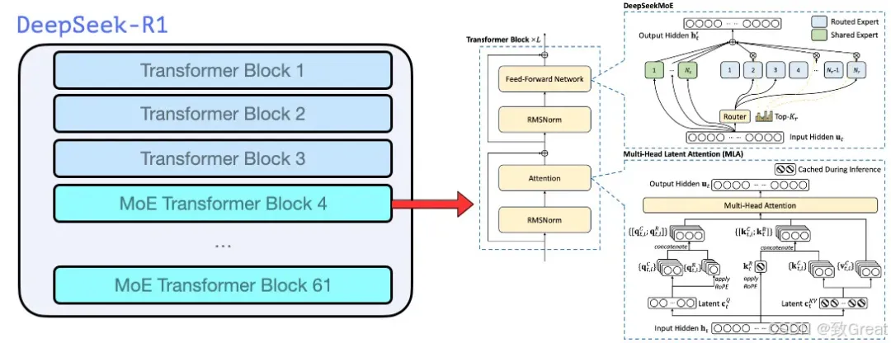

带有维度的完整模型架构描述：

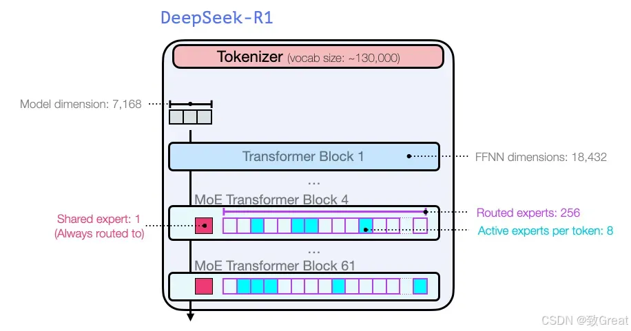

DeepSeek-V3使用多标记预测 (MTP) 技术，利用最后两个预测头预测接下来的2 个标记。第二个预测标记的接受率介于85% 和 90%之间，表明在各个生成主题中均具有很高的可靠性。 DeepSeek-R1 (DeepSeek-V3) 总共包含 671B 个参数，其中每个标记激活 37B 个。在这里插入图片描述.

# 3. 前 3 个 DeepSeek-R1 层

前 3 层由多头潜在注意力 (MLA) 和标准 FFN 层组成。这些通常被称为“密集 LLM 层”，因为 FFN 层不会被 MoE 层取代，相比之下 MoE 层被认为更稀疏。

---

# 4. DeepSeek-R1 的第 4 层至第 61 层

这些层由 MLA 层和 MoE 层组成。我们将在接下来的部分中了解什么是 MLA 层和 MoE 层以及它们如何工作。

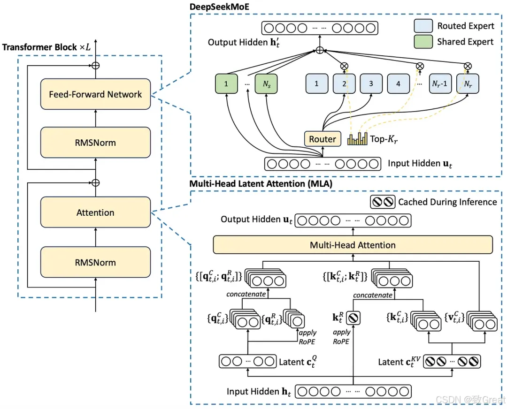

## 5. Multi-Head Latent Attention: Boosting Inference Efficiency

## 5.1 introduction
传统的Transformer模型通常采用多头注意力（MHA）（Vaswani等人，2017），但在生成过程中，其繁重的Key-Value（KV）缓存将成为限制推理效率的瓶颈。 为了减少KV缓存，多查询注意力（MQA）（Shazeer，2019）和分组查询注意力（GQA）（Ainslie等人，2023）是建议的。 它们需要更小的 KV 缓存量，但它们的性能无法与 MHA 相匹配（我们在附录 D.1 中提供了 MHA、GQA 和 MQA 的消融研究）。

对于 DeepSeek-V2，我们设计了一种创新的注意力机制，称为多头潜在注意力（MLA）。 MLA 配备低秩键值联合压缩，比 MHA 具有更好的性能，但需要的 KV 缓存量要少得多。 我们将在下面介绍它的架构，并在附录 D.2 中提供 MLA 和 MHA 的比较。

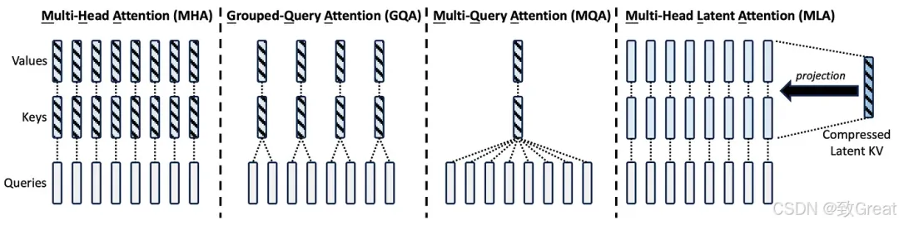

## 5.2 Multi-Head  Attention (MHA)
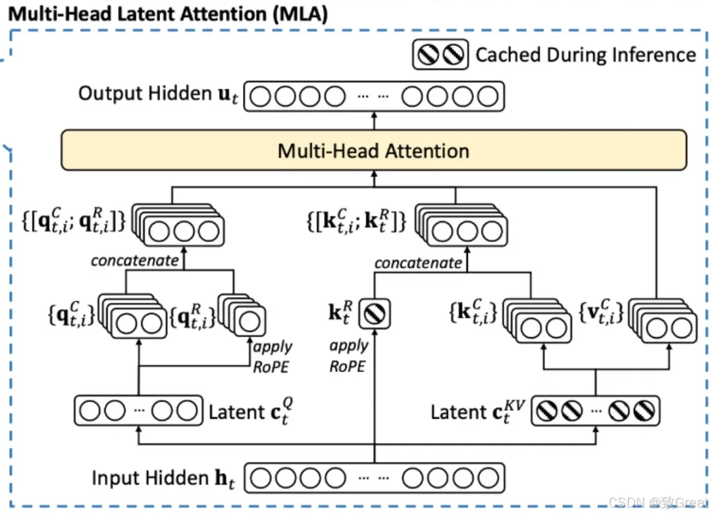

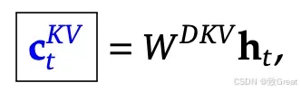

## 5.3 Low-Rank Key-Value Joint Compression

## 5.4 解耦旋转位置嵌入
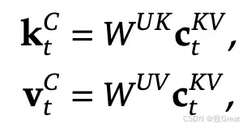

## 5.5 MLA 完整公式
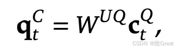

## 5.6 缓存对比

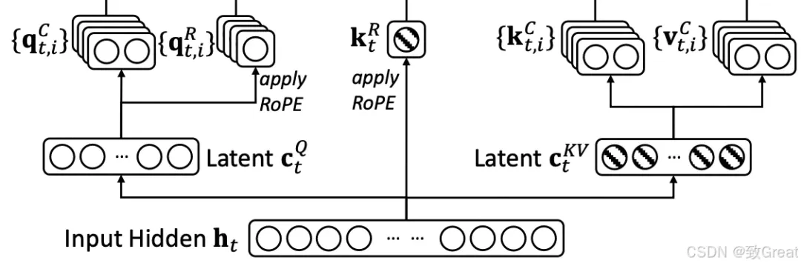

## 5.7 W^{uk} 被 W^{Q} 吸收

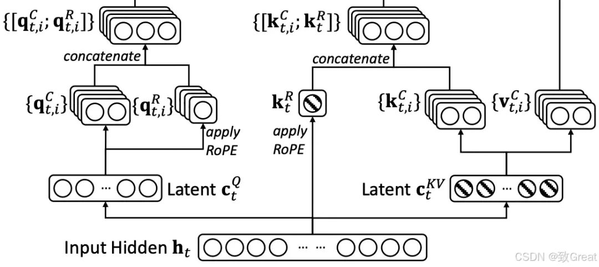

## 5.8 RoRE 时W^{uk} 无法被 W^{Q} 吸收
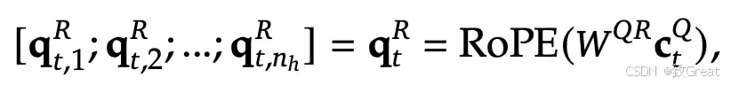

# 6 DeepSeekMOE
在 DeepSeek 系列模型中，MoE 架构首次在 DeepSeekMoE 模型中引入，并且正在 DeepSeek-V2、DeepSeek-V3 和 DeepSeek-R1 中使用。

对于 FFN，我们采用 DeepSeekMoE 架构（Dai 等人，2024）。 DeepSeekMoE 有两个关键思想：将专家细分为更细的粒度，以实现更高的专家专业化和更准确的知识获取；以及隔离一些共享专家，以减轻路由专家之间的知识冗余。 在激活和总专家参数数量相同的情况下，DeepSeekMoE 可以大幅优于 GShard （Lepikhin 等人，2021） 等传统 MoE 架构。 

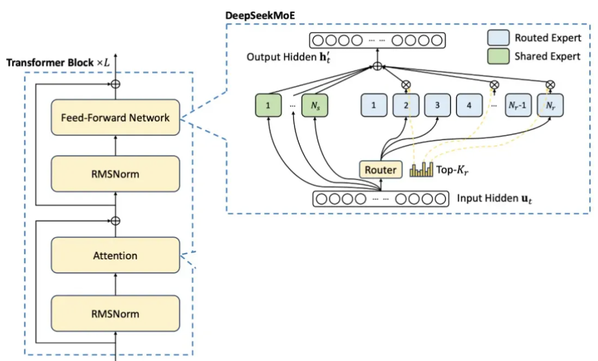

从本质上讲，MoE 遵循标准 Transformer 设计，但通过引入多个并行专家网络(FFN) 而不是单个密集 FFN来修改前馈层。其工作原理如下：

1. 多个 FFN（而非一个）

MoE 不使用单个共享的 FFN，而是使用多个并行训练的FFN 层（专家） 。 

2. 输入处理和令牌路由

每个 token 都像往常一样经过 transformer自注意力层。
它不是由单个 FFN 处理，而是被发送到路由器，由路由器决定哪些专家应该处理它。 

3. 通过路由器选择专家

一个小型的、可训练的路由器决定哪个专家子集（FFN）应该处理每个标记。
通常，每个 token仅选择 1 或 2 个专家以保持效率（例如， top-1 或 top-2 门控）。DeepSeek -V3（DeepSeek-R1）使用 9 个专家，其中 1 个是共享专家，其他 8 个是路由专家。
选择通常基于softmax 评分机制，其中路由器为每个专家分配概率。具体来说，在 DeepSeek-V3 (DeepSeek-R1) 中，使用 Sigmoid 而不是 softmax。 

4. 专家稀疏计算

只有选定的专家才能处理令牌，而其他人则保持不活动状态。
专家输出使用加权求和进行组合，并传递到下一个 Transformer 层。在 DeepSeek-V3/R1 中，权重是归一化的 S 型输出。
这种稀疏激活可确保任何时候仅使用模型的一小部分，从而保持计算可管理。 

## 6.1 为什么要用 MoE 取代单一 FFN？

- 可扩展性— MoE 允许模型使用更多参数进行扩展，而无需线性增加计算量。
- 高效学习— 专家专注于数据的不同方面，从而提高泛化能力。
- 计算节省— 由于每个 token 仅使用专家子集，因此与相同大小的密集模型相比，MoE 模型的运行成本更低。DeepSeek-V3/R1 共有 6710 亿个参数，其中每个 token 激活 370 亿个参数。

## 6.2 DeepSeekMoE 解读

### 6.2.1 基本架构

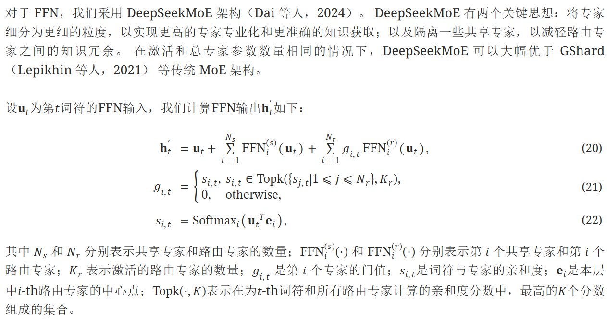

### 6.2.2 基于中心点的路由机制
传统MOE通常通过线性投影学习路由权重，而基于中心点的路由直接利用数据分布特性，减少参数依赖，提升可解释性。 

在 DeepSeekMoe 的路由机制中，中心点的确定通常结合了可学习参数与动态优化策略，以实现高效的专家分配。以下是其核心机制的逐步解释：

1. 可学习的中心点初始化
中心点（通常表示为向量）作为模型参数的一部分，**随机初始化**（如高斯分布或均匀分布）。每个专家对应一个唯一的中心点，初始时这些中心点在向量空间中均匀分布，确保覆盖潜在的输入表示范围。

2. 基于相似度的路由计算
输入 token 的嵌入向量（通过前置网络编码后）作为查询向量（query），与所有专家的中心点进行**相似度计算**（如点积、余弦相似度）。例如： 
$$
\text{相似度}_i = \frac{\mathbf{q} \cdot \mathbf{c}_i}{\|\mathbf{q}\| \|\mathbf{c}_i\|}
$$
其中，$\mathbf{q}$ 为查询向量，$\mathbf{c}_i$ 为第 $i$ 个专家的中心点。

3. 稀疏路由选择
仅选择相似度最高的前 \(k\) 个专家（如 \(k=1\) 或 \(k=2\)），确保计算的高效性。这一步骤通过 **Top-k 门控** 实现，例如：
$$
g_i = \begin{cases}
\frac{\exp(\mathbf{q}^T \mathbf{c}_i)}{\sum_{j \in \text{Top-k}} \exp(\mathbf{q}^T \mathbf{c}_j)} & \text{if } i \in \text{Top-k} \\
0 & \text{otherwise}
\end{cases}
$$

4. 中心点的动态优化
在训练过程中，中心点通过 **梯度下降** 自动调整，以最小化整体损失函数。反向传播时，路由机制的梯度会更新中心点，使其向更具代表性的输入区域移动。例如，若某专家频繁处理某一类输入，其中心点会逐渐靠近该类输入的均值方向。

5. 负载均衡与正则化
为防止某些专家被过度激活或闲置，DeepSeekMoe 可能引入 **负载均衡损失**（如重要性损失或专家多样性正则化），迫使中心点在向量空间中均匀分布。例如： 
$$
\mathcal{L}_{\text{balance}} = \lambda \sum_{i=1}^N \left( \text{importance}_i - \frac{1}{N} \right)^2
$$

其中 $\text{importance}_i$ 为第 \(i\) 个专家的激活频率，$\lambda$ 为平衡系数。

6. 自适应调整策略（可选）
在训练后期，可能采用 **动态中心点修剪或合并** 策略，移除冗余专家或合并相似中心点，进一步提升模型效率。

## 关键优势
- **端到端学习**：中心点与模型参数联合优化，无需依赖外部聚类算法。
- **稀疏性与效率**：Top-k 机制确保计算资源集中在最相关的专家。
- **自适应性**：通过负载均衡机制，自动调整专家分工，避免资源浪费。

这一机制在保持模型轻量化的同时，显著提升了任务处理的专业性和灵活性。

### 6.2.3 设备限制路由
我们设计了一种**设备限制的路由机制**来`限制 MoE 相关的通信成本`。 当采用专家并行时，路由专家将分布在多个设备上。 对于每个词符，其与MoE相关的通信频率与其目标专家覆盖的设备数量成正比。 由于DeepSeekMoE中的细粒度专家分割，`激活的专家数量可能很大`，因此如果我们应用专家并行性，MoE相关的通信成本将会更高。

对于 DeepSeek-V2，除了简单地选择路由专家的 top-K 之外，我们还确保`每个词符的目标专家将分布在最多M 台设备上`。 具体来说，对于每个词符，我们首先选择M 个设备中包含亲和力得分最高的专家。 然后，我们在这些M个设备上的专家中进行top-K选择。 在实践中，我们发现当M⩾3时，设备限制路由可以实现与不受限制的top-K路由大致一致的良好性能。

与DeepSeek-V2使用的设备限制路由类似，DeepSeek-V3也使用受限路由机制来限制训练期间的通信成本。 简而言之，我们确保每个符元最多会被发送到M个节点，这些节点根据每个节点上分布的专家最高 $\frac{K_r}{M}$个亲和力分数之和来选择。 在此约束下，我们的MoE训练框架几乎可以实现完全的计算-通信重叠。 

### 6.2.4 无辅助损失的负载均衡

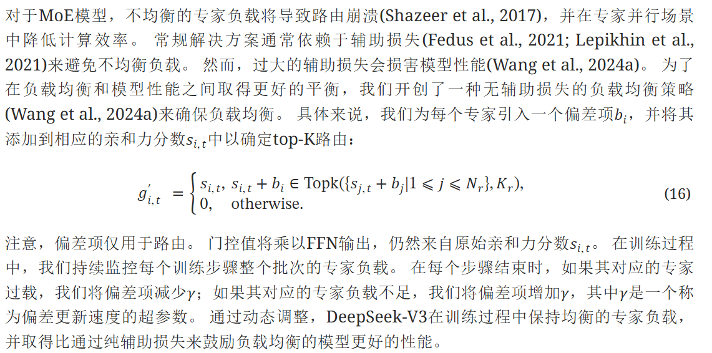

### 6.2.5 补充的序列级辅助损失。

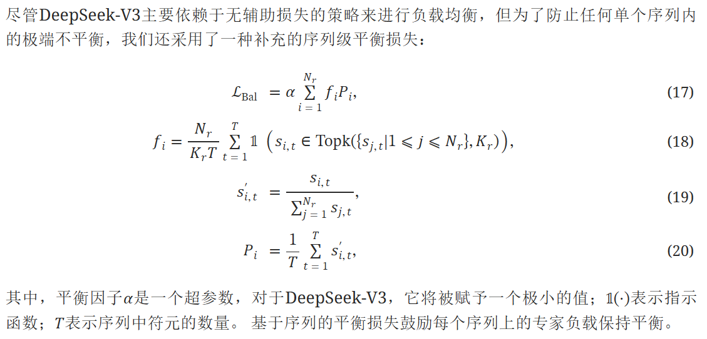

### 6.2.6 No Token-Dropping

由于有效的负载均衡策略，DeepSeek-V3在其整个训练过程中保持良好的负载平衡。 因此，DeepSeek-V3在训练过程中不会丢弃任何符元。 此外，我们还实现了特定的部署策略以确保推理负载平衡，因此DeepSeek-V3在推理过程中也不会丢弃符元。

# 7 多标记预测（MTP）

多标记预测是语言建模中的一种高级方法，其中模型不是一次预测一个序列中的下一个单词，而是同时预测多个未来标记。此方法使模型能够并行预测多个即将到来的单词，从而提高学习效率并加速文本生成。

Meta 引入了一种多标记预测架构，可训练语言模型同时预测多个未来标记，从而提高采样效率并加快推理速度。在此概念的基础上，DeepSeek-V3 整合了多标记预测 (MTP) 目标，使模型能够同时预测多个标记。这种方法使训练信号密集化，并能够更好地预先规划标记表示，从而提高复杂基准测试的性能。

## 7.1 DeepSeek-V3/R1 和 Meta 的多令牌预测有两个关键区别：
>“与 Gloeckle 等人（2024 年）[Meta Research] 使用独立输出头并行预测 𝐷 个额外标记不同，
>我们按顺序预测其他标记，并在每个预测深度保留完整的因果链。” — DeepSeek-V3

- Meta 的模型预测了4 个 token，而 DeepSeek-V3 预测了2 个 token。
- Meta 模型中的预测头是独立的，而 DeepSeek-V3 的预测头是顺序连接的。

## 7.2 MTP 在 DeepSeek-R1 中如何工作？

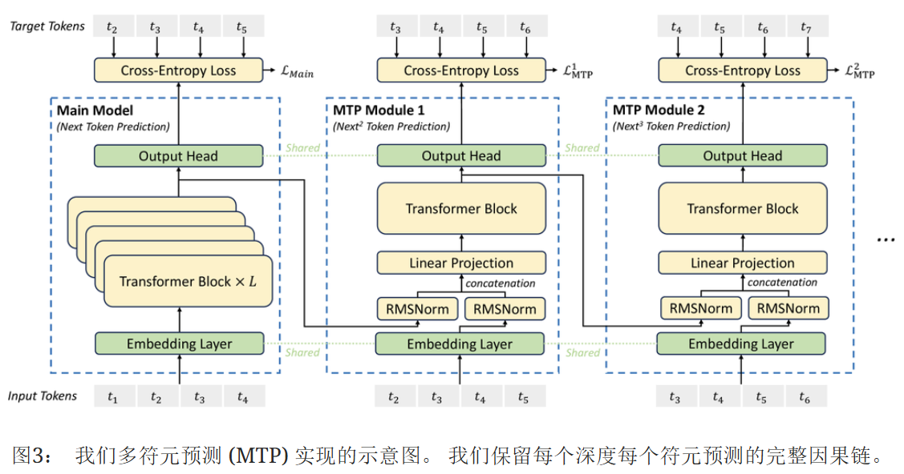

让我们一步一步地看一下该图表。

在训练期间，输入标记（位于左下角）穿过嵌入层，然后传播到所有变压器块/层。

第一个预测头（包括输出头）直接连接到主模型的最终 Transformer 层。输出头通常是前馈网络 (FFN)，其输出维度与模型的词汇量相匹配。该头负责按顺序预测下一个标记。给定输入标记t₁、t₂、t₃、t₄，它会预测t₂、t₃、t₄、t₅ 。但是，在推理过程中，只计算最终标记t₅ 。

第二个预测头通过添加额外的可学习层扩展了这种方法。它从主模型的最终 Transformer 层获取输出，应用 RMSNorm 进行归一化，然后将其与输入嵌入连接起来。这些输入嵌入是从主模型中使用的相同嵌入层获得的。与第一个预测头不同，这个头从t₂而不是t₁开始处理输入标记。然后使用线性投影层将连接的输出投影到合适的嵌入大小，然后使用可学习的 Transformer 块/层进行进一步处理。在训练期间，这个头将t₃预测为t₆，但在推理中，只计算t₆ 。

类似地，第三个预测头从第二个预测头的transformer器块/层获取输入以及相应的输入嵌入，现在从t₃开始到t₆。它遵循与前几个头相同的结构，在训练期间预测t₄到t₇，但在推理期间仅计算t₇。

每个预测头使用交叉熵计算损失。然后，这些损失用因子λ加权，取其平均值作为最终损失值。

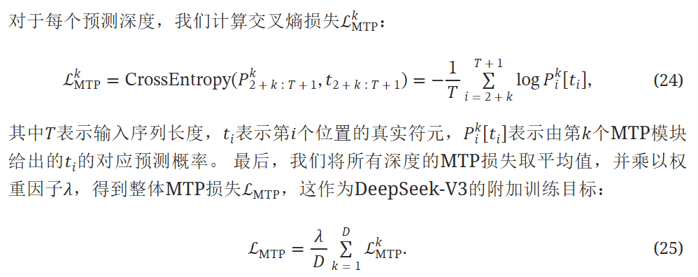

## 7.3 推理中的MTP。
我们的MTP策略主要旨在提高主模型的性能，因此在推理过程中，我们可以直接丢弃MTP模块，主模型可以独立正常运行。 此外，我们还可以将这些MTP模块重新用于推测性解码，以进一步提高生成延迟。

# 8 DualPipe和计算-通信重叠
DeepSeek-V3的训练由HAI-LLM框架支持，这是一个由我们的工程师从头开始构建的高效轻量级训练框架。 总的来说，DeepSeek-V3应用了16路流水线并行（PP）(Qi et al., 2023a)，跨越8个节点的64路专家并行（EP）(Lepikhin et al., 2021)，以及ZeRO-1数据并行（DP）(Rajbhandari et al., 2020)。 

为了促进DeepSeek-V3的高效训练，我们实现了细致的工程优化。 首先，我们设计了用于高效流水线并行的DualPipe算法。 与现有的流水线并行方法相比，DualPipe的流水线气泡更少。 更重要的是，它重叠了前向和后向过程中的计算和通信阶段，从而解决了跨节点专家并行引入的沉重通信开销的挑战。 其次，我们开发了高效的跨节点全对全通信内核，以充分利用IB和NVLink带宽，并节省专门用于通信的流多处理器 (SM)。 最后，我们仔细优化了训练期间的内存占用，从而使我们能够在不使用代价高昂的张量并行 (TP) 的情况下训练DeepSeek-V3。 

**DualPipe 计算和通讯重叠**

*图4： 一对单独的前向和后向块的重叠策略（Transformer块的边界未对齐）。 橙色表示前向，绿色表示“输入的反向”，蓝色表示“权重的反向”，紫色表示流水线并行通信，红色表示屏障。 全对全通信和流水线并行通信都可以完全隐藏。*

对于DeepSeek-V3，跨节点专家并行引入的通信开销导致计算与通信比率低效，约为1:1。 为了应对这一挑战，我们设计了一种名为DualPipe的创新流水线并行算法，它不仅通过有效地重叠前向和后向计算-通信阶段来加速模型训练，而且还减少了流水线气泡。

DualPipe的关键思想是重叠一对单独的前向和后向块中的计算和通信。 具体来说，我们将每个块划分为四个组件：注意力、全对全调度、MLP和全对全组合。 特别地，对于后向块，注意力和MLP进一步被分成两部分，输入的反向和权重的反向，就像在ZeroBubble(Qi et al., 2023b)中一样。 此外，我们还有一个PP通信组件。 如图4所示，对于一对前向和后向块，我们重新排列这些组件并手动调整专用于通信与计算的GPU SM比例。 在这种重叠策略中，我们可以确保在执行过程中所有到所有和PP通信都可以完全隐藏。 鉴于高效的重叠策略，完整的DualPipe调度如下图所示。 它采用双向流水线调度，同时从流水线的两端馈送微批次，并且可以完全重叠很大一部分通信。 这种重叠还确保，随着模型进一步扩展，只要我们保持恒定的计算与通信比率，我们仍然可以在节点之间使用细粒度的专家，同时实现接近零的全部到全部通信开销。

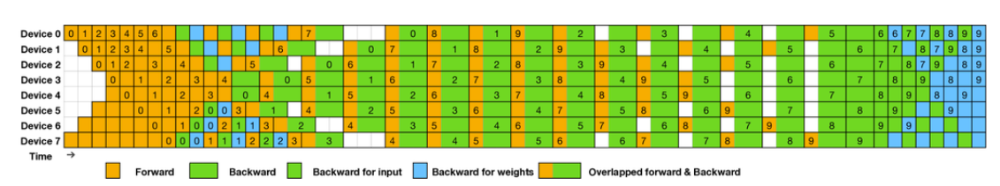

> 图5： 8个PP秩和两个方向上20个微批次的DualPipe调度示例。 反向的微批次与正向的微批次对称，为了简化说明，我们省略了它们的批次ID。 由共享黑边包围的两个单元格具有相互重叠的计算和通信。

此外，即使在没有大量通信负担的更一般情况下，DualPipe仍然表现出效率优势。 在表2中，我们总结了不同PP方法的流水线气泡和内存使用情况。 如表所示，与ZB1P(Qi et al., 2023b)和1F1B(Harlap et al., 2018)相比，DualPipe显著减少了流水线气泡，而峰值激活内存仅增加了 $\frac{1}{PP}$ 倍。 尽管DualPipe需要保留模型参数的两个副本，但这不会显著增加内存消耗，因为我们在训练期间使用了较大的EP大小。 与Chimera(Li and Hoefler, 2021)相比，DualPipe只需要流水线阶段和微批次能够被2整除，而不需要微批次能够被流水线阶段整除。 此外，对于DualPipe，气泡和激活内存都不会随着微批次数量的增加而增加。

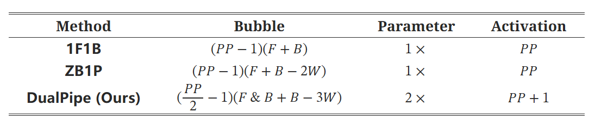

表 2： 不同流水线并行方法的流水线阻塞和内存使用情况比较。F 表示前向块的执行时间，B 表示完整后向块的执行时间，W 表示“权重后向”块的执行时间，F&B 表示两个相互重叠的前向和后向块的执行时间。

# 9 FP8 训练

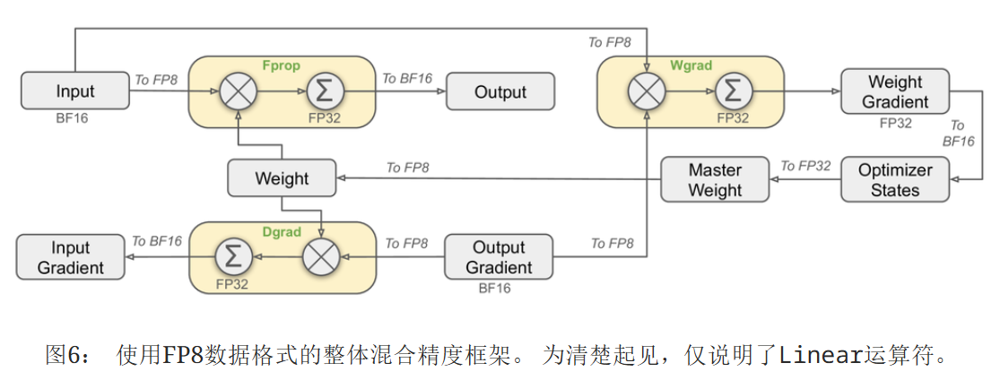

受近期低精度训练进展的启发(Peng et al., 2023b; Dettmers et al., 2022; Noune et al., 2022)，我们提出了一种细粒度的混合精度框架，利用FP8数据格式训练DeepSeek-V3。 虽然低精度训练具有很大的前景，但它常常受到激活值、权重和梯度中异常值的影响(Sun et al., 2024; He et al., ; Fishman et al., 2024)。 尽管在推理量化方面取得了重大进展(Xiao et al., 2023; Frantar et al., 2022)，但很少有研究证明低精度技术在大规模语言模型预训练中的成功应用(Fishman et al., 2024)。 为了应对这一挑战并有效扩展FP8格式的动态范围，我们引入了一种细粒度的量化策略：具有 $1×N_c$ 个元素的tile-wise分组或具有 $N_c×N_c$个元素的block-wise分组。 在我们的增精度累加过程中，相关的反量化开销在很大程度上得到了缓解，这是实现精确FP8通用矩阵乘法(GEMM)的关键方面。 此外，为了进一步减少MoE训练中的内存和通信开销，我们将激活值缓存并调度到FP8中，同时将低精度优化器状态存储在BF16中。 我们在两个与DeepSeek-V2-Lite和DeepSeek-V2类似的模型规模上验证了所提出的FP8混合精度框架，训练了大约1万亿个符元（更多细节见附录B.1）。 值得注意的是，与BF16基线相比，我们FP8训练模型的相对损失误差始终低于0.25%，这一水平完全在训练随机性的可接受范围内。

## 9.1 混合精度框架

基于低精度训练中广泛采用的技术(Kalamkar et al., 2019; Narang et al., 2017)，我们提出了一种用于FP8训练的混合精度框架。 在这个框架中，大多数计算密集型操作都在FP8中进行，而一些关键操作则战略性地保留其原始数据格式，以平衡训练效率和数值稳定性。 图6阐述了整体框架。

首先，为了加速模型训练，大多数核心计算内核，即 GEMM 运算，都以 FP8 精度实现。 这些 GEMM 运算接受 FP8 张量作为输入，并生成 BF16 或 FP32 的输出。 如图6所示，与Linear算子相关的所有三个 GEMM，即Fprop（前向传递）、Dgrad（激活反向传递）和Wgrad（权重反向传递），都以 FP8 执行。 这种设计理论上将计算速度提高了一倍，相比于原来的 BF16 方法。 此外，FP8 Wgrad GEMM 允许将激活以 FP8 存储，以便在反向传递中使用。 这显著减少了内存消耗。

尽管 FP8 格式具有效率优势，但某些算子由于其对低精度计算的敏感性，仍然需要更高的精度。 此外，一些低成本算子也可以使用更高的精度，而不会对整体训练成本造成可忽略不计的开销。 出于这个原因，经过仔细研究，我们为以下组件保留了原始精度（例如，BF16 或 FP32）：嵌入模块、输出头、MoE 门控模块、规范化算子以及注意力算子。 这些有针对性地保留高精度，确保了 DeepSeek-V3 的稳定训练动态。 为进一步保证数值稳定性，我们将主权重、权重梯度和优化器状态存储在更高的精度中。 虽然这些高精度组件会产生一些内存开销，但可以通过在我们的分布式训练系统中跨多个 DP 排名进行高效分片来最大限度地减少其影响。

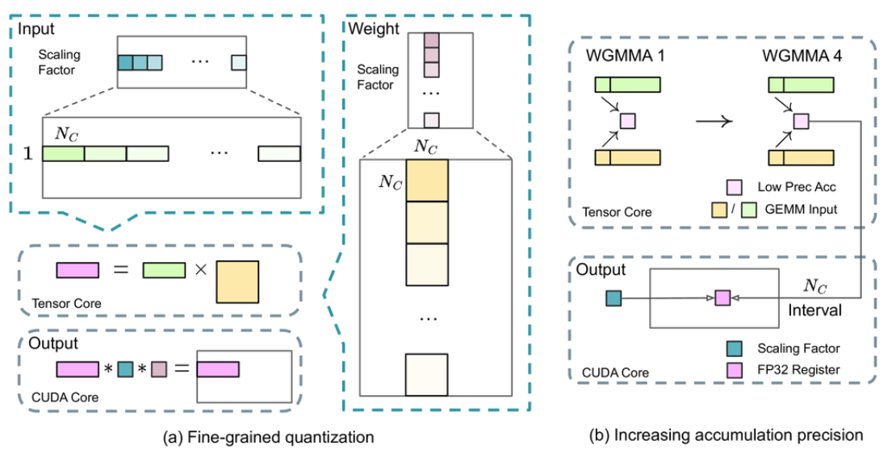

*(a) 我们提出了一种细粒度量化方法来减轻由特征异常值引起的量化误差；为简单起见，仅说明了Fprop。 (b) 结合我们的量化策略，我们通过以 $N_C=128$ 个元素 MMA 的间隔提升到 CUDA 内核来提高 FP8 GEMM 精度，以实现高精度累积.*  

## 9.2 量化与乘法带来的精度改进
基于我们的混合精度FP8框架，我们引入了几种策略来提高低精度训练精度，重点关注量化方法和乘法过程。

**细粒度量化。**
在低精度训练框架中，由于FP8格式的动态范围有限（受其减少的指数位限制），溢出和下溢是常见的挑战。 作为标准做法，通过将输入张量的最大绝对值缩放至FP8的最大可表示值来将输入分布与FP8格式的可表示范围对齐(Narang et al., 2017)。 此方法使低精度训练对激活异常值高度敏感，这会严重降低量化精度。 为了解决这个问题，我们提出了一种细粒度量化方法，该方法在更细粒度的级别应用缩放。 如图7 (a)所示，(1) 对于激活，我们基于1x128的块（即，每个符元每个128个通道）对元素进行分组和缩放；(2) 对于权重，我们基于128x128的块（即，每个128个输入通道每个128个输出通道）对元素进行分组和缩放。 此方法通过根据较小的元素组调整比例来确保量化过程能够更好地适应异常值。 在附录B.2中，我们进一步讨论了当我们像权重量化一样基于块对激活进行分组和缩放时的训练不稳定性。

我们方法中的一个关键修改是在GEMM运算的内维中引入每组缩放因子。 标准FP8 GEMM不支持此功能。 但是，结合我们精确的FP32累加策略，可以有效地实现它。

值得注意的是，我们的细粒度量化策略与微缩放格式的理念高度一致(Rouhani et al., 2023b)，而NVIDIA下一代GPU（Blackwell系列）的Tensor Cores已宣布支持具有更小量化粒度的微缩放格式(NVIDIA, 2024a)。 我们希望我们的设计可以作为未来工作的参考，以跟上最新的GPU架构。

**提高累加精度**
低精度GEMM运算通常会遇到下溢问题，其精度在很大程度上取决于高精度累加，这通常以FP32精度执行(Kalamkar等人，2019；Narang等人，2017)。 然而，我们观察到，NVIDIA H800 GPU上FP8 GEMM的累加精度仅限于保留约14位，这远低于FP32累加精度。 当内部维度K较大(Wortsman等人，2023)时，这个问题将变得更加突出，这在大规模模型训练中是一个典型的场景，其中批量大小和模型宽度都会增加。 以K=4096的两个随机矩阵的GEMM运算为例，在我们预备测试中，Tensor Core中有限的累加精度导致最大相对误差接近2%。 尽管存在这些问题，但在一些FP8框架中，有限的累加精度仍然是默认选项(NVIDIA，2024b)，严重限制了训练精度。

为了解决这个问题，我们采用了将计算提升到CUDA Core以获得更高精度的方法(Thakkar等人，2023)。 该过程如图7(b)所示。 具体来说，在Tensor Core上执行MMA（矩阵乘法累加）期间，使用有限的位宽累加中间结果。 一旦达到 $N_C$ 间隔，这些部分结果将被复制到CUDA Core上的FP32寄存器中，在那里执行全精度FP32累加。 如前所述，我们的细粒度量化沿内部维度K应用每个组的比例因子。这些比例因子可以在CUDA Core上高效地乘以，作为反量化过程，并具有最小的额外计算成本。

值得注意的是，这种修改降低了单个线程块的WGMMA（线程组级矩阵乘法累加）指令发出率。 然而，在H800架构上，通常有两个WGMMA同时存在：当一个线程块执行提升操作时，另一个线程块能够执行MMA操作。 这种设计能够使这两个操作重叠，保持Tensor Core的高利用率。 根据我们的实验，设置 $N_C=128$ 个元素，相当于4个WGMMAs，代表了可以在不引入大量额外开销的情况下显著提高精度的最小累加间隔。

**尾数/指数**
与先前工作(NVIDIA，2024b；Peng等人，2023b；Sun等人，2019b)采用的混合FP8格式形成对比，该格式在Fprop中使用E4M3（4位指数和3位尾数），在Dgrad和Wgrad中使用E5M2（5位指数和2位尾数），我们对所有张量采用E4M3格式以获得更高的精度。 我们将这种方法的可行性归因于我们细粒度的量化策略，即基于块的缩放。 通过对较小的元素组进行操作，我们的方法有效地在这些分组元素之间共享指数位，从而减轻了有限动态范围的影响。

**在线量化**
延迟量化被用于张量量化框架(NVIDIA, 2024b; Peng et al., 2023b)，该框架维护先前迭代中最大绝对值的记录以推断当前值。 为了确保精确的比例并简化框架，我们针对每个1x128激活块或128x128权重块在线计算最大绝对值。 基于此，我们推导出缩放因子，然后将激活或权重在线量化为FP8格式。

## 9.3 低精度存储和通信
与我们的FP8训练框架结合，我们通过将缓存的激活和优化器状态压缩为更低精度的格式，进一步减少了内存消耗和通信开销。

**低精度优化器状态**
我们采用BF16数据格式而不是FP32来跟踪AdamW(Loshchilov and Hutter, 2017)优化器中的第一和第二矩，而不会造成明显的性能下降。 但是，主权重（由优化器存储）和梯度（用于批量大小累积）仍然保留在FP32中，以确保整个训练过程中的数值稳定性。

**低精度激活**
如图6所示，Wgrad操作在FP8中执行。 为了减少内存消耗，将激活缓存到FP8格式中以用于Linear算子的反向传递是一个自然的选择。 但是，对于低成本高精度训练，对多个算子进行了特殊考虑：

(1) 注意力算子之后的Linear的输入。 这些激活值也用于注意力算子的反向传播，这使其对精度敏感。 我们采用定制的E5M6数据格式专门用于这些激活值。 此外，这些激活值将在反向传播中从1x128量化块转换为128x1块。 为避免引入额外的量化误差，所有比例因子都采用舍入缩放，即2的整数次幂。

(2) MoE中SwiGLU算子的输入。 为进一步降低内存成本，我们缓存SwiGLU算子的输入并在反向传播中重新计算其输出。 这些激活值也以FP8格式存储，并使用我们的细粒度量化方法，在内存效率和计算精度之间取得平衡。

**低精度通信**
通信带宽是MoE模型训练中的一个关键瓶颈。 为了缓解这一挑战，我们将MoE上投影之前的激活值量化为FP8，然后应用调度组件，该组件与MoE上投影中的FP8 前向传播兼容。 与注意力算子之后线性层的输入类似，此激活值的比例因子也是2的整数次幂。 类似的策略应用于MoE下投影之前的激活梯度。 对于前向和反向合并组件，我们都将其保留在BF16中，以在训练管道的关键部分保持训练精度。

# 10 其它节约显存的技术
为了减少训练期间的内存占用，我们采用了以下技术。

1. RMSNorm 和 MLA 上投影的重新计算。
我们在反向传播过程中重新计算所有 RMSNorm 操作和 MLA 上投影，从而无需持久存储它们的输出激活值。 通过少量额外开销，此策略显著减少了存储激活值所需的内存。

2. CPU 中的指数移动平均。
在训练期间，我们保留模型参数的指数移动平均 (EMA)，以便在学习率衰减后尽早估计模型性能。 EMA 参数存储在 CPU 内存中，并在每个训练步骤之后异步更新。 此方法使我们能够在不产生额外内存或时间开销的情况下维护 EMA 参数。

3. 用于多符元预测的共享嵌入和输出头。
使用 DualPipe 策略，我们将模型中最浅的层（包括嵌入层）和最深的层（包括输出头）部署在同一个 PP 秩上。 此安排使得 MTP 模块和主模型之间可以物理共享共享嵌入和输出头的参数和梯度。 这种物理共享机制进一步提高了我们的内存效率。

# 11 高效实现跨节点All-to-All 通信

为了确保 DualPipe 具有足够的计算性能，我们定制了高效的跨节点全对全通信内核（包括调度和组合），以节省专用于通信的 SM 数量。 内核的实现与 MoE 门控算法和我们集群的网络拓扑结构共同设计。 具体来说，在我们的集群中，跨节点 GPU 通过 IB 完全互连，节点内通信通过 NVLink 处理。 NVLink 提供 160 GB/s 的带宽，大约是 IB (50 GB/s) 的 3.2 倍。 为了有效利用 IB 和 NVLink 的不同带宽，我们将每个符元最多调度到 4 个节点，从而减少 IB 通信量。 对于每个符元，在其路由决策做出后，它将首先通过 IB 传输到目标节点上具有相同节点内索引的 GPU。 一旦到达目标节点，我们将努力确保它通过 NVLink 即时转发到承载其目标专家的特定 GPU，而不会被随后到达的符元阻塞。 通过这种方式，通过 IB 和 NVLink 的通信完全重叠，每个符元可以有效地选择每个节点平均 3.2 个专家，而不会产生 NVLink 的额外开销。 这意味着，尽管 DeepSeek-V3 在实践中只选择 8 个路由专家，但它可以将此数量最多扩展到 13 个专家（4 个节点× 3.2 个专家/节点），同时保持相同的通信成本。 总体而言，在这种通信策略下，只需要 20 个 SM 就能充分利用 IB 和 NVLink 的带宽。

详细地说，我们采用 warp 专业化技术 (Bauer et al., 2014) 并将 20 个 SM 分成 10 个通信通道。 在调度过程中，(1) IB 发送，(2) IB 到 NVLink 转发，以及 (3) NVLink 接收分别由各自的 warp 处理。 分配给每个通信任务的 warp 数会根据所有 SM 上的实际工作负载动态调整。 同样，在合并过程中，(1) NVLink 发送，(2) NVLink 到 IB 的转发和累积，以及 (3) IB 接收和累积也由动态调整的 warp 处理。 此外，调度和合并内核都与计算流重叠，因此我们也考虑它们对其他 SM 计算内核的影响。 具体来说，我们采用定制的 PTX（并行线程执行）指令并自动调整通信块大小，这显著减少了 L2 缓存的使用以及对其他 SM 的干扰。

# 12 附录：DeepSeekV1

DeepSeek V1是2024年1月份发布的第一版DeepSeek模型，包含DeepSeek的核心构建方式，核心技术点分为数据端、模型端、优化端、对齐4个部分，前面3个部分处于模型的预训练阶段，对齐阶段使用SFT进行人类风格对齐。

数据端：在数据的处理上，包括去重、过滤、混合3个步骤，目的是构建一个多样性强、纯净的高质量预训练数据。在去重阶段，对于Common Crawl数据集进行全局的去重过滤，可以提升去重比例。在过滤阶段，构建了一套详细的包括文法语法分析在内的评估流程，去除低质量数据。在混合阶段，对不同domain的数据进行采样，平衡不同domain数据量，让数据量较少的domain也能有足够的样本占比，提升数据集多样性和全面性。

此外，在数据处理方面，使用Byte-level Byte-Pair Encoding (BBPE)作为tokenizer，相比BPE是在字符粒度进行字符串分割，BBPE在字节粒度进行处理，整体算法逻辑和BPE类似。

整体参与预训练的token数量为2 trillion。在V2和V3中，训练的token数量不断上升，V2为8 trillion，V3为14 trillion。

**模型端：** 
模型的主体结构基本沿用LLaMA。LLaMA主体就是Transformer结构，主要差异包括RMSNorm的Pre-normalization（每层Transformer输入使用RMSNorm进行归一化）、激活函数采用SwiGLU、位置编码采用Rotary Embeddings。模型包括7B和67B两种尺寸，67B尺寸的Transformer中的attention采用了Grouped Query Attention代替最普通的self-attention降低inference开销。Grouped Query Attention每组query共用同一组key和value。

**优化端：** 
使用multi-step learning rate代替LLaMA中的cosine learning rate schedule，主要原因是实验发现两者虽然最终收敛到的loss差不多，但是前者在连续学习上loss能够保证一致性，连续学习更加方便。先用2000个step的warmup将学习率提升到最大值，然后在训练完80%的训练数据后将学习率降低到31.6%，在训练完90%的训练数据后进一步降低到10%。

**对齐：** 
使用Supervised Fine-Tuning、DPO两种方式进行预训练模型的finetune，进行风格对齐。Supervised Fine-Tuning使用120w搜集到的SFT数据（一些根据指令给出答案的文本，由人类标注的高质量数据，帮助预训练模型迁移人类风格）进行finetune。DPO是针对之前ChatGPT中基于强化学习的RHLF风格迁移的一种升级，不用强化学习，只使用一个指定对应的两个答案之前的相对偏好关系作为损失函数加入到模型中。

>DPO：直接基于人类偏好数据优化模型，无需奖励模型。通过对比学习最大化偏好回答的对数似然概率，使用二元交叉熵损失函数实现4810。依赖成对偏好数据（如用户选择的优/劣回答），直接调整模型参数以符合偏好分布. 
>DPO：流程简化，直接监督学习：
> - 收集偏好数据； 
>- 直接优化模型参数，无需强化学习循环81011。

