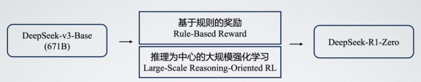
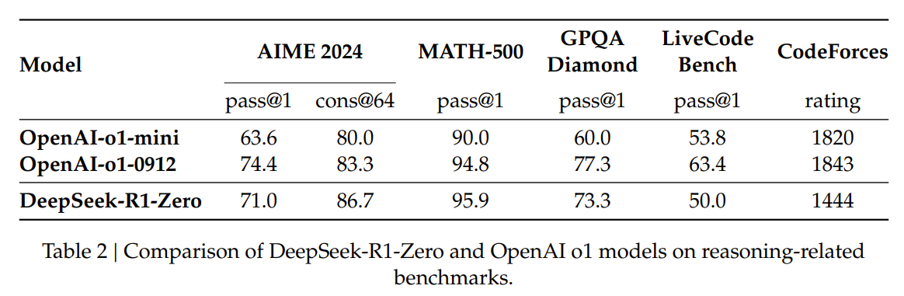
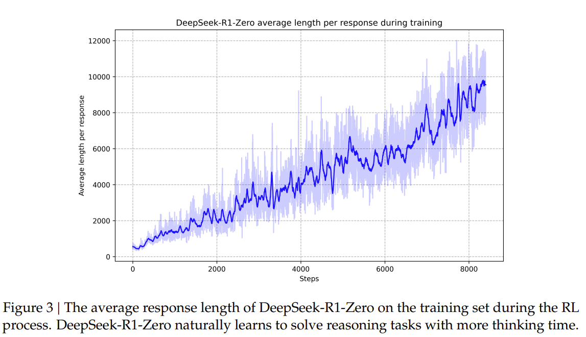
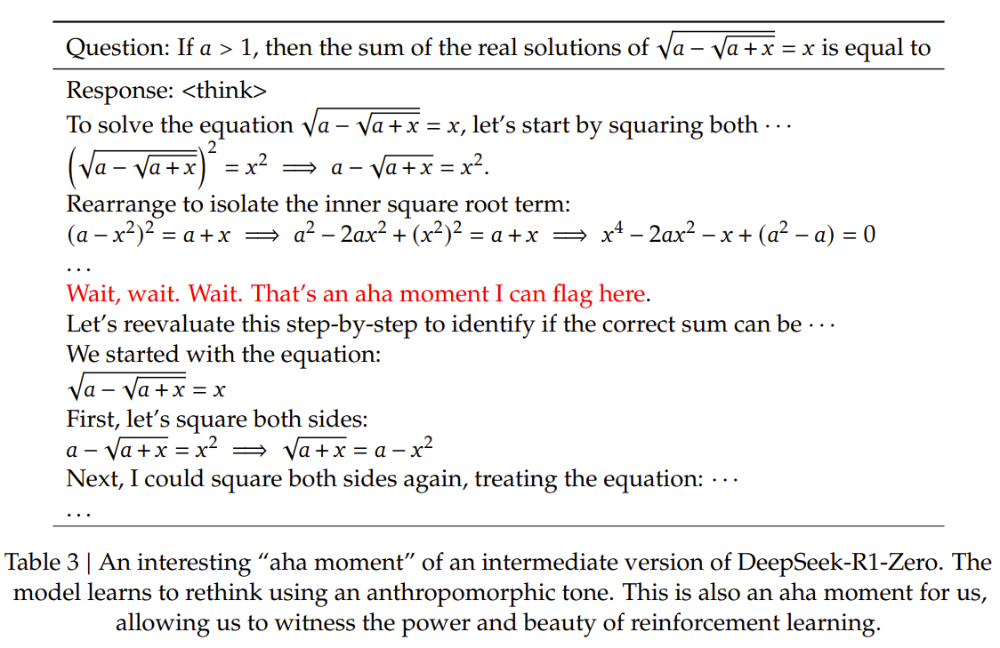
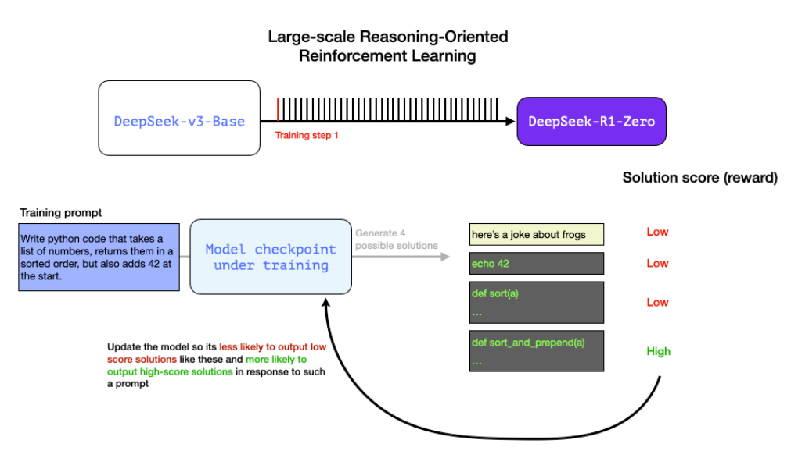
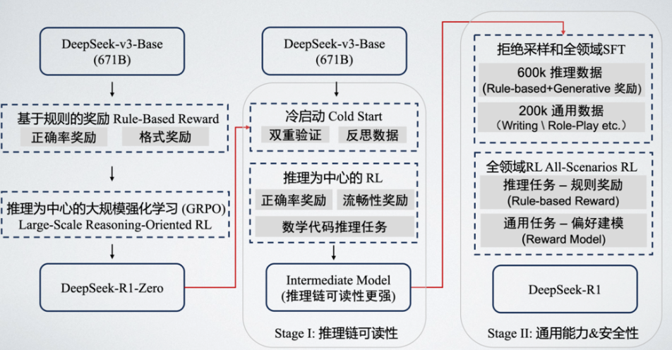

**基于 STaR 的方法和基于强化学习的方法进行强推理模型复现的区分和产生的效果的不同???**

# 1. DeepSeek-R1 开创 RL 加持下强推理慢思考范式新边界

**Post-Training Scaling law. ???**

近期后训练阶段开始成为语言模型中在完整训练过程中非常关键的一环，包括提升推理能力和社会价值对齐方面起到了非常重要的作用。自从 OpenAI o1 开启后训练强化学习新范式后，社区研究 Inference Time Scaling 通过增强 CoT 的长度提升推理能力的热情也是在逐渐增高。其中一个关键的问题就是**如何通过有效的测试阶段的时间的扩展来提升它的推理能力**。<br>

近期 DeepSeek R1 的开源，也是再次让我们看到了强化学习的潜力。得益于纯大规模强化学习 DeepSeek-R1 Zero 和 DeepSeek-R1 的出现其实大大提升了推理能力和长文本的思考能力，其中 R1 Zero 是完全从基础模型开始构建，完全依赖强化学习，而不使用人类专家标注的监督微调。在训练过程中随着训练步骤的增加，模型也是逐渐展现出长文本推理以及长链修复的能力。随着推理路径的逐步增长，模型来表现出自我反思的能力，能够发现并修复之前的错误。<br>

得益于强大的推理能力和长文本思考能力，DeepSeek R1 在开源以来就备受关注，其中它在著名的数学代码任务榜单上也是获得了非常突出的表现。比如在 AIME2024 上取得了 79.8% 的成绩，也是超过了 OpenAI o1。其中也在编码的任务上表现出了专家水平。与此同时，DeepSeek R1 在知识类问答的任务上推动了科学探索的边界，在无论 MMLU 还是 GPQA 等一些基于科学问答和理工类的榜单上都是取得了比较好的表现。更令人惊艳的是 R1 在一些长文本依赖的任务上比如 FRAMEs 和一些事实性推断任务上也是表现突出，其实也展现出来了强推理模型在 AI 驱动的一些 research 的潜力。

# 2 扩展率

## 2.1 预训练阶段的扩展率

那么我们首先回顾一下预训练阶段的扩展律。其实也就是在预训练模型上，计算量数据和参数量成一个类似于正比的关系，也就是**算力等于 6 倍的参数量乘上数据量**。因此在大模型时代发展的初期，囤卡提升预训练的算力和模型参数变成了主要目标。<br>

$$compute = 6 \times param \times data$$


## 2.2 后训练阶段的扩展率
随着 OpenAI o1 的发布，也证明了在强化学习加持下后训练时代一个新的扩展律：<br>
- 随着模型在后训练阶段的训练时计算量和测试时计算量的提升，模型的性能特别是数学代码能力也会随之提升。
- 那么在后训练扩展律下语言模型的训练时计算量多了一个新的变量，也就是在探索时语言模型推理产生的计算量。<br>

## 2.3 为什么我们需要后训练扩展率
其实早在 2022 年就有启发的认知，主要是出于两个原因：<br>
1. 第一个是随着模型尺寸的逐渐增大，预训练阶段参数的扩展带来的边际收益开始逐步递减，如果想要深度提升模型的推理能力和长程问题的能力，基于强化学习的后训练将会成为下一个突破点；
2. 第二个也就是自回归模型在传统的像数学推理问题上很难进步，其中的关键一点就是没有办法进行回答的自主修正，那如果仅是依靠生成的方法和扩大参数的规模在数学和推理任务上带来的收益不会很大。所以我们迫切地需要额外的 Scaling Law 也是额外的扩展律。<br>

# 3 DeepSeed-R1-Zero

DeepSeek R1 Zero 的发布也是让我们看到了强化学习的潜力，特别是它`跳过了经典后训练阶段中的监督微调`，直接运用大规模强化学习就实现了**推理能力的大幅提升**，在数学代码等问题上显著飞跃。并且在强化学习训练过程中**自然涌现长文本推理能力**，这其中的关键操作核心在于一个是`基于规则的奖励 Rule-based Reward` 和`以推理为中心的大规模强化学习`。接下来我们也进行逐步的拆解。<br>



**3.1 DeepSeed-R1-Zero 的数学代码能力**



**涌现出来的长文本思考能力**



在 DeepSeek R1 Zero 的**奖励建模**中采用了`基于规则的奖励`，也就是基于一定的规则可以直接利用程序进行判断正误的奖励信号。

具体来说 DeepSeek R1 Zero 设计了两种奖励：<br>
1. 一种是准确率奖励，即对于推理任务是否根据**最后答案的正确率**直接来判断这个任务是否成功完成；
2. 第二种是格式奖励也就是**显式的去规劝模型的输出过程中必须包含思考的过程**，利用一个 thinking token 将思考的过程圈起来。

>这里的 thinking token 指的是一种显式标记（explicit marker），用于在模型的输出中清晰划分“思考过程”和“最终回答”，通常是一个特殊符号、关键词或固定格式的文本片段。它的作用是强制模型分步输出推理逻辑，类似于人类解题时“先写草稿再写答案”的过程。

```bash
[THINKING]
第一步：理解问题，明确需要翻译的句子是“解读用英语怎么说”。
第二步：分析语境，选择最贴切的词汇（如 interpret/decode/analyze）。
第三步：根据用户需求（可能是学术场景），优先推荐 "interpret"。
[/THINKING]
最终答案：The word "解读" can be translated as "interpret" in English.

# 训练时
"请用以下格式回答：
<thinking>你的推理过程</thinking>
<answer>最终答案</answer>"
```

而在强化学习的训练模板选择上，DeepSeek R1 Zero 采用了最简单的思考过程，而没有去在 system prompt 中加入过多的去诱导模型产生特定的思考范式，比如说去产生反思等范式。这一期望是可以希望能够直接观察到在 RL 过程中最本质的表现。<br>

DeepSeek R1 Zero **更为关键的是以推理为中心的大规模强化学习**。具体来说在传统的 RLHF 算法上 DeepSeek 进行了一些算法的细节优化，采用了像组相对策略优化也是 GRPO。同时它只瞄准了推理方面的专项任务。通过大规模的强化学习模型已经呈现出了**自我迭代提升的趋势**，也就是`随着训练步数的增加模型的思考长度会逐渐增长`，这也对应着模型在测试阶段的计算量的增长，也就是推理时长的提升。

与此同时模型也在中途训练过程中涌现了 'Aha' moment，学会用 wait 等停顿词，自然的去增加更多的推理时间，并且**反思和评价先前的步骤**并主动去`探索其他的方法路径`。<br>



DeepSeek 的成功也为我们带来了一些关键的启示：例如在传统的大语言模型训练中监督微调通常被认为是不可或缺的一环，其逻辑是先用大量人工标注的数据来让模型初步掌握某种能力或回答范式，再利用强化学习进一步优化模型的性能。

然而 DeepSeek 却**打破了这一传统**，他们选择`直接将 RL 应用于基础模型，而没有经过任何形式的 SFT 训练`。这种纯强化学习的方法之所以如此引人注目，是很大程度上因为它抛弃了对于大规模人工标注数据的依赖。众所周知 SFT 是非常需要消耗大量的人力物力来构建和维护高质量的训练数据集，而 DeepSeek 的团队这种做法可以直接让模型在强化学习的环境中进行自我探索，通过与环境的互动，自主的去发现和学习解决复杂问题的能力，就好比一个初学者在没有老师的指导下通过不断的尝试和错误，来掌握一门新的技能。这种自主学习的方式，不仅节省了大量的标注成本，更重要的是它能让模型更加自由地探索解决问题的路径，而不是被预先设定的模式所束缚，这也使得模型最终具备了更加强大的泛化能力和适应能力。


而之所以能够跳过监督微调阶段直接运用纯强化学习拓展推理能力的边界，其实也得益于以下几个关键之处。

首先是要有足够强的基座模型，DeepSeek R1 Zero 系列的模型是在 DeepSeek v3 的 671B 的基座模型上进行了训练，它的基座模型是超过了某个质量和能力的阈值的，它在 14.8T 的高质量 Tokens 上进行训练，其实基座模型在预训练阶段积累的海量知识，是可以帮助模型在强化学习加持后突破推理上界。这是因为在预训练阶段积累的知识和思维方式是相对更高阶的，就像人类大师和新手都可以通过自博弈来提升自己的能力，但是由于人类大师的先验见过的东西更多，所以潜力更大。近期也有一些利用小模型复现 'Aha'moment 的工作，这得益于高质量的推理数据和大规模的强化学习，但若是要进一步去提升推理能力的边界，足够强的基座模型是必不可少的。

其次是大规模强化学习的加持，即通过 GRPO 对于训练过程进行优化。

最后是奖励规则化奖励，通过绕过奖励攻陷模型，规则化奖励能够直接基于固定的规则进行奖励判定，但规则化奖励能够成功的前提也很大程度上得益于关注的推理任务是可以进行自动化标注和验证的，这是和一般的聊天与写作任务相不同的。

在这里我们举一个自动化标记和验证的例子，例如对于一个推理问题，我们希望模型可以编写一个 Python 代码，那么自动化验证的方法，就可以分为这么几步：第一步是利用软件去检查代码补全，比如说判断它是否是完整的代码；第二步是执行 Python 代码，来检查运行情况，查看它是否是可运行的；第三是我们可以调用外部模块，来构建额外的检测单元；第四甚至我们可以更进一步的，为了去约束模型进行有效的推理，我们可以测量程序的执行时间，从而使训练过程首选性能更高的解决方案。而以上的奖励信号都是可以作为小批量训练和连续训练过程中的奖励信号的。

这里有个示意图也就是根据不同的规则，进行形式化的验证和判定，最后解的分数就会转化成强化学习训练过程中的奖励信号进行反传。



但是 DeepSeek-R1 Zero也有对应的问题，比如说**长推理过程可读性差，语言混合帮助性低**。那么我们能否在 zero 的基础上，在`兼顾推理性能的同时，提升模型的帮助性和安全性的`。例如能不能产生一些比较清晰且直接的推理过程，并且能够泛化到通用能力任务上的模型。例如 R1；以及我们能否**利用一些高质量的反思数据去做冷启动**，从而`加速强化学习的收敛或者帮助提升推理表现`。那么围绕这两个研究问题，应运而生了 DeepSeek R1 这个模型。

# 4 DeepSeek-R1

## 4.1 R1 技术范式
总的来说 DeepSeek R1 的技术 pipeline 可以被总结为这么一套范式。首先第一基于 DeepSeek v3-base 产生了 DeepSeek R1 Zero 这个模型，第一阶段是我们希望先增强 R1 zero 的推理链的可读性，在这一阶段我们会利用一些冷启动的数据，这些数据里边可能是包含了人类专家和模型所撰写的高质量的语言，符合语言格式的这样一些反思数据。然后我们再以推理为中心的强化学习去进一步的去进行微调，从而获得一个相对推理链可读性更强的一个中间模型；那么更进一步我们采用传统 RLHF 中的一些技术，比如说通过拒绝采样和全领域的监督微调以及在全领域的任务上进行强化学习的训练，比如对于推理任务我们可以使用规则奖励，而对于一些通用比如说聊天任务我们进行偏好建模，从而来在第二阶段去提升模型的通用能力和安全性，最终获得了 DeepSeek R1 这样一个模型。<br>



## 4.2 Stage1 : 推理链可读性
首先是第一阶段，我们如何去提升模型的推理链的可读性，在这个环节我们又分为两个阶段：<br>
- 第一个是**冷启动**，
- 第二是以推理为中心的强化学习。

在冷启动阶段其实我们准备的数据是一些`高质量的更长思维链的带反思和验证的数据集`，这部分数据集它其实是由人类的注释者和 R1 Zero 产生了一个高质量链式思考(CoT 数据)，它的成效其实是说引入一些人类的先验，同时去提升它推理链的语义连贯性和可读性，然后并且让模型获得一个最基本的能力。<br>

**冷启动 cold start**
- 数据准备：few-shot long cot data, 详细带反思和验证的数据集；
- 双重验证：由人类注释者和DeepSeek R1 Zero 生成的高质量链式思考(CoT)数据，部分样本长度达到10000个token；
- 成效：提供一些Human Prior，显著提升了语言的语义连贯性，可读性和基本推理能力。

**以推理为中心的强化学习**

- 增加了大规模的 RL 训练过程：和 DeepSeek-R1 Zero 基本一致，主要是提升 Reasoning 的能力，包括 coding、mathematics、logic reasoning 等带有明确解答过程的问题。
- 语言一致性奖励：引入 language consistency reward 衡量长推理链可读性（通过计算 CoT 过程中目标语言的占比）。
- 推理准确奖励：结合 accuracy of reasoning tasks and reward for language consistency。
- 成效：通过 GRPO，模型在 AIME 2024 等数学基准上取得了显著提升，pass@1 从 15.6% 提高到 71.0%。此外，模型能够自发延长推理链条，展现出更强的逻辑连贯性 。

**总结** <br>
除了传统的格式奖励之外，在这里还引入了语言一致性的奖励。

因为在 DeepSeek-R1 Zero 中我们观察到了比如说思维链中可能会混合带有不同语言的现象，通过引入通过计算思维链过程中目标语言的占比作为一个语言一致性奖励，从而可以衡量长推理链的可读性。第二个奖励信号也就是推理正确率的奖励，通过 GRPO 模型也是能够在 AIME 这些数学基准上 Pass@1 的正确率就有一个非常大的飞跃的提升。

与此同时，模型也能够自发地去延长推理链条，展现出更强的逻辑连贯性.

## 4.3 Stage2 : 通用能力和安全性
在获得了一个推理链`可读性更强`并且有基本推理能力的模型之后，我们`再采用`传统的 RLHF 中的像**监督微调、拒绝采样以及全领域的强化学习**来帮助模型去获得一个通用能力和安全性。`在监督微调中和之前冷启动的数据是不同`，这部分的监督微调主要还是**负责全领域的任务**，它除了包括一些推理任务的数据之外，还有一些比如说像**角色扮演通用任务**。这个成效是在使模型在`推理能力不减的前提下，语言表现更为自然，适应性更为广泛`。在经过**全领域的 RL**，其实可以进一步提升除了推理能力之外的`帮助性和安全性`。对于帮性安全性，其实我们就用传统的奖励模型来建模`人类的偏好和意图就可以了`。最终版本的 R1，其实不仅是在推理和对话任务上达到了高水平，还更具备更安全的交互性能。

**总结** <br>
- 拒绝采样和全领域 SFT（Rejection Sampling and SFT）
  - 当上一个阶段的 RL 收敛之后，再进行 SFT。
  - 和之前 Cold-Start 的数据不同，这部分 SFT 主要是负责全领域任务。
    - 600k 推理任务：(1) 基于规则的奖励 (2) 利用批判模型融合生成式奖励。
    - 200k 通用任务（writing、role-playing、general-purpose）。
  - 成效：使模型在推理能力不减的前提下，语言表现更为自然，适应性更为广泛。

- 全领域 RL（RL for all Scenarios）
  - 进一步提升除了 reasoning 能力之外帮助性和安全性。
    - 对于 reasoning data，可以用基于规则的奖励。
    - 对于 general data，可以用奖励模型来建模人类偏好意图。
  - 成效：最终版本的 R1 不仅在推理和对话能力上达到了高水平，还具备更安全的交互性能。

# 5 DeepSeek-R1 的一些技术亮点和 takeaways

## 5.1 亮点分析
- 纯强化学习得到推理能力
  - 社区的复现都涉及蒸馏和搜索，而 DS-R1 Zero 跳过监督微调 SFT 阶段，展现出大规模强化学习的潜力，这也得益于以下几点：
    - 需要足够强的基座模型：基座模型（DeepSeek-V3 Base）超过了某个质量和能力阈值（671B 在 14.8T 高质量 Token 上训练）；
    - 大规模强化学习加持：GRPO 对于强化学习训练的优化；
    - 规则化奖励：绕过奖励攻陷问题，但是得益于推理问题可以进行自动化标记和验证（Self-Automated Verification and Annotation），这是与一般聊天和写作请求任务不同的。
- 训练步数的增长，模型的 thinking response length 逐渐增加（test-time computation increasing）。
- DeepSeek-R1-Zero 自主涌现学会重新评测原来的方法、反思和主动探索其他的路径。
- 多阶段训练下的冷启动让 RL 训练更加稳定，避免初期不稳定、加速收敛、提升思维链可读性。
- 未来后训练的重心会逐步倾向于 RL，但是少量训练用于 SFT 可能还是必须的。
- 强化学习技术不只局限在基于规则的数学、算法代码等容易提供奖励的领域，它还可以创造性地把强化学习所带来的强推理能力，泛化到其他领域 。

## 5.2 原因分析
首先第一个是它背后的教师模型 DeepSeek-v3 它其实能够在 14.8T 的高质量 tokens 上进行训练，其实类似于提供了一个 System I 一个足够好的直觉也就是 prior distribution，其实方便后续的 RL 过程的进一步的探索和挖掘。与此同时 DeepSeek-v3 的低成本，其实也是带来的惊艳效果也是让社区非常震惊的，比如说基于 MoE 的架构，其实用 2048 张 H100 就可以 54 天就可以进行一场训练。在 PPT 讲解的最后，我们也是会对 DeepSeek-v3 的具体的架构创新点，还有它采用的一些技术上的优化，进行一个简单的讲解。

第二个值得关注的也就是在 DeepSeek R1 中所揭示的 RL 加持下的一个长度泛化和推理方式的涌现，在大规模强化学习的加持下 DeepSeek R1 Zero 其实表现出在推理任务上思维链长度的**自然增长和涌现**。

- 大规模 RL 的加持下，DeepSeek-R1 Zero 表现在推理任务上思维链长度的自然增长和涌现。
- 反思深度逐层加深，出现标记不明确的步骤、保持中间结论、验证、混合语言推理等现象。
- 模型在准确率奖励和格式奖励下自然探索到验证、回溯、总结、反思的行为范式。
  - 如何控制来保证最后的 response 长度能够稳定上升，可能会出现反复重复验证、或者验证时间过晚的情况；（REINFORCE 系列更快；PPO 训练稳定但是慢）。
- 多语言可能是因为预训练数据是多语言的，“一视同仁” 被 Tokenization，不同的领域的不同语言编码是否有不同优势？

# 6 Takeaways 要点总结
- DS-R1 Zero 跳过监督微调 SFT 阶段，展现出大规模强化学习的潜力。这种自主学习的方式，不仅节省了大量的标注成本，而且让模型更自由的探索解决问题的路径，而不是被预先设定的模式所束缚。这也使得模型最终具备了更加强大的泛化能力和适应能力。
- 为了充分释放 GRPO 的潜力并确保训练稳定性，DeepSeek R1 的训练中采用了四阶段的交替迭代流程：“监督微调（SFT）→强化学习（RL）→再次 SFT→再次 RL”，有效解决了传统强化学习模型在冷启动、收敛效率和多场景适应性方面的瓶颈。
- 强大的自验证和长链推理能力：并非预先设定好的，而是在 RL 训练中自主涌现出来的。
  - 自验证是指模型在生成最终答案之前，会先主动地验证自己的中间推理步骤是否正确。这就像一个学生在做题时，会反复检查自己的解题过程，以确保答案的准确性。
  - 反思是指模型会回溯检查自己之前的推理过程，并根据检查的结果进行修正，相当于一个学生在复习时，会反思自己之前的错误，以便下次不再犯同样的错误。
  - 而长链推理能力则让模型能够处理更复杂、更需要多步骤思考的问题。这种能力对于解决一些需要跨越多个逻辑步骤才能找到答案的问题至关重要，例如复杂的数学题或逻辑谜题。
- 冷启动让 RL 训练更加稳定：
  - 避免 RL 训练初期的不稳定，使得模型能够更快地进入稳定的训练状态；
  - 有效地加速 RL 训练的收敛，缩短训练时间；
  - 提高模型输出的可读性，减少不同语言混合使用的情况。

- 推理为中心的 RL 训练：
  - 语言一致性奖励，以解决模型在多语言环境中进行推理时，出现语言混合的问题。
  - 对推理链的质量进行细致的评估，并通过奖励机制引导模型生成更加合理、准确的推理过程。
- 多目标优化：
兼顾推理性能、帮助性和安全性。
- 蒸馏的潜力：蒸馏可以帮助将更大模型通过 RL 发现的高阶推理范式蒸馏到小模型中，这比用小模型直接使用大规模 RL 发现的推理范式要更加有效。
- 基于群组的相对策略优化 (GRPO)：
通过构建多个模型输出的群组，并计算群组内的相对奖励来估计基线，从而避免了传统策略优化算法中需要使用与策略模型大小相同的评论模型。
  - 降低 RL 训练的计算成本、保证模型能够有效地学习到策略。
- 奖励机制的设计：兼顾推理能力和语言一致性。
  - 准确率奖励和格式奖励，从而保证模型不仅能够正确地解决问题，还能够以规范、易读的方式输出答案。
  - 格式奖励：用于强制模型将推理过程放置在特定的标签内，用<think>和</think>标签来包裹推理过程，使用<answer>和</answer>标签来包裹最终答案。
  - 语言一致性奖励：惩罚在推理过程中使用了多种语言的输出，鼓励模型尽可能地使用一种目标语言进行推理，从而保证模型输出的语言风格一致性。

- 低成本高质量语言模型边界的探索，扩展的具体方法和侧重点改变：最初是模型规模，然后是数据集规模，现在是推理时的计算资源和合成数据。
- 垂直领域和横向拓展：采用 “API + 本地化知识库” 或 “提示工程 + 检索增强” 的混合方案，通过 Prompt Engineering 和 RAG 等技术实现业务场景的快速适配与轻量定制，同时建立完善的运维合规体系，确保数据处理全流程的安全性与合法性。
- 资本市场的剧烈波动是 AI 技术快速迭代引发的短期现象，表现为研发投入和数据中心建设成本激增，这在近期美股科技股的震荡中得以集中体现；而从长期来看，行业将陷入算力军备竞赛的循环，每一轮技术突破和应用场景扩展都将催生新的算力需求与资源投入，持续重塑行业竞争格局。
- 资源优化：随着模型使用方案的平民化，中小企业和个人开发者得以将有限资源聚焦于场景创新与技术优化，无需在基础能力建设或算力消耗上投入过多成本。
- 市场激活：这种高性价比、低门槛的大模型服务模式，将吸引更多初创团队涌入赛道，催生多元化的应用场景和技术路径，推动行业生态的繁荣发展。
- 高效创新：在有限算力资源支持下，算法创新模式，突破了算力的 “卡脖子” 限制 。


