# 0 DeepSeek-R1 Training

- [论文链接-CN](https://arxiv.org/pdf/2501.12948)
- [论文链接-CN](https://yiyibooks.cn/arxiv/2501.12948v1/index.html)

论文提出了基于强化学习（RL）的推理模型 DeepSeek-R1-Zero 和 DeepSeek-R1。
- DeepSeek-R1-Zero：完全通过大规模强化学习（无需监督微调/SFT）训练，展示了强大的推理能力，但存在可读性差、语言混合等问题。
- DeepSeek-R1：在强化学习前引入冷启动数据和多阶段训练（SFT + RL），解决了可读性问题，性能与 OpenAI-o1-1217 相当。
- 开源贡献：发布 DeepSeek-R1-Zero、DeepSeek-R1 及基于 Qwen 和 Llama 的 6 个蒸馏模型（1.5B 至 70B），供研究社区使用。

DeepSeek-R1-Zero 的训练
- 强化学习算法：采用 GRPO（组相对策略优化），省去价值模型，通过组内奖励对比优化策略。
- 奖励设计：基于规则的准确性奖励（如数学答案验证）和格式奖励（强制结构化输出）。
- 自我进化：模型通过 RL 自主发展出反思、长链推理等复杂行为（如“顿悟时刻”）。

DeepSeek-R1 的优化
- 冷启动数据：收集少量高质量长链推理数据，通过 SFT 初始化模型，提升可读性和性能。
- 多阶段训练：
  - 第一阶段 RL 专注于数学、编程等明确答案的任务。
  - 第二阶段结合拒绝采样生成 SFT 数据，增强通用能力（写作、问答等）。
  - 最终 RL 对齐人类偏好（如无害性、有用性）。

知识蒸馏
 将 DeepSeek-R1 的推理能力迁移至小模型（如 Qwen、Llama），蒸馏模型的性能显著优于直接对小模型应用 RL。

讨论与局限
- 蒸馏 vs. RL：蒸馏经济高效，但突破智能边界仍需更大模型和 RL。
- 失败尝试：过程奖励模型（PRM）和蒙特卡洛树搜索（MCTS）因奖励滥用和搜索空间复杂未成功。
- 当前局限：
  - 通用能力（如多轮对话）不及 DeepSeek-V3。
  - 语言混合问题（中英文外其他语言支持不足）。
  - 软件工程任务 RL 数据不足，性能提升有限。

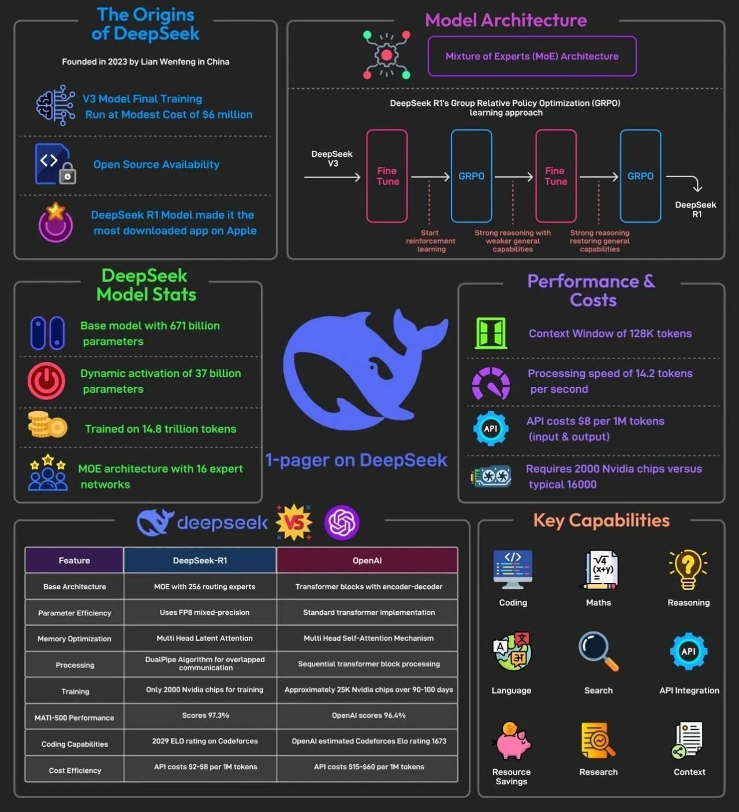

# 1 介绍
DeepSeek-R1 作为 AI 领域又一重要的进展，对机器学习研发社区来说，它的发布意义重大。

主要原因包括：

1. 它是一个开放权重模型，并且提供了蒸馏版本；
2. 它分享并反思了一种新的训练方法，可以用于复现类似 OpenAI O1 这样的推理型模型。

在本文中，我们将深入探讨 DeepSeek-R1 的构建过程。

# 2 三步创建高质量 LLM 的方法

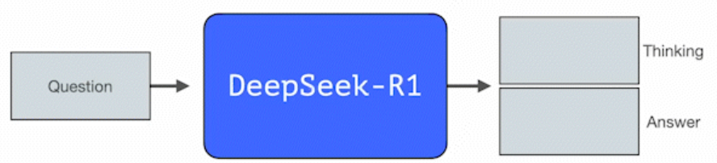

与传统 LLM 逐词生成不同，DeepSeek-R1 通过生成思维链标记，深入处理数学与推理问题，其训练分三步。

三步骤创建高质量 LLM 的一般方法：

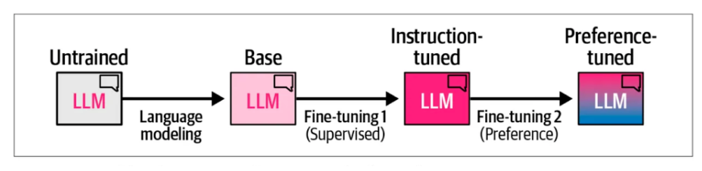

- 语言建模：基于海量网络数据训练基础模型；
- 监督微调（SFT）：提升模型指令遵循与问题解答能力；
- 偏好调整：对齐人类偏好，生成最终可用模型。

# 3 DeepSeek-R1 训练流程

DeepSeek-R1 遵循以下总体流程：模型训练第一步的细节来自之前**DeepSeek-V3**的论文。

R1 使用该论文的基础模型，并仍然经过**监督式微调(SFT)**和**偏好微调**步骤，但其`执行方式有所不同`。

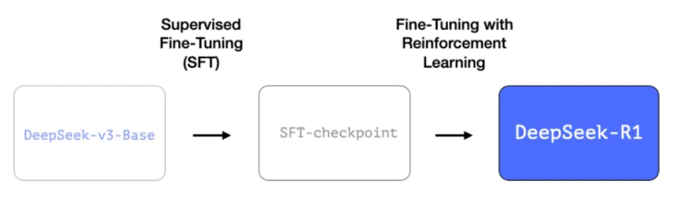

在 R1 的创建过程中，有三点特别值得强调.

## 3.1 长链推理监督微调（SFT）数据

这一过程包含 60 万个**长思维链推理示例**。这些示例非常难以获取，而且`人工标注成本非常高`。这就是为什么其生成流程成为值得关注的第二大技术亮点。 

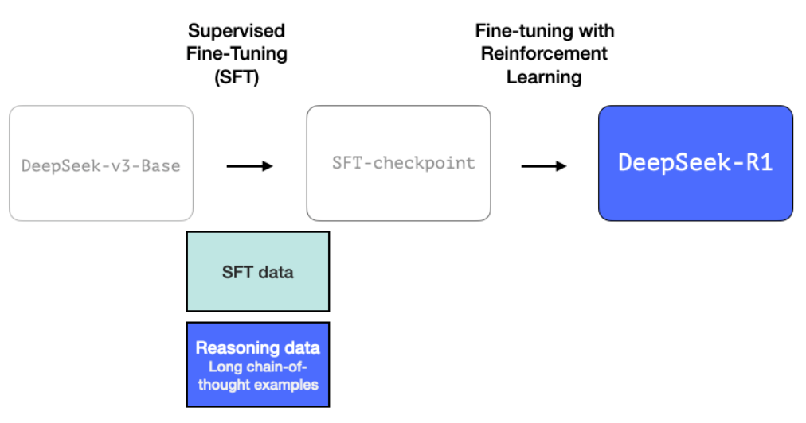

## 3.2 阶段性高质量推理大语言模型（但在非推理任务上表现较弱）

该数据由 R1 的前身模型创建——这是一个未命名但专精推理的兄弟模型。该模型的灵感来源于名为 R1-Zero 的第三代模型（后文将详细讨论）。

其重要性不在于作为可直接使用的优质大语言模型，而在于其构建过程仅需极少量的标注数据配合大规模强化学习，最终造就了一个擅长解决推理问题的模型。

通过这个未命名的专业推理模型生成的输出结果，可进一步训练出更通用的模型。这类通用模型在保持其他非推理任务达到用户对大语言模型预期水平的同时，也能完成复杂推理任务。

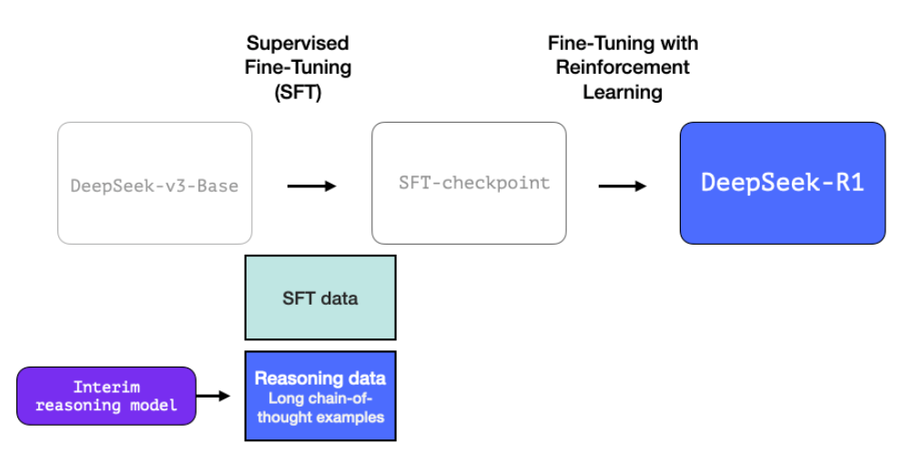

## 3.3 运用大规模强化学习（RL）构建推理模型

这一过程分两步： 

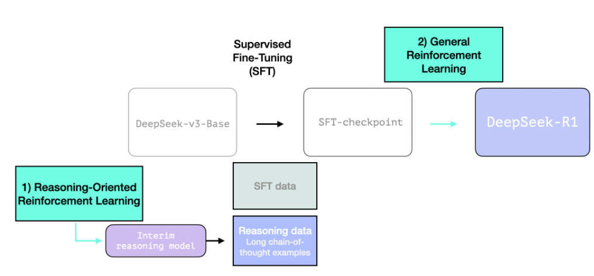

### 3.3.1 大规模推理导向强化学习（R1-Zero）

在这里，强化学习（RL）被用来创建一个中间推理模型。该模型随后用于生成监督微调和推理示例。

而使得创建这个模型成为可能的关键在于：该实验创建了一个名为 DeepSeek-R1-Zero 的前身模型。

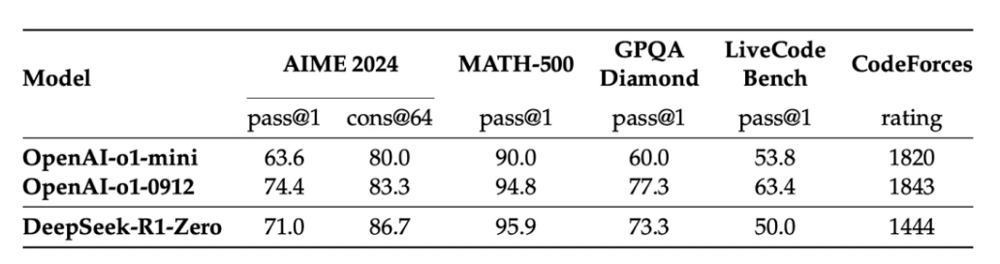

R1-Zero 的特殊之处在于，它无需使用带标签的监督式微调（SFT）训练集，就能在推理任务中表现出色。其训练过程直接从预训练的基础模型开始，通过强化学习（RL）训练流程完成（跳过了 SFT 阶段）。它的表现如此优异，甚至可以与 o1 模型相媲美。

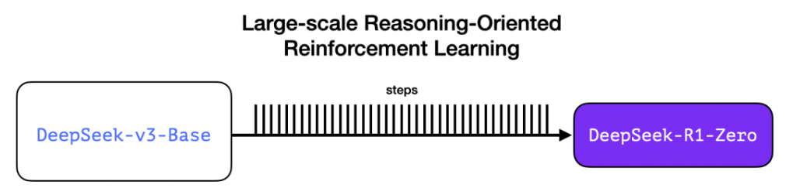

一直以来，数据始终是决定机器学习模型能力的关键要素。那么这个模型是如何打破这一定律的？这涉及两个关键因素： 

- 现代基础模型已经达到了质量和能力的阈值（这个基础模型是在 14.8 万亿个高质量 token 上训练的）。
- 与普通的聊天或写作任务不同，推理类问题可通过自动化方式进行验证和标注。

让我们通过一个例子来说明。以下是强化学习（RL）训练步骤中的一个典型提示词：

> 写一段 Python 代码，接收数字列表并返回排序后的结果，但是需要在列表开头添加数字 42。

像这样的问题适合通过多种方式进行自动验证。假设我们将这个问题提供给正在训练中的模型，它会生成一个答案： 
- 代码格式验证：用代码检查工具（linter）来验证这个答案是否为正确的 Python 代码。 
- 运行时验证：直接运行 Python 代码，看它是否能正常执行。 
- 功能验证：借助现代代码大模型自动生成单元测试（即使这些大模型本身并非推理专家），验证代码是否满足功能要求。 
- 性能优化：更进一步，可测量代码执行时间，在训练过程中引导模型优先选择性能更优的解决方案——即使其他方案同样是正确的 Python 程序。 

通过这种方式，我们可以在训练过程中向模型提出类似的问题，并获得多种可能的解决方案。

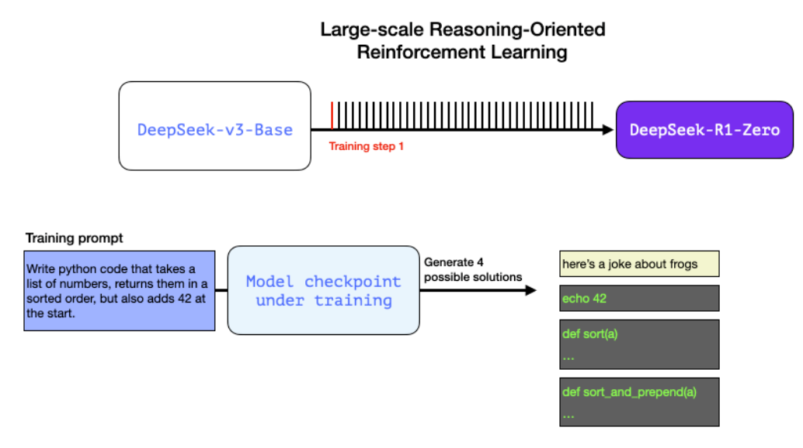

通过自动检查（无需人工干预），我们发现：
- 第一个答案根本不是代码，
- 第二个是代码，但不是 Python 代码，
- 第三个是一个看似可行的解决方案，但没有通过单元测试，
- 第四个才是正确的解决方案。

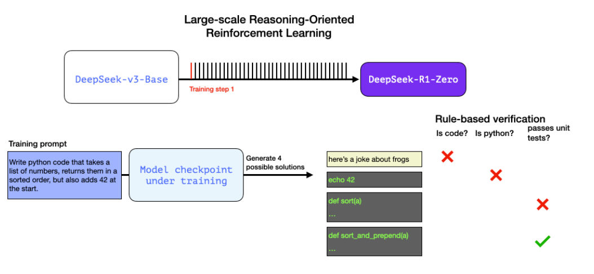

这些自动化生成的训练信号都能直接用于模型优化。这一过程自然需要在小批量样本中处理大量案例，并通过连续训练迭代，逐步优化。

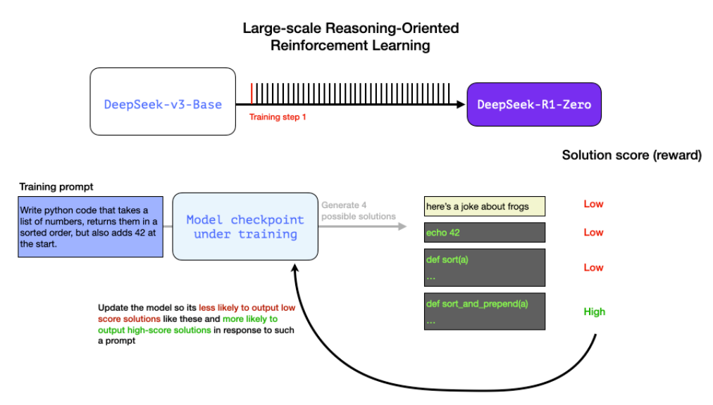

正如论文图 2 所示，在强化学习训练过程中，正是通过这些奖励信号与模型参数更新的动态反馈机制，模型得以在各项任务中持续提升表现。

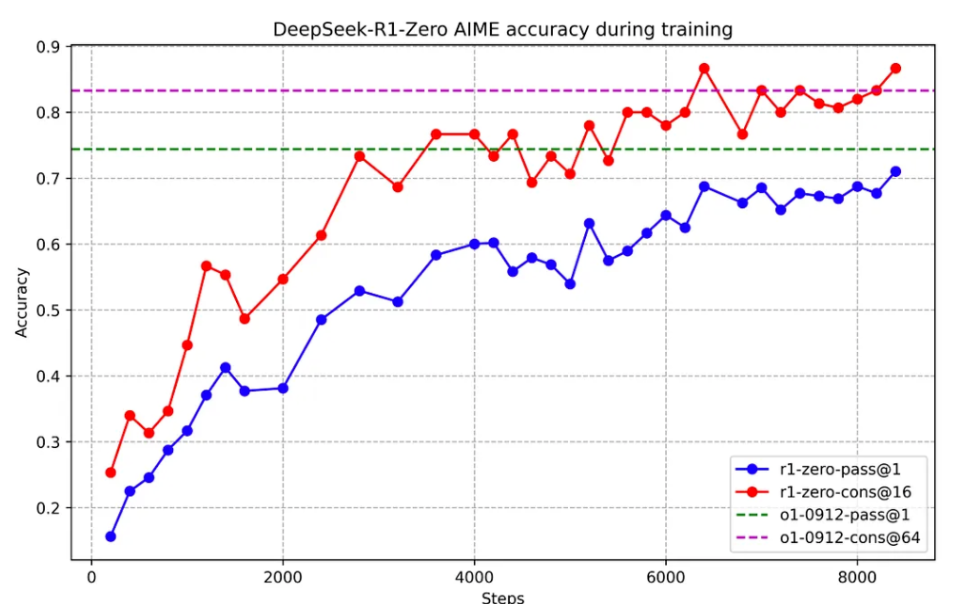

*图2:在训练过程中，DeepSeek-R1-Zero 的 AIME 准确率。对于每个问题，我们会采样 16 个响应并计算总体平均准确率，以确保评估的稳定性.*

模型能力的提升与生成内容长度的增加呈现对应关系——随着处理问题复杂度的提高，模型会生成更多用于推理的思维标记（thinking tokens）。

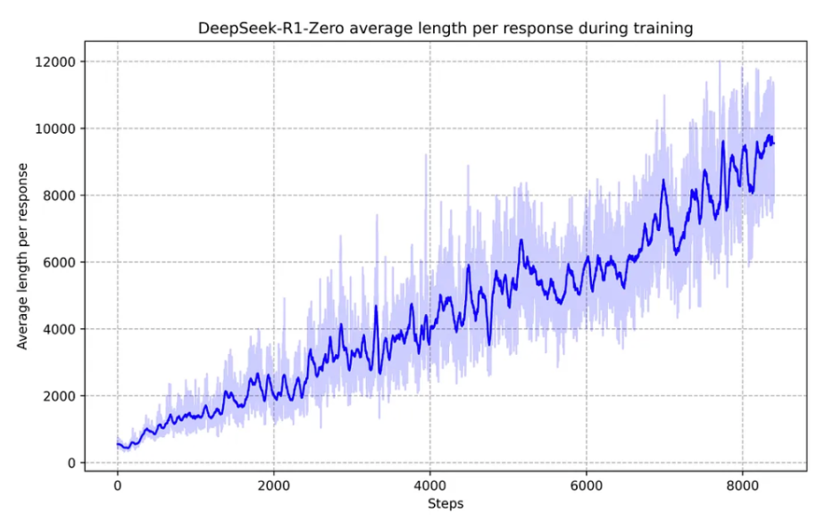

图3:在强化学习过程中，DeepSeek-R1-Zero 在训练集上的平均响应长度。DeepSeek-R1-Zero 自然地学会了通过更多的思考时间来解决推理任务.

> 这个过程是有用的，但尽管 R1-Zero 模型在推理问题上得分很高，它还存在其他缺陷，导致实际可用性不及预期。

> 尽管 DeepSeek-R1-Zero 展现出强大的推理能力，并能自主地发展出意想不到且强大的推理行为，但它仍然面临一些挑战。例如，DeepSeek-R1-Zero 生成的内容可读性差、语言混杂等问题。

R1 的目标旨在实现更优的实用性。因此，R1 并没有完全依赖强化学习过程，而是在以下两个环节进行了优化（如本节前文所述）： 
1. 构建中间推理模型来生成监督式微调（ SFT ）数据点;  
2. 训练 R1 模型以提升推理和非推理问题的处理能力（使用其他类型的验证器） 

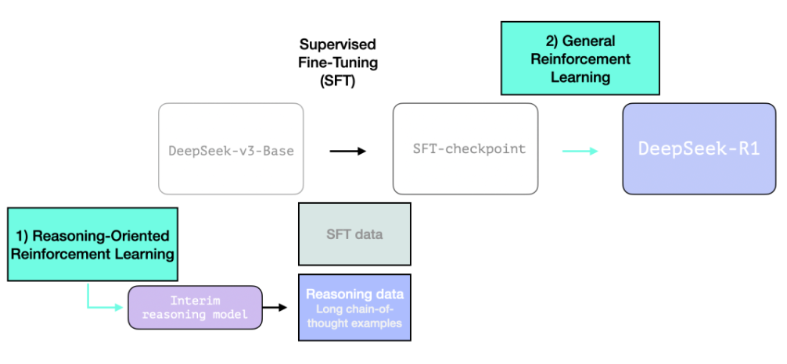

## 3.4 利用中间推理模型创建监督微调（SFT）
推理数据为使中间推理模型更具实用性，需对其进行监督式微调（SFT）训练，训练数据包含数上千个推理问题案例（部分由 R1-Zero 生成并筛选）。论文将此称为“**冷启动数据**”。 

### 3.4.1 冷启动
与 DeepSeek-R1-Zero 不同，为了避免基础模型在强化学习训练初期出现不稳定的冷启动阶段，我们对 DeepSeek-R1 **构建并收集了少量的长思维链（CoT）数据来进行微调模型**，将其作为强化学习（RL）的初始执行体。`采用长思维链作为示例进行少样本(few-shot)提示学习`，直接通过提示词引导模型生成包含反思和验证的详细答案，以可读格式采集 DeepSeek-R1-Zero 的输出，收集 DeepSeek-R1-Zero 的输出并以可读格式呈现，然后通过人工标注者的后处理来优化结果。 

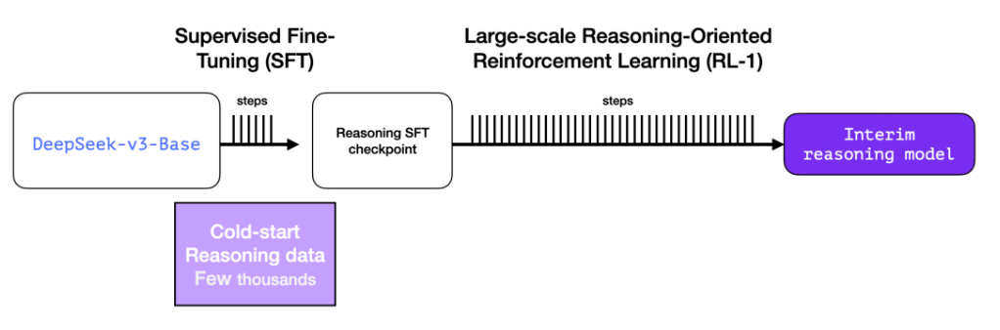

但问题来了——既然已有这类数据，为何仍需依赖强化学习（RL）流程？

核心症结在于数据规模的鸿沟。冷启动数据集可能仅有 5000 个样本（尚可人工收集），但要训练完整的 R1 模型需要 60 万个样本。

中间推理模型正是为了弥合这一差距，通过合成生成海量高价值训练数据而存在。

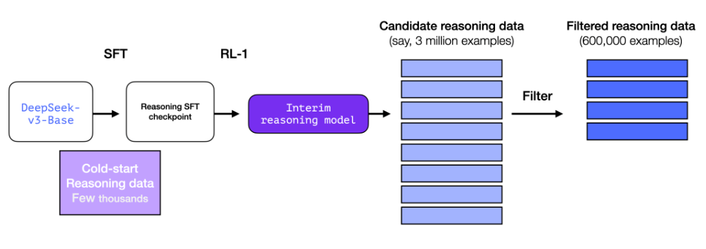

如果你初次接触监督式微调（Supervised Fine-Tuning, SFT）概念，其核心流程是通过向模型提供"输入提示（prompt）"与"正确输出（correct completion）"配对的训练示例来进行优化。 

以下图展示了几个 SFT 训练示例，示例来源：Hands-On Large Language Models 第 12 章。 

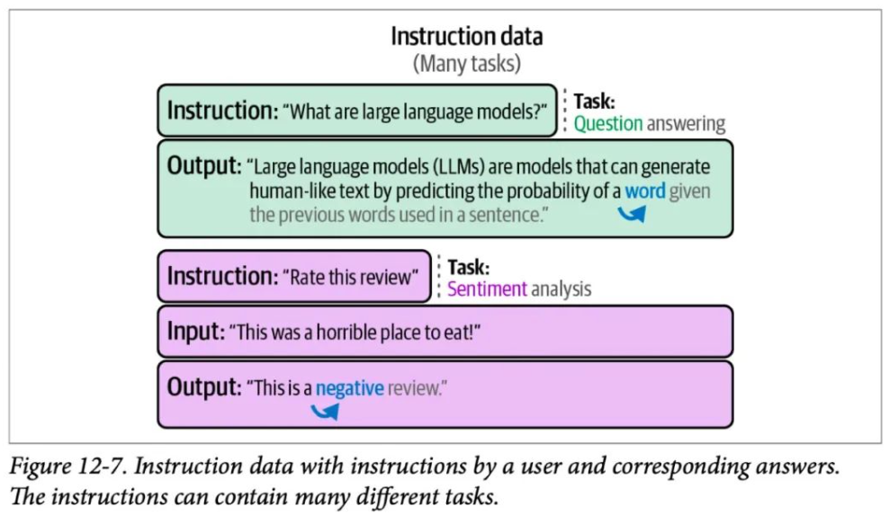

## 3.5 通用强化学习（RL）训练阶段

这使得 R1 模型`不仅在推理任务中表现卓越`，还能胜任`各类非推理任务`。

其训练机制与前述强化学习流程类似，但针对非推理类应用场景进行了扩展优化——通过引入`实用性奖励模型`与`安全性奖励模型`（类似Llama模型的机制）对相关应用的提示进行多维评估。

这种复合奖励机制确保模型在扩展应用边界时，既能保持输出有效性，又能遵循安全伦理规范。

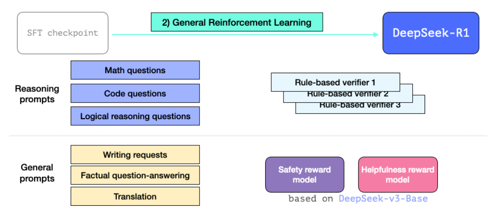

