# 1 强化学习概念介绍
强化学习是机器学习的重要分支，其核心思想是智能体（Agent）通过**与环境的交互**学习最优策略，通过**试错机制**最大化`累积`奖励。以下是详细解析：<br>

# 1.1 强化学习核心概念
1. 交互式学习机制

强化学习强调智能体与环境的动态交互，通过奖励信号（正/负反馈）调整策略。例如自动驾驶汽车通过环境反馈（碰撞惩罚、安全行驶奖励）优化决策45。

2. 关键组成要素

- 策略（Policy）：从状态到动作的映射，可分为确定性策略（如直接选择最优动作）或随机策略（如概率选择）。

- 奖励（Reward）：环境反馈的标量值，用于评价动作效果（如游戏得分、任务完成度）。

- 价值函数（Value Function）：`评估长期累积奖励的预期`，如状态价值函数（某状态的未来收益）和动作价值函数（某状态下执行某动作的未来收益）。

- 环境模型（Model）：可选组件，用于预测状态转移和奖励（Model-based方法），若无模型则直接依赖经验（Model-free方法）。

- 与监督学习的区别: 监督学习依赖静态数据集和标签，而强化学习通过动态试错获取数据，更适用于序列决策问题（如机器人控制、游戏策略）14。


# 1.2 强化学习常用方法
强化学习的常用学习方法可分为三大类：<br>

>基于价值的方法;
>基于策略的方法;
>两者的结合混合方法（Actor-Critic）.

同时根据是否依赖环境模型可分为Model-Based与Model-Free方法。以下分类详解及Actor-Critic的归属说明：

### 1.2.1 基于价值的方法
核心思想：通过估计状态或状态-动作对的长期价值（如Q值）选择最优动作。
特点：

适合离散动作空间（如游戏中的按键选择）。
需维护价值表或价值网络。

### 1.2.2 基于策略的方法
核心思想：直接优化策略函数（如神经网络），输出动作概率分布。
特点：

适合连续动作空间（如机器人运动控制）。
通过策略梯度更新参数。

### 1.2.3 混合方法（Actor-Critic）
核心思想：结合策略网络（Actor）和价值网络（Critic），Actor生成动作，Critic评估动作价值，实现单步更新和稳定学习。
特点：

平衡策略梯度与价值估计，提升效率和稳定性。
适用于复杂任务（如机器人控制、游戏策略）。

### 1.2.4 Model-Based与Model-Free方法
Model-Based：建立环境模型预测状态转移（如AlphaGo的蒙特卡洛树搜索）。
Model-Free：直接通过交互经验学习（如Q-Learning、Actor-Critic）。

# 2 ChatGPT 背后的“功臣”——RLHF (Reinforcement Learning with Human Feedback) 技术详解

- [文档连接](https://huggingface.co/blog/zh/rlhf)
- [论文链接](https://arxiv.org/pdf/1706.03741)
- [Fine-Tuning Language Models from Human Preferences](https://arxiv.org/pdf/1909.08593)

*在策略优化中，KL 散度用于限制新旧策略之间的差异，确保策略更新不会过于激进* <br>

在Reward model的训练中，我们需要人的参与，human labelers给policy模型生成的文本进行选择「比如在四个答案选项(y0，y1，y2，y3)中选择一个最好的」，这个选择作为reward model学习的标签.<br>
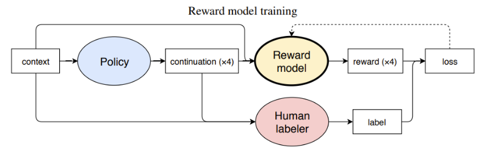

Reward mode训练好后，那么在训练policy model时，Reward model便可以完全取代human labeler选择，这种基于偏好的选择作为信号传给policy model，再利用OpenAI默认的策略优化算法PPO来训练.
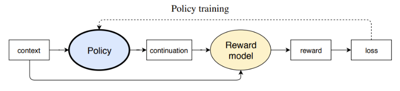

# 3 从 RLHF 到 PPO

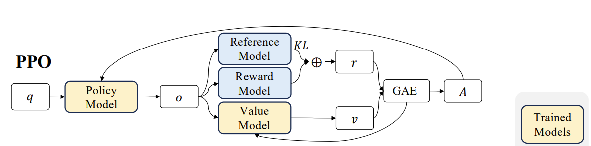

## 3.1 背景

&nbsp;&nbsp;&nbsp;&nbsp;&nbsp;&nbsp;&nbsp;&nbsp;在强化学习（RL）中，仅仅知道“你得了多少分”往往是不够的。单纯追求高分可能会导致各种副作用，比如过度探索、模型不稳定，甚至产生偏离合理策略的“走捷径”行为。为了解决这些挑战，强化学习引入了多种机制，如评论者（价值函数）、裁剪操作、参考模型，以及最近提出的群相对策略优化（GRPO）。<br>

&nbsp;&nbsp;&nbsp;&nbsp;&nbsp;&nbsp;&nbsp;&nbsp;为了让这些概念更加直观，我们来打个比方：把强化学习的训练过程想象成小学考试的场景。我们（正在训练的模型）就像是**学生**，努力争取高分；给老师批改试卷就像**奖励模型**，而父母根据我们的成绩给零花钱则类似于**评论者**的作用。接下来，我们一步步来探讨为什么仅看最终分数是不够的，评论者、裁剪操作和参考模型是如何发挥作用的，以及GRPO是如何扩展这些理念的。<br>


# 3.2 仅使用奖励模型(Reward Model)

假设我和弟弟在同一个小学班级。老师给我们的考试打分，给出“绝对分数”。我通常能得80分以上（满分100分），而弟弟常常只得30分左右。然后，我们直接拿着这些分数去找爸爸要零花钱——也就是说，我们的“奖励”（在强化学习的术语中）就是我们的原始考试分数。谁得分高，谁得到的零花钱就多。

乍一看，这似乎没什么问题。但很快就出现了两个大问题：

不公平：如果弟弟通过努力学习，从30分提高到60分，但与我通常的80多分相比，仍然相形见绌。他并没有得到应有的鼓励。

不稳定：我自己为了追求更高的分数，可能会采**取极端的学习方法**（例如，不分昼夜地死记硬背，熬夜到很晚）。有时我可能得95分，有时却只得60分，因此我的分数——以及由此产生的奖励信号——**波动很大**。<br>

结果，`使用绝对分数作为奖励会导致奖励波动很大，而我弟弟最终会觉得，一点点地进步根本不值得。` <br>

**数学对应关系** <br>

在RL中，如果我们仅这样做：<br>

$$J_{\text{naive}}(\theta) = \mathbb{E}_{(q,o) \sim (\text{data}, \pi_\theta)}[r(o)]$$

这意味着“仅优化最终奖励”，我们可能会遇到`高方差和对部分改进激励不足的问题`。换句话说，行动者（Actor）缺乏一个与其当前水平相匹配的基准，这会妨碍训练效率。<br>

# 3.3 引入评论者(Value Module)：使用“预测分数线”来改进奖励

认识到这个问题后，爸爸意识到“重要的不仅仅是绝对分数，还有相对于你当前水平的进步程度”。

于是他决定：

把我的**预测分数线**定在80分，我弟弟的定在40分。如果我们考试超过这些分数线，就能得到更多零花钱；如果没达到，就只能得到很少或者根本没有。

因此，如果我弟弟努力学习，从30分跳到60分，他就比他的“预测分数线”高出20分，这将转化为丰厚的奖励。与此同时，如果我保持在80分左右，那么增量收益就较小，所以我并不一定比他得到的多很多。这样的安排鼓励每个人从自己的基线出发去进步，而不是单纯比较绝对分数。

当然，爸爸很忙，所以一旦设定了分数线，它并不会保持不变——他需要根据我们的进步不断“调整”。如果我弟弟的水平提升到60分左右，那么40分的基线就不再公平了。同样，如果我一直徘徊在85分左右，爸爸可能也需要调整我的分数线。换句话说，爸爸也需要学习，特别是要了解我和弟弟进步的速度。

**数学对应关系** <br>

在强化学习中，这个“分数线”被称为**价值函数 $V_\psi(s)$** 它作为一个基准。我们的训练目标从“仅奖励”演变为“我们超出这个基准多少”，这通过优势（Advantage）来表达：

$$A_t = r_t - V_\psi(s_t)$$

对于给定的状态 \(s_t\) 和动作 \(o_t\)，如果实际奖励超过了评论者的预期，就意味着执行的动作比预测的要好。如果实际奖励较低，则该动作表现不佳。在最简单的形式中，我们优化的是类似这样的目标：

$$ J_{\text{adv}}(\theta) = \mathbb{E}[A(o)] $$

$$ A(o) = r(o) - V_\psi(o) $$

通过`减去这个分数线`，我们减少了训练中的**方差**，对超出预期的动作给予更高的梯度信号，并对未达到预期的动作进行惩罚。


# 3.4 添加裁剪和最小值操作：防止过度更新

即使有了“分数线”，也可能出现新的问题。例如：

如果我突然在考试中取得突破，得了95分或100分，爸爸可能会给我巨额奖励，促使我在下次考试前采取过于激进的学习模式。我的成绩可能会在极端之间波动（95分和60分），导致奖励大幅波动。

因此，爸爸决定适度调整我每一步更新学习策略的幅度——他`不会仅仅因为一次考试考得好就给我指数级更多的零花钱。`如果给得太多，我可能会走向*极端探索*；如果给得太少，我又会缺乏动力。所以他必须找到一种平衡。

**数学对应关系** <br>

在PPO（近端策略优化）中，这种平衡是通过“裁剪”机制实现的。PPO目标的核心包括：

$$\min\left(r_t(\theta)A_t, \text{clip}\left(r_t(\theta), 1 - \epsilon, 1 + \epsilon\right)A_t\right)$$

其中

$$r_t(\theta) = \frac{\pi_\theta(o_t \mid s_t)}{\pi_{\theta_{\text{old}}}(o_t \mid s_t)}$$

表示对于该动作，*新策略和旧策略之间的概率比率*。如果比率偏离1太远，它会被裁剪到\([1 - \epsilon, 1 + \epsilon]\)范围内，这限制了策略在一次更新中可以改变的程度。<br>

用更简单的话来说：<br>

考100分能让我获得额外奖励，但爸爸设定了一个“上限”，以防止我过度。然后，他会在下次考试时重新评估，保持一种稳健的方法，而不是助长极端波动。<br>

# 3.5 参考模型(Reference Model)：防止作弊和极端策略

即便如此，如果我仅仅盯着高分，我可能会采取一些可疑的手段——比如作弊或威胁老师给我打满分。显然，这违反了所有规则。在大型语言模型的领域，类似的情况就是生成有害或虚构的内容来人为地提高某些奖励指标。

因此，爸爸设定了一条额外的规则：

“无论如何，你都不能太偏离你最初、诚实的学习方法。如果你偏离了你的基线太多，即使分数很高，我也会取消你的资格，并扣发你的零花钱。”

这类似于在学期开始时（即初次**监督微调后**）划定一条“参考线”。你不能偏离那条最初的策略太远，否则就会面临惩罚。

**数学对应关系** <br>

在PPO中，这通过添加一个**针对参考模型（即初始策略）的KL散度惩罚**来体现。具体来说，我们在损失函数中加入类似以下的内容：

$$-\beta D_{\text{KL}}(\pi_\theta \, \| \, \pi_{\text{ref}})$$

这可以防止行动者（Actor）偏离原初的、合理的策略太远，从而避免“作弊”或其他极端越界行为。


# 4 从 PPO 到 GRPO

## 4.1 GRPO：用“多个模拟平均值”替代价值函数（取消Value Model）
&nbsp;&nbsp;&nbsp;&nbsp;&nbsp;&nbsp;&nbsp;&nbsp;有一天，爸爸说：“我没有时间一直评估你们的学习进度，并不断画出新的分数线。为什么不先做五组**模拟测试**，然后取它们的平均分作为你的预期分数呢？如果你在真实测试中超过了这个平均分，那就说明你做得比自己的预期好，所以我会奖励你。否则，你得不到太多奖励。”我和弟弟，以及可能还有更多的同学，都可以依靠各自的一组模拟测试，而不是爸爸需要不断调整的外部“价值网络”。

&nbsp;&nbsp;&nbsp;&nbsp;&nbsp;&nbsp;&nbsp;&nbsp;到目前为止，我们看到`PPO依赖于Actor（行动者）+ Critic（评论家）+ Clip（裁剪）+ KL惩罚框架` 。然而，在大型语言模型（LLM）场景中，Critic（价值函数）往往需要与Actor**一样大**，才能准确评估状态，这可能会很昂贵，有时也不切实际——特别是如果你只在最后得到一个最终奖励（比如最终答案的质量）。

因此，group相对策略优化（GRPO）应运而生。其核心思想是：

- 不需要为Critic设置单独的value network，
- 对同一问题或状态，**从旧策略中采样多个输出**，
- 将这些输出的平均奖励视为基线，
- 任何高于平均值的都产生“正优势”，任何低于平均值的都产生“负优势”。

同时，GRPO保留了PPO的Clip和KL机制，以确保稳定、合规的更新。


**数学对应关系**

根据DeepSeekMath的技术报告，GRPO（群体相对策略优化）的目标函数（省略了一些符号）为：

$$J_{\text{GRPO}}(\theta) = \mathbb{E}\left[ \sum_{i=1}^{G} \left( \min\left( \frac{\pi_{\theta}(o_i)}{\pi_{\theta_{\text{old}}}(o_i)} A_i, \text{clip}\left( \frac{\pi_{\theta}(o_i)}{\pi_{\theta_{\text{old}}}(o_i)}, 1 - \epsilon, 1 + \epsilon \right) A_i \right) - \beta D_{\text{KL}}(\pi_{\theta} \, \| \, \pi_{\text{ref}}) \right) \right],$$

其中

$$A_i = \frac{r_i - \text{mean}(\{r_1, r_2, \cdots, r_G\})}{\text{std}(\{r_1, r_2, \cdots, r_G\})}$$

&nbsp;&nbsp;&nbsp;&nbsp;&nbsp;&nbsp;&nbsp;&nbsp;`通过对同一问题的多个输出求平均并进行归一化，计算出一个“相对分数”`。这样，我们就不再需要一个专门的价值函数，但仍然可以得到一个动态的“分数线”，从而**简化训练并节省资源**。<br>

## 4.2 回顾与未来展望

通过小学考试的类比，我们一步步从原始的绝对分数，到PPO的完整机制（Critic、Advantage、Clip、Reference Model），最后到GRPO（利用多个输出的平均分数来消除价值函数）。以下是一些关键要点：

Critic的作用：为每个状态提供一个“合理预期”，显著减少训练方差。

Clip & min机制：限制更新幅度，防止对某一次“突破性”考试过度反应。

Reference Model（参考模型）：防止“作弊”或极端偏差，确保策略与其初始状态保持合理一致。

GRPO的优势：在大型语言模型中，它消除了对单独价值网络的需求，降低了内存和计算成本，同时与“比较式”奖励模型设计很好地契合。

就像爸爸转而“让孩子们自己模拟多次考试，然后将他们的平均分作为基线”一样，GRPO避免了维护一个庞大的Critic，同时仍然提供了相对奖励信号。它保留了PPO的稳定性和合规性特性，但简化了过程。

希望这篇文章能帮助你自然地掌握PPO和GRPO。如果你对过程监督或迭代强化学习等话题感兴趣，请关注我的博客以获取更多更新。

# 5 PPO 训练细节
- [论文地址-EN](https://arxiv.org/pdf/1707.06347)
- [论文地址-CN](https://yiyibooks.cn/arxiv/1707.06347v2/index.html)
- [Secrets of RLHF](https://arxiv.org/pdf/2401.06080)

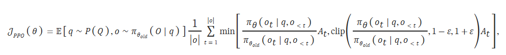

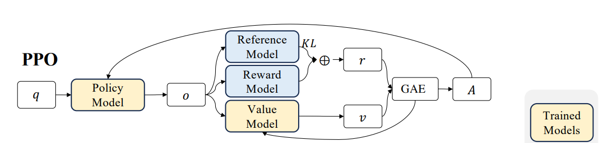


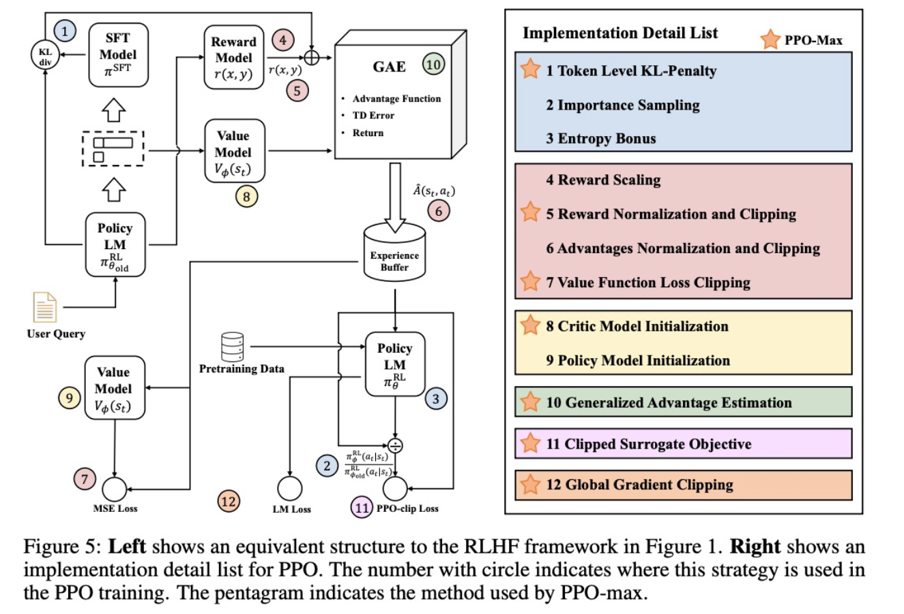

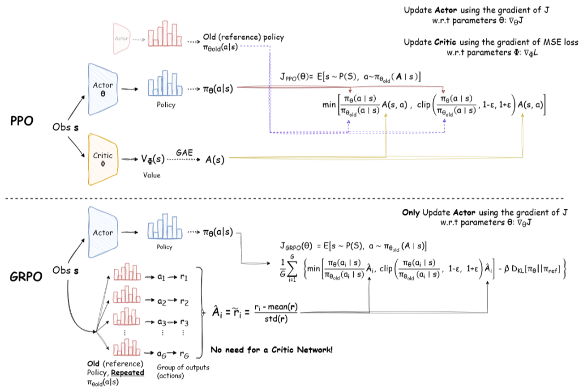

## 5.1 ratio

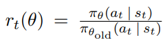

*ratio表示新旧策略在相同状态下选择某个动作的概率比值，即 π_new(a|s) / π_old(a|s)，这一比值被称为重要性采样比率（Importance Sampling Ratio）。它用于衡量新策略相对于旧策略的动作选择概率变化，是策略优化过程中评估动作价值的重要依据*

ratio 仅针对新粗略实际选择的token计算，与其他token无关。

**example:**
```bash
旧策略：P(“mat”)=0.6，P(“rug”)=0.1；
新策略：P(“mat”)=0.75，P(“rug”)=0.3；
若新策略选择“rug”：
ratio = 0.3 / 0.1 = 3；
旧策略未选择“rug”的概率会被忽略。
```

## 5.2 Advantage 优势函数

# GAE（Generalized Advantage Estimation）公式说明

### 1. 时间步差值（Delta）计算
时间步差值 \(\delta_t\) 表示当前时间步的优势估计，其公式如下：

\[
\delta_t = r_t + \gamma V(s_{t+1}) - V(s_t)
\]

其中：
- \(r_t\): 当前时间步的奖励
- \(V(s)\): 值函数（Critic）对状态 \(s\) 的预测值
- \(\gamma\): 折扣因子（通常取值范围为 0.9 ~ 0.99）

---

### 2. GAE 累积计算
GAE 的累积优势函数 \(A_t\) 通过加权求和多个时间步差值 \(\delta_t\) 来计算，其公式如下：

$$A_t = \sum_{k=0}^{T-t} (\gamma \lambda)^k \delta_{t+k}$$

其中：
- \(\lambda\): 平衡偏差与方差的超参数（通常取值范围为 0.95 ~ 0.99）
- \(T\): 时间步总数
- \((\gamma \lambda)^k\): 指数衰减权重

在实际实现中，通常采用反向递归的方式高效计算。

---

### 3. 归一化处理
为了稳定训练，通常对优势函数 \(A_t\) 进行标准化处理，包括以下步骤：
1. 计算所有时间步优势值的均值 \(\mu_A\) 和标准差 \(\sigma_A\)。
2. 对每个时间步的优势值进行标准化：

\[
\hat{A}_t = \frac{A_t - \mu_A}{\sigma_A}
\]

这种方式可以减少训练过程中梯度爆炸或消失的风险，从而提升模型稳定性。

### 4 奖励函数

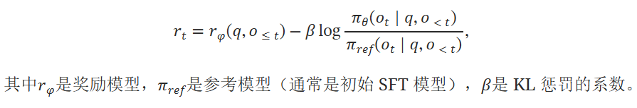

## 5.3 代码实现
- [](https://github.com/dkarunakaran/ppo-pytorch#)


# 6 GRPO 论文
- [论文地址-EN](https://arxiv.org/pdf/2402.03300)
- [论文地址-EN](https://yiyibooks.cn/arxiv/2402.03300v3/index.html)

## 6.1 相关公式
- 公式
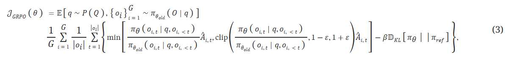

- kl-散度
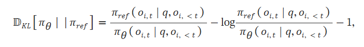

- AGE 函数
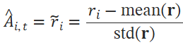

## 6.2 图表解释

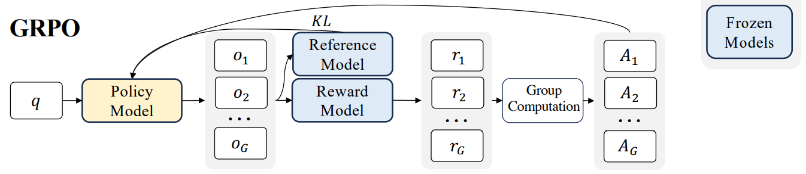

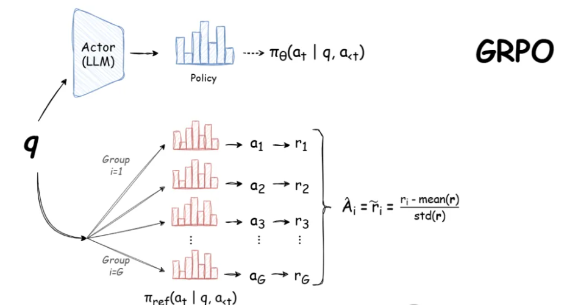

## 6.3 举例
```python
Query: “What is 2 + 3?”

Step 1: LLM generates three answers.
1. “5”
2. “6”
3. “2 + 3 = 5”

Step 2: Each answer is scored.
1. “5” → 1 points (correct, no reasoning)
2. “6” → 0 points (incorrect)
3. “2 + 3 = 5” → 2 points (correct, w/ reasoning)

Step 3: Compute avg score for entire group.
Avg score = (1 + 0 + 2) / 3 = 1

Step 4: Compare each answer score to avg.
1. “5” → 0  (same as avg)
2. “6” → -1 (below avg)
3. “2 + 3 = 5” → 1 (above avg)

Step 5: Reinforce LLM to favor higher scores.
1. Favor responses like #3 (positive)
2. Maintain responses like #1 (neutral)
3. Avoid responses like #2 (negative)

This process is repeated, allowing the model to learn and improve over time.
```


# 参考文档
- [PPO: Proximal Policy Optimization](https://arxiv.org/abs/1707.06347)
- [PPO-GRPO 公式详解](https://yugeten.github.io/posts/2025/01/ppogrpo/)
