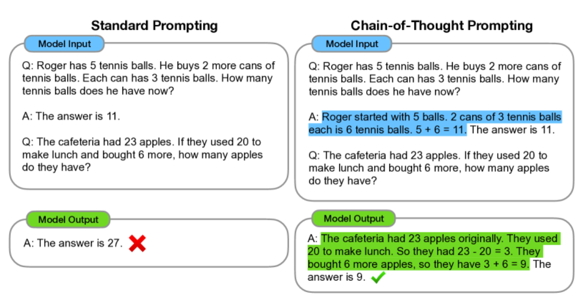
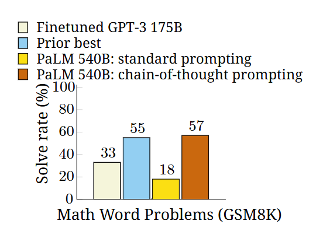
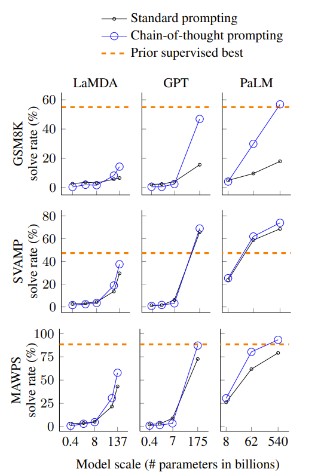
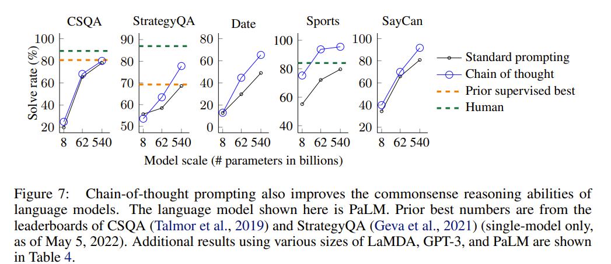
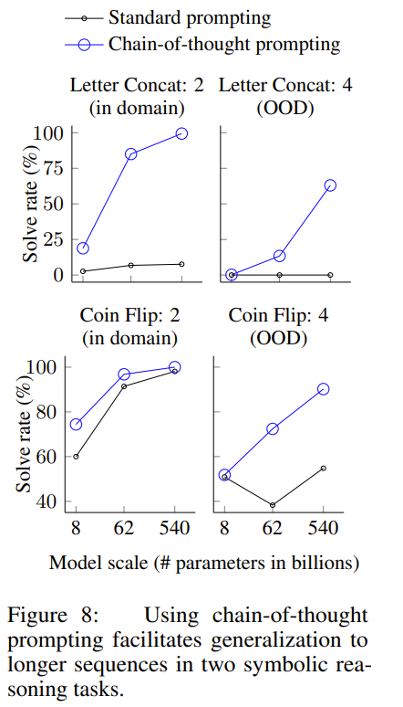
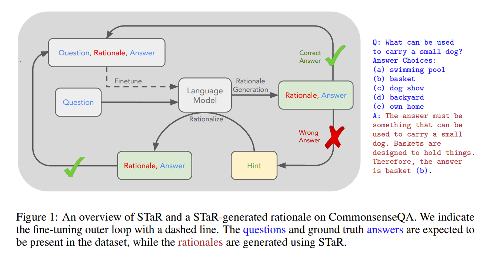

# 0 Chain-of-Thought Prompting Elicits(引发) Reasoning(推理) in Large Language Models

- [论文地址-EN](https://arxiv.org/abs/2201.11903)
- [论文地址-EN](https://yiyibooks.cn/arxiv/2201.11903v6/index.html)


# 摘要
我们探索了生成 思维链(一系列中间推理步骤), 如何显著提高大型语言模型执行复杂推理的能力。 特别是，我们展示了这种推理能力如何通过一种名为 **思维链提示(chain-of-thought prompting)** 的简单方法，自然地出现在足够大的语言模型中，其中在提示中提供了一些思维链演示作为范例。

在三个大型语言模型上的实验表明，`思维链提示提高了在各种算术、常识和符号推理任务上的性能`。 经验上的增益可能很显著。 例如，仅仅用八个思维链范例提示一个 PaLM 540B，就能在 GSM8K 数学文字问题基准测试中达到最先进的准确率，甚至超过了经过微调的 GPT-3，并配备了一个验证器.

# 1引言
近年来，语言模型彻底改变了 NLP 领域 (Peters 等人，2018；Devlin 等人，2019；Brown 等人，2020，等等)。 扩大语言模型的规模已被证明具有多种优势，例如提高性能和样本效率 (Kaplan 等人，2020；Brown 等人，2020，等等)。 但是，`仅扩大模型规模不足以在诸如算术、常识和符号推理等具有挑战性的任务上实现高性能` (Rae 等人，2021)。

本文探讨了如何**通过一种简单的方法来释放大型语言模型的推理能力**，这种方法的灵感来自两个想法。 **首先**，算术推理技术可以从生成自然语言理由中获益，这些理由可以得出最终答案。 之前的工作已经赋予模型从头开始训练 (Ling 等人，2017) 或微调预训练模型 (Cobbe 等人，2021) 的能力，从而生成自然语言中间步骤，除此之外还有神经符号方法，这些方法使用形式语言而不是自然语言 (Roy 和 Roth，2015；Chiang 和 Chen，2019；Amini 等人，2019；Chen 等人，2019)。 **其次**，大型语言模型为`通过提示进行上下文少样本学习提供了令人兴奋的可能性`。 也就是说，可以简单地用一些演示任务的输入-输出示例“提示”模型，`而不是为每个新任务微调一个单独的语言模型检查点`。 值得注意的是，这在各种简单的问答任务中取得了成功 (Brown 等人，2020)。

但是，以上两个想法都存在关键局限性。 对于rationale-augmented 训练和微调方法，创建大量高质量理由(rationales)成本很高，这比正常机器学习中使用的简单输入-输出对复杂得多。 对于 Brown 等人 (2020) 中使用的传统少样本(few-shot)提示方法，它在需要推理能力(reasoning abilities)的任务中效果很差，并且随着语言模型规模的增加通常没有显著提高 (Rae 等人，2021)。 在本文中，我们将这两种想法的优势结合起来，以一种避免其局限性的方式。 具体来说，我们探讨了语言模型在给定一个由**三元组**组成的提示的情况下执行少样本提示推理任务的能力：**⟨输入，思维链，输出⟩**。 一个`思维链(CoT) 是一个通向最终输出的中间自然语言推理步骤序列`，我们将这种方法称为**思维链提示**。 图 1 中显示了一个示例提示。<br>



*图 1： 思维链提示使大型语言模型能够解决复杂的算术、常识和符号推理任务。 突出显示了思维链推理过程。*

我们对算术、常识和符号推理基准进行了实证评估，结果表明**思维链提示优于标准提示**，`有时甚至有惊人的程度`。 图 2 展示了其中一个结果——在 GSM8K 数学文字问题基准 (Cobbe 等人，2021) 上，使用 PaLM 540B 的思维链提示在很大程度上优于标准提示，并取得了`最新的性能`。 仅提示方法很重要，因为它不需要大型训练数据集，并且单个模型检查点可以在`不损失通用性的情况下执行许多任务`。 这项工作强调了大型语言模型如何通过几个关于任务的自然语言数据示例来学习（参见 通过大型训练数据集自动学习输入和输出背后的模式）。<br>



*PaLM 540B 使用思维链提示在 GSM8K 数学文字问题基准测试中取得新的最先进的性能。 经过微调的 GPT-3 和之前最好的来自 Cobbe 等人 (2021)。* <br>

# 2 思维链提示

考虑一下`人们在解决复杂推理任务（例如多步骤数学文字问题）时的思考过程`。 通常将问题分解为中间步骤并在给出最终答案之前解决每个步骤：<br>

```bash
"After Jane gives 2 flowers to her mom she has 10…
 then after she gives 3 to her dad she will have 7…
 so the answer is 7."
```

本文的目标是**赋予语言模型生成类似思想链的能力**——a一系列连贯的中间推理步骤，得出问题的最终答案。 我们将证明，如果在少样本(few-shot)提示的示例中提供了思维链推理的演示，那么足够大的语言模型就可以生成思维链。<br>

图 1 显示了一个模型生成思维链来解决一个它本来会错误的数学文字问题的例子。 在这种情况下，思维链类似于一个解决方案，可以被解释为一个解决方案，但我们仍然选择称它为思维链，以更好地捕捉它`模仿一个逐步思考过程以得出答案的想法`（而且，解决方案/解释通常在最终答案 之后出现 (Narang 等人，2020; Wiegreffe 等人，2022; Lampinen 等人，2022，等等)）。<br>

思维链提示作为一种促进语言模型推理的方法，具有几个吸引人的特性。<br>

1. 首先，原则上，思维链允许模型将多步骤问题分解成中间步骤，这意味着`可以将额外的计算分配给需要更多推理步骤的问题`。<br>
2. 其次，思维链提供了一个可解释的窗口，可以观察模型的行为，表明它可能如何得出特定答案，并提供调试推理路径出错位置的机会（尽管完全描述支持答案的模型计算仍然是一个开放性问题）。<br>
3. 第三，思维链推理可以用于数学文字问题、常识推理和符号操作等任务，并且原则上可能适用于人类可以通过语言解决的任何任务。<br>
4. 最后，通过将思维链序列的示例包含在少样本提示的示例中，可以很容易地在足够大的现成语言模型中`激发思维链推理`。<br>

在实证实验中，我们将观察思维链提示在算术推理 (第 3 节)、常识推理 (第 4 节) 和符号推理 (第 5 节) 中的效用。<br>

# 3 算术推理
我们首先考虑 图 1 中形式的数学文字题，它们衡量语言模型的算术推理能力。 尽管对人类来说很简单，但`算术推理是语言模型常常难以完成的任务` (Hendrycks 等人，2021；Patel 等人，2021，等等)。 令人惊讶的是，`当与 540B 参数语言模型一起使用时，思维链提示在多个任务上的表现与特定于任务的**微调模型**相当`，甚至在具有挑战性的 GSM8K 基准测试中取得了新的最先进水平 (Cobbe 等人，2021)。



*Chain-of-thought prompting enables large language models to solve challenging math problems. Notably, chain-of-thought reasoning is an emergent ability of increasing model scale. Prior best numbers are from Cobbe et al. (2021) for GSM8K, Jie et al. (2022) for SVAMP, and Lanet al. (2021) for MAWPS.* <br>

# 4 常识推理
虽然思维链特别适合数学文字题，但思维链的语言性质实际上使其适用于广泛的常识推理问题，这些问题涉及在一般背景知识的前提下推理物理和人类的互动。 常识推理是与世界互动的关键，目前自然语言理解系统还无法做到 (Talmor 等人，2021)。

基准。 我们考虑了涵盖各种常识推理类型的五个数据集。 流行的 CSQA (Talmor 等人，2019) 提出关于世界的问题，这些问题涉及复杂的语义，通常需要先验知识。 StrategyQA (Geva 等人，2021) 要求模型推断出多跳策略来回答问题。 我们从 BIG-bench 项目 (BIG-bench 合作，2021) 中选择了两个专门的评估集：日期 理解，涉及从给定上下文中推断日期，以及 体育 理解，涉及确定与体育相关的句子是合乎情理还是不合乎情理。 最后，SayCan 数据集 (Ahn 等人，2022) 涉及将自然语言指令映射到来自离散集的一系列机器人动作。 图 3 展示了所有数据集的思维链注释示例。

提示。 我们遵循与上一节相同的实验设置。 对于 CSQA 和 StrategyQA，我们从训练集中随机选择示例，并手动为它们编写思维链，用作少样本示例。 两个 BIG-bench 任务没有训练集，因此我们在评估集中选择了前十个示例作为少样本示例，并在评估集的其余部分报告数据。 对于 SayCan，我们使用了来自 Ahn 等人 (2022) 中训练集的六个例子，并手动编写了思维链。

结果。 图 7 突出了 PaLM 的这些结果（LaMDA、GPT-3 和不同模型规模的完整结果见 表 4）。 对于所有任务，扩大模型规模都提高了标准提示的性能；思维链提示进一步提高了性能，在 PaLM 540B 上改进最为明显。 使用思维链提示，PaLM 540B 相对于基线取得了优异的性能，在 StrategyQA 上超越了之前最先进的水平 (75.6% 对比 69.4%)，并在体育理解方面超越了没有帮助的体育爱好者 (95.4% 对比 84%)。 这些结果表明，思维链提示也可以提高需要各种常识推理能力的任务的性能（但请注意，CSQA 上的增益很小）。



# 5 符号推理

我们最后的实验评估考虑了符号推理，这对人类来说很简单，但对语言模型来说可能具有挑战性。 我们表明，思维链提示不仅使语言模型能够执行标准提示设置中具有挑战性的符号推理任务，而且还促进了长度泛化，以推断比少样本示例中看到的更长的推理时间输入。

**任务。**

我们使用以下两个玩具任务。

• 最后一个字母连接。 此任务要求模型连接姓名中单词的最后一个字母（例如，“Amy Brown” →  “yn”）。 这是一个比第一个字母连接更具挑战性的版本，语言模型已经可以在没有思维链的情况下执行。 3 我们通过随机连接姓名普查数据 (https://namecensus.com/) 中前一千个常用名字和姓氏来生成完整的姓名。
• 抛硬币。 此任务要求模型回答在人们翻转或不翻转硬币后，硬币是否仍然正面朝上（例如， “一枚硬币正面朝上。 菲比翻转了硬币。 奥斯瓦尔多没有翻转硬币。 硬币仍然是正面朝上吗？” → “否”）。

由于这些符号推理任务的构建是明确定义的，因此对于每个任务，我们考虑一个域内测试集，其中示例的步骤数与训练/少样本示例相同，以及一个域外（OOD）测试集，其中评估示例的步骤数比示例中的步骤数更多。 对于最后一个字母的连接，模型只看到两个词的名称的示例，然后对三个词和四个词的名称执行最后一个字母的连接。 4 我们对硬币翻转任务中的潜在翻转次数做同样的事情。 我们的实验设置使用与前两节相同的模型和方法。 我们再次为每个任务手动编写少样本示例的思维链，这些思维链在图 3中给出。

**结果。**

这些域内和域外评估的结果如图 8所示，其中 PaLM 的结果显示，LaMDA 的结果显示在附录表 5中。 使用 PaLM 540B，思维链提示会导致近 100% 的解决率（请注意，标准提示已经解决了 PaLM 540 中的硬币翻转，尽管 LaMDA 137B 没有解决）。 请注意，这些域内评估是“玩具任务”，因为完美的解决方案结构已经由少样本示例中的思维链提供；模型要做的就是用测试时示例中的新符号重复相同的步骤。 然而，小型模型仍然会失败——对于这三个任务来说，对看不见的符号进行抽象操作的能力只有在 100B 模型参数的规模下才会出现。

关于域外评估，标准提示对于这两个任务都失败了。 使用思维链提示，语言模型实现了向上扩展曲线（尽管性能低于域内设置）。 因此，思维链提示促进了语言模型在足够规模上的长度泛化，超越了已知的思维链。



# 6 结论
探索了思维链提示作为一种简单的机制，用于在大型语言模型中引出多步推理行为。在所有实验中，思维链推理仅仅通过提示现成的语言模型来引出。 在撰写本文的过程中，没有对任何语言模型进行微调。

对于许多标准提示具有平坦的扩展曲线的推理任务，思维链提示导致急剧增加的扩展曲线。 思维链提示似乎扩展了大型语言模型能够成功执行的任务集——换句话说，我们的工作强调了标准提示只提供了大型语言模型能力的下限。 这种观察可能比它回答的问题更多——例如，随着模型规模的进一步增加，我们还能期待推理能力提高多少？ 还有哪些提示方法可以扩展语言模型可以解决的任务范围？

最后，思维链推理仅在大模型规模下才出现，这使得它在实际应用中成本很高；进一步的研究可以探索如何在更小的模型中诱导推理。

# 6 如何不通过prompt 让模型直接获得 CoT的能力呢？

**STaR: Self-Taught Reasoner Bootstrapping Reasoning With Reasoning**

- [论文链接-EN](https://arxiv.org/pdf/2203.14465)
- [论文链接-CN](https://yiyibooks.cn/arxiv/2203.14465v2/index.html)

在给出最终答案之前生成明确的论据（“论据生成”）对于各种任务中的 LLM 来说都是有价值的，包括数学推理、常识推理、代码评估、社会偏见推断和自然语言推理。 然而，诱导论据生成的两种主要方法都存在严重缺陷。<br>

1. 构建论据的微调数据集，无论是通过人工标注还是通过手工制作的模板自动生成 [3, 4, 5, 9]。 人工方法成本高昂，并且不可能为每个有趣的问题构建这样的数据集.

2. 基于模板的方法依赖于自动生成的理由，但只有在已经知道通用解决方案 [5] 或可以进行合理的硬编码启发式方法 [4] 时才有效.

关于fine-tuned Chain-of-Thought，虽然Chain-of-Thought方法可以提升模型的推理能力，但表现仍有很大的进步空间。那么如果模型能够产生更好的Chain-of-Thought，是不是就能够拥有更好的推理能力呢？所以用来训练模型的资料基本包含了三个部分：第一部分是针对大语言模型（LLM）的提问；第二部分是让LLM看到Chain-of-Thought推理步骤的范例；最后一部分就是基于这个推理步骤产生的回答。当我们让LLM看过这些更高质量的推理步骤资料之后，显然它就能获得更好的推理能力。<br>

但下一步的问题就是，我们要怎么取得这些推理步骤资料呢？传统上采用人类标注资料的方式，不仅成本昂贵，也难以产生足够大量的资料供LLM训练使用。STaR的突破之处在于**让LLM自己来产生训练资料**，大致方法是：我们先准备大量不含推理步骤的问答资料，当LLM看到问题之后，**先让它自行生成推理步骤和回答**，接着将结果分为两类，如果是能获得正确答案的推理步骤资料就保留，答案错误的资料则剔除，最后这些正确答案推理步骤的资料就可以用来进行fine-tuning。并且在完成fine-tuned的模型，我们会让它再回头看过问题后产生推理步骤资料，就这样让LLM用自己产生的资料训练自己，当训练出更强的模型后又可以产生更好的推理步骤资料，持续迭代。<br>



我们开发了自学推理器（STaR，图1）方法，这是一种可扩展的自举方法，允许模型学习生成自己的解释，同时学习解决越来越困难的问题。 在我们的方法中，我们重复以下过程：<br>

1. 在每次迭代中，首先通过尝试使用当前模型的解释生成能力来解决数据集，构建一个微调数据集；<br>
2. 然后，使用解释来增强这个数据集，为模型无法解决的问题的真值答案提供理由；<br>
3. 最后，在组合数据集上对大型语言模型进行微调。<br>

# 7 训练AI 推理能力的方法到底是什么呢？

训练AI的推理能力传统的方法通常是什么：一般是通过在SFT（监督微调）加入大量的思维链（COT）范例，用例证和复杂的如过程奖励模型（PRM）之类的复杂神经网络奖励模型，来让模型学会用思维链思考。

但DeepSeek-R1-Zero选择了一条前所未有的路径“纯”强化学习路径，它完全抛开了预设的思维链模板（Chain of Thought）和监督式微调（SFT），仅依靠简单的奖惩信号来优化模型行为。这就像让一个天才儿童在没有任何范例和指导的情况下，纯粹通过不断尝试和获得反馈来学习解题。

# 8 强化学习提升思维链

DeepSeek-R1-Zero 证明了对已预训练好的模型，不需要经过 SFT，只需要纯粹的 RL，就能让模型涌现 CoT 推理能力。

SFT是监督式微调，也就是准备好一堆标注好的数据，让模型去学习拟合，可以粗略理解为刷题，大量的刷题学习能解决类似的题目；

RL是强化学习，只告诉模型什么是好的什么是不好的，过程中模型自己学习怎么达到目标，可以理解为不靠刷题，自己去理解探索数学和世界的规律，理论上灵活性强，上限更高，还有可能探索出人类未知的能力。

强化学习首次出圈是 AlphaGo，AlphaGo 先学习人类棋谱，再用强化学习自我对弈进化，而随后的 AlphaGo Zero 没有人类棋谱，只定义好围棋奖励规则，模型自己学习怎么下，达到更高的水平。R1-Zero 这命名也是致敬 Alpha-Zero，因为它们非常类似，脱离人类的指导自主发现规律提升智能。

为什么之前没人做到？

- 模型能力没达到一定阈值，仅通过强化学习没法涌现。
- 强化学习是种方法，过程中用什么算法做价值判定也很大程度影响效果
- o1 可能已经做了同样的探索和结果，也可能没有，它闭源不公开，而 DeepSeek 首次探索并公开了。


