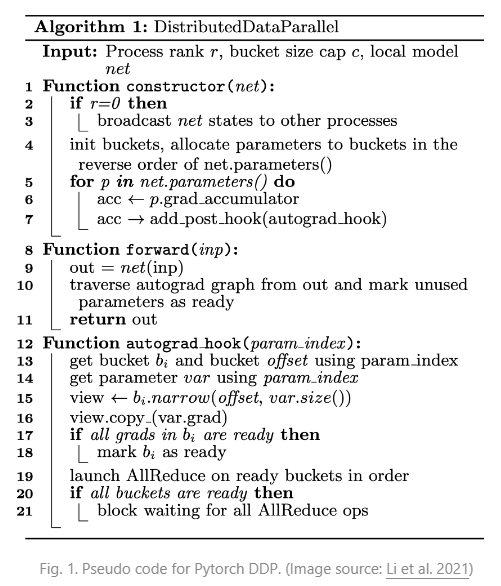

# 0 如何在多个 GPU 上训练非常大的模型？
&nbsp;&nbsp;&nbsp;&nbsp;&nbsp;&nbsp;&nbsp;&nbsp;近年来，我们看到许多自然语言处理基准任务利用更大的预训练语言模型取得更好的结果。如何训练大型深度神经网络具有挑战性，因为它需要大量的 GPU 内存和漫长的训练时间。 
&nbsp;&nbsp;&nbsp;&nbsp;&nbsp;&nbsp;&nbsp;&nbsp;然而，单个 GPU 工作器的**内存有限**，许多大型模型的尺寸已经超出单个 GPU 的范围。有几种并行范式可实现跨多个 GPU 进行模型训练，以及各种模型架构和节省内存设计，以帮助实现训练非常大型的神经网络。 

# 1 训练并行性
&nbsp;&nbsp;&nbsp;&nbsp;&nbsp;&nbsp;&nbsp;&nbsp;训练非常大型神经网络模型的主要瓶颈是对大量 GPU 内存的巨大需求，远远超出单个 GPU 机器的容量。除了模型权重（例如数十亿个浮点数）之外，通常存储中间计算输出（如梯度和优化器状态，如 Adam 中的动量和变化）的成本更高。此外，训练大型模型通常需要大量的训练语料库，因此单个进程可能需要很长时间。 

&nbsp;&nbsp;&nbsp;&nbsp;&nbsp;&nbsp;&nbsp;&nbsp;因此，并行性是必要的。并行性可以在不同的维度上发生，包括数据、模型架构和张量操作。 

# 2 数据并行
&nbsp;&nbsp;&nbsp;&nbsp;&nbsp;&nbsp;&nbsp;&nbsp;数据并行（DP）最简单的方法是将相同的模型权重复制到多个工作器中，并将数据的一部分分配给每个工作器同时处理。 

&nbsp;&nbsp;&nbsp;&nbsp;&nbsp;&nbsp;&nbsp;&nbsp;如果模型大小大于单个 GPU 节点的内存，简单的数据并行方法无法很好地工作。像 GeePS（Cui 等，2016）这样的方法可以在模型太大无法适应一台机器时，将暂时未使用的参数转移到 CPU，以适应有限的 GPU 内存。数据交换传输应该在后端进行，不干扰训练计算。 

&nbsp;&nbsp;&nbsp;&nbsp;&nbsp;&nbsp;&nbsp;&nbsp;在每个小批处理结束时，工作器需要**同步梯度或权重以避免陈旧**。有两种主要的同步方法，两者都有明显的优缺点。 

1.批量同步并行（BSP）：工作器在每个小批处理结束时同步数据。这可以防止模型权重的陈旧，并提高学习效率，但每台机器必须停下来等待其他发送梯度。 ;
2.异步并行（ASP）：每个 GPU 工作器异步处理数据，没有等待或停滞。然而，这很容易导致使用陈旧权重，从而降低统计学习效率。尽管它增加了计算时间，但可能不会加快到达收敛的训练时间(工程上一般不会这么干)。 

&nbsp;&nbsp;&nbsp;&nbsp;&nbsp;&nbsp;&nbsp;&nbsp;在中间某个地方是每隔一定迭代次数全局同步梯度。这一功能在 PyTorch v1.5 以后的分布式数据并行（DDP）中被称为“梯度累积”（Li 等，2021）。桶化梯度避免了立即的 AllReduce 操作，而是将多个梯度放入一个 AllReduce 中以提高吞吐量。可以根据计算图进行计算和通信调度优化。

# 3 模型并行性(MP)
&nbsp;&nbsp;&nbsp;&nbsp;&nbsp;&nbsp;&nbsp;&nbsp;模型并行（MP）旨在解决**模型权重无法适应单个节点的情况**。计算和模型参数在多台机器上进行分区。与数据并行不同，数据并行中每个woker托管整个模型的完整副本，而模型并行仅在一个woker上分配一部分模型参数，因此**内存使用和计算量都减少了**。 

&nbsp;&nbsp;&nbsp;&nbsp;&nbsp;&nbsp;&nbsp;&nbsp;由于深度神经网络通常包含一堆**垂直层**，将大型模型按层拆分成小块连续层，在一个woker上将一小部分连续层分组在一个分区中，这种拆分方式似乎很直观。然而，通过多个这样(pp)的woker依次处理每个数据批处理的朴素实现，**会导致等待时间较长和计算资源严重闲置**。 

# 4 管线并行性（MP --> PP）
&nbsp;&nbsp;&nbsp;&nbsp;&nbsp;&nbsp;&nbsp;&nbsp;**管线并行（PP）将模型并行性与数据并行性结合起来**，以减少效率低下的时间“气泡(bubbles)”。其主要思想是将一个minibatch拆分成多个microbatches，并使每个stage的工作器能够同时处理一个microbatch。需要注意的是，每个microbatch都需要进行两次传递，一次前向传递和一次反向传递。worker间的通信仅传输激活（前向）和梯度（反向）。这些传递如何安排以及梯度如何聚合在不同方法中有所不同。分区数partitions(工作器数)也被称为管线深度。 

&nbsp;&nbsp;&nbsp;&nbsp;&nbsp;&nbsp;&nbsp;&nbsp;在 GPipe（[Huang 等，2019](https://arxiv.org/abs/1811.06965)）中，来自多个microbatch的梯度被聚合并在最后进行同步。同步梯度下降确保了学习的一致性和效率，不受woker数量的影响。正如图3所示，气泡仍然存在，但比图2中的要小得多。假设microbatch均匀分割，并且有 n 个分区，假设每个microbatch的前向和后向传递各需要一个单位时间，则气泡占比为： 

&nbsp;&nbsp;&nbsp;&nbsp;&nbsp;&nbsp;&nbsp;&nbsp;GPipe论文观察到，如果microbatch的数量超过partition数量的4倍（当应用激活重新计算时），气泡开销几乎可以忽略不计。 

# 参考文档
- [How to train really large models on many gpus](https://lilianweng.github.io/posts/2021-09-25-train-large/)
- [How to train really large models on many gpus](https://openai.com/index/techniques-for-training-large-neural-networks/)
