# 0 如何在多个 GPU 上训练非常大的模型？
&nbsp;&nbsp;&nbsp;&nbsp;&nbsp;&nbsp;&nbsp;&nbsp;近年来，我们看到许多自然语言处理基准任务利用更大的预训练语言模型取得更好的结果。如何训练大型深度神经网络具有挑战性，因为它需要大量的 GPU 内存和漫长的训练时间。 
&nbsp;&nbsp;&nbsp;&nbsp;&nbsp;&nbsp;&nbsp;&nbsp;然而，单个 GPU 工作器的**内存有限**，许多大型模型的尺寸已经超出单个 GPU 的范围。有几种并行范式可实现跨多个 GPU 进行模型训练，以及各种模型架构和节省内存设计，以帮助实现训练非常大型的神经网络。 

# 1 训练并行性
&nbsp;&nbsp;&nbsp;&nbsp;&nbsp;&nbsp;&nbsp;&nbsp;训练非常大型神经网络模型的主要瓶颈是对大量 GPU 内存的巨大需求，远远超出单个 GPU 机器的容量。除了模型权重（例如数十亿个浮点数）之外，通常存储中间计算输出（如梯度和优化器状态，如 Adam 中的动量和变化）的成本更高。此外，训练大型模型通常需要大量的训练语料库，因此单个进程可能需要很长时间。 

&nbsp;&nbsp;&nbsp;&nbsp;&nbsp;&nbsp;&nbsp;&nbsp;因此，并行性是必要的。并行性可以在不同的维度上发生，包括数据、模型架构和张量操作。 

# 2 数据并行
&nbsp;&nbsp;&nbsp;&nbsp;&nbsp;&nbsp;&nbsp;&nbsp;数据并行（DP）最简单的方法是将相同的模型权重复制到多个工作器中，并将数据的一部分分配给每个工作器同时处理。 

&nbsp;&nbsp;&nbsp;&nbsp;&nbsp;&nbsp;&nbsp;&nbsp;如果模型大小大于单个 GPU 节点的内存，简单的数据并行方法无法很好地工作。像 GeePS（Cui 等，2016）这样的方法可以在模型太大无法适应一台机器时，将暂时未使用的参数转移到 CPU，以适应有限的 GPU 内存。数据交换传输应该在后端进行，不干扰训练计算。 

&nbsp;&nbsp;&nbsp;&nbsp;&nbsp;&nbsp;&nbsp;&nbsp;在每个小批处理结束时，工作器需要**同步梯度或权重以避免陈旧**。有两种主要的同步方法，两者都有明显的优缺点。 

1.批量同步并行（BSP）：工作器在每个小批处理结束时同步数据。这可以防止模型权重的陈旧，并提高学习效率，但每台机器必须停下来等待其他发送梯度。 ;
2.异步并行（ASP）：每个 GPU 工作器异步处理数据，没有等待或停滞。然而，这很容易导致使用陈旧权重，从而降低统计学习效率。尽管它增加了计算时间，但可能不会加快到达收敛的训练时间(工程上一般不会这么干)。 

&nbsp;&nbsp;&nbsp;&nbsp;&nbsp;&nbsp;&nbsp;&nbsp;在中间某个地方是每隔一定迭代次数全局同步梯度。这一功能在 PyTorch v1.5 以后的分布式数据并行（DDP）中被称为“梯度累积”（Li 等，2021）。桶化梯度避免了立即的 AllReduce 操作，而是将多个梯度放入一个 AllReduce 中以提高吞吐量。可以根据计算图进行计算和通信调度优化。

# 3 模型并行性(MP)
&nbsp;&nbsp;&nbsp;&nbsp;&nbsp;&nbsp;&nbsp;&nbsp;模型并行（MP）旨在解决**模型权重无法适应单个节点的情况**。计算和模型参数在多台机器上进行分区。与数据并行不同，数据并行中每个woker托管整个模型的完整副本，而模型并行仅在一个woker上分配一部分模型参数，因此**内存使用和计算量都减少了**。 

&nbsp;&nbsp;&nbsp;&nbsp;&nbsp;&nbsp;&nbsp;&nbsp;由于深度神经网络通常包含一堆**垂直层**，将大型模型按层拆分成小块连续层，在一个woker上将一小部分连续层分组在一个分区中，这种拆分方式似乎很直观。然而，通过多个这样(pp)的woker依次处理每个数据批处理的朴素实现，**会导致等待时间较长和计算资源严重闲置**。 

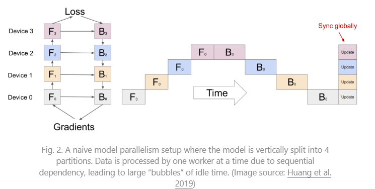

# 4 管线并行性（MP --> PP）
&nbsp;&nbsp;&nbsp;&nbsp;&nbsp;&nbsp;&nbsp;&nbsp;**管线并行（PP）将模型并行性与数据并行性结合起来**，以减少效率低下的时间“气泡(bubbles)”。其主要思想是将一个minibatch拆分成多个microbatches，并使每个stage的工作器能够同时处理一个microbatch。需要注意的是，每个microbatch都需要进行两次传递，一次前向传递和一次反向传递。worker间的通信仅传输激活（前向）和梯度（反向）。这些传递如何安排以及梯度如何聚合在不同方法中有所不同。分区数partitions(工作器数)也被称为管线深度。 

&nbsp;&nbsp;&nbsp;&nbsp;&nbsp;&nbsp;&nbsp;&nbsp;在 GPipe（[Huang 等，2019](https://arxiv.org/abs/1811.06965)）中，来自多个microbatch的梯度被聚合并在最后进行同步。同步梯度下降确保了学习的一致性和效率，不受woker数量的影响。正如图3所示，气泡仍然存在，但比图2中的要小得多。假设microbatch均匀分割，并且有 n 个分区，假设每个microbatch的前向和后向传递各需要一个单位时间，则气泡占比为： 
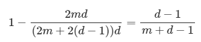

&nbsp;&nbsp;&nbsp;&nbsp;&nbsp;&nbsp;&nbsp;&nbsp;GPipe论文观察到，如果microbatch的数量超过partition数量的4倍（当应用激活重新计算时），气泡开销几乎可以忽略不计。 

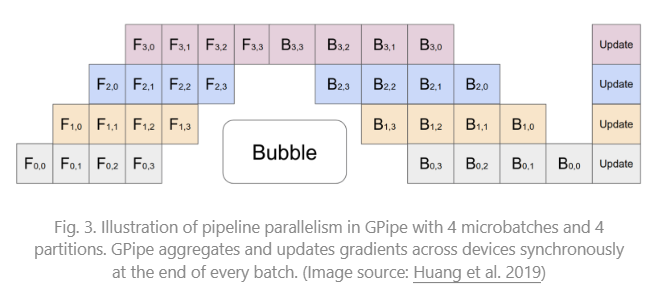

&nbsp;&nbsp;&nbsp;&nbsp;&nbsp;&nbsp;&nbsp;&nbsp;GPipe 实现了随着设备数量的增加几乎**线性**的吞吐量提升，尽管**如果模型参数在工作器之间分布不均匀，则不能始终保证这一点**。 

&nbsp;&nbsp;&nbsp;&nbsp;&nbsp;&nbsp;&nbsp;&nbsp;PipeDream（[Narayanan 等，2019](https://cs.stanford.edu/~matei/papers/2019/sosp_pipedream.pdf)）安排每个woker交替处理前向传递和后向传递（1F1B）。PipeDream 将每个模型partition命名为“stage”，每个stage的woker可以有多个副本(replica)来运行数据并行性。在这个过程中，PipeDream 使用确定性的轮询负载平衡策略将work分配给多个stage的副本，以确保同一minibatch的前向和后向传递在同一个副本上进行。 

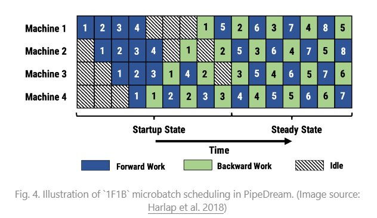

&nbsp;&nbsp;&nbsp;&nbsp;&nbsp;&nbsp;&nbsp;&nbsp;由于 PipeDream 没有跨所有woker进行的end-of-batch allreduce gradient synchronization，1F1B 的本地实现很容易导致一个microbatch的**前向和后向传递使用不同版本的模型权重**，从而**降低学习效率**。PipeDream 提出了一些设计来解决这个问题： 

- 权重存储：每个woker跟踪几个模型版本，并确保在给定数据批次中前向和后向传递中使用相同版本的权重。
- 垂直同步（可选）：模型权重的版本与激活和梯度一起在阶段工作器之间流动。然后计算采用从前一个工作器传播的相应存储版本。该过程保持了work之间的版本一致性。请注意，这是异步的，与 GPipe 不同。

&nbsp;&nbsp;&nbsp;&nbsp;&nbsp;&nbsp;&nbsp;&nbsp;在训练运行的开始阶段，PipeDream 首先对模型中每个层的计算内存成本和时间进行分析，然后优化将层分割为stage的解决方案，这是一个动态规划问题。 

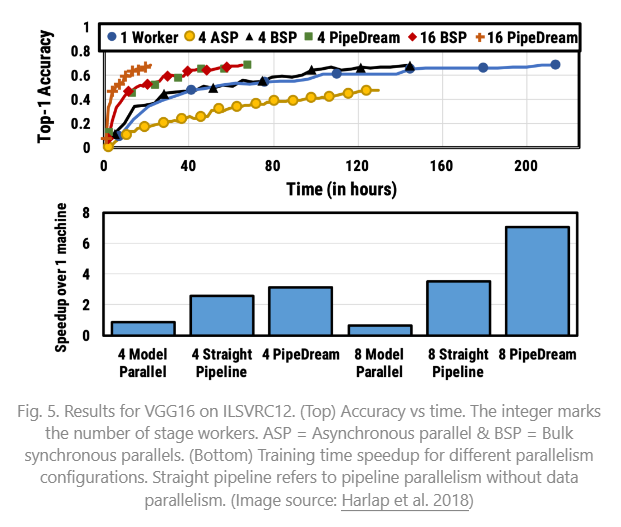

&nbsp;&nbsp;&nbsp;&nbsp;&nbsp;&nbsp;&nbsp;&nbsp;PipeDream 有两个主要变体，通过存储的模型版本来减少内存占用（Narayanan 等人，2021年）。

&nbsp;&nbsp;&nbsp;&nbsp;&nbsp;&nbsp;&nbsp;&nbsp;**PipeDream-flush** 定期增加全局同步的pipeline-flush，就像 GPipe 一样。通过这种方式，它通过**牺牲一点吞吐量**大大减少了内存占用（即只保留一个模型权重版本）。 

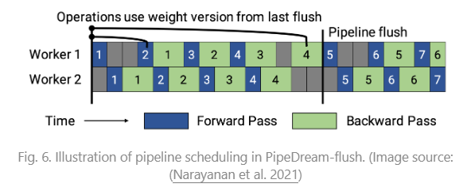

&nbsp;&nbsp;&nbsp;&nbsp;&nbsp;&nbsp;&nbsp;&nbsp;**PipeDream-2BW** 仅保留**两个模型权重版本**，其中“2BW”代表“双缓冲权重”。它在每个micro-batch生成一个新的模型版本，应该比管道深度大。由于一些剩余的反向传播仍依赖于旧版本，新更新的模型版本无法立即完全替换旧版本。总共只需要保存两个版本，因此**内存成本大大降低**。 

# 5 张量并行性
&nbsp;&nbsp;&nbsp;&nbsp;&nbsp;&nbsp;&nbsp;&nbsp;模型并行(MP)和管道并行(PP)将模型**纵向分割**。另一方面，我们可以**横向**将一个张量操作的计算在多个设备之间进行分区，称为张量并行（TP）。 

&nbsp;&nbsp;&nbsp;&nbsp;&nbsp;&nbsp;&nbsp;&nbsp;以 transformer 为例，考虑到其流行度。transformer 模型主要由 MLP 层和自注意块组成。Megatron-LM（Shoeybi 等人，2020年）采用了一种简单的方式来并行处理 MLP 和自注意力内层计算。 

&nbsp;&nbsp;&nbsp;&nbsp;&nbsp;&nbsp;&nbsp;&nbsp;transformer 中的 MLP 层包含一个 GEMM（General matrix multiply）后跟一个非线性 GeLU 转换。让我们按列拆分权重矩阵A： 

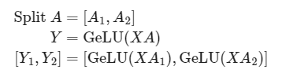

&nbsp;&nbsp;&nbsp;&nbsp;&nbsp;&nbsp;&nbsp;&nbsp;注意力块根据上述分区并行运行带有查询（query）、键（key）和值（value）权重的 GEMM，然后将它们与另一个 GEMM 结合以生成注意力头结果。 

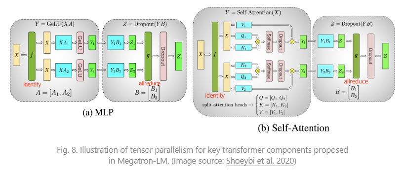

&nbsp;&nbsp;&nbsp;&nbsp;&nbsp;&nbsp;&nbsp;&nbsp;[Narayanan 等人（2021）](https://arxiv.org/abs/2104.04473)结合了管道、张量和数据并行性，并采用了一种新的管道调度策略(interleave-1f1b)，将其方法命名为 PTD-P。与仅将一系列连续的层（“模型块”）定位在一个设备上不同，每个worker可以被分配**多个小连续层子集的块**（例如，设备 1 拥有层 1、2、9、10；设备 2 拥有层 3、4、11、12；每个设备有两个模型块）。一个批次中的microbatch数量应该被worker的数量整除。如果每个工作器有v个模型块，与 GPipe 调度相比，管道**气泡时间可以减少v倍**。 

# 6 专家混合（Mixture-of-Experts，MoE）
## 6.1 原始的MOE
&nbsp;&nbsp;&nbsp;&nbsp;&nbsp;&nbsp;&nbsp;&nbsp;最近，专家混合（MoE）方法引起了许多关注，因为研究人员（主要来自谷歌）尝试推动模型规模的极限。这一思想的核心是[集成学习](https://en.wikipedia.org/wiki/Ensemble_learning) : Combination of multiple weak learners gives you a strong learner!  

&nbsp;&nbsp;&nbsp;&nbsp;&nbsp;&nbsp;&nbsp;&nbsp;在一个深度神经网络内部，集成可以通过连接多个专家的门控机制来实现（[Shazeer 等人，2017年](https://arxiv.org/abs/1701.06538)）。**门控机制控制着网络的哪个子集（例如，哪些专家）应该被激活以产生输出**。该论文将其命名为“稀疏门控专家混合”（MoE）层。 

&nbsp;&nbsp;&nbsp;&nbsp;&nbsp;&nbsp;&nbsp;&nbsp;精确地说，一个 MoE 层包含：
- n个作为专家的前馈网络 $E_{i}$ ;
- 一个可训练的门控网络G 来学习n个专家上的概率分布，以便将流量路由到几个选定的专家。

&nbsp;&nbsp;&nbsp;&nbsp;&nbsp;&nbsp;&nbsp;&nbsp;根据门控输出，不必评估每个专家。当专家数量过多时，我们可以考虑使用两级分层 MoE。 

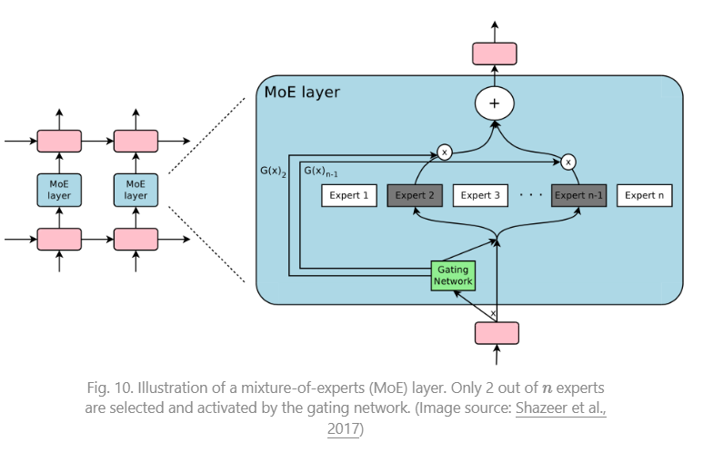

&nbsp;&nbsp;&nbsp;&nbsp;&nbsp;&nbsp;&nbsp;&nbsp;一个简单的选择是用一个可训练的权重矩阵 $G_{g}$ 乘以输入，然后进行 softmax 运算: $G_{\sigma}(x)=softmax(x W_{g})$ 。然而，这会产生一个密集的控制向量用于门控，并且不利于节省计算资源，因为我们只在 $G^{(i)}(x)=0$ 时需要评估一个专家。因此，MoE 层只保留前 k 个值。它还向 G **添加可调整的高斯噪声以改善负载平衡**。这种机制称为**带噪声的 top- k 门控**。 

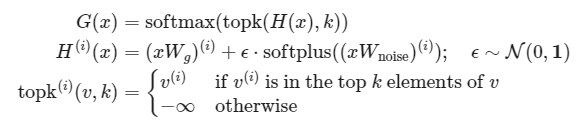

&nbsp;&nbsp;&nbsp;&nbsp;&nbsp;&nbsp;&nbsp;&nbsp;在这里，上标 $v^{(i)}$ 表示向量 v 的第 i 个维度。函数 topk (., k) 通过将其他维度设置为 -\infty ，选择具有最高值的前 k 个维度。 

&nbsp;&nbsp;&nbsp;&nbsp;&nbsp;&nbsp;&nbsp;&nbsp;为了避免门控网络**可能始终偏好少数强专家的自我强化效应**，[Shazeer 等人（2017年）](https://arxiv.org/abs/1701.06538)通过额外的**重要性损失提出了软约束**，以鼓励所有专家具有相同的权重。这相当于每个专家的批次平均值的变异系数的平方。 

&nbsp;&nbsp;&nbsp;&nbsp;&nbsp;&nbsp;&nbsp;&nbsp;其中CV 是变异系数，损失权重 $w_{aux}$ 是一个需要调整的超参数。 

&nbsp;&nbsp;&nbsp;&nbsp;&nbsp;&nbsp;&nbsp;&nbsp;由于每个专家网络只获得训练样本的一部分（“缩减的批次问题”），我们应该尽量在 MoE 中使用**尽可能大的批次大小**。然而，这受限于 GPU 内存。数据并行性和模型并行性可以应用以提高吞吐量。 

## 6.2 GShard
&nbsp;&nbsp;&nbsp;&nbsp;&nbsp;&nbsp;&nbsp;&nbsp;GShard（[Lepikhin 等，2020](https://arxiv.org/abs/2006.16668)）通过分片将 MoE transformer 模型扩展到 6000 亿个参数(600B)。MoE transformer 用 MoE 层替换每个其他前馈层。分片的 MoE transformer **只在多台机器上分片了 MoE 层，而其他层则简单地复制**。 

&nbsp;&nbsp;&nbsp;&nbsp;&nbsp;&nbsp;&nbsp;&nbsp;在 GShard 中有几种改进的设计用于门控函数： 
- 专家容量：通过一个专家的token数量不应超过一个阈值，称为“专家容量(capacity)”。如果一个token被路由到已达到其capacity的专家，该token将被标记为“溢出(overflowed)”，并且门控输出将被更改为**零向量**。 
- 本地组调度：token被均匀地分成多个本地组，并在组级别强制执行专家容量。 
- 辅助损失：其动机类似于原始的 MoE 辅助损失。他们添加了一个辅助损失，以最小化每个专家路由的数据分数的均方。 
- 随机路由：第二优秀的专家以其权重成比例的概率被选择；否则，GShard 遵循随机路由，以增加一些随机性。 

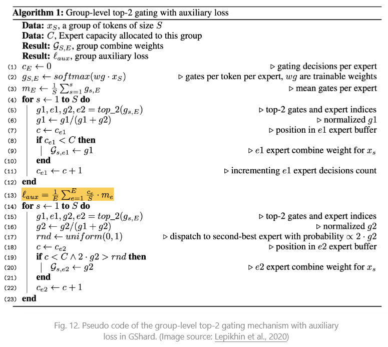

## 6.3 Switch Transformer
&nbsp;&nbsp;&nbsp;&nbsp;&nbsp;&nbsp;&nbsp;&nbsp;Switch Transformer（[Fedus 等人，2021年](https://arxiv.org/abs/2101.03961)）通过将密集的前馈层替换为稀疏的 Switch FFN 层，将模型规模扩展到数万亿个参数！在这种结构中，**每个输入仅路由到一个专家网络**。用于负载平衡的辅助损失如下所示: $loss_{aux} = w_{aux} {\sum_{i}^{n}f_{i}p_{i}}$ , 给定n个专家，其中 $f_{i}$ 是路由到第i个专家的token的比例， $p_{i}$ 是由门控网络预测的i专家的路由概率。 

&nbsp;&nbsp;&nbsp;&nbsp;&nbsp;&nbsp;&nbsp;&nbsp;为了提高训练稳定性，Switch Transformer 结合了以下设计： 

- 选择性精度。他们表明，仅将模型的局部部分选择性地转换为 FP32 精度可以提高稳定性，同时避免了FP32张量的昂贵通信成本。**FP32 精度仅在路由器函数体内使用**，并将结果重新转换为 FP16。
- 较小的初始化。权重矩阵的初始化是从均值为μ=0, 标准差为 $σ=\sqrt{\frac{s}{n}}$ 的截断正态分布中进行采样。他们还建议将 transformer 初始化尺度参数从s=1减小到s=0.1。 
- 使用更高的专家丢弃率(dropout rate)。微调通常在小数据集上进行。为了避免过拟合，每个专家内的丢弃率增加了相当大的量。有趣的是，他们发现增加所有层的丢弃率会导致性能下降。在论文中，他们在非专家层使用了 0.1 的丢弃率，但在专家 FF 层内使用了 0.4。 

&nbsp;&nbsp;&nbsp;&nbsp;&nbsp;&nbsp;&nbsp;&nbsp;Switch Transformer 论文总结了用于训练大型模型的不同数据和模型并行策略，并通过一个精美的插图进行了说明： 

&nbsp;&nbsp;&nbsp;&nbsp;&nbsp;&nbsp;&nbsp;&nbsp;无论是 GShard 的 top-2 还是 Switch Transformer 的 top-1 都取决于token选择，其中每个token选择最佳的一个或两个专家进行路由。它们都采用了一个辅助损失来鼓励更平衡的负载分配，但这并不能保证最佳性能。此外，专家容量限制(capacity limitation)可能会导致token浪费，因为如果一个专家达到其容量限制，这些token将被丢弃。 

## 6.4 Export Choice（EC）([Zhou 等人，2022年](https://arxiv.org/abs/2202.09368))
&nbsp;&nbsp;&nbsp;&nbsp;&nbsp;&nbsp;&nbsp;&nbsp;EC路由允许每个专家选择前k个token。这样，每个专家自然地保证了**固定的容量**，每个token可以路由到多个专家。EC 可以实现完美的负载平衡，并且据显示可以将训练收敛速度提高 2 倍。 

&nbsp;&nbsp;&nbsp;&nbsp;&nbsp;&nbsp;&nbsp;&nbsp;给定专家数为e和输入矩阵 $X_{nxd}$，token与专家的亲和分数通过以下方式计算： 

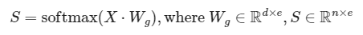

&nbsp;&nbsp;&nbsp;&nbsp;&nbsp;&nbsp;&nbsp;&nbsp;一个token到专家的分配由三个矩阵表示，分别为 $I_{exk}, G_{exk}$ 和 $P_{exkxn}$ 。 $I_{i,j}$ 标注了第
i个专家的第j个选择是哪个token。门控矩阵G存储了所选token的路由权重。P是I的 one-hot 版本，用于生成门控 FFN 层的输入矩阵PX。 

&nbsp;&nbsp;&nbsp;&nbsp;&nbsp;&nbsp;&nbsp;&nbsp;Export Choice 路由探索的一种正则化方法是限制每个令牌的最大专家数。 

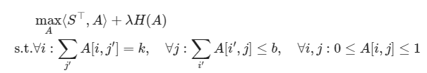

&nbsp;&nbsp;&nbsp;&nbsp;&nbsp;&nbsp;&nbsp;&nbsp;其中矩阵 $A_{e,n}$中的每个条目 $A[i,j]$表示第i个专家是否选择第j个令牌。解决这个问题并不是一件简单的事情。该论文使用了 Dykstra 算法，该算法运行一系列多次迭代的计算步骤。在实验中，限制专家选择会导致微调性能略微降低。 

&nbsp;&nbsp;&nbsp;&nbsp;&nbsp;&nbsp;&nbsp;&nbsp;参数k由 k=nc/e确定，其中n是一个批次中token的总数，c是表示一个token平均使用的专家数量的容量因子。大多数实验中使用2，但带有c=1的 EC 仍然优于最佳token选择门控。有趣的是c=0.5仅对训练性能造成轻微损害。 

&nbsp;&nbsp;&nbsp;&nbsp;&nbsp;&nbsp;&nbsp;&nbsp;Export Choice（EC）的一个重大缺点是，当批量大小过小时，它无法工作，对于自回归文本生成也是如此，因为它需要知道未来的token才能进行top-k选择。 

# 参考文档
- [How to train really large models on many gpus](https://lilianweng.github.io/posts/2021-09-25-train-large/)
- [How to train really large models on many gpus](https://openai.com/index/techniques-for-training-large-neural-networks/)
- [huggingface-moe](https://huggingface.co/blog/moe)

